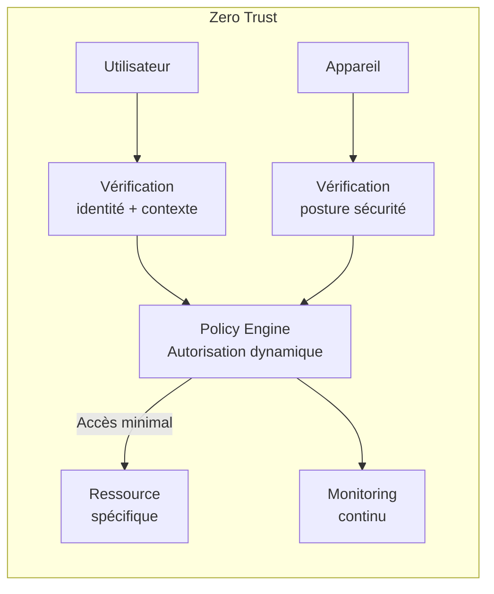
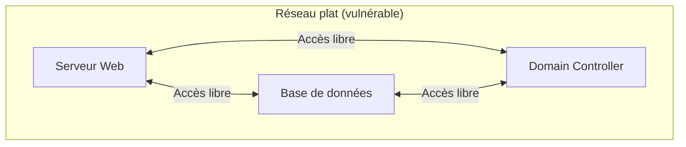
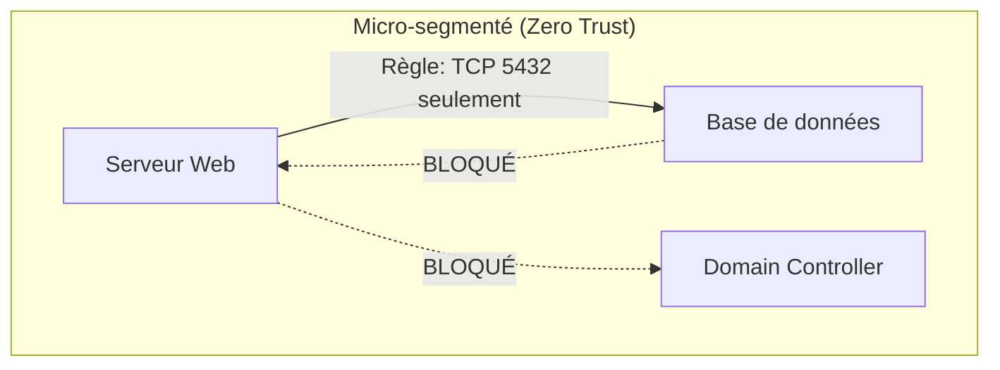
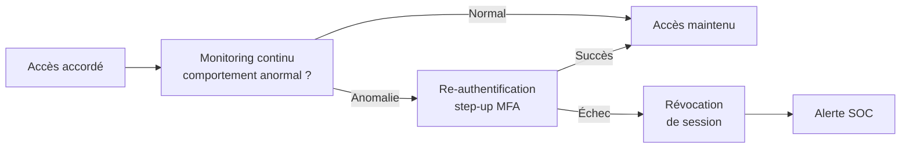

# Zero Trust Architecture

Zero Trust est un modèle de sécurité fondé sur le principe "ne jamais faire confiance, toujours vérifier" (Never Trust, Always Verify). Il abandonne le paradigme du périmètre réseau de confiance au profit d'une vérification continue de chaque accès.

## Paradigme traditionnel vs Zero Trust

```mermaid
graph LR
    subgraph "Modèle traditionnel (Castle and Moat)"
        ext1[Internet\n(non fiable)] -->|Pare-feu| dmz[DMZ]
        dmz --> internal[Réseau interne\n(tout est fiable)]
        internal --> dc[Data Center\nRessources]
    end
```



**Problème du modèle traditionnel :**
Une fois à l'intérieur du réseau (via VPN, compromission périphérique), l'attaquant peut se déplacer librement. 80% des attaques exploitent des comptes légitimes.

## Les 3 piliers du Zero Trust

### 1. Vérifier explicitement

Authentifier et autoriser systématiquement, en prenant en compte tous les signaux disponibles :
- Identité (MFA, FIDO2)
- Posture de l'appareil (MAJ à jour, EDR actif, chiffrement activé)
- Localisation (pays, réseau)
- Service demandé (niveau de sensibilité)
- Comportement (heure inhabituelle, volume inhabituel)

### 2. Utiliser le moindre privilège

- Accès Just-in-Time (JIT) : accès accordé à la demande pour une durée limitée
- Just-Enough-Access (JEA) : uniquement les permissions nécessaires à la tâche
- Pas de sessions permanentes avec des droits élevés

### 3. Supposer la compromission

- Segmenter le réseau pour limiter les mouvements latéraux
- Chiffrer tout le trafic (même interne)
- Journaliser tout pour détecter et investiguer
- Valider l'intégrité end-to-end

## Micro-segmentation

La micro-segmentation découpe le réseau en zones isolées, limitant les mouvements latéraux même si un segment est compromis.





**Implémentation :**

```bash
# Kubernetes Network Policy
apiVersion: networking.k8s.io/v1
kind: NetworkPolicy
metadata:
  name: allow-only-frontend-to-db
  namespace: production
spec:
  podSelector:
    matchLabels:
      role: database
  ingress:
  - from:
    - podSelector:
        matchLabels:
          role: frontend
    ports:
    - protocol: TCP
      port: 5432

# AWS Security Groups (micro-segmentation cloud)
# SG-web → autorise uniquement SG-app en ingress
# SG-app → autorise uniquement SG-db en ingress sur port 5432
# SG-db → n'autorise aucune sortie vers internet
```

## Identity-Aware Proxy (IAP)

L'IAP se place devant les applications et vérifie l'identité et le contexte avant de proxifier la requête. L'application n'est plus accessible directement.

```mermaid
graph LR
    user[Utilisateur] -->|HTTPS| iap[Identity-Aware Proxy]
    iap -->|Vérif. identité| idp[IdP / SSO]
    iap -->|Vérif. appareil| mdm[MDM / Endpoint Check]
    iap -->|Si autorisé| app[Application\n(non exposée directement)]
```

**Solutions :**
- **Google BeyondCorp** : implémentation Zero Trust de Google (modèle de référence)
- **Cloudflare Access** : IAP cloud
- **Zscaler Private Access** : ZTNA (Zero Trust Network Access)
- **Pomerium** : open source
- **HashiCorp Boundary** : accès aux ressources privées sans VPN

## ZTNA vs VPN

| Critère | VPN traditionnel | ZTNA |
|---|---|---|
| Accès réseau | Accès complet au segment réseau | Accès à une application spécifique |
| Authentification | Login initial seulement | Continue et contextuelle |
| Visibilité | Réseau interne exposé | Applications jamais exposées directement |
| Mouvement latéral | Possible | Bloqué par construction |
| Performance | Hairpinning, latence | Accès direct et optimisé |
| Device trust | Généralement ignoré | Vérification de la posture |

## SASE — Secure Access Service Edge

Architecture cloud qui combine réseau WAN et sécurité en un service unifié.

```
SASE = SD-WAN + CASB + FWaaS + ZTNA + SWG

- SD-WAN : connectivité réseau optimisée
- CASB : sécurité des accès aux apps cloud
- FWaaS : pare-feu cloud
- ZTNA : accès Zero Trust aux apps privées
- SWG : proxy web sécurisé
```

Vendeurs : Zscaler, Palo Alto Prisma, Cisco Umbrella, Netskope.

## Continuous Adaptive Risk and Trust Assessment (CARTA)

Zero Trust est dynamique : le niveau d'accès est réévalué en continu selon le risque courant.



**Signaux surveillés en continu :**
- Comportement d'accès (heure, localisation)
- Santé de l'appareil (EDR, dernière mise à jour)
- Vitesse de déplacement impossible (login Paris puis Tokyo en 1h)
- Volume de données téléchargées
- Applications accédées

## Framework NIST SP 800-207

Le NIST définit 7 principes Zero Trust :

1. Toutes les sources de données sont des ressources
2. Toutes les communications sont sécurisées (chiffrées) quel que soit le réseau
3. Accès ressource par ressource, session par session
4. L'accès est déterminé par une politique dynamique incluant l'état de l'appareil
5. Tous les appareils sont surveillés et leur intégrité vérifiée
6. L'authentification et l'autorisation sont strictement appliquées
7. Collecte maximale de données pour améliorer la posture de sécurité

## Implémentation progressive

Zero Trust n'est pas un produit à acheter mais une transformation progressive :

```
Phase 1 — Identité (6-12 mois)
  → MFA sur tous les comptes (FIDO2 pour les admins)
  → SSO centralisé (Okta, Azure AD, Keycloak)
  → Inventaire des comptes et suppression des orphelins

Phase 2 — Appareils (6-12 mois)
  → MDM sur tous les appareils (Intune, Jamf)
  → Vérification de la posture (chiffrement, EDR, patch level)
  → Séparation BYOD / corporate

Phase 3 — Réseau (12-24 mois)
  → Micro-segmentation des workloads critiques
  → ZTNA pour remplacer le VPN
  → Chiffrement du trafic est-ouest (mTLS)

Phase 4 — Applications et données (ongoing)
  → Classification des données
  → DLP (Data Loss Prevention)
  → CASB pour les applications cloud
  → Chiffrement au repos systématique
```
