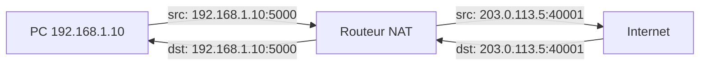

# Adressage IP et Subnetting

## Structure d'une adresse IPv4

Une adresse IPv4 est composée de 32 bits, représentés en notation décimale pointée (4 octets).

```
192        .168       .10        .5
11000000   10101000   00001010   00000101
```

Chaque adresse est divisée en deux parties :
- **Partie réseau** : identifie le réseau
- **Partie hôte** : identifie la machine dans ce réseau

Le **masque de sous-réseau** indique où s'arrête la partie réseau.

```
IP      : 192.168.10.5    = 11000000.10101000.00001010.00000101
Masque  : 255.255.255.0   = 11111111.11111111.11111111.00000000
Réseau  : 192.168.10.0    (les bits du masque à 1 → partie réseau)
Hôte    :             .5  (les bits du masque à 0 → partie hôte)
```

## Classes IPv4 (historique)

| Classe | Plage | Masque défaut | Réseaux | Hôtes/réseau |
|---|---|---|---|---|
| A | 1.0.0.0 – 126.255.255.255 | /8 | 126 | 16 777 214 |
| B | 128.0.0.0 – 191.255.255.255 | /16 | 16 384 | 65 534 |
| C | 192.0.0.0 – 223.255.255.255 | /24 | 2 097 152 | 254 |
| D | 224.0.0.0 – 239.255.255.255 | — | Multicast | — |
| E | 240.0.0.0 – 255.255.255.255 | — | Réservé | — |

Note : la classe A exclut 0.x.x.x (réseau par défaut) et 127.x.x.x (loopback).

## Adresses spéciales

```
127.0.0.1           Loopback (localhost) — trafic interne à la machine
0.0.0.0             Adresse non spécifiée (écoute sur toutes interfaces)
255.255.255.255     Broadcast limité (réseau local)
169.254.0.0/16      APIPA — adresse auto-configurée sans DHCP
```

## Adresses privées (RFC 1918)

Non routables sur Internet — réservées aux réseaux internes :

```
10.0.0.0/8          10.0.0.0   – 10.255.255.255    (16 777 216 hôtes)
172.16.0.0/12       172.16.0.0 – 172.31.255.255    (1 048 576 hôtes)
192.168.0.0/16      192.168.0.0 – 192.168.255.255  (65 536 hôtes)
```

## Notation CIDR

CIDR (Classless Inter-Domain Routing) remplace le système de classes par un préfixe de longueur variable.

```
192.168.1.0/24

/24 = le masque a 24 bits à 1
Masque : 255.255.255.0
Hôtes utilisables : 2^(32-24) - 2 = 254
  (-2 : adresse réseau .0 et broadcast .255)
```

**Table de référence rapide :**

| CIDR | Masque | Hôtes utilisables | Usage courant |
|---|---|---|---|
| /8 | 255.0.0.0 | 16 777 214 | Grandes entreprises |
| /16 | 255.255.0.0 | 65 534 | Entreprises moyennes |
| /24 | 255.255.255.0 | 254 | LAN standard |
| /25 | 255.255.255.128 | 126 | Division de /24 en 2 |
| /26 | 255.255.255.192 | 62 | Division de /24 en 4 |
| /27 | 255.255.255.224 | 30 | Petite équipe |
| /28 | 255.255.255.240 | 14 | Très petit sous-réseau |
| /29 | 255.255.255.248 | 6 | Lien point-à-point (DMZ) |
| /30 | 255.255.255.252 | 2 | Lien entre routeurs |
| /31 | 255.255.255.254 | 0 (2) | RFC 3021 : liens p2p |
| /32 | 255.255.255.255 | 1 | Hôte unique (route statique) |

## Calcul de subnetting

### Méthode par puissance de 2

**Problème :** Diviser 192.168.1.0/24 en 4 sous-réseaux égaux

```
On veut 4 sous-réseaux → 2^x = 4 → x = 2 bits empruntés
Nouveau préfixe : /24 + 2 = /26
Hôtes par sous-réseau : 2^(32-26) - 2 = 62

Sous-réseaux :
192.168.1.0/26    → .0   à .63   (hôtes .1 à .62)
192.168.1.64/26   → .64  à .127  (hôtes .65 à .126)
192.168.1.128/26  → .128 à .191  (hôtes .129 à .190)
192.168.1.192/26  → .192 à .255  (hôtes .193 à .254)
```

**Problème :** Diviser 10.0.0.0/8 pour un réseau de 500 hôtes

```
On veut 500 hôtes → 2^x - 2 ≥ 500 → x = 10 bits hôtes → /22
2^10 - 2 = 1022 hôtes (prochain multiple de 2 au-dessus de 500)

10.0.0.0/22   → .0.0  à .3.255
10.0.4.0/22   → .4.0  à .7.255
10.0.8.0/22   → .8.0  à .11.255
...
```

### Trouver le réseau d'une adresse

```
Adresse : 172.16.50.200/20

Masque /20 = 11111111.11111111.11110000.00000000 = 255.255.240.0

172.16.50.200
         ^^ = 50 en binaire = 00110010
Masque      = 11110000
AND         = 00110000 = 48

Réseau : 172.16.48.0/20
Broadcast : 172.16.63.255
Hôtes : 172.16.48.1 à 172.16.63.254 (4094 hôtes)
```

## VLSM — Variable Length Subnet Masking

Utiliser des masques de longueur différente dans le même espace d'adressage pour optimiser l'usage.

**Exemple : Plan d'adressage d'une entreprise (10.0.0.0/16)**

```
Besoin :
- RH : 50 machines       → /26 (62 hôtes)
- Dev : 200 machines     → /24 (254 hôtes)
- Prod : 1000 machines   → /22 (1022 hôtes)
- DMZ : 10 serveurs      → /28 (14 hôtes)
- Lien WAN : 2 routeurs  → /30 (2 hôtes)

Attribution VLSM :
10.0.0.0/22    → Production      (10.0.0.1 – 10.0.3.254)
10.0.4.0/24    → Développement   (10.0.4.1 – 10.0.4.254)
10.0.5.0/26    → RH              (10.0.5.1 – 10.0.5.62)
10.0.5.64/28   → DMZ             (10.0.5.65 – 10.0.5.78)
10.0.5.80/30   → Lien WAN        (10.0.5.81 – 10.0.5.82)
```

## NAT — Network Address Translation

NAT traduit les adresses privées en adresses publiques, permettant à tout un réseau de partager une seule IP publique.



**Types de NAT :**

| Type | Description | Usage |
|---|---|---|
| **SNAT** (Source NAT) | Modifier l'IP source (sortie vers Internet) | Accès Internet depuis réseau privé |
| **DNAT** (Destination NAT) | Modifier l'IP destination | Redirection de port (serveur en DMZ) |
| **PAT** (Port Address Translation) | Plusieurs IPs privées → 1 IP publique + ports distincts | NAT résidentiel/entreprise |
| **1:1 NAT** | Une IP privée ↔ une IP publique fixe | Serveurs exposés |

```bash
# iptables — NAT sortant (masquerade)
iptables -t nat -A POSTROUTING -o eth0 -j MASQUERADE

# iptables — DNAT (redirection port 80 vers serveur interne)
iptables -t nat -A PREROUTING -i eth0 -p tcp --dport 80 \
  -j DNAT --to-destination 192.168.1.10:80
```

## Supernetting et agrégation de routes

Agrégation de plusieurs réseaux contigus en un seul préfixe plus court (résumé de routes) :

```
192.168.0.0/24
192.168.1.0/24
192.168.2.0/24
192.168.3.0/24
→ Agrégé en : 192.168.0.0/22
```

Condition : les réseaux doivent être contigus ET le résumé doit commencer sur une frontière de puissance de 2.

## Considérations de sécurité

**Séparation des réseaux par rôle :**
```
10.0.0.0/24   Réseau de gestion (management, IPMI, KVM)
10.0.1.0/24   Serveurs production
10.0.2.0/24   DMZ (services exposés)
10.0.3.0/24   Utilisateurs
10.0.4.0/24   IoT (isolé des autres)

→ ACLs entre chaque segment
→ Le réseau de gestion n'est accessible que depuis les postes d'admin
```

**Adresses de loopback et spéciales à filtrer aux frontières :**
```
Bloquer en ingress depuis Internet :
- 10.0.0.0/8, 172.16.0.0/12, 192.168.0.0/16 (RFC 1918)
- 127.0.0.0/8 (loopback)
- 169.254.0.0/16 (APIPA)
- 0.0.0.0/8 (réseau)
- 240.0.0.0/4 (réservé)
→ Anti-spoofing (ingress filtering, RFC 2827)
```
