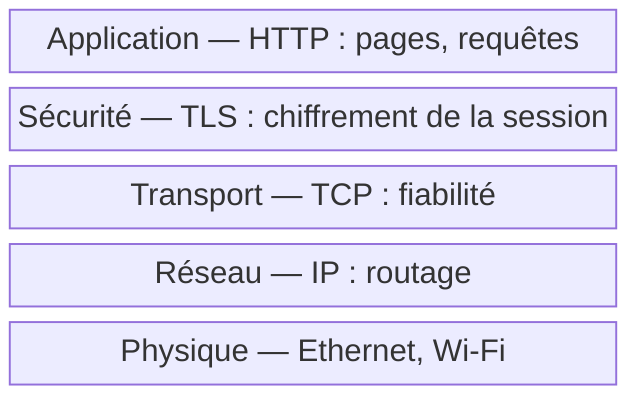
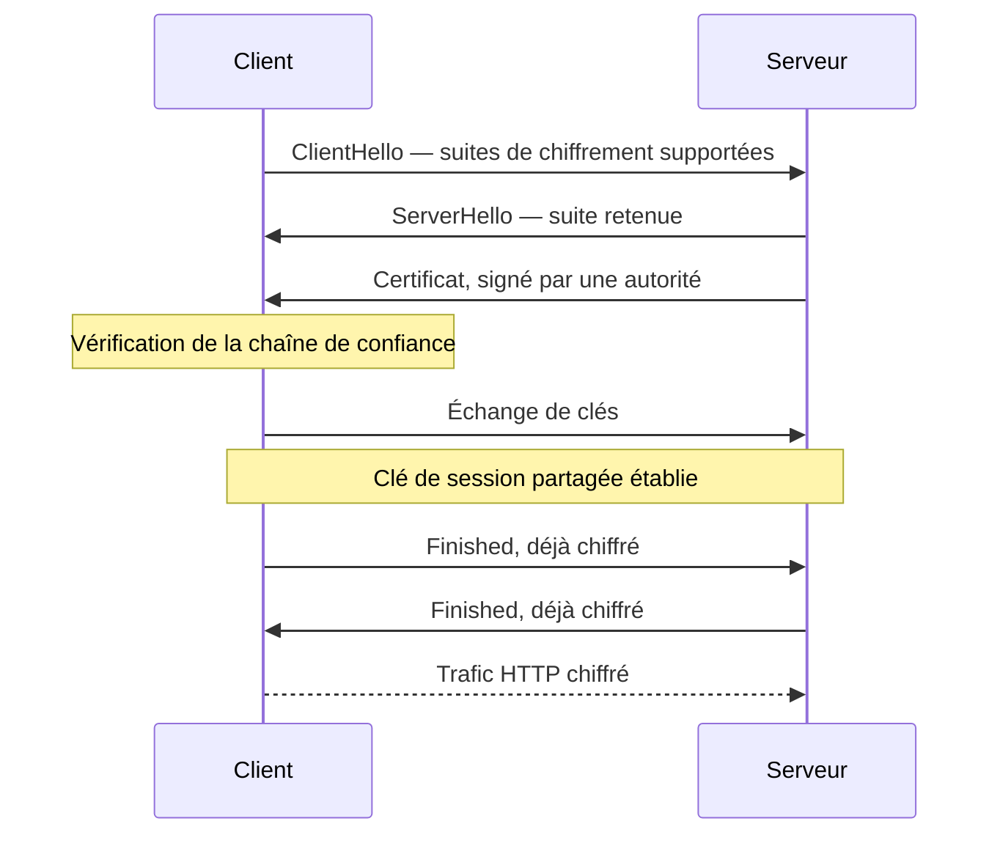

# HTTPS

**HTTPS** (HyperText Transfer Protocol Secure) = HTTP + chiffrement TLS. C'est la version sécurisée du protocole web standard.

## Le problème qu'il résout

Sans HTTPS, tout ce que tu envoies sur un site web voyage en **clair** sur le réseau :
- Ton mot de passe visible par n'importe qui entre toi et le serveur
- Un attaquant sur le même Wi-Fi peut lire tout ton trafic (attaque MITM)
- Ton FAI peut voir exactement ce que tu fais

HTTPS **chiffre** la communication pour que même intercepté, le trafic soit illisible.

> [!important] Ce que HTTPS ne protège pas
> HTTPS garantit la confidentialité et l'intégrité du **contenu**, mais pas l'anonymat de la connexion : l'IP de destination reste visible sur le réseau, et sans Encrypted Client Hello (ECH), le nom de domaine visé (SNI) circule aussi en clair pendant le handshake. Un observateur réseau ne lit pas le contenu, mais voit souvent quel site est contacté.

## Comment ça fonctionne

### Les couches réseau (du plus bas au plus haut)

> HTTP circule **à l'intérieur** de TLS — ce n'est pas l'inverse. TLS enveloppe HTTP, pas l'autre.

## La poignée de main TLS (TLS Handshake)

Avant d'échanger des données, le navigateur et le serveur négocient une session sécurisée :

## Le certificat SSL/TLS

C'est la **carte d'identité** du serveur. Il contient :
- Le nom de domaine (ex: `google.com`)
- La clé publique du serveur
- La signature d'une **CA** (Certificate Authority) de confiance — ex: Let's Encrypt, DigiCert

Sans certificat valide → le navigateur affiche un avertissement "Connexion non sécurisée".

> [!warning] Piège fréquent
> Cliquer sur "Continuer quand même" face à un avertissement de certificat n'est pas une simple formalité : ça désactive la seule vérification qui garantit que le serveur en face est bien celui attendu. C'est exactement le scénario qu'exploite une attaque MITM avec un certificat auto-signé.

## HTTP vs HTTPS en pratique

| | HTTP | HTTPS |
|-|------|-------|
| Port | 80 | 443 |
| Chiffrement | Non | TLS |
| Certificat | Non | Requis |
| Visible dans l'URL | `http://` | `https://` + cadenas |
| Référencement Google | Pénalisé | Favorisé |

## TLS vs SSL

- **SSL** (Secure Sockets Layer) = ancienne version, obsolète et vulnérable (SSLv2, SSLv3)
- **TLS** (Transport Layer Security) = version actuelle, successeur de SSL
- Aujourd'hui on dit "SSL" par habitude mais on utilise TLS 1.2 ou 1.3
