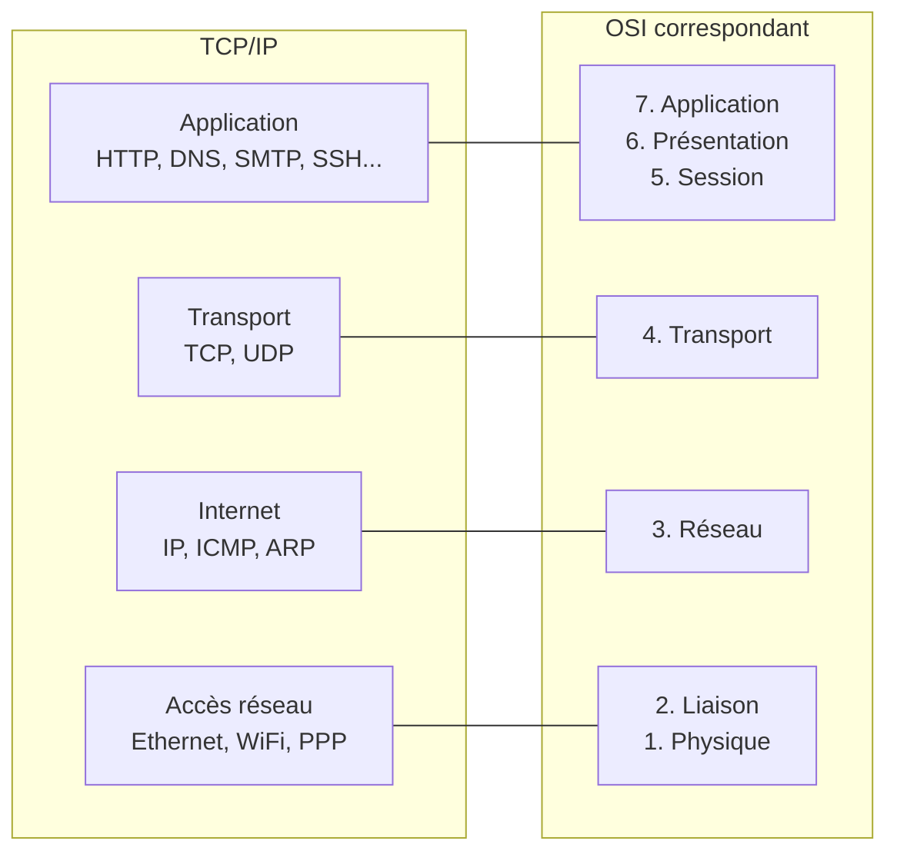
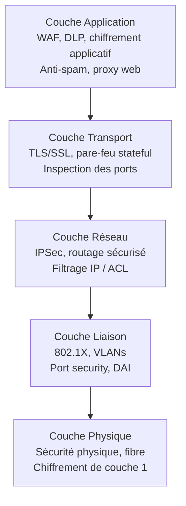

# Modèles Réseau — OSI et TCP/IP

Les modèles de référence permettent de comprendre et de décomposer la communication réseau en couches indépendantes. Ils sont fondamentaux pour diagnostiquer des problèmes, concevoir des architectures et comprendre où s'applique chaque mécanisme de sécurité.

## Modèle OSI (7 couches)

```mermaid
graph LR
    subgraph "Émetteur"
        a7[7. Application\nDonnées] --> a6[6. Présentation\nDonnées chiffrées/compressées]
        a6 --> a5[5. Session\nDonnées + session]
        a5 --> a4[4. Transport\nSegments TCP / Datagrammes UDP]
        a4 --> a3[3. Réseau\nPaquets IP]
        a3 --> a2[2. Liaison\nFrames Ethernet]
        a2 --> a1[1. Physique\nBits]
    end

    a1 -->|Câble / WiFi| b1

    subgraph "Récepteur"
        b1[1. Physique] --> b2[2. Liaison]
        b2 --> b3[3. Réseau]
        b3 --> b4[4. Transport]
        b4 --> b5[5. Session]
        b5 --> b6[6. Présentation]
        b6 --> b7[7. Application]
    end
```



### Couche 7 — Application

**Rôle :** Interface entre les applications et le réseau. Définit le format des messages applicatifs.

**Protocoles :**
- HTTP/HTTPS (port 80/443) — navigation web
- SMTP (25), IMAP (143), POP3 (110) — email
- DNS (53) — résolution de noms
- FTP (21) — transfert de fichiers
- SSH (22) — shell sécurisé
- SNMP (161) — gestion réseau
- LDAP (389/636) — annuaire

**Sécurité à ce niveau :** WAF, filtrage applicatif, DLP, inspection SSL

### Couche 6 — Présentation

**Rôle :** Traduction des formats de données (chiffrement, compression, encodage).

**Fonctions :**
- Chiffrement/déchiffrement (TLS est souvent associé à cette couche)
- Compression (gzip, deflate)
- Encodage (ASCII, UTF-8, Base64)
- Sérialisation (JSON, XML, ASN.1)

### Couche 5 — Session

**Rôle :** Établissement, gestion et terminaison des sessions de communication.

**Fonctions :**
- Synchronisation (points de reprise dans les transferts longs)
- Gestion du dialogue (half-duplex / full-duplex)
- Reconnexion automatique

**Exemples :** NetBIOS, RPC, SQL sessions

### Couche 4 — Transport

**Rôle :** Transport fiable (ou non) des données de bout en bout. Multiplexage via les ports.

#### TCP — Transmission Control Protocol

Orienté connexion, fiable, ordonné.

**Three-way handshake :**
```
Client → Serveur : SYN (seq=x)
Serveur → Client : SYN-ACK (seq=y, ack=x+1)
Client → Serveur : ACK (ack=y+1)
→ Connexion établie
```

**Fermeture de connexion (four-way) :**
```
Client → Serveur : FIN
Serveur → Client : ACK
Serveur → Client : FIN
Client → Serveur : ACK
```

**Flags TCP :** SYN, ACK, FIN, RST (reset), PSH (push), URG (urgent)

**Contrôle de flux :** fenêtres glissantes (sliding window) — ajuste le débit selon la capacité du destinataire.

**Contrôle de congestion :** slow start, congestion avoidance (AIMD).

#### UDP — User Datagram Protocol

Non connecté, non fiable, pas d'ordre garanti. Plus rapide, moins de surcharge.

```
Usage : DNS, DHCP, VoIP, streaming, jeux en ligne, SNMP
       (tolérance aux pertes > exigence d'ordre)
```

| Critère | TCP | UDP |
|---|---|---|
| Connexion | Oui (handshake) | Non |
| Fiabilité | Oui (ACK, retransmission) | Non |
| Ordre | Oui | Non |
| Contrôle flux | Oui | Non |
| Overhead | Élevé | Faible |
| Usage | Web, email, SSH, BDD | DNS, VoIP, streaming |

**Ports notables :**

| Port | Protocole | Service |
|---|---|---|
| 20/21 | TCP | FTP données / contrôle |
| 22 | TCP | SSH |
| 23 | TCP | Telnet (non chiffré) |
| 25 | TCP | SMTP |
| 53 | TCP/UDP | DNS |
| 67/68 | UDP | DHCP serveur/client |
| 80 | TCP | HTTP |
| 110 | TCP | POP3 |
| 123 | UDP | NTP |
| 143 | TCP | IMAP |
| 161/162 | UDP | SNMP |
| 389 | TCP | LDAP |
| 443 | TCP | HTTPS |
| 445 | TCP | SMB |
| 636 | TCP | LDAPS |
| 993/995 | TCP | IMAPS / POP3S |
| 1433 | TCP | MSSQL |
| 3306 | TCP | MySQL |
| 3389 | TCP | RDP |
| 5432 | TCP | PostgreSQL |
| 8080/8443 | TCP | HTTP/HTTPS alternatifs |

### Couche 3 — Réseau

**Rôle :** Routage des paquets de l'émetteur au destinataire à travers plusieurs réseaux. Adressage logique.

**Protocoles :**
- **IP** (v4/v6) : adressage et routage
- **ICMP** : messages de contrôle (ping, traceroute, "destination unreachable")
- **ARP** : résolution adresse IP → MAC (couche 2/3)
- **Protocoles de routage** : OSPF, BGP, RIP, EIGRP

**Équipements :** routeurs, couche 3 des switches (routing inter-VLAN)

**Structure d'un paquet IP :**
```
Version | IHL | DSCP | Total Length
Identification | Flags | Fragment Offset
TTL | Protocol | Header Checksum
Source IP Address (32 bits)
Destination IP Address (32 bits)
Options (variable)
Data (payload)
```

**TTL (Time To Live) :** décrémenté à chaque routeur. Quand TTL=0, le paquet est rejeté (ICMP Time Exceeded) → prévient les boucles de routage. Traceroute exploite ce mécanisme.

### Couche 2 — Liaison de données

**Rôle :** Transmission fiable sur un lien physique unique. Adressage physique (MAC).

**Sous-couches :**
- **LLC** (Logical Link Control) : multiplexage des protocoles couche 3
- **MAC** (Medium Access Control) : accès au medium, adressage physique

**Protocoles :**
- **Ethernet** : standard des LAN câblés (802.3)
- **Wi-Fi** : 802.11 (a/b/g/n/ac/ax)
- **PPP** : liens point-à-point
- **VLAN** (802.1Q) : segmentation logique du réseau physique

**Adresse MAC :** 48 bits (6 octets), ex: `AA:BB:CC:11:22:33`
- 3 premiers octets : OUI (Organizationally Unique Identifier) — identifie le fabricant
- 3 derniers octets : identifiant unique de l'interface

**Trame Ethernet :**
```
Préambule (7) | SFD (1) | MAC dst (6) | MAC src (6) | Ethertype (2) | Payload | FCS (4)
```

**Équipements :** switches, bridges, cartes réseau

### Couche 1 — Physique

**Rôle :** Transmission des bits sur le medium physique. Définit les signaux électriques, lumineux ou radio.

**Standards :**
- **Ethernet** : 100BASE-TX, 1000BASE-T, 10GBASE-T (câble à paires torsadées)
- **Fibre optique** : single-mode (longue distance), multi-mode (datacenter)
- **Wi-Fi** : 2.4 GHz, 5 GHz, 6 GHz
- **Bluetooth**, **Zigbee**, **NFC** : courte portée

**Équipements :** hubs (obsolètes), répéteurs, câbles, modems

## Modèle TCP/IP (4 couches)

Modèle pratique sur lequel Internet est réellement construit.



## Encapsulation

À l'envoi, chaque couche ajoute son en-tête (header) aux données de la couche supérieure.

```
Application  : [Données HTTP]
Transport    : [En-tête TCP][Données HTTP]        → Segment
Réseau       : [En-tête IP][TCP][Données]         → Paquet
Liaison      : [En-tête Eth][IP][TCP][Données][FCS] → Trame
Physique     : Bits sur le câble
```

À la réception, chaque couche retire son en-tête avant de passer au niveau supérieur (désencapsulation).

## Où s'applique la sécurité ?



## Protocoles d'analyse réseau

```bash
# Capturer le trafic réseau (tcpdump)
tcpdump -i eth0 -w capture.pcap host 192.168.1.1
tcpdump -i eth0 port 443 and host 10.0.0.5

# Filtres Wireshark (display filters)
tcp.port == 80             # Trafic HTTP
ip.addr == 192.168.1.1     # Trafic vers/depuis une IP
http.request.method == "POST"  # Requêtes POST
tcp.flags.syn == 1          # Paquets SYN (début de connexions)
dns.qry.name contains "google"  # Requêtes DNS vers google

# Reconstruire une session TCP depuis une capture
tshark -r capture.pcap -q -z follow,tcp,ascii,0
```
