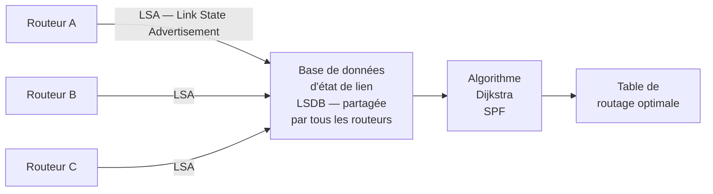
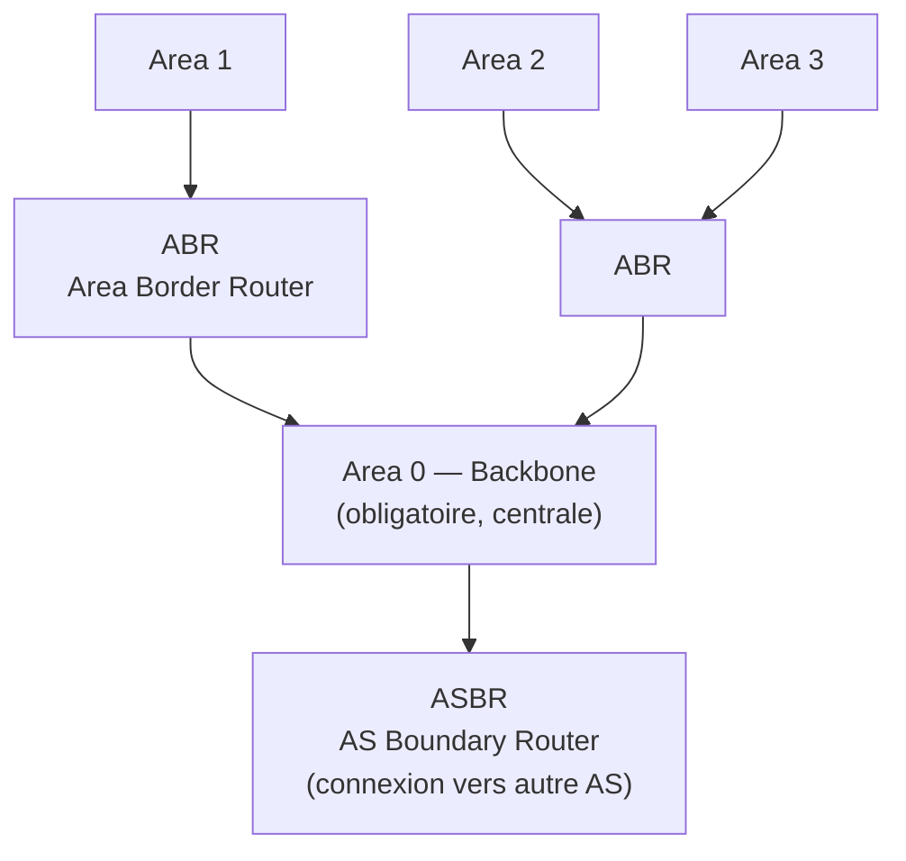

# OSPF — Open Shortest Path First

OSPF est le protocole de routage dynamique le plus utilisé dans les réseaux d'entreprise. Contrairement à RIP (vecteur de distance), OSPF utilise l'**état de lien** — chaque routeur construit une carte complète de la topologie.

### Principe de Fonctionnement



**Processus** :
1. **Hello packets** : découverte des voisins (toutes les 10s, Dead interval 40s)
2. **Échange LSA** : chaque routeur annonce ses liens et coûts à tous les autres (flooding)
3. **Construction LSDB** : base commune à tous les routeurs de la zone
4. **Algorithme SPF (Dijkstra)** : calcul des chemins les plus courts
5. **Table de routage** : meilleure route pour chaque destination

### Métrique : Le Coût

Le coût OSPF = `100 000 000 / Bande passante (bps)`

| Interface | Bande passante | Coût par défaut |
|---|---|---|
| Ethernet 10 Mbps | 10 000 000 | 10 |
| Fast Ethernet 100 Mbps | 100 000 000 | 1 |
| Gigabit Ethernet | 1 000 000 000 | 1 (nécessite ajustement) |
| Série T1 (1,544 Mbps) | 1 544 000 | ~64 |

**Ajustement recommandé** : `auto-cost reference-bandwidth 10000` pour tenir compte du Gigabit et 10 GbE.

### Aires OSPF (Areas)

OSPF utilise un système hiérarchique d'**aires** pour limiter la propagation des LSA sur les grands réseaux.



- **Area 0 (Backbone)** : toutes les zones doivent y être connectées directement ou via virtual link
- **ABR** : routeur connecté à plusieurs aires — maintient une LSDB par aire
- **ASBR** : redistribue des routes externes (BGP, RIP, statiques)

### Types de Routeurs OSPF

| Type | Rôle |
|---|---|
| Internal Router (IR) | Toutes interfaces dans une même aire |
| Area Border Router (ABR) | Connecté à plusieurs aires dont area 0 |
| Backbone Router (BR) | Au moins une interface dans area 0 |
| AS Boundary Router (ASBR) | Redistribue routes depuis d'autres protocoles |

### DR et BDR (Designated Router)

Sur les réseaux multi-accès (Ethernet), OSPF élit un **Designated Router (DR)** pour réduire le nombre d'adjacences.

- Sans DR : n(n-1)/2 adjacences pour n routeurs
- Avec DR : n-1 adjacences (tous parlent au DR, DR diffuse)
- **BDR** (Backup DR) : prend le relais si le DR tombe
- Élection : priorité la plus haute (défaut = 1), puis Router ID le plus élevé

### Configuration Cisco

```cisco
router ospf 1
 router-id 1.1.1.1
 auto-cost reference-bandwidth 10000
 network 192.168.1.0 0.0.0.255 area 0
 network 10.0.0.0 0.0.0.3 area 1
 passive-interface GigabitEthernet0/1
```

```cisco
! Vérification
show ip ospf neighbor
show ip ospf database
show ip route ospf
```

### Configuration multi-accès OSPF

Sur les réseaux multi-accès (Ethernet), OSPF élit un DR/BDR. La configuration de la priorité permet de contrôler l'élection :

```cisco
! Forcer un routeur à être DR
interface GigabitEthernet0/0
 ip ospf priority 100

! Empêcher un routeur de devenir DR (priorité 0)
interface GigabitEthernet0/0
 ip ospf priority 0
```

### Authentification OSPF

```cisco
! Authentification MD5 (recommandé)
router ospf 1
 area 0 authentication message-digest

interface GigabitEthernet0/0
 ip ospf message-digest-key 1 md5 MOT_DE_PASSE_FORT
```

L'authentification est essentielle pour prévenir les injections de fausses routes dans le réseau.

### Comparaison OSPF vs RIP vs EIGRP

| Critère | RIP | OSPF | EIGRP |
|---|---|---|---|
| Algorithme | Bellman-Ford | Dijkstra | DUAL |
| Type | Vecteur de distance | État de lien | Hybride |
| Métrique | Sauts (max 15) | Coût (bande passante) | Composite (bw + delay) |
| Convergence | Lente (minutes) | Rapide (secondes) | Très rapide |
| Scalabilité | Petits réseaux | Grands réseaux | Réseaux Cisco |
| Standard | Ouvert | Ouvert (RFC 2328) | Propriétaire Cisco |
| Complexité | Simple | Moyenne | Moyenne |
