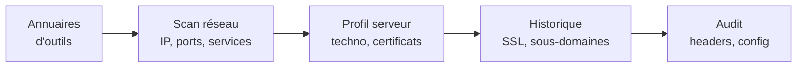

# OSINT — Outils web et serveurs

L'**OSINT** (Open Source Intelligence) consiste à collecter et analyser des informations publiquement accessibles. Pour la reconnaissance d'un site ou d'un serveur, plusieurs catégories d'outils permettent d'enchaîner les étapes : annuaires d'outils → cartographie réseau → profil du serveur → historique SSL → audit de sécurité.

## Étapes d'une reconnaissance web

## Annuaires généralistes — par où commencer

| Outil | Maintenu par | Usage |
|---|---|---|
| [Bellingcat Toolkit](https://bellingcat.gitbook.io/toolkit) | Bellingcat (journalisme d'investigation) | Référence francophone/anglophone, classée par thème (personnes, images, géolocalisation, etc.) |
| [OSINT Framework](https://find.osint-tool.com/) | communauté | Arborescence visuelle de centaines d'outils OSINT |

## Cartographier un serveur / une IP

Recherche d'IP exposées, de ports ouverts, de services fingerprint-és.

| Outil | Force | Limites |
|---|---|---|
| [Shodan](https://shodan.io) | « Google des objets connectés » — index de l'Internet exposé (caméras, ICS, serveurs, IoT) | Compte requis pour les requêtes avancées |
| [Censys](https://search.censys.io/) | Très bon pour les certificats et la cartographie hôtes/services. Données récentes. | Quotas en gratuit |
| [FOFA](https://en.fofa.info/) | Équivalent chinois de Shodan, parfois meilleur en Asie | Interface moins polie, certaines fonctions payantes |

**Astuce** : un même actif vu par Shodan, Censys et FOFA renvoie souvent des résultats complémentaires — les trois scanners ne couvrent pas exactement les mêmes plages d'adresses.

## Historique des certificats SSL

Les certificats X.509 sont publics (Certificate Transparency logs depuis 2018). On peut donc lister tous les sous-domaines historiquement certifiés pour un domaine.

| Outil | Usage |
|---|---|
| [crt.sh](https://crt.sh) | Recherche par domaine — révèle souvent des sous-domaines oubliés (`dev.exemple.com`, `staging.exemple.com`) |

**Cas d'usage typique** : un pentester découvre via crt.sh un `git.cible.com` non listé publiquement, qui mène à une instance GitLab mal protégée.

## Audit de configuration de sécurité

Pour évaluer la posture sécuritaire d'un site déjà identifié.

| Outil | Audite quoi |
|---|---|
| [Security Headers](https://securityheaders.com/) | Présence et qualité des en-têtes HTTP de sécurité (CSP, HSTS, X-Frame-Options, etc.) |
| [SSL Labs](https://www.ssllabs.com/) | Qualité de la configuration TLS — versions, suites cryptographiques, vulnérabilités connues |
| [UpGuard — Nginx Hardening](https://www.upguard.com/blog/10-tips-for-securing-your-nginx-deployment) | Guide pratique de durcissement Nginx |
| [Gist Nginx Config](https://gist.github.com/plentz/6737338) | Configuration Nginx sécurisée prête à l'emploi |

## Géolocalisation et OSINT image

| Outil | Usage |
|---|---|
| [GeoHints](https://geohints.com/) | Aide pour le geoguessing — codes postaux, indices visuels par pays (couleur des plaques, type de poteaux, langue des panneaux…) |

## Précautions

- **Cadre légal** : la collecte d'infos publiques est légale, l'intrusion sur un système l'exige une autorisation écrite (mission de pentest, programme de bug bounty)
- **Pas de scan agressif** sans permission — Shodan et Censys font le travail à votre place sans toucher la cible
- **Conservation des sources** : noter date et URL, les configurations changent rapidement
