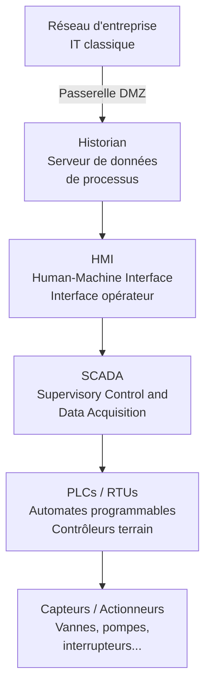

# Sécurité ICS/SCADA — Systèmes Industriels

Les systèmes de contrôle industriels (ICS) pilotent les infrastructures critiques : centrales électriques, réseaux d'eau, raffinage pétrolier, transport ferroviaire, usines. Leur compromission peut avoir des conséquences physiques graves, voire mortelles.

## Architecture des systèmes industriels

### Composants clés



| Composant | Rôle |
|---|---|
| **SCADA** | Supervision globale, collecte données, interface centrale |
| **HMI** | Interface graphique pour les opérateurs |
| **PLC** (Programmable Logic Controller) | Automate qui exécute la logique de contrôle |
| **RTU** (Remote Terminal Unit) | Collecte données terrain, souvent en zone éloignée |
| **Historian** | Base de données de séries temporelles pour les processus |
| **DCS** (Distributed Control System) | Contrôle distribué pour procédés continus (chimie, pétrole) |

### Niveaux de Purdue (ISA-95)

```
Niveau 5 : Internet / Cloud
Niveau 4 : Réseau entreprise (ERP, bureautique)
──────────────── DMZ industrielle ────────────────
Niveau 3 : Opérations usine (SCADA, Historian, MES)
Niveau 2 : Supervision (HMI, Engineering Workstations)
Niveau 1 : Contrôle (PLCs, DCS)
Niveau 0 : Processus physique (capteurs, actionneurs)
```

## Protocoles industriels

Conçus pour la fiabilité et le temps réel, pas pour la sécurité.

| Protocole | Usage | Sécurité native |
|---|---|---|
| **Modbus** (1979) | Série, TCP | Aucune |
| **DNP3** | Énergie, eau | Authentification optionnelle (SAv5) |
| **PROFIBUS/PROFINET** | Automatisation industrielle | Limitée |
| **OPC-UA** | Interopérabilité ICS | TLS + auth (si configuré) |
| **IEC 60870-5-104** | Téléconduite énergie | Optionnelle |
| **EtherNet/IP** | Automatisation | Limitée |
| **BACnet** | Bâtiments (HVAC) | Faible |

**Problème fondamental Modbus :**
```python
# Modbus TCP — aucune authentification, aucun chiffrement
from pymodbus.client import ModbusTcpClient

client = ModbusTcpClient('192.168.1.10', port=502)
client.connect()

# Lire les registres (état des équipements)
result = client.read_holding_registers(0, 10, unit=1)
print(result.registers)  # Valeurs process en clair

# Écrire dans les registres (modifier un paramètre de contrôle)
client.write_register(100, 0, unit=1)  # Couper une vanne ?
```

## Vecteurs d'attaque ICS

### Compromission IT → OT (mouvement latéral)

Le chemin le plus fréquent : compromission du réseau bureautique, pivot vers le réseau industriel via une mauvaise segmentation.

```
Attaquant → Internet → Phishing employé → Réseau IT
         → Historian (connecté aux deux réseaux)
         → HMI / SCADA
         → PLC → Actions physiques
```

**Cas réel — Colonial Pipeline (2021) :**
```
Credentials VPN compromis (Dark Web)
→ Accès réseau administratif
→ Arrêt volontaire du pipeline (par précaution)
→ 5 jours d'interruption
→ Pénurie carburant côte Est US, 4,4 M$ de rançon
```

### Attaques directes sur les PLCs

**Stuxnet (2010)** — Arme cybernétique la plus sophistiquée jamais découverte :
```
Vecteur : clé USB dans une usine d'enrichissement iranienne (Natanz)
Cible : PLCs Siemens S7-315 contrôlant des centrifugeuses
Technique : modification du code PLC pour faire tourner les centrifugeuses
            à des vitesses destructrices tout en affichant des valeurs normales
            aux opérateurs
Résultat : destruction d'environ 1 000 centrifugeuses sur 8 700
           Retard de 2 ans du programme nucléaire iranien
```

**Industroyer/Crashoverride (2016)** — Attaque contre le réseau électrique ukrainien :
```
Cible : sous-stations électriques de Kiev
Technique : protocoles IEC 60870-5-101/104 et IEC 61850 natifs
            → commandes directes aux disjoncteurs
Résultat : coupure de courant pour 230 000 personnes pendant 6 heures
```

**TRITON/TRISIS (2017)** — Ciblage des Safety Instrumented Systems (SIS) :
```
Cible : Schneider Electric Triconex Safety Controllers
Intention : désactiver les systèmes de sécurité d'une usine pétrochimique
            pour permettre une explosion / incident physique
Résultat : arrêt accidentel de l'usine → attaque découverte avant catastrophe
```

## Spécificités de la sécurité OT

### Contraintes fondamentales

| Contrainte | Description | Impact sur la sécurité |
|---|---|---|
| **Disponibilité primordiale** | 99,999% de disponibilité requise | Pas de patch intempestif |
| **Durée de vie longue** | 15-30 ans pour les équipements | OS obsolètes, Windows XP courant |
| **Temps réel** | Délais de ms critique | Sécurité réseau légère seulement |
| **Systèmes legacy** | Conçus avant l'ère cybersécurité | Pas d'authentification native |
| **Impact physique** | Erreur = accident industriel | Précaution extrême pour les changements |
| **Propriétaire** | Protocoles et équipements spécifiques | Peu d'outils de sécurité compatibles |

### Gestion des patches

```
Environnement IT : patch en 30 jours (SLA standard)
Environnement OT : patch pendant la maintenance annuelle (ou jamais)

Raisons :
- Arrêter une ligne de production = perte de millions €/h
- Tests de compatibilité longs (firmware PLC certifié)
- Support vendor souvent requis pour l'application
- Certains équipements n'ont plus de support

Compensations :
- Isolation réseau stricte (air gap ou DMZ)
- Détection d'intrusion (IDS passif)
- Application whitelisting
- Monitoring comportemental des processus
```

## Mesures de sécurité ICS

### Segmentation réseau (priorité absolue)

```
Principe : limiter au maximum la connectivité entre IT et OT

Zone 1 (IT) → Firewall → Zone DMZ industrielle → Firewall → Zone OT

Dans la DMZ industrielle :
- Historian (seul composant accédant aux deux côtés)
- Jump servers pour l'accès distant (pas d'accès direct)
- Serveurs de gestion des patches
- Antivirus centralisé

Dans la Zone OT :
- Pas d'accès Internet direct
- Pas de partages réseau inutiles
- Chaque équipement communique uniquement avec ce qu'il doit
```

### Air Gap et transferts sécurisés

```bash
# Data Diode — unidirectionnel physique (OT → IT, jamais l'inverse)
# Owl Cyber Defense, Waterfall Security : appliances matérielles

# Transfert de fichiers via zone de quarantaine
# 1. Scanner le fichier dans une zone IT
# 2. Vérifier l'intégrité (hash)
# 3. Transférer via un support approuvé (USB contrôlé)

# Application whitelisting — seuls les exécutables connus autorisés
# McAfee Application Control, Carbon Black App Control
```

### Détection passive (IDS OT)

Les IDS actifs sont dangereux sur les réseaux OT (un scan peut crasher un PLC).

```bash
# Claroty, Dragos, Nozomi Networks, Darktrace OT
# → Analyse passive du trafic réseau industriel
# → Profil du comportement normal de chaque équipement
# → Alerte sur les anomalies sans jamais envoyer de paquets

# Honeypots OT — leurres simulant des PLCs
# Conpot (open source)
docker run -it --rm honeynet/conpot:latest
# Simule Siemens S7, Modbus, BACnet → attire et détecte les scans
```

## Normes et standards

| Standard | Description |
|---|---|
| **IEC 62443** | Standard international de sécurité ICS/OT |
| **NIST SP 800-82** | Guide de sécurité pour les systèmes industriels (US) |
| **NERC CIP** | Cybersécurité pour le réseau électrique nord-américain |
| **ISA/IEC 62443** | Zones et conduits, niveaux de sécurité SL1-SL4 |

**IEC 62443 — Niveaux de sécurité :**
```
SL1 : Protection contre violations involontaires (erreurs humaines)
SL2 : Protection contre attaquants avec moyens et motivation modérés
SL3 : Protection contre attaquants sophistiqués avec ressources étendues
SL4 : Protection contre les États-nations (ex: Stuxnet)
```

## Ressources et outils

| Outil | Usage |
|---|---|
| **Shodan** (filtre ics) | Découvrir les ICS exposés sur Internet |
| **PLCScan** | Scanner Modbus/S7 |
| **Metasploit modules ICS** | Tests d'exploitation ICS (autorisés uniquement) |
| **Conpot** | Honeypot ICS |
| **GrassMarlin** | Cartographie passive réseau ICS |
| **Nozomi / Claroty** | Détection d'anomalies OT |
