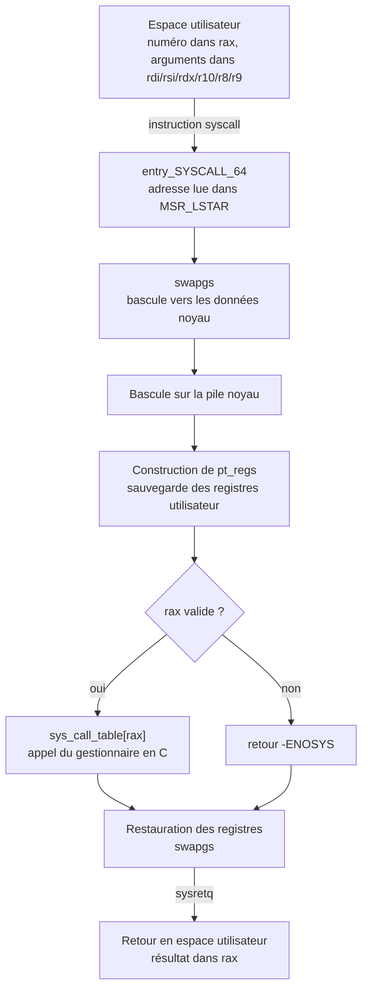

# Appels Système

Un processus, laissé à lui-même, ne peut presque rien. Il calcule dans sa propre mémoire et c'est tout. Lire un fichier, ouvrir une connexion, réclamer de la mémoire, créer un processus, et jusqu'à se terminer : chacune de ces actions suppose de sortir de soi, et aucune n'est à sa portée. Toutes passent par le noyau.

L'appel système est cette porte. Ce n'est pas la voie principale : c'est **la seule**. Tout ce qu'un programme fait d'observable depuis l'extérieur se réduit, en dernière analyse, à une suite d'appels système. Cette note décrit le franchissement lui-même — ce qui se passe entre l'instruction qui le déclenche et celle qui lui succède. Pour la vue d'ensemble du rôle d'un système d'exploitation et de la séparation des anneaux de privilège, voir [[Fondamentaux]].

> [!important] Idée clé
> Un appel système n'est **pas** un appel de fonction, malgré la ressemblance de la syntaxe en C. Un appel de fonction saute à une adresse du même espace d'adressage, avec les mêmes privilèges, sur la même pile. Un appel système change de niveau de privilège, change de pile, et sur les noyaux modernes change de table de pages. Ce n'est pas un saut, c'est un **changement de contexte contrôlé** vers un code qui ne fait pas confiance à celui qui l'appelle. Les trois conséquences majeures découlent toutes de là : il coûte cher, il est le point de passage obligé de toute observation d'un programme, et il constitue la surface d'attaque du noyau depuis l'espace utilisateur.

## Pourquoi une frontière étroite

Le noyau s'exécute en anneau 0 : il peut tout. Un processus s'exécute en anneau 3 : il ne peut rien de privilégié. Entre les deux, il faut un passage, et ce passage doit satisfaire deux exigences contradictoires.

Il doit être **étroit**. Toute la surface du système d'exploitation — fichiers, réseau, mémoire, processus, signaux, temps — tient en quelques centaines d'entrées, de l'ordre de 400 à 450 selon la version du noyau. Cette étroitesse est délibérée : chaque entrée est du code privilégié appelable par n'importe quel programme, y compris hostile. Moins il y en a, moins il y a à auditer.

Il doit être **défiant**. Le noyau ne fait aucune confiance aux arguments qu'il reçoit. Un pointeur venu de l'espace utilisateur peut désigner n'importe quoi, y compris de la mémoire noyau. Le code du noyau marque donc ces pointeurs d'une annotation spéciale, `__user`, et ne les déréférence jamais directement : il passe par `copy_from_user()` et `copy_to_user()`, qui vérifient que l'adresse appartient bien à l'espace du processus appelant.

> [!warning] Piège
> Cette défiance n'est pas de la paranoïa administrative. Si le noyau lisait deux fois un argument en mémoire utilisateur — une fois pour le valider, une fois pour l'utiliser — un autre fil du même processus pourrait le modifier entre les deux. La validation porterait alors sur une valeur qui n'est plus celle qu'on utilise : c'est une vulnérabilité **TOCTOU** (*time of check to time of use*). La règle est donc de **copier d'abord, valider ensuite, travailler uniquement sur la copie**. Toute entorse à cette discipline dans un pilote est une faille en puissance.

## Le franchissement sur x86-64

Historiquement, un appel système se déclenchait par une interruption logicielle, `int 0x80`. Le mécanisme fonctionnait mais empruntait toute la machinerie des interruptions matérielles, coûteuse. Le x86-64 a introduit une instruction dédiée, plus directe : `syscall`.

### Ce que fait le processeur

L'instruction `syscall` n'est pas un saut vers une adresse qu'on lui donne. Elle saute vers une adresse que **le noyau a enregistrée au démarrage** dans un registre spécifique au modèle, `MSR_LSTAR`. Le noyau y écrit l'adresse de son point d'entrée, `entry_SYSCALL_64`, défini en assembleur dans `arch/x86/entry/entry_64.S`.

Le processeur effectue alors, en une instruction :

| Action | Détail |
|---|---|
| Sauvegarde du retour | L'adresse de l'instruction suivante est rangée dans `rcx` |
| Sauvegarde de l'état | Le registre `rflags` est rangé dans `r11` |
| Changement de privilège | `CS` et `SS` sont chargés depuis `MSR_STAR`, passage en anneau 0 |
| Saut | `rip` reçoit le contenu de `MSR_LSTAR` |

> [!warning] Piège
> Le processeur **ne change pas de pile**. Contrairement à une interruption matérielle, où le matériel bascule automatiquement sur la pile noyau désignée par le TSS, `syscall` laisse `rsp` pointant sur la pile utilisateur — donc sur de la mémoire que le processus contrôle entièrement. C'est au noyau de basculer lui-même, immédiatement, avant de toucher à quoi que ce soit. Il y parvient grâce à l'instruction `swapgs`, qui échange la base du segment `GS` avec une valeur réservée au noyau et lui donne ainsi accès à ses données par processeur, dont l'adresse de la pile noyau. Une erreur à cet endroit précis est catastrophique, et plusieurs vulnérabilités noyau historiques s'y logent.

### Ce que fait le noyau



La structure `pt_regs` mérite un mot : c'est l'instantané complet des registres utilisateur au moment du franchissement, rangé sur la pile noyau. C'est elle qui permettra de restaurer le processus à l'identique au retour — et c'est elle que lit un débogueur quand il inspecte un processus arrêté dans un appel système.

## La table des appels système

Chaque appel système porte un numéro. La correspondance vit dans les sources du noyau, sous `arch/x86/entry/syscalls/syscall_64.tbl`, et se lit directement :

```
1	common	write			sys_write
60	common	exit			sys_exit
```

> [!important] Idée clé
> **Un numéro d'appel système est un contrat définitif.** Il n'est jamais renuméroté, jamais réattribué, jamais supprimé — même quand l'appel devient obsolète. La raison tient en une règle que Linus Torvalds répète depuis trente ans : on ne casse pas l'espace utilisateur. Un binaire compilé en 1995 qui invoque l'appel numéro 1 doit continuer d'écrire sur un descripteur en 2026. C'est pourquoi la table ne fait que croître, avec ses fossiles et ses doublons — `open` et `openat`, `stat` et `statx` — chaque nouvelle variante recevant un numéro neuf plutôt que de modifier l'ancienne. Cette stabilité absolue est ce qui rend possible l'exécution de binaires anciens, et ce qui explique aussi pourquoi l'interface est encombrée.

Côté noyau, un appel système est une fonction C ordinaire, déclarée par une macro qui encode le nombre d'arguments :

```C
SYSCALL_DEFINE3(write, unsigned int, fd, const char __user *, buf,
                size_t, count)
{
        /* ... */
}
```

Le suffixe `3` donne le nombre de paramètres, et l'annotation `__user` sur `buf` signale le pointeur non fiable évoqué plus haut.

## La convention d'appel

| Rôle | Registre |
|---|---|
| Numéro de l'appel | `rax` |
| 1er argument | `rdi` |
| 2e argument | `rsi` |
| 3e argument | `rdx` |
| 4e argument | `r10` |
| 5e argument | `r8` |
| 6e argument | `r9` |
| Valeur de retour | `rax` |

Six arguments au maximum, sans exception : rien ne passe par la pile, contrairement aux appels de fonction ordinaires. Un appel système qui aurait besoin de davantage de paramètres reçoit un pointeur vers une structure — c'est le cas de `clone3` ou de `io_uring_setup`. Le détail du mécanisme et la différence avec la convention des fonctions, où le quatrième argument passe par `rcx` et non `r10`, sont traités dans [[Assembleur x86-64]].

### La convention d'erreur

Le noyau n'a pas de variable `errno` : il n'aurait aucun sens qu'il en ait une, puisqu'elle appartient au processus appelant. Il encode donc l'erreur dans la valeur de retour elle-même, en renvoyant **l'opposé du code d'erreur**.

| Valeur dans `rax` | Signification |
|---|---|
| Positive ou nulle | Succès, la valeur est le résultat |
| Entre -1 et -4095 | Échec, le code d'erreur est l'opposé de la valeur |

La fonction enveloppe de la bibliothèque C effectue la traduction : elle teste si le retour tombe dans cette plage, et si oui place l'opposé dans `errno` puis renvoie `-1`. C'est cette traduction, et non le noyau, qui produit la convention familière du `-1` accompagné d'`errno`.

> [!tip] À retenir
> La plage réservée aux erreurs explique une bizarrerie : un appel système ne peut pas renvoyer légitimement une valeur comprise entre -1 et -4095, sous peine d'être interprétée comme un échec. En pratique la contrainte ne gêne jamais — les appels renvoient des tailles, des descripteurs ou des identifiants, tous positifs — mais elle est la raison pour laquelle `mmap`, qui renvoie une adresse, signale l'échec par `MAP_FAILED` plutôt que par une adresse nulle.

## Ce que fait la bibliothèque C

Un programme n'invoque pratiquement jamais un appel système directement. Il appelle `fopen`, `fgets`, `printf`, `fclose` — et aucun de ces noms n'existe dans le noyau. Ce sont des fonctions de la bibliothèque C, qui appellent en dessous `open`, `read`, `write`, `close`.

Cette couche intermédiaire n'est pas un surcoût gratuit. Elle assure trois choses que le noyau ne peut pas assurer :

- **La validation et la traduction** : vérifier les arguments, gérer `errno`, adapter les types.
- **Le tampon** : `printf` n'écrit pas caractère par caractère. Il accumule dans un tampon et ne déclenche `write` qu'au remplissage ou au saut de ligne. Un programme naïf qui écrirait un caractère par appel système serait des ordres de grandeur plus lent.
- **La portabilité** : l'interface POSIX reste stable là où la numérotation des appels système varie d'une architecture à l'autre.

Ces deux niveaux s'observent séparément, et la distinction est précieuse au débogage :

```bash
strace ./programme       # les appels système, donc la frontière noyau
ltrace ./programme       # les appels de bibliothèque, donc le niveau au-dessus
ltrace -S ./programme    # les deux entremêlés, pour voir qui déclenche quoi
```

## Le coût du franchissement

Un appel de fonction coûte quelques nanosecondes. Un appel système coûte quelques centaines de nanosecondes. L'écart de deux ordres de grandeur s'explique par l'accumulation de plusieurs frais :

| Source du coût | Nature |
|---|---|
| Changement de privilège | Rechargement des sélecteurs de segment, vidange partielle du pipeline |
| Changement de pile | Basculement et construction de `pt_regs` |
| Pollution des caches | Le code noyau évince des lignes de cache et des entrées de TLB utiles au processus |
| Isolation des tables de pages | Depuis Meltdown, KPTI impose un changement de table de pages à l'aller et au retour |

> [!warning] Piège
> L'atténuation **KPTI** (*Kernel Page-Table Isolation*), déployée en urgence début 2018 contre Meltdown, a significativement alourdi le franchissement : l'espace noyau n'est plus cartographié dans les tables de pages du processus, il faut donc en changer à chaque entrée et à chaque sortie. Les charges de travail dominées par les appels système — bases de données, serveurs réseau — en ont ressenti l'effet directement. C'est l'illustration la plus nette de ce qu'une atténuation de sécurité au niveau matériel peut coûter, et de pourquoi l'optimisation consiste presque toujours à **franchir moins souvent** plutôt qu'à franchir plus vite.

Les trois stratégies d'évitement en découlent : **tamponner** pour regrouper plusieurs opérations logiques en un franchissement, **grouper** avec des appels vectoriels comme `readv`/`writev` ou une soumission asynchrone comme `io_uring`, et **supprimer** le franchissement quand il n'est pas nécessaire — ce que fait le vDSO.

## vDSO et vsyscall

Certains appels système ne demandent aucun privilège. « Quelle heure est-il ? » n'expose rien : le noyau connaît la réponse, et rien n'empêcherait qu'il la publie dans une page lisible par tous. Payer un franchissement complet pour la lire est un gaspillage pur — et ces appels-là comptent parmi les plus fréquents.

Deux mécanismes successifs ont répondu à ce constat.

**vsyscall**, le premier, cartographie une page à une adresse fixe, `0xffffffffff600000`, contenant trois appels : `gettimeofday`, `time`, `getcpu`.

**vDSO** (*virtual dynamic shared object*) l'a remplacé. Le noyau cartographie dans chaque processus une bibliothèque partagée complète, `linux-vdso.so.1`, qu'aucun fichier ne porte sur le disque. Elle apparaît pourtant comme une dépendance ordinaire :

```bash
ldd /bin/uname
        linux-vdso.so.1 (0x00007ffe014b7000)
        libc.so.6 => /lib64/libc.so.6 (0x00007fbfee2fe000)
        /lib64/ld-linux-x86-64.so.2 (0x00005559aab7c000)

grep vdso /proc/self/maps
```

Elle expose `__vdso_clock_gettime`, `__vdso_gettimeofday`, `__vdso_time`, `__vdso_getcpu` et `__vdso_clock_getres`. Tout programme lié dynamiquement à la glibc en bénéficie sans le savoir : l'appel se résout entièrement en espace utilisateur, sans franchissement.

| | vsyscall | vDSO |
|---|---|---|
| Adresse | Fixe, identique dans tout processus | Aléatoire, cartographiée au chargement |
| Forme | Page unique | Bibliothèque partagée relogeable |
| Appels couverts | 3 | 5 |
| Statut | Obsolète, émulé | En service |

> [!warning] Piège
> L'adresse fixe de vsyscall en a fait une aubaine pour l'exploitation : une page exécutable, à un emplacement connu d'avance, présente dans tout processus, **insensible à l'ASLR par construction**. Elle fournissait des fragments de code réutilisables pour le détournement de flot d'exécution. C'est la raison de son abandon : les noyaux modernes l'émulent par défaut, ou la désactivent entièrement via le paramètre `vsyscall=none`. Le vDSO corrige précisément ce défaut en étant relogeable, donc soumis à l'ASLR comme le reste. Voir [[Binary Exploitation]].

## Observer

L'appel système est le point de passage obligé : quoi qu'un programme prétende faire, il le fait par là. C'est ce qui rend son observation si informative — on n'a pas besoin du code source pour savoir ce qu'un binaire touche réellement.

| Outil | Usage |
|---|---|
| `strace -f -e trace=openat,connect` | Suivi filtré, fils compris. L'outil de première intention |
| `strace -c` | Profil agrégé : nombre d'appels et temps passé par type |
| `ltrace -S` | Appels de bibliothèque et appels système entremêlés |
| `cat /proc/<pid>/syscall` | Appel en cours d'un processus et ses arguments, sans l'interrompre |
| `perf trace` | Équivalent à `strace` avec un surcoût bien moindre, adapté à la production |
| `bpftrace` | Instrumentation programmable par eBPF, filtrage arbitraire à la source |

> [!warning] Piège
> `strace` repose sur `ptrace`, qui arrête le processus à chaque entrée et chaque sortie d'appel système. Le ralentissement atteint couramment un facteur dix à cent. Sur un programme dont le comportement dépend du temps — expiration de délai, concurrence, protocole réseau — **l'observation modifie ce qu'elle observe**, et le bogue recherché peut disparaître ou changer de nature sous l'instrument. C'est exactement le cas où il faut passer à `perf trace` ou à eBPF, dont le surcoût se mesure en pourcents.

## Restreindre : seccomp

Si l'interface d'appel système est la seule porte du noyau, elle en est aussi la seule surface d'attaque depuis l'espace utilisateur. Toute élévation de privilèges exploitant une faille du noyau passe nécessairement par un appel système — c'est la définition même du vecteur.

D'où une idée défensive directe : **un processus n'a pas besoin de tous les appels système**. Un serveur web en régime établi lit, écrit et attend des sockets ; il n'a aucune raison légitime d'appeler `mount`, `ptrace` ou `init_module`. Lui retirer ces appels réduit la surface sans rien coûter à son fonctionnement.

C'est ce que fait **seccomp-BPF** : un filtre, exprimé en BPF, que le processus s'applique à lui-même et qui décide pour chaque appel système s'il passe, échoue avec une erreur, ou tue le processus. Le filtre est irrévocable — un processus ne peut que se restreindre davantage, jamais s'affranchir de ce qu'il s'est imposé.

Le mécanisme est aujourd'hui omniprésent, généralement sans que l'utilisateur le voie :

- **Docker** applique un profil par défaut qui bloque plusieurs dizaines d'appels système jugés inutiles à un conteneur. Voir [[Docker]] et [[Kubernetes Security]].
- **systemd** expose des directives d'unité — `SystemCallFilter`, `SystemCallArchitectures` — qui confinent un service déclarativement.
- **Les navigateurs** confinent leurs processus de rendu, qui traitent du contenu hostile par nature.

> [!tip] À retenir
> Le réflexe d'analyse consiste à rapprocher les deux faces. Pour durcir un service, on l'observe d'abord avec `strace -c` en fonctionnement normal afin d'établir la liste réelle des appels qu'il utilise, puis on construit le filtre à partir de cette liste. Pour analyser un binaire suspect, on procède exactement à l'inverse : la liste des appels système qu'il émet trahit ses intentions bien plus sûrement que ses chaînes de caractères ou son nom de fichier. Voir [[Malware Analysis]].

## À lire ensuite

- [[Fondamentaux]] — rôles du noyau, anneaux de privilège, vue d'ensemble
- [[Assembleur x86-64]] — conventions d'appel, registres, l'instruction `syscall` en contexte
- [[Processus et Threads]] — `fork`, `exec`, `wait` et le cycle de vie d'un processus
- [[Gestion de la Mémoire]] — `mmap`, `brk` et l'espace d'adressage virtuel
- [[Système de Fichiers]] — descripteurs de fichiers, VFS, `open`/`read`/`write`
- [[Démarrage et Bootloader]] — comment le noyau arrive en mémoire et installe ses points d'entrée
- [[Linux Privilege Escalation]] — exploitation des failles noyau atteintes par cette interface
- [[Binary Exploitation]] — détournement de flot d'exécution, ASLR et réutilisation de code
