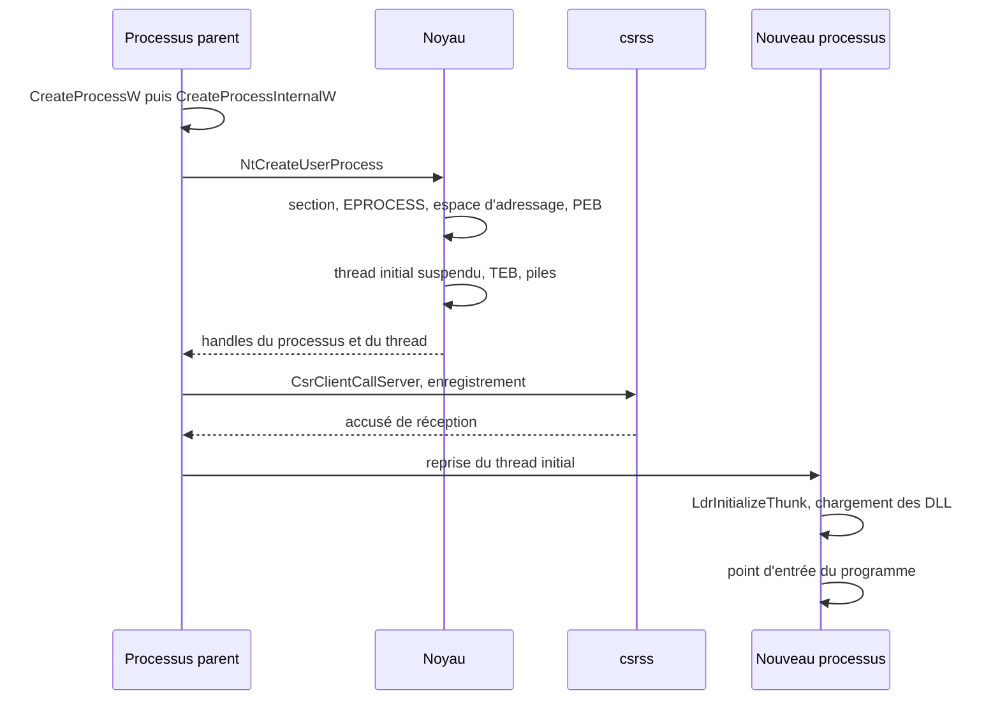
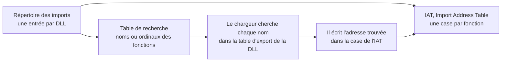

# Création d'un processus sous Windows

Un double clic sur une icône, et un programme apparaît. Entre les deux, Windows a ouvert un fichier, l'a projeté en mémoire, construit une demi-douzaine de structures en mode noyau et en mode utilisateur, prévenu un processus système, puis laissé un chargeur résoudre les dépendances du programme avant de lui passer la main. Suivre ce trajet est la meilleure façon de voir fonctionner ensemble les pièces décrites dans [[Windows NT — Architecture interne]] : couches, appels système, objets, handles et jetons.

> [!important] Idée clé
> Unix crée un processus en deux temps : `fork` duplique le processus courant, puis `exec` remplace son programme (voir [[Processus et Threads]]). Windows fait tout en une fois : on lui donne un fichier exécutable et il fabrique un processus neuf autour. Depuis Windows Vista, l'essentiel de ce travail se fait dans **un seul appel système**, `NtCreateUserProcess`.

## Vue d'ensemble

## Du côté du parent

`CreateProcess`, `ShellExecuteEx`, `CreateProcessWithLogonW`, WMI : Windows offre de nombreuses façons documentées de lancer un programme, mais elles aboutissent toutes, directement ou par un appel de procédure distante, à **`CreateProcessInternalW`**, dans `kernelbase.dll`. `CreateProcessW` n'en est qu'une façade.

Cette fonction fait le travail propre au sous-système Windows. Elle interprète la ligne de commande et les options, prépare les paramètres du futur processus (répertoire courant, variables d'environnement, ligne de commande), puis appelle `NtCreateUserProcess` dans `ntdll.dll`, qui franchit la frontière du noyau.

> [!tip] À retenir
> Avant Vista, `CreateProcess` enchaînait plusieurs appels système : ouvrir le fichier, créer une section, créer le processus avec `NtCreateProcessEx`, puis son premier thread. `NtCreateProcessEx` existe toujours, surtout pour la compatibilité. Il prend une section déjà créée au lieu d'un fichier et laisse l'appelant construire lui-même le thread initial et les paramètres. Ce découpage en étapes manuelles est justement ce qu'exploitent certaines techniques d'injection et de dissimulation.

## Dans le noyau

### Projeter l'exécutable

Le noyau ouvre d'abord le fichier exécutable, puis crée à partir de lui un **objet section**. Une section est l'objet du noyau qui représente une zone de mémoire partageable ; l'API Windows l'appelle *file mapping object*. Elle peut être adossée :

- à un **fichier** : les pages de la section sont lues depuis le fichier et, si elles sont modifiées, réécrites dedans ;
- au **fichier d'échange** : c'est ce que produit `CreateFileMapping` quand on lui passe `INVALID_HANDLE_VALUE` à la place d'un fichier. Deux processus qui ouvrent la même section nommée partagent alors de la mémoire.

Pour un exécutable, la section est de type *image* : le gestionnaire de mémoire analyse le format PE (voir [[Reverse Engineering]]) et prépare chaque section du fichier avec ses propres protections, code en lecture et exécution, données en lecture et écriture. Une section image peut ensuite être projetée d'un coup dans un espace d'adressage. C'est aussi ce qui permet à plusieurs processus de partager les mêmes pages physiques de code pour un même exécutable ou une même DLL.

### Le processus : EPROCESS

Le noyau crée ensuite l'**objet processus**, une structure `EPROCESS` allouée par le gestionnaire d'objets. Son premier membre est une structure `KPROCESS`, qui regroupe ce dont le noyau au sens strict a besoin (notamment pour l'ordonnancement), le reste servant à l'exécutif : identifiant du processus, table des handles, jeton d'accès, liste des threads, descripteurs de l'espace d'adressage.

Le nouveau processus reçoit le **jeton** de son créateur : il s'exécute dans le contexte de sécurité du processus appelant. Si le thread appelant emprunte l'identité d'un autre utilisateur, c'est tout de même le jeton du processus, et non le jeton d'emprunt, qui est copié. Pour lancer un programme sous une autre identité, il faut `CreateProcessAsUser` ou `CreateProcessWithLogonW`.

### L'espace d'adressage

Le gestionnaire de mémoire crée l'espace d'adressage virtuel du processus, puis y projette la section de l'exécutable et **`ntdll.dll`**, présente dans tous les processus puisque c'est elle qui exécutera les premières instructions en mode utilisateur.

Chaque région réservée de cet espace est décrite par un **VAD** (*Virtual Address Descriptor*), un nœud d'arbre binaire de recherche équilibré qui en donne l'adresse, la taille, la protection et l'état. Quand un programme appelle `VirtualAlloc`, il ajoute une entrée à cet arbre, sans qu'aucune page physique soit encore attribuée :

| Option de `VirtualAlloc` | Effet |
|---|---|
| `MEM_RESERVE` | Réserve une plage d'adresses. Y accéder provoque une violation d'accès |
| `MEM_COMMIT` | Engage la mémoire, c'est-à-dire la décompte de ce que le système peut fournir. Les pages physiques ne sont attribuées qu'au premier accès |
| `MEM_RESERVE \| MEM_COMMIT` | Les deux en un seul appel |

Au premier accès à une page engagée, une faute de page survient ; le gestionnaire consulte le VAD, constate que l'accès est légitime et fournit une page remplie de zéros. L'ensemble des pages d'un processus effectivement présentes en mémoire physique forme son **working set**, borné par un minimum et un maximum. Les principes généraux de la pagination sont dans [[Gestion de la Mémoire]].

> [!tip] À retenir
> L'arbre des VAD est l'une des sources les plus précieuses en investigation mémoire. Une région en lecture, écriture et exécution qui ne correspond à aucun fichier projeté est le signe classique d'un code injecté. C'est ce que recherche le greffon `malfind` de Volatility (voir [[Memory Analysis]] et [[Volatility 3]]).

### Le PEB

Le noyau alloue ensuite dans l'espace utilisateur du processus le **PEB** (*Process Environment Block*). C'est le pendant de `EPROCESS` pour le code en mode utilisateur, qui ne peut pas lire les structures du noyau. On y trouve notamment :

- `BeingDebugged`, qui indique si un débogueur est attaché au processus. Microsoft recommande de passer par `CheckRemoteDebuggerPresent` plutôt que de lire le PEB directement ;
- `Ldr`, la base de données du chargeur : la liste des modules chargés dans le processus ;
- `ProcessParameters` : ligne de commande, répertoire courant, environnement.

Microsoft ne documente qu'une petite partie du PEB et prévient que sa structure peut changer d'une version à l'autre.

### Le thread initial

Un processus n'exécute rien par lui-même : ce sont ses threads qui s'exécutent. Le noyau crée donc le **thread initial**, avec :

- un objet `ETHREAD`, dont le premier membre est un `KTHREAD`, sur le même modèle que `EPROCESS` et `KPROCESS` ;
- une **pile utilisateur** et une **pile noyau** : chaque thread a les deux, puisqu'il passera de l'un à l'autre mode à chaque appel système ;
- un **TEB** (*Thread Environment Block*) en mémoire utilisateur, qui pointe vers le PEB et contient les emplacements de stockage local au thread. En mode utilisateur sur x64, le registre de segment `GS` pointe sur le TEB du thread courant.

Le thread est créé **suspendu**. Le noyau insère le processus et le thread dans la table des handles du parent, et `NtCreateUserProcess` rend la main à `CreateProcessInternalW` avec ces deux handles.

## Retour chez le parent : prévenir csrss

Avant de laisser démarrer le nouveau processus, `CreateProcessInternalW` doit l'annoncer au sous-système Windows. Elle appelle `CsrClientCallServer`, qui envoie à **`csrss`** un message par **ALPC** (*Advanced Local Procedure Call*), le mécanisme de communication interprocessus rapide et non documenté de Windows. `csrss` duplique pour lui-même des handles vers le processus et le thread, puis alloue ses propres structures pour les suivre.

Ce n'est qu'après cet enregistrement que le thread initial est repris. Le parent récupère les handles et les identifiants dans la structure `PROCESS_INFORMATION`, et `CreateProcess` retourne.

> [!warning] Piège
> L'ordre compte. Un thread injecté de l'extérieur dans le nouveau processus avant que `csrss` ait été prévenu serait le premier à s'exécuter : il ferait lui-même l'initialisation du processus, `csrss` recevrait ensuite une annonce incohérente, et la création échouerait. Tout outil qui injecte du code dans des processus en cours de démarrage doit tenir compte de cette fenêtre.

## Dans le nouveau processus : le chargeur

### LdrInitializeThunk

Tout thread en mode utilisateur, quel qu'il soit, commence son exécution dans **`LdrInitializeThunk`**, une fonction de `ntdll.dll`. Le premier thread d'un processus y accomplit l'initialisation du processus avant d'être dirigé vers le point d'entrée du programme. Cette initialisation comprend notamment :

- le remplissage de la base de données du chargeur (`PEB->Ldr`) ;
- le chargement des DLL dont l'exécutable dépend, puis de leurs propres dépendances, de proche en proche ;
- l'appel des fonctions d'initialisation de chaque DLL (`DllMain`) et des rappels de stockage local au thread ;
- pour un programme en mode console, la création de la fenêtre de console.

Depuis Windows 10, le chargeur répartit une partie de ce travail entre plusieurs threads d'un pool, ce qui explique qu'un programme qui ne crée aucun thread en montre pourtant plusieurs dans un débogueur. Le nombre de ces threads se règle par la valeur `MaxLoaderThreads` des *Image File Execution Options* du registre.

### Résoudre les imports

Un exécutable ne sait pas à l'avance où ses DLL seront chargées. Pour chaque fonction importée, il contient donc une case vide, que le chargeur remplit au démarrage. Le mécanisme repose sur des tables décrites par l'en-tête PE :

Avant la résolution, la table de recherche et l'IAT ont le même contenu. Après, chaque case de l'IAT contient l'adresse réelle de la fonction, et le code du programme appelle ses fonctions importées en passant par ces cases. Le détail des structures est dans la section sur le format PE de [[Reverse Engineering]].

> [!tip] À retenir
> Parce que tout appel à une fonction importée passe par l'IAT, remplacer une case de cette table suffit à détourner les appels du programme vers une autre fonction. C'est l'une des techniques de crochetage les plus anciennes, utilisée aussi bien par des outils de surveillance que par des logiciels malveillants.

### Le point d'entrée

Une fois les dépendances chargées et initialisées, le chargeur transfère l'exécution au **point d'entrée** de l'exécutable, dont l'adresse relative figure dans l'en-tête optionnel du PE (`AddressOfEntryPoint`). Pour un programme C ou C++, ce n'est pas encore `main` : c'est le code de démarrage de la bibliothèque d'exécution, qui initialise le tas du C, les variables globales et les arguments, puis appelle `main` ou `WinMain`.

## Observer le trajet

| Outil | Ce qu'il montre |
|---|---|
| Process Monitor (Sysinternals) | Les événements de création de processus et de thread, les chargements d'images, les accès fichiers et registre qui les accompagnent |
| Process Explorer (Sysinternals) | L'arbre des processus, les handles et les DLL de chacun, son jeton |
| WinDbg | `!process`, `!peb`, `!teb`, et les structures `nt!_EPROCESS` ou `nt!_KTHREAD` avec `dt` |
| Journal Sysmon, événement 1 | Chaque création de processus avec sa ligne de commande et son parent, pour la détection (voir [[Windows Forensics]]) |

## Sources

- Hunt & Hackett, *The Definitive Guide To Process Cloning on Windows* : aboutissement de toutes les API à `CreateProcessInternalW`, `NtCreateUserProcess` et `NtCreateProcessEx`, `LdrInitializeThunk`.
- m417z, *When is it generally safe to CreateRemoteThread?* : étapes de la création, notification de `csrss`, fenêtre d'injection.
- j00ru, *Windows CSRSS Write Up: Inter-process Communication*, et Core Security, *Creating Processes Using System Calls* : `CsrClientCallServer` et ALPC.
- MDSec, *EDR Parallel-asis through Analysis* : le chargeur parallèle de Windows 10.
- Microsoft Learn : `CreateProcessW` (contexte de sécurité du nouveau processus), `CreateFileMappingA`, *File Mapping*, `VirtualAlloc`, *Working Set*, structures `PEB` et `TEB`, *Windows kernel opaque structures* (`EPROCESS`, `ETHREAD`), *PE Format*.
- Geoff Chappell, *EPROCESS* : `KPROCESS` en tête de `EPROCESS`.

Pour approfondir : *Windows Internals*, 7e édition, partie 1, chapitre 3 (processus et jobs).

## À lire ensuite

- [[Windows NT — Architecture interne]] : couches, appels système, objets, handles, SID et jetons
- [[Processus et Threads]] : le modèle général et la création de processus sous Unix
- [[Gestion de la Mémoire]] : pagination, fautes de page, mémoire virtuelle
- [[Reverse Engineering]] : le format PE et ses tables d'import
- [[Memory Analysis]] : EPROCESS, PEB et VAD dans une image mémoire
- [[AV-EDR Evasion]] : injection de code et contournement des crochets
