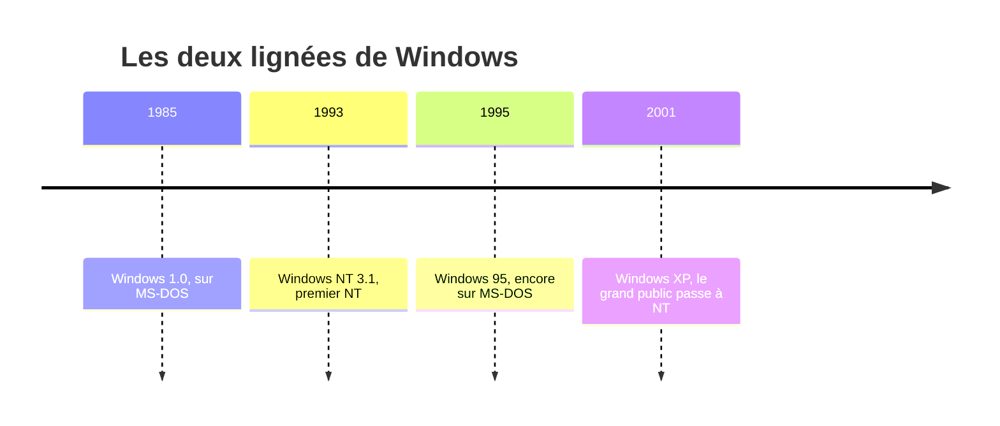
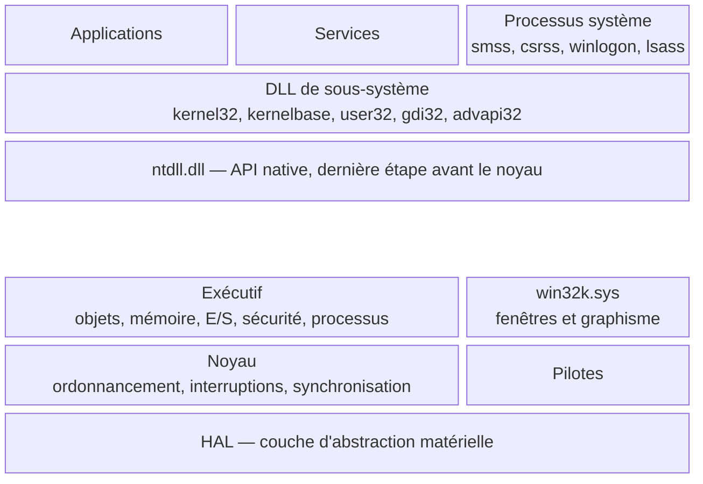
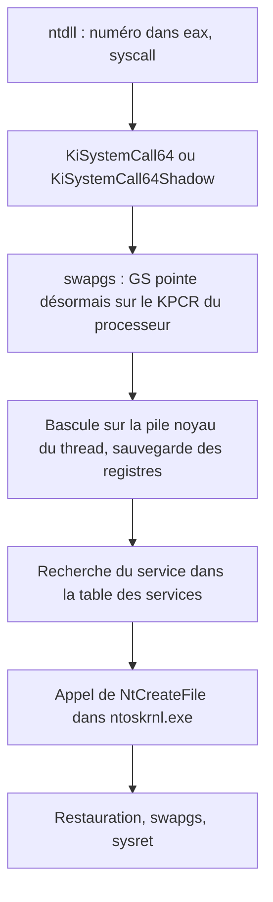
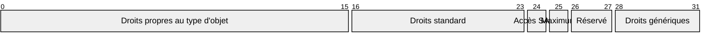

# Windows NT — Architecture interne

Toutes les versions de Windows en usage aujourd'hui, du poste de travail au serveur, descendent d'un même système : **Windows NT**. Ses couches, ses conventions et ses noms de fonctions reviennent partout dès qu'on regarde Windows d'un peu près, que ce soit en analyse de logiciels malveillants, en investigation mémoire ou en développement de pilotes. Cette note en donne la carte : qui fait quoi en mode utilisateur et en mode noyau, comment un programme franchit la frontière, et comment le système représente et protège ses ressources. La naissance d'un processus, qui met toutes ces pièces en mouvement, est suivie pas à pas dans [[Création d'un processus sous Windows]].

> [!important] Idée clé
> Un programme Windows ne parle presque jamais directement au noyau. Il appelle l'**API Windows** (`kernel32.dll`, `user32.dll`…), qui appelle l'**API native** exposée par `ntdll.dll`, qui seule déclenche l'appel système. Microsoft documente et garantit la première couche, pas la seconde. C'est l'inverse de Linux, où l'interface stable est l'appel système lui-même (voir [[Appels Système]]). Presque toutes les particularités de Windows vues de bas niveau découlent de ce choix.

## Deux lignées, une seule survivante

Pendant près de dix ans, Microsoft a entretenu deux familles de systèmes sans rapport technique entre elles.

- **La lignée DOS** : Windows 1.0 (1985) à 3.x, puis Windows 95, 98 et Me. Une interface graphique reposant sur MS-DOS.
- **La lignée NT** : un système 32 bits entièrement nouveau, qui ne repose pas sur DOS. Bill Gates recrute en 1988 **Dave Cutler**, venu de Digital Equipment Corporation, où il avait conçu le système VMS dont NT reprend de nombreux concepts. La première version, **Windows NT 3.1**, sort le 27 juillet 1993. Elle est numérotée 3.1 pour s'aligner sur le Windows grand public de l'époque, mais n'a rien de commun avec lui sous le capot.

La réunion se fait avec **Windows XP**, disponible en octobre 2001 : c'est la première version grand public qui ne repose ni sur MS-DOS ni sur le noyau de Windows 95. Depuis, tout Windows est un NT.



## La carte des couches

NT n'utilise que deux des quatre anneaux de privilège du x86 : l'anneau 3 pour le mode utilisateur, l'anneau 0 pour le mode noyau. Le choix visait la portabilité vers des processeurs RISC qui n'offraient que deux niveaux.



Les trois rangées du haut s'exécutent en mode utilisateur, les trois du bas en mode noyau.

### En mode utilisateur

| Composant | Rôle |
|---|---|
| DLL de sous-système | Implémentent l'API Windows documentée. `kernel32` pour la base (fichiers, mémoire, processus), `user32` pour les fenêtres, `gdi32` pour le dessin, `advapi32` pour la sécurité et le registre |
| `kernelbase.dll` | Introduite avec Windows 7 : une grande partie de `kernel32` et `advapi32` y a été déplacée, et ces deux DLL se contentent souvent de lui transmettre l'appel |
| `ntdll.dll` | Exporte l'API native, contient le chargeur d'images et le code qui déclenche les appels système. Présente dans tous les processus |
| `smss.exe` | Gestionnaire de sessions, premier processus en mode utilisateur lancé par le noyau. Il crée les sessions et y lance `csrss` et `winlogon` |
| `csrss.exe` | Partie en mode utilisateur du sous-système Windows. Tient la liste des processus et threads de sa session, gère les consoles. Processus critique : le tuer provoque un écran bleu |
| `lsass.exe` | Applique la politique de sécurité locale, vérifie les connexions et crée les jetons d'accès |

À l'origine, NT pouvait héberger plusieurs **sous-systèmes d'environnement**, chacun offrant une API différente au-dessus du même noyau : Win32, OS/2 et POSIX. Le sous-système OS/2 a disparu après Windows 2000, et la lignée POSIX a abouti au sous-système Windows pour Linux. Il ne reste en pratique que Win32.

### En mode noyau

L'essentiel du noyau tient dans un seul fichier, `ntoskrnl.exe`, qui contient deux étages distincts.

- **L'exécutif** regroupe les gestionnaires de haut niveau : gestionnaire d'objets, gestionnaire de mémoire, gestionnaire d'E/S, moniteur de référence de sécurité, gestion des processus, configuration (le registre). Les appels système sont implémentés à ce niveau.
- **Le noyau** au sens strict fournit les mécanismes de bas niveau : ordonnancement des threads, répartition des interruptions et des exceptions, synchronisation multiprocesseur. Cette séparation nette entre exécutif et noyau est l'héritage le plus visible du projet initial de micro-noyau. Le résultat final est un **noyau hybride** (voir [[Fondamentaux]]).

Sous eux, la **HAL** (`hal.dll`) masque les différences entre plateformes matérielles, notamment les contrôleurs d'interruptions. Depuis Windows 10 version 2004, elle est intégrée à `ntoskrnl.exe` et le fichier `hal.dll` n'est plus qu'un reste de compatibilité.

À côté, `win32k.sys` porte le gestionnaire de fenêtres et le moteur graphique. Dans NT 3.x, ils vivaient dans `csrss`, en mode utilisateur ; Windows NT 4.0 les a descendus en mode noyau pour gagner en performance, au prix d'une surface d'attaque beaucoup plus large.

### Les préfixes de fonctions

Les fonctions internes de Windows portent un préfixe qui indique le composant auquel elles appartiennent. Savoir les lire permet de s'orienter dans une pile d'appels ou un désassemblage.

| Préfixe | Composant | Exemple |
|---|---|---|
| `Nt`, `Zw` | Services système (appels système) | `NtCreateFile` |
| `Rtl` | Bibliothèque d'exécution, utilitaires sans passage par le noyau | `RtlInitUnicodeString` |
| `Ldr` | Chargeur d'images | `LdrInitializeThunk` |
| `Csr` | Communication avec `csrss` | `CsrClientCallServer` |
| `Ob` | Gestionnaire d'objets | `ObReferenceObject` |
| `Mm` | Gestionnaire de mémoire | `MmGetPhysicalAddress` |
| `Ps` | Gestion des processus et threads | `PsGetCurrentProcess` |
| `Ke`, `Ki` | Noyau, fonctions publiques et internes | `KiSystemCall64` |
| `Ex` | Services de l'exécutif | `ExAllocatePool2` |
| `Io` | Gestionnaire d'E/S | `IoCreateFile` |
| `Se` | Sécurité | `SeAccessCheck` |

> [!tip] À retenir
> `Nt` et `Zw` désignent le même service. Appelés depuis le mode utilisateur, ils se comportent de façon identique. La différence n'existe qu'en mode noyau : un pilote qui appelle la version `Zw` signale que les arguments viennent d'une source de confiance, la version `Nt` laisse le système vérifier d'où ils viennent (le champ *PreviousMode* du thread). Le préfixe `Zw` ne signifie rien.

## Le franchissement vers le noyau

### Côté utilisateur

Suivons un `CreateFileW`. La fonction de `kernelbase.dll` valide et convertit ses arguments, puis appelle `NtCreateFile` dans `ntdll.dll`. Sur x64, cette fonction se réduit à un talon de quelques instructions :

```nasm
mov  r10, rcx      ; rcx sera écrasé par l'instruction syscall
mov  eax, 55h      ; numéro du service (ici NtCreateFile sous Windows 10 et 11)
syscall
ret
```

Le premier `mov` existe parce que `syscall` range l'adresse de retour dans `rcx`, qui porte le premier argument dans la convention d'appel Windows x64. L'argument est donc déplacé dans `r10` avant le franchissement.

### Côté noyau

`syscall` saute à l'adresse que le noyau a inscrite au démarrage dans le registre spécifique au modèle `IA32_LSTAR`. Sous Windows, c'est **`KiSystemCall64`**, ou **`KiSystemCall64Shadow`** sur les machines protégées contre Meltdown. Le reste du parcours :



- **`swapgs`** échange la base du segment `GS` avec la valeur du registre `IA32_KERNEL_GS_BASE`. En mode utilisateur, `GS` pointe sur le **TEB** du thread courant ; en mode noyau, il pointe sur le **KPCR** (*Kernel Processor Control Region*), la structure propre à chaque processeur qui donne accès au thread en cours, à la pile noyau et au **KPRCB** qu'elle contient.
- **La table des services** (SSDT, *System Service Dispatch Table*, symbole `KiServiceTable`) est indexée par le numéro reçu dans `eax`. Sur x64, chaque entrée est un entier de 32 bits : les bits 4 à 31 donnent le décalage de la fonction par rapport au début de la table, les 4 bits de poids faible une information sur ses arguments passés par la pile. Stocker des décalages plutôt que des adresses absolues rend la table indépendante de l'adresse de chargement du noyau.
- Les numéros à partir de `0x1000` ne vont pas dans `ntoskrnl.exe` mais dans `win32k.sys`, via une seconde table. Ce sont les fonctions `NtUser…` et `NtGdi…`, déclarées côté utilisateur dans `win32u.dll` depuis Windows 10.

> [!warning] Piège
> **Les numéros d'appels système changent d'une version de Windows à l'autre**, parce que la table est régénérée à chaque ajout de service. `NtCreateUserProcess` porte le numéro `0xAC` sous Vista, `0xAA` sous Windows 7, `0xB5` sous Windows 8, `0xBA` sous Windows 10 1507 et `0xD1` sous Windows 11 25H2. Un programme qui coderait ces numéros en dur casserait à la mise à jour suivante. C'est la raison pour laquelle Microsoft n'en garantit aucun et fait passer tout le monde par `ntdll`, et la raison pour laquelle ce passage obligé est devenu un point d'observation : les EDR y posent leurs crochets, et certains logiciels malveillants les contournent en émettant eux-mêmes l'instruction `syscall` (voir [[AV-EDR Evasion]]).

### KVA Shadow, la réponse à Meltdown

La vulnérabilité **Meltdown** (CVE-2017-5754), publiée début janvier 2018, permettait à un programme de lire la mémoire du noyau par exécution spéculative dès lors que celle-ci était cartographiée dans son espace d'adressage. La parade de Windows, **KVA Shadow** (*Kernel Virtual Address Shadow*), équivaut à KPTI sous Linux : en mode utilisateur, le processus tourne sur des tables de pages « fantômes » qui ne contiennent que la mémoire utilisateur et le minimum de code noyau nécessaire au franchissement. `KiSystemCall64Shadow` est ce point d'entrée minimal : il bascule vers les tables complètes, puis rejoint le chemin ordinaire de `KiSystemCall64`.

> [!tip] À retenir
> La SSDT était autrefois modifiée aussi bien par des antivirus que par des rootkits, pour intercepter les appels système et masquer fichiers, clés de registre ou connexions. Sur les versions x64, **PatchGuard** (*Kernel Patch Protection*) surveille ces structures et provoque un écran bleu s'il détecte une modification. Un produit de sécurité doit donc passer par les mécanismes d'interception que le noyau documente.

## Tout est objet

Processus, threads, fichiers, sections de mémoire, clés de registre, jetons de sécurité, événements, mutex : pour l'exécutif, toute ressource est un **objet**. Le **gestionnaire d'objets** en centralise la création, le nommage, la protection et la durée de vie, ce qui évite à chaque sous-système de réinventer ces mécanismes.

Chaque objet est précédé d'un **en-tête** commun (`_OBJECT_HEADER`) qui contient notamment :

- un **compteur de références** et un **compteur de handles** ;
- l'index de son **type** (processus, fichier, section…) ;
- un pointeur vers son **descripteur de sécurité**.

Un objet nommé apparaît dans un **espace de noms** hiérarchique unique, que l'outil WinObj de Sysinternals permet de parcourir (`\Device`, `\BaseNamedObjects`, `\Sessions`…).

### Les handles

Le mode utilisateur ne touche jamais un objet directement. Il reçoit un **handle**, un identifiant opaque qui n'a de sens qu'à l'intérieur du processus : c'est un index dans la **table des handles** de ce processus, dont chaque entrée pointe sur l'objet et mémorise les droits d'accès accordés.

La vérification de sécurité a lieu **à l'ouverture**. Une fois le handle obtenu, les opérations sont seulement limitées aux droits demandés à ce moment-là. `CloseHandle` libère l'entrée ; quand le compteur de handles et le compteur de références retombent à zéro, l'objet est détruit (sauf objet marqué permanent). Le code noyau, lui, manipule des pointeurs directs et maintient le compteur de références avec `ObReferenceObject` et `ObDereferenceObject`.

> [!warning] Piège
> L'API Windows n'est pas cohérente dans sa manière de signaler un handle invalide. `CreateFile` renvoie `INVALID_HANDLE_VALUE` (soit -1) en cas d'échec, alors que `CreateFileMapping` renvoie `NULL`. Tester le mauvais cas laisse passer l'erreur sans bruit. Il faut lire le paragraphe *Return value* de chaque fonction sur Microsoft Learn, sans jamais supposer.

## Qui a le droit de faire quoi

### Les SID

Un **SID** (*Security Identifier*) identifie de manière unique tout ce qui peut recevoir des droits : utilisateur, groupe, session de connexion, service. Il est stocké en binaire et s'écrit sous la forme `S-R-I-S…` :

```
S-1-5-32-544
│ │ │ │  └── sous-autorité 544 : le groupe Administrateurs
│ │ │ └───── sous-autorité 32 : le domaine intégré (BUILTIN)
│ │ └─────── autorité 5 : NT Authority
│ └───────── révision 1
└─────────── préfixe littéral
```

| Élément | Taille et rôle |
|---|---|
| Révision | Version de la structure. Toujours 1 |
| Autorité | Valeur sur 48 bits désignant l'autorité émettrice |
| Sous-autorités | Nombre variable ; la dernière est le **RID** (*relative identifier*), qui désigne le compte à l'intérieur de son domaine |

Quelques SID à reconnaître :

| SID | Désigne |
|---|---|
| `S-1-5-18` | Le compte LocalSystem |
| `S-1-5-32-544` | Le groupe local Administrateurs |
| `S-1-5-21-…` | Préfixe des comptes d'une machine ou d'un domaine : suivent l'identifiant de ce domaine, puis le RID du compte |
| RID 500 | Le compte administrateur intégré d'une machine ou d'un domaine |

Un RID n'est jamais réattribué. Supprimer un compte puis en recréer un du même nom donne un SID différent, qui ne retrouve aucun des droits de l'ancien.

### Descripteurs de sécurité et ACL

Chaque objet protégeable porte un **descripteur de sécurité** qui contient :

- le SID de son **propriétaire** et de son groupe principal ;
- une **DACL** (*discretionary ACL*), qui dit qui a quels droits ;
- une **SACL** (*system ACL*), qui dit quelles tentatives d'accès doivent être journalisées ;
- des bits de contrôle.

Une ACL est une liste d'**ACE** (*access control entries*). Chaque ACE associe un SID, un type (autoriser, refuser, auditer) et un **masque d'accès** de 32 bits.



Les 16 bits de poids faible portent les droits propres au type d'objet (lire un fichier, terminer un processus), les 8 suivants les droits standard communs à presque tous les objets (`DELETE`, `READ_CONTROL`, `WRITE_DAC`, `WRITE_OWNER`, `SYNCHRONIZE`). Le bit 24 demande l'accès à la SACL, le bit 25 (`MAXIMUM_ALLOWED`) réclame tous les droits que le jeton permet d'obtenir, et les 4 bits de poids fort les droits génériques (lecture, écriture, exécution, tout), que chaque type d'objet traduit en droits concrets.

> [!warning] Piège
> Une DACL **absente** et une DACL **vide** sont des situations opposées. Sans DACL, le système accorde tous les droits à tout le monde. Avec une DACL vide, sans aucune ACE, il refuse tout à tout le monde. Quand la DACL contient des ACE, le système les parcourt **dans l'ordre** et s'arrête dès que tous les droits demandés sont accordés ou que l'un d'eux est refusé. L'ordre des ACE compte donc.

### Les jetons d'accès

À la connexion d'un utilisateur, une fois son mot de passe vérifié, `lsass` produit un **jeton d'accès** (*access token*). Chaque processus lancé au nom de cet utilisateur en reçoit une copie, son **jeton principal**. Le jeton contient :

- le SID de l'utilisateur et ceux de ses groupes ;
- un SID de session de connexion ;
- la liste des **privilèges** (déboguer un programme, charger un pilote, prendre possession d'un fichier…) ;
- la DACL par défaut appliquée aux objets que le processus crée sans en préciser.

Quand un thread ouvre un objet, le moniteur de référence de sécurité confronte le jeton à la DACL de l'objet. Un thread peut aussi porter temporairement un **jeton d'emprunt d'identité** (*impersonation token*), ce qui permet à un serveur d'agir avec les droits de son client. Le vol et la manipulation de ces jetons sont au cœur de nombreuses techniques d'élévation de privilèges (voir [[Windows Privilege Escalation]]).

### Les sessions

Chaque ouverture de session interactive, locale ou à distance, crée une **session** : un espace qui isole les interfaces graphiques des utilisateurs entre eux et possède sa propre instance de `csrss`. Depuis Windows Vista, la **session 0** est réservée aux services et processus système et n'est plus interactive ; le premier utilisateur ouvre la session 1. Avant Vista, les services partageaient la session du premier utilisateur connecté, ce qui exposait des processus très privilégiés aux fenêtres et aux messages d'applications ordinaires.

## Sources

- Microsoft Learn : *Using Nt and Zw Versions of the Native System Services Routines*, *Security identifiers*, *SID Components*, *Access control lists*, *Access Mask Format*, *Access tokens*, *New Low-Level Binaries* (kernelbase), pages des fonctions `CreateFileA` et `CreateFileMappingA`.
- Microsoft Security Response Center, *KVA Shadow: Mitigating Meltdown on Windows*, mars 2018.
- Mateusz Jurczyk, *Windows X86-64 System Call Table*, pour les numéros d'appels système par version.
- Wikipédia (en), *Architecture of Windows NT*, *Windows NT 3.1*, *Windows XP*, *Windows Native API*, *Client/Server Runtime Subsystem*, *Session Manager Subsystem*.
- n4r1b, *System calls on Windows x64* (2019), et ired.team, *System Service Descriptor Table*, pour le talon de `ntdll` et le format des entrées de la SSDT.
- Geoff Chappell, *KPCR (amd64)*.
- Microsoft, *Application Compatibility: Session 0 Isolation*.

Pour approfondir : Mark Russinovich, David Solomon, Alex Ionescu, Pavel Yosifovich, *Windows Internals*, 7e édition, Microsoft Press, la référence du domaine, et le Vergilius Project pour la disposition des structures non documentées.

## À lire ensuite

- [[Création d'un processus sous Windows]] : ces mécanismes à l'œuvre, de `CreateProcess` au point d'entrée du programme
- [[Appels Système]] : le même franchissement sous Linux, où l'interface stable est l'appel système lui-même
- [[Fondamentaux]] : types de noyaux, anneaux de privilège
- [[Assembleur x86-64]] : registres, conventions d'appel
- [[Reverse Engineering]] : le format PE et l'analyse des binaires Windows
- [[Memory Analysis]] : retrouver ces structures dans une image mémoire
- [[AV-EDR Evasion]] : crochets dans `ntdll` et appels système directs
