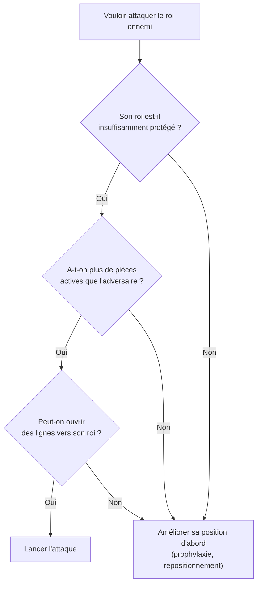

# Attaque au Roi

L'attaque au roi est l'aspect le plus spectaculaire des échecs. Elle repose sur des principes stricts : avantage en espace, pièces actives, ouverture de lignes vers le roi ennemi.

## Conditions pour attaquer

Avant de lancer une attaque, vérifier :



## Rois roqués du même côté

Quand les deux rois ont roqué du même côté, lancer ses pions contre le roi adverse, c'est aussi dégarnir le sien. L'attaque se mène alors surtout avec les pièces, et la poussée de pions se joue plutôt au centre ou à l'aile opposée.

L'exemple type est l'**attaque de minorité**, dans la structure du Gambit Dame refusé, variante d'échange (structure de Carlsbad). Les Blancs avancent deux pions de l'aile dame (b4-b5) contre trois pions noirs (a7, b7, c6) pour provoquer, après l'échange sur c6, un pion arriéré en c6 ou un pion isolé. Ce n'est pas une attaque contre le roi : c'est une attaque contre la structure, qui prépare une finale meilleure.

> [!warning] Piège
> L'attaque de minorité vise des pions, pas le roi. Le but n'est pas de gagner du matériel tout de suite, mais de créer une faiblesse permanente (pion arriéré ou isolé) que l'adversaire devra défendre jusqu'en finale ; voir [[Stratégie Positionnelle#Structure de pions|structure de pions]]. Avancer les pions sans ce plan clair ne fait qu'affaiblir sa propre position.

## Rois roqués de côtés opposés

C'est la situation la plus explosive : chaque camp peut lancer ses pions contre le roi adverse sans dégarnir le sien. L'exemple type est l'attaque yougoslave de la Sicilienne Dragon, où les Blancs roquent à l'aile dame et poussent h4-h5 et g4, tandis que les Noirs attaquent sur la colonne c.

**Principe** : le premier qui ouvre des lignes vers le roi adverse gagne.
- Chaque tempo compte : pas de coup de consolidation qui ne serve pas l'attaque.
- Les sacrifices de pions sont courants pour ouvrir une colonne.

**Lignes à ouvrir** : colonnes g et h (aile roi), ou a, b et c (aile dame).

## Techniques d'ouverture de lignes

**L'assaut de pions.** La poussée g4-g5 chasse un cavalier f6 défenseur. La poussée h4-h5 attaque un pion g6 : après l'échange h5xg6, la colonne h s'ouvre pour la tour et la dame.

**Le sacrifice de pion.** On donne un pion pour ouvrir une colonne plus vite que l'adversaire ne peut la refermer. Une colonne ouverte est une autoroute pour la tour et la dame.

**Le sacrifice du fou grec sur h7.** C'est le classique contre un petit roque noir, quand aucun cavalier ne défend h7 depuis f6 : 1.Fxh7+ Rxh7 2.Cg5+ Rg8 3.Dh5, avec la menace Dh7 mat. Il faut en général un pion blanc en e5 (qui interdit f6 au cavalier noir), un cavalier qui atteint g5 et une dame qui atteint h5. S'il manque une de ces conditions, le sacrifice perd une pièce.

## Les pièces dans l'attaque

| Pièce | Rôle dans l'attaque |
|---|---|
| Dame | Chef de l'attaque, mais elle s'approche une fois les lignes ouvertes : trop tôt, elle devient une cible |
| Tour | Doubler sur colonne ouverte, 7e rangée |
| Fou | Diagonale vers le roi (f7, h7, g7) |
| Cavalier | Avant-poste e5 ou f5 (case forte devant le roi) |
| Pions | Créer les ouvertures, ne pas avancer devant son propre roi |

## La case f7 (et f2)

La case f7 (noirs) ou f2 (blancs) est la plus vulnérable de la partie — défendue seulement par le roi au départ.

**Motifs classiques** :
- **La fourchette en f7** : un cavalier blanc qui arrive en f7 attaque à la fois la dame d8 et la tour h8.
- **L'attaque Fried Liver** : dans la défense des deux cavaliers, après 1.e4 e5 2.Cf3 Cc6 3.Fc4 Cf6 4.Cg5 d5 5.exd5 Cxd5?!, les Blancs sacrifient le cavalier par 6.Cxf7! Rxf7 7.Df3+ Re6 8.Cc3. Le roi noir est tiré au centre, et le cavalier d5 est cloué.

```widget:echiquier
fen: rnbqkbnr/pppppppp/8/8/8/8/PPPPPPPP/RNBQKBNR w KQkq - 0 1
moves: e2e4 e7e5 g1f3 b8c6 f1c4 g8f6 f3g5 d7d5 e4d5 f6d5 g5f7 e8f7 d1f3 f7e6 b1c3
```

> [!important] Idée clé
> Un sacrifice sur f7 n'est objectivement bon que s'il génère assez d'initiative pour compenser la pièce donnée — beaucoup de sacrifices "classiques" appris par cœur sont en réalité réfutés par une défense précise. Le calculer plutôt que le jouer par réflexe évite de perdre une pièce pour rien contre un adversaire qui connaît la parade.

## Signaux d'alarme défensifs

Reconnaître quand son roi est en danger :
- Pions devant le roque avancés ou échangés (cases h6/g6 faiblesses)
- Colonne ouverte ou semi-ouverte en face du roi
- Fou adverse sur une diagonale qui vise le roque (b1-h7 ou a2-g8)
- Cavalier ennemi posté en e5/f5 sans pouvoir être chassé
- Faible présence défensive autour du roi (pièces loin)
