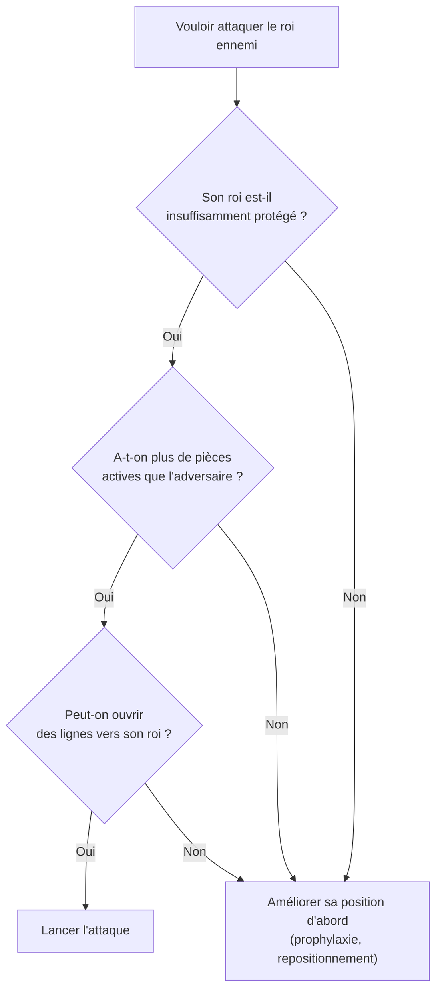

# Attaque au Roi

L'attaque au roi est l'aspect le plus spectaculaire des échecs. Elle repose sur des principes stricts : avantage en espace, pièces actives, ouverture de lignes vers le roi ennemi.

### Conditions pour Attaquer

Avant de lancer une attaque, vérifier :

### Rois Roqués du Même Côté

Quand les deux rois ont roqué du même côté, l'attaque directe est risquée — l'adversaire contre-attaque de l'autre côté.

**Stratégie : attaque de minorité**
- Avancer 2-3 pions pour briser la chaîne de pions devant le roi ennemi
- Créer des faiblesses permanentes (cases, pions isolés)

**Exemple classique** : aile dame dans la Sicilienne — Blancs attaquent en g/h, Noirs en c/d.

### Rois Roqués de Côtés Opposés

C'est la situation la plus explosive : chaque camp attaque avec ses pions sans exposer son propre roi.

**Principe** : qui avance ses pions le plus vite gagne
- Priorité absolue à l'avance des pions (pas de tempo perdu)
- Sacrifices de pions courants pour ouvrir des colonnes/diagonales

**Lignes à ouvrir** : colonne h, g (aile roi), ou a, b (aile dame)

### Techniques d'Ouverture de Lignes

**Sacrifice de pion** : ouvrir une colonne vers le roi
- 1. g4-g5 suivi de g5xf6 (ou f6xg5 → h4-h5-h6)
- Colonne ouverte = autoroute pour tour et dame

**Sacrifice de pièce sur h6/h7** : classique contre roque en g8-h8
- Fxh7+ Rxh7 Dh5+ Rg8 Tg3 : attaque décisive si pièces coordonnées

**Coup de boutoir g4-g5** : déstabiliser le pion f6 ou h6 défensif

### Pièces dans l'Attaque

| Pièce | Rôle dans l'attaque |
|---|---|
| Dame | Chef de l'attaque, s'approche en dernier (sinon tactiques défensives) |
| Tour | Doubler sur colonne ouverte, 7e rangée |
| Fou | Diagonale vers le roi (f7, h7, g7) |
| Cavalier | Avant-poste e5 ou f5 (case forte devant le roi) |
| Pions | Créer les ouvertures, ne pas avancer devant son propre roi |

### La Case f7 (et f2)

La case f7 (noirs) ou f2 (blancs) est la plus vulnérable de la partie — défendue seulement par le roi au départ.

**Motifs classiques** :
- **Fourchette du cavalier en f7** : Cf7 gagne Tour + Cavalier contre Roi (fourchette royale)
- **Attaque Fried Liver** : Ouverture italienne, Cf7 Rxf7 Dd5+ sacrifice pièce pour initiative
- **Fried Liver** : 1.e4 e5 2.Cf3 Cc6 3.Fc4 Cf6 4.Cg5 d5 5.exd5 Cxd5?! 6.Cxf7!

### Signaux d'Alarme Défensifs

Reconnaître quand son roi est en danger :
- Pions devant le roque avancés ou échangés (cases h6/g6 faiblesses)
- Colonne ouverte ou semi-ouverte en face du roi
- Fou adverse sur diagonale menaçant (b3-h7 ou a2-g8)
- Cavalier ennemi posté en e5/f5 sans pouvoir être chassé
- Faible présence défensive autour du roi (pièces loin)
