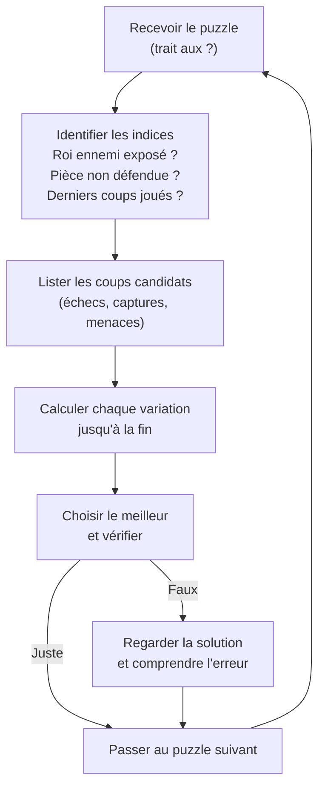

# Puzzles et Entraînement Tactique

La tactique s'entraîne comme un muscle. Résoudre des problèmes chaque jour est l'un des moyens les plus sûrs de progresser, surtout en dessous de 2000 Elo, où la plupart des parties se décident sur une tactique ratée.

## Pourquoi les puzzles

**Ce qu'ils développent :**
- Reconnaissance des motifs (clouage, fourchette, échec découvert…)
- Calcul de variations forcées
- Visualisation sans toucher les pièces
- Réflexes en partie réelle

**Pourquoi ça marche :** les études sur l'expertise aux échecs (de Groot, puis Chase et Simon) montrent que les forts joueurs reconnaissent des configurations familières là où les débutants voient des pièces isolées. Les problèmes remplissent cette mémoire de motifs.

> [!warning] Piège
> Un problème annonce qu'il y a une combinaison à trouver. En partie, rien ne le signale : il faut d'abord remarquer que la position *contient* une tactique. La force en problèmes ne se transfère donc pas automatiquement en force pratique, tant qu'on ne s'entraîne pas aussi sur ses propres parties.

## Méthode de résolution

**Échecs, captures, menaces** : avant de jouer, passer en revue tous les échecs, puis toutes les captures, puis toutes les menaces, dans cet ordre. Ce sont les coups qui laissent le moins de choix à l'adversaire, donc ceux qu'on peut calculer jusqu'au bout.

## Thèmes tactiques fondamentaux

| Motif | Description | Signal d'alerte |
|---|---|---|
| **Fourchette** | Une pièce attaque deux pièces ou plus en même temps | Deux pièces non défendues à un saut de cavalier l'une de l'autre |
| **Clouage** | Pièce ne peut bouger sans exposer pièce précieuse | Roi ou Dame derrière une pièce sur une diagonale/colonne |
| **Enfilade** | Inverse du clouage — pièce précieuse forcée à bouger | Roi sur colonne ouverte, fou actif |
| **Attaque découverte** | Bouger une pièce révèle attaque de la pièce derrière | Pièce bloquant une ligne active |
| **Double échec** | Deux pièces donnent échec simultanément | Roi forcé à bouger — les captures et interpositions ne fonctionnent pas |
| **Déviation** | Forcer un défenseur à quitter sa case | Pièce qui défend plusieurs points à la fois |
| **Attraction** | Attirer le roi ou une pièce sur une case défavorable | Roi dont une case voisine peut recevoir un sacrifice |
| **Mat en 1** | Reconnaissance immédiate | Roi en bord, peu de cases de fuite |

## Plateformes d'entraînement

**Lichess (gratuit, open source)**
- Puzzles thématiques et aléatoires
- Puzzle Storm : un maximum de problèmes en 3 minutes
- Puzzle Racer : compétition en temps réel
- Analyse automatique de ses parties → puzzles personnalisés

**Chess.com**
- Puzzle Rush : un maximum de problèmes en 5 minutes, trois erreurs et c'est fini
- Puzzle Battle : compétition vs joueur
- Cours interactifs par niveau

**ChessTempo**
- Spécialisé puzzles tactiques
- Mode "blitz" et "entraînement" (plus lent, pas de pénalité)
- Statistiques détaillées par motif

## Plan d'entraînement par niveau

Les paliers sont ceux de [[Pédagogie et Entraînement]].

**Débutant (moins de 1200 Elo)**
- 15-20 puzzles/jour, puzzles faciles (1-2 coups)
- Focus : mats en 1, fourchettes simples, captures gagnantes
- Durée : 20-30 min/jour

**Intermédiaire (1200-1800 Elo)**
- 20-30 puzzles/jour, niveau adaptatif
- Focus : tous motifs de base + combinaisons 3-4 coups
- Analyser les erreurs, pas seulement réussir

**Avancé (1800-2200 Elo)**
- Moins de problèmes, mais difficiles : mieux vaut 10 problèmes calculés jusqu'au bout que 50 devinés
- Inclure des études (compositions) : elles entraînent la précision
- Analyse post-puzzle : trouver toutes les défenses

**Expert (2200+ Elo)**
- Résoudre des puzzles durs en mode "lent" (penser comme en partie)
- Études de finale : développent le calcul pur
- Revoir parties de Grands Maîtres et trouver les coups tactiques seul

## Les études d'échecs

Les études sont des compositions artificielles, pas tirées de parties réelles, avec une consigne simple : « les Blancs jouent et gagnent » ou « les Blancs jouent et font nulle ». Contrairement aux problèmes de mat, elles ne fixent pas de nombre de coups, et leur position ressemble souvent à une finale de partie.

**Intérêt pédagogique :**
- Force le calcul pur sans reconnaissance de motif
- Souvent contre-intuitif (solutions paradoxales)
- Développe la patience et la précision

**Compositeurs célèbres :** Troïtzky (finales de cavaliers), Réti, Grigoriev (finales de pions)

> [!important] Idée clé
> Les études diffèrent des puzzles tactiques dans leur pédagogie : un puzzle tiré d'une partie récompense la reconnaissance de motif ("j'ai déjà vu ce pattern"), une étude récompense le calcul pur car sa solution est souvent une seule idée jamais rencontrée ailleurs — voir par exemple la [[Finales de Pions#La triangulation|triangulation]], un thème typique d'étude qui ne "ressemble" à rien d'intuitif avant de l'avoir compris.

## Suivre sa progression

Tenir un journal tactique :
- Elo puzzle (Lichess ou Chess.com)
- Motifs les plus ratés → cibler ces thèmes
- Temps moyen de résolution
- Ses propres parties, analysées par Lichess, qui en tire automatiquement des problèmes
