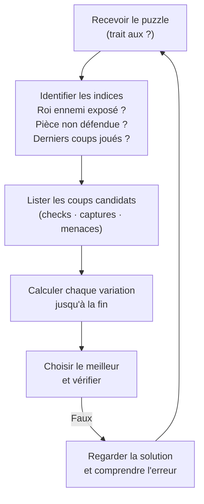

# Puzzles et Entraînement Tactique

La tactique s'entraîne — comme un muscle. Résoudre des puzzles quotidiennement est le moyen le plus efficace de progresser aux échecs, quelle que soit la méthode d'ouverture ou de stratégie.

### Pourquoi les Puzzles

**Ce qu'ils développent :**
- Reconnaissance des motifs (clouage, fourchette, échec découvert…)
- Calcul de variations forcées
- Visualisation sans toucher les pièces
- Réflexes en partie réelle

**Données empiriques :**
- Les joueurs qui résolvent 10+ puzzles/jour progressent significativement en 3 mois
- La reconnaissance de motifs représente ~80% de la force tactique pratique
- Même les Grands Maîtres font des puzzles quotidiens (Carlsen, Nepo)

### Méthode de Résolution

**Règle des 3C** : Avant de jouer, chercher Checks → Captures → (menaces) dans cet ordre.

### Thèmes Tactiques Fondamentaux

| Motif | Description | Signal d'alerte |
|---|---|---|
| **Fourchette** | Une pièce attaque 2+ pièces simultanément | Cavalier ennemi bien placé, deux pièces alignées |
| **Clouage** | Pièce ne peut bouger sans exposer pièce précieuse | Roi ou Dame derrière une pièce sur une diagonale/colonne |
| **Enfilade** | Inverse du clouage — pièce précieuse forcée à bouger | Roi sur colonne ouverte, fou actif |
| **Attaque découverte** | Bouger une pièce révèle attaque de la pièce derrière | Pièce bloquant une ligne active |
| **Double échec** | Deux pièces donnent échec simultanément | Roi forcé à bouger — les captures et interpositions ne fonctionnent pas |
| **Déclinaison** | Forcer défenseur à quitter sa case | Pièce défendant plusieurs points à la fois |
| **Attraction** | Attirer roi/pièce sur une case défavorable | Dame ou Tour adverse surprotégeant une case |
| **Mat en 1** | Reconnaissance immédiate | Roi en bord, peu de cases de fuite |

### Plateformes d'Entraînement

**Lichess (gratuit, open source)**
- Puzzles thématiques et aléatoires
- Puzzle Storm : mode speed, 3 minutes
- Puzzle Racer : compétition en temps réel
- Analyse automatique de ses parties → puzzles personnalisés

**Chess.com**
- Puzzle Rush : speed puzzles (5 min, survie)
- Puzzle Battle : compétition vs joueur
- Cours interactifs par niveau

**ChessTempo**
- Spécialisé puzzles tactiques
- Mode "blitz" et "entraînement" (plus lent, pas de pénalité)
- Statistiques détaillées par motif

### Plan d'Entraînement par Niveau

**Débutant (< 1000 Elo)**
- 15-20 puzzles/jour, puzzles faciles (1-2 coups)
- Focus : mats en 1, fourchettes simples, captures gagnantes
- Durée : 20-30 min/jour

**Intermédiaire (1000-1500 Elo)**
- 20-30 puzzles/jour, niveau adaptatif
- Focus : tous motifs de base + combinaisons 3-4 coups
- Analyser les erreurs, pas seulement réussir

**Avancé (1500-2000 Elo)**
- 30-50 puzzles/jour, puzzle difficiles
- Inclure des "études" (compositions) : entraîne la précision
- Analyse post-puzzle : trouver toutes les défenses

**Niveau compétitif (2000+)**
- Résoudre des puzzles durs en mode "lent" (penser comme en partie)
- Endgame studies : développe le calcul pur
- Revoir parties de Grands Maîtres et trouver les coups tactiques seul

### Les Études d'Échecs (Chess Studies)

Les études sont des compositions artificielles (pas forcément tirées de parties réelles) avec un objectif précis : mat ou gain en X coups.

**Intérêt pédagogique :**
- Force le calcul pur sans reconnaissance de motif
- Souvent contre-intuitif (solutions paradoxales)
- Développe la patience et la précision

**Compositeurs célèbres :** Troïtzky (études de cavaliers), Reti, Grigoriev (finales de pions)

### Tracker de Progression

Tenir un journal tactique :
- Elo puzzle (Lichess ou Chess.com)
- Motifs les plus ratés → cibler ces thèmes
- Temps moyen de résolution
- Parties propres analysées avec Stockfish → puzzles générés automatiquement
