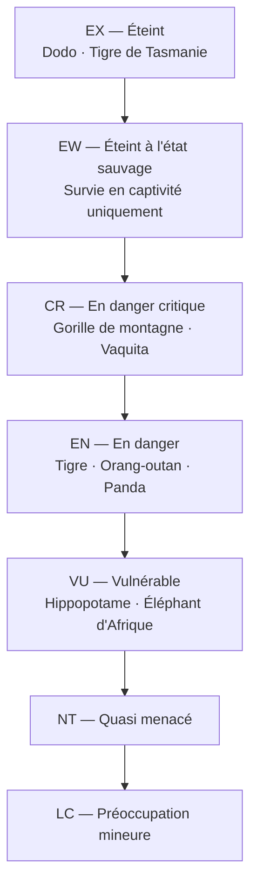

# Biodiversité et Extinction

### Mesure et Répartition de la Biodiversité

**Niveaux de Biodiversité**
- **Génétique** : variabilité allèles au sein espèce
- **Spécifique** : nombre d'espèces
- **Écosystémique** : diversité habitats, communautés

**Nombre d'Espèces**
- **Décrites** : ~2 millions
- **Estimées** : 8-10 millions (incertitude élevée)
- **Biais** : vertébrés bien connus, invertébrés, microbes sous-estimés
- **Insectes** : 1 million décrites, peut-être 5-10 millions réelles

**Hotspots de Biodiversité**
- 36 zones identifiées (Conservation International)
- Critères : >1500 espèces endémiques plantes vasculaires + >70% habitat perdu
- **Exemples** : Madagascar, Andes tropicales, Caraïbes, Méditerranée, Sundaland
- Couvrent 2,4% surface terrestre, hébergent 50% plantes, 42% vertébrés terrestres

**Patterns Latitudinaux**
- Diversité ↑ vers équateur (gradient latitudinal)
- Hypothèses : énergie solaire, stabilité climatique, surface, spéciation

### Services Écosystémiques

**Classification (Millennium Ecosystem Assessment, 2005)**

**Services d'Approvisionnement**
- Nourriture (agriculture, pêche, chasse)
- Eau douce
- Bois, fibres, combustibles
- Médicaments (aspirine du saule, taxol de l'if, 50% médicaments d'origine naturelle)

**Services de Régulation**
- Climat (forêts stockent carbone, évapotranspiration)
- Pollinisation (35% production agricole, abeilles, papillons, oiseaux)
- Purification eau (zones humides, forêts)
- Contrôle érosion (racines, végétation)
- Régulation maladies (biodiversité dilue pathogènes)
- Pollinisation des inondations (zones humides, mangroves)

**Services Culturels**
- Esthétique, spirituel, éducatif
- Récréation, tourisme (écotourisme)
- Identité culturelle

**Services de Soutien**
- Formation sols
- Cycle nutriments
- Productivité primaire

**Valeur Économique**
- Estimations : 125-145 trillions $/an (Costanza et al.)
- Problème : internaliser externalités

### Extinctions et Crise de la Biodiversité

**Extinctions de Masse Passées**

| # | Période | Date (Ma) | Espèces perdues | Cause principale |
|---|---|---|---|---|
| 1 | Ordovicien-Silurien | -445 | ~85% | Glaciation + régression marine |
| 2 | Dévonien | -375 | ~75% | Anoxie océanique, volcanism |
| 3 | Permien-Trias | -252 | 96% marines · 70% terrestres | Trapps de Sibérie (volcanism massif) |
| 4 | Trias-Jurassique | -201 | ~80% | Trapps de l'Atlantique Central |
| 5 | Crétacé-Paléogène | -66 | ~76% dont dinosaures | Astéroïde Chicxulub + volcanism |
| 6 | **Actuelle (Anthropocène)** | **Aujourd'hui** | **100–1000× taux naturel** | **Activité humaine** |

1. **Ordovicien** (-445 Ma) : 85% espèces
2. **Dévonien** (-375 Ma) : 75%
3. **Permien** (-252 Ma) : 96% marines, 70% terrestres (la plus grande)
4. **Trias** (-201 Ma) : 80%
5. **Crétacé** (-66 Ma) : 76% dont dinosaures (astéroïde)

**Sixième Extinction (Actuelle)**
- **Taux actuel** : 100-1000× taux naturel ("background")
- **Causes (HIPPO)** :
  - **H**abitat destruction (principale cause)
  - **I**nvasive species (prédation, compétition, maladies)
  - **P**ollution
  - **P**opulation humaine (pression)
  - **O**verharvesting (surexploitation : chasse, pêche, commerce)
  - + **C**limate change (changement climatique, cause croissante)

**Statut UICN (Union Internationale Conservation Nature)**

- **Extinct (EX)** : disparu (dodo, tigre de Tasmanie)
- **Extinct in the Wild (EW)** : survie seulement captivité
- **Critically Endangered (CR)** : risque extrême
- **Endangered (EN)** : menacé
- **Vulnerable (VU)** : vulnérable
- **Near Threatened (NT)**
- **Least Concern (LC)**

**Chiffres Clés**
- **Liste Rouge** : 150 000+ espèces évaluées
- **Menacées** : 28% (42 000+ espèces)
  - 41% amphibiens
  - 37% requins et raies
  - 36% récifs coralliens
  - 27% mammifères
  - 21% reptiles
  - 13% oiseaux

**Espèces Emblématiques Menacées**
- **CR** : gorille de montagne, lémurien, vaquita (marsouin), rhinocéros de Java
- **EN** : tigre, orang-outan, panda géant, éléphant d'Asie, baleine bleue
- **Disparitions récentes** : rhinocéros blanc du Nord (2018, dernier mâle), baiji (dauphin Yangtsé, ~2006)

