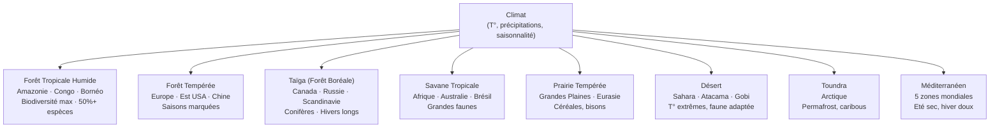

# Hotspots de Biodiversité et Biomes

### Biomes Terrestres

Un **biome** est un grand ensemble d'écosystèmes défini par son climat et sa végétation dominante. Les biomes déterminent la distribution globale de la biodiversité.

| Biome | Surface mondiale | Espèces végétales | Menace principale |
|---|---|---|---|
| Forêt tropicale | 7% terres | 60 000+ | Déforestation |
| Taïga | 27% terres | Faible diversité | Changement climatique |
| Savane | 20% terres | Moyenne | Agriculture, feux |
| Déserts | 33% terres | Adaptées | Surpâturage, urbanisation |
| Méditerranéen | 2% terres | Très élevée (maquis) | Urbanisation, feux |
| Toundra | 8% terres | Faible | Réchauffement, fonte permafrost |

### Les 36 Hotspots de Biodiversité

Un **hotspot** (Conservation International) doit satisfaire deux critères :
1. Abriter au moins **1 500 espèces de plantes vasculaires endémiques** (>0,5% total mondial)
2. Avoir perdu **70%+ de sa végétation originelle**

**Hotspots majeurs** :

| Région | Pays principaux | Endémisme | Pression |
|---|---|---|---|
| Andes Tropicales | Colombie, Pérou, Bolivie | 45 000 plantes, 1 700 oiseaux | Agriculture, mines |
| Madagascar et îles | Madagascar | 90%+ espèces endémiques | Déforestation |
| Bassin Méditerranéen | Espagne, Maroc, Grèce | 22 500 plantes | Urbanisation, tourisme |
| Forêts d'Afrique Centrale | Cameroun, RDC | Gorilles, okapis | Exploitation bois |
| Sundaland | Malaisie, Indonésie | Orang-outans, tapirs | Palmier à huile |
| Wallacea | Indonésie Est | Ligne de Wallace | Déforestation |
| Philippines | Philippines | 25% endémisme vertébrés | Déforestation sévère |
| Caraïbes | Cuba, Haïti, Jamaïque | Reptiles, amphibiens | Tourisme, urbanisation |
| Cerrado | Brésil central | 5 000 plantes endémiques | Agriculture soja |
| Californie | USA, Mexique (Baja) | 2 125 plantes endémiques | Urbanisation, sécheresse |

### La Ligne de Wallace

Alfred Russel Wallace (1858) observe une **discontinuité faunique** abrupte entre :
- **Côté asiatique** (Bornéo, Java) : éléphants, tigres, orangs-outans, cerfs
- **Côté australasien** (Célèbes, Lombok) : marsupiaux, cacatoès, oiseaux de paradis

Cause : pendant les glaciations, Bornéo était rattaché à l'Asie (Sundaland) mais Célèbes ne l'a jamais été. La ligne de Wallace marque cette frontière paléogéographique, toujours visible dans la faune actuelle.

### Gradient de Biodiversité Latitudinal

La diversité des espèces est maximale aux tropiques et diminue vers les pôles.

**Hypothèses explicatives** :
- **Énergie** : plus d'énergie solaire → plus de productivité primaire → plus de niches
- **Stabilité climatique** : tropiques = stabilité millénaire → spéciation continue sans extinction massive
- **Surface** : les zones tropicales sont vastes
- **Temps évolutif** : les tropiques sont des "musées" et des "fabriques" d'espèces
- **Hétérogénéité** : diversité des microhabitats en forêt tropicale

### Endemisme Insulaire

Les îles hébergent une proportion disproportionnée d'espèces endémiques, mais sont aussi les plus vulnérables aux extinctions.

**Théorie de la biogéographie insulaire** (MacArthur & Wilson, 1967) :
- Équilibre entre colonisation et extinction
- Grande île + proche du continent = plus d'espèces
- Petite île + loin = moins d'espèces

**Applications** : conception des réserves naturelles (taille, forme, corridors).

**Extinctions insulaires historiques** :
- Dodo (Maurice, XVIIe) — rats + chasse
- Moa (Nouvelle-Zélande) — Polynésiens
- 90%+ des extinctions documentées depuis 1500 = espèces insulaires
