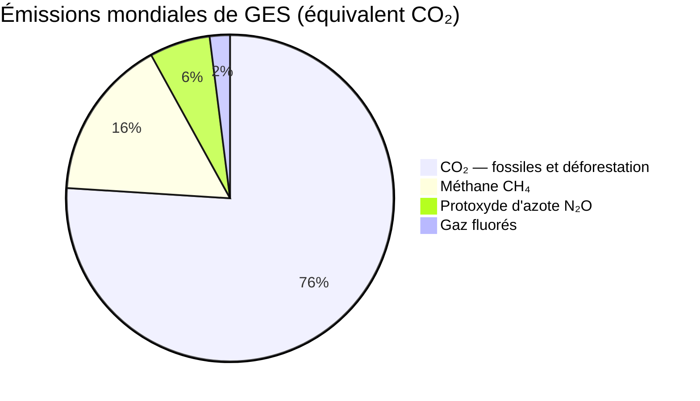

# Changement Climatique

### Causes et Mécanismes

**Effet de Serre**
- Gaz atmosphère absorbent infrarouge terrestre
- **Naturel** : +33°C (sans = -18°C moyenne)
- **Gaz principaux** : H₂O (vapeur), CO₂, CH₄ (méthane), N₂O, O₃, CFC

**Causes Anthropiques**

- **CO₂ (76%)** : combustibles fossiles (charbon, pétrole, gaz), déforestation
- **Méthane CH₄ (16%)** : élevage (ruminants), rizières, déchets, fuites gaz naturel
  - PRG (Potentiel Réchauffement Global) sur 100 ans : 28-34× CO₂
- **N₂O (6%)** : engrais agricoles, industries
  - PRG : 265× CO₂
- **Fluorés (2%)** : réfrigération, industrie
  - PRG : milliers de fois CO₂

**Feedbacks (Rétroactions)**
- **Positifs (amplification)** :
  - Fonte glace → ↓ albédo (réflexivité) → + absorption chaleur
  - Permafrost → libération CH₄, CO₂
  - Vapeur d'eau → + effet de serre
  - Forêts → savanes (sécheresses) → libération carbone
- **Négatifs (atténuation)** :
  - + CO₂ → + photosynthèse (saturation possible)
  - + vapeur → + nuages → + réflexion solaire (complexe)

### Observations et Projections

**Température**
- **+1,1°C** depuis ère préindustrielle (1850-1900)
- **Objectif Accord de Paris (2015)** : limiter à +1,5-2°C
- **Trajectoire actuelle** : +2,5-3°C d'ici 2100 (si politiques actuelles)
- **Scénarios GIEC (SSP)** :
  - SSP1-1.9 : +1,5°C (optimiste, forte atténuation)
  - SSP2-4.5 : +2,7°C (moyen)
  - SSP5-8.5 : +4,4°C (pessimiste, business as usual)

**Autres Changements Observés**
- **Glaces** :
  - Arctique : -13% surface par décennie (septembre)
  - Groenland, Antarctique : fonte accélérée (100+ Gt/an)
  - Glaciers montagne : recul généralisé
- **Niveau des mers** :
  - +20 cm depuis 1900
  - Projection 2100 : +0,6-1,1 m (voire 2 m si effondrements calottes)
  - Causes : dilatation thermique (50%) + fonte glaces
- **Océans** :
  - Acidification : pH ↓0,1 depuis 1750 (-30% ions carbonate)
  - Désoxygénation : -2% O₂ depuis 1960
  - Stratification : ↓ mélange vertical
- **Événements Extrêmes** :
  - Canicules : ×5 fréquence
  - Précipitations intenses : ↑
  - Sécheresses : régions méditerranéennes, Afrique
  - Cyclones : intensité ↑ (pas nécessairement fréquence)

### Impacts

**Écosystèmes**
- **Migration espèces** : déplacement vers pôles, altitude (+15 m/décennie montagne)
- **Décalages phénologiques** : floraison, migration oiseaux plus tôt (désynchronisations)
- **Blanchissement coraux** : 2016-2017 Grande Barrière (50% mort)
- **Forêts** : sécheresses, incendies (Amazonie, Australie 2019-20, Méditerranée)
- **Permafrost** : fonte libère CH₄ (bombe à retardement)
- **Extinctions** : 1 million espèces menacées (rapport IPBES 2019)

**Sociétés Humaines**
- **Agriculture** : sécheresses, inondations, rendements ↓ (surtout tropiques)
- **Eau** : stress hydrique (2 milliards personnes actuellement)
- **Santé** : canicules (70 000 morts Europe 2003), maladies vectorielles (malaria, dengue expansion)
- **Migrations** : 200+ millions réfugiés climatiques projetés 2050
- **Économie** : pertes PIB (5-20% selon scénarios, rapport Stern)
- **Inégalités** : pays pauvres (Afrique, petites îles) plus vulnérables

**Points de Bascule (Tipping Points)**
- Irréversibilités possibles :
  - Effondrement AMOC (Circulation Atlantique Méridionale) → refroidissement Europe
  - Forêt amazonienne → savane
  - Calottes Groenland, Antarctique Ouest → engagement multi-mètres niveau mer
  - Permafrost → libération massive CH₄
- Seuils : probablement entre +1,5 et +2°C

