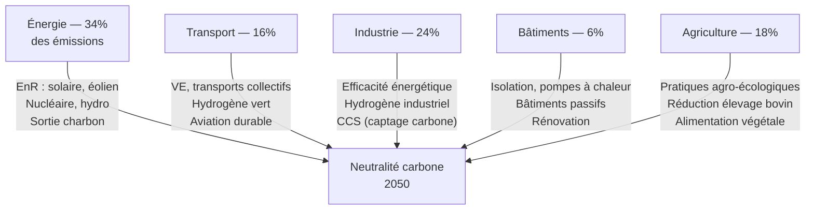

# Solutions et Atténuation du Changement Climatique

Face au changement climatique, deux stratégies complémentaires s'imposent : **l'atténuation** (réduire les émissions) et **l'adaptation** (s'ajuster aux impacts inévitables).

### Cadre International

**Accord de Paris (2015)**
- Objectif : limiter le réchauffement à +1,5°C, au maximum +2°C
- 196 parties signataires
- NDC (Nationally Determined Contributions) : engagements nationaux révisés tous les 5 ans
- Financement : 100 milliards $/an des pays riches vers pays en développement (objectif non atteint en 2020)

**GIEC (Groupe d'experts Intergouvernemental sur l'Évolution du Climat)**
- Synthèse de la littérature scientifique
- Rapports AR6 (2021-2022) : base de référence des politiques climatiques

### Décarbonation des Secteurs Clés

### Énergies Renouvelables

**Solaire photovoltaïque**
- Coût : baissé de 90% depuis 2010 → énergie la moins chère de l'histoire
- Capacité mondiale : 1 TW (2022), objectif 8-10 TW en 2050
- Limites : intermittence, stockage, surface

**Éolien**
- Terrestre : mature, bon marché
- Offshore : plus puissant et régulier, coût en baisse rapide
- Capacité mondiale : 900 GW (2022)

**Nucléaire**
- Bas carbone (12-15 g CO₂/kWh sur cycle de vie)
- Stable (non intermittent)
- Controverses : déchets, risques, coût, délais de construction
- **SMR** (Small Modular Reactors) : nouvelle génération prometteuse

**Hydrogène vert**
- Électrolyse de l'eau avec EnR
- Décarboner secteurs difficiles : sidérurgie, chimie, aviation
- Défi : efficacité (30-40% pertes dans la chaîne)

### Capture et Stockage du Carbone (CCS/CDR)

**Naturelle (basée nature)**
- Reforestation et afforestation : 1,5-3 Gt CO₂/an potentiel
- Restauration zones humides et prairies
- Séquestration sol agricole (biochar, pratiques régénératives)
- **Limite** : permanence fragile (incendies, sécheresses)

**Technologique**
- **CCS industriel** : captage CO₂ en sortie d'usine + stockage géologique
- **DAC (Direct Air Capture)** : aspiration CO₂ de l'air ambiant
  - Coût actuel : 250-600 $/t CO₂ (objectif <100 $/t)
  - Capacité 2023 : <0,01 Mt/an (besoin : 10 Gt/an)
- **BECCS** : bioénergie + CCS (controversé, compétition terres agricoles)

### Adaptation

L'adaptation est inévitable pour les 1,1°C déjà acquis, et nécessaire pour les impacts futurs.

**Agriculture**
- Variétés résistantes chaleur et sécheresse
- Irrigation efficiente (goutte-à-goutte, captage eau pluie)
- Agroforesterie, diversification cultures
- Calendriers agricoles décalés

**Villes et Infrastructures**
- Îlots de fraîcheur (végétalisation, albédo toits)
- Protection côtes (digues, mangroves, retraite planifiée)
- Gestion eaux pluviales (zones inondables, rétention)
- Plans canicule (salles fraîches, alerte précoce)

**Santé**
- Surveillance maladies vectorielles (malaria, dengue, Zika)
- Systèmes alerte canicule
- Adaptation infrastructures hospitalières

### Financement Climatique

| Mécanisme | Description |
|---|---|
| Marché carbone (ETS) | Prix du carbone → incitation à réduire |
| Taxe carbone | Signal prix direct sur émissions |
| Fonds Vert Climat (ONU) | Aide pays en développement |
| Obligations vertes | Financement privé projets verts |
| Taxonomie verte (UE) | Définit ce qui est «vert» pour orienter investissements |

**Prix du carbone nécessaire** : 100-200 $/t CO₂ d'ici 2030 selon GIEC (vs ~25-50 $/t actuellement dans la plupart des ETS).

### Les Pièges du Discours

**Greenwashing** : communication sur des actions marginales pour masquer le bilan réel.

**Catastrophisme paralysant** : l'anxiété climatique sans action ne sert pas la cause.

**Solutionnisme technologique seul** : les solutions techniques sont nécessaires mais insuffisantes sans changements systémiques (consommation, alimentation, mobilité).

**Individualisation** : reporter la responsabilité sur le consommateur plutôt que sur les systèmes (énergie, transport, industrie).
