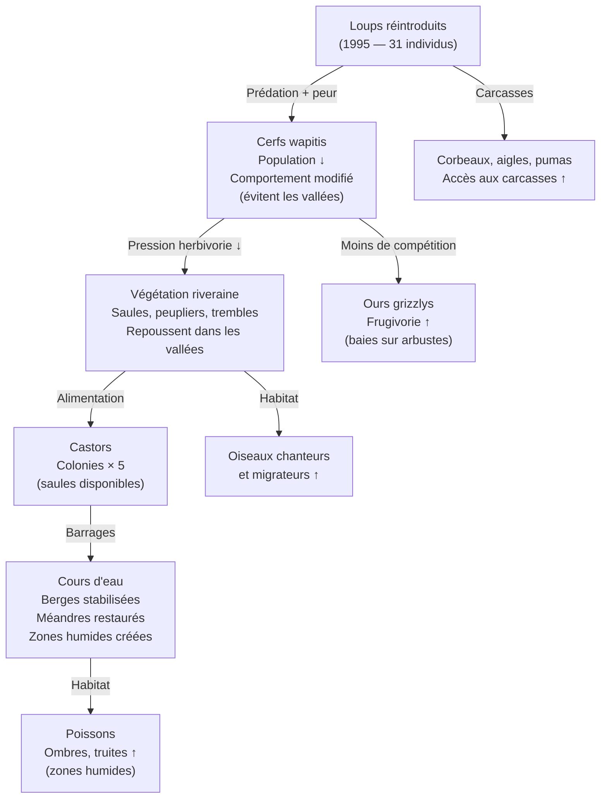

# Cascades Trophiques et Espèces Clés

Une **espèce clé de voûte** (keystone species) est une espèce dont l'impact sur l'écosystème est disproportionné par rapport à sa biomasse. Sa disparition provoque des **cascades trophiques** — des réactions en chaîne qui transforment radicalement l'écosystème.

### L'Exemple de Yellowstone — Le Retour du Loup

Le cas le plus étudié de cascade trophique : la réintroduction de 31 loups à Yellowstone en 1995.

**La rivière a littéralement changé de cours** — les berges stabilisées par la végétation ont modifié la géomorphologie. Ce phénomène est appelé une **cascade trophique** — les effets descendent et remontent dans le réseau alimentaire.

### Qu'est-ce qu'une Espèce Clé de Voûte ?

Concept introduit par Robert Paine (1969) — expérience sur l'étoile de mer *Pisaster* en zone intertidale :
- Retrait de l'étoile de mer → explosion des moules → disparition de 15+ espèces
- Avec l'étoile → diversité maintenue

**Critère** : coefficient d'impact communautaire élevé (impact / biomasse).

### Types d'Espèces Clés

**Prédateurs sommitaux**
- Régulent les herbivores → protègent la végétation
- Loups, lions, orques, requins, aigles
- Absence → surpopulation herbivores → dégradation végétation (trophic cascade)

**Ingénieurs de l'écosystème**
- Modifient physiquement l'habitat
- **Castors** : barrages → zones humides → habitats pour 40+ espèces
- **Éléphants** : abattent arbres → maintiennent savanes (empêchent fermeture boisée)
- **Vers de terre** : aèrent et fertilisent les sols (Darwin les qualifiait d'essentiels)

**Espèces Mutualistiques**
- Pollinisateurs ou disperseurs de graines essentiels
- **Abeilles** : pollinisation de 70% des plantes cultivées
- **Chauves-souris** : pollinisation des cactus, des bananiers (tropiques)
- **Figuiers** : mutualism avec guêpes-figuiers, puis ressource pour des centaines d'espèces

**Espèces Fondatrices (Foundation Species)**
- Structurent l'habitat par leur seule présence
- **Coraux** : récifs = habitat pour 25% des espèces marines
- **Kelp** (algues géantes) : forêts sous-marines, habitat
- **Chênes** : soutiennent 500+ espèces d'insectes

### Cascades Trophiques : Descendante vs Ascendante

| Type | Direction | Déclencheur | Exemple |
|---|---|---|---|
| **Top-down** (descendante) | Prédateur → herbivore → plante | Disparition prédateur | Disparition loups → surpâturage |
| **Bottom-up** (ascendante) | Plante → herbivore → prédateur | Variation production primaire | Phytoplancton ↓ → zoo ↓ → poissons ↓ |

**Trophic downgrading** (Terborgh et al.) : la disparition des grands prédateurs — trend mondial — déstabilise les écosystèmes terrestres et marins.

### Exemples Majeurs dans le Monde

**Requins et Océan** (Ektopia des requins en Atlantique Nord)
- Requins ↓ (surpêche) → raies ↑ → mollusques bivalves (coques, huîtres) ↓ → pêcheries effondrées

**Loutres de mer, oursins, kelp** (Pacifique Nord)
- Loutres ↓ (chasse XIXe) → oursins ↑ → forêts de kelp ↓ → désert sous-marin
- Loutres protégées → équilibre restauré

**Éléphants et Savane Africaine**
- Éléphants abattent les acacias → clairières → diversité faune/flore
- Zones sans éléphants → fermeture boisée → réduction biodiversité

### Implications pour la Conservation

**Priorité aux prédateurs sommitaux** : leur réintroduction peut restaurer des écosystèmes entiers à moindre coût que des interventions directes espèce par espèce.

**Rewilding** :
- Europe : Rewilding Europe (aurochs reconstitués, loups en France, lynx)
- Tasmanie : diable de Tasmanie réintroduit pour contrôler les renards

**Gestion adaptative** : surveiller les cascades trophiques pour ajuster les quotas de chasse, la gestion des parcs.

**Limites** :
- La biologie de la conservation ne permet pas toujours de réintroduire des prédateurs (conflit éleveurs)
- Les écosystèmes sont non-linéaires : une perturbation peut déclencher plusieurs cascades simultanées
- Les espèces introduites peuvent devenir invasives (exemple : crapaud buffle en Australie)
