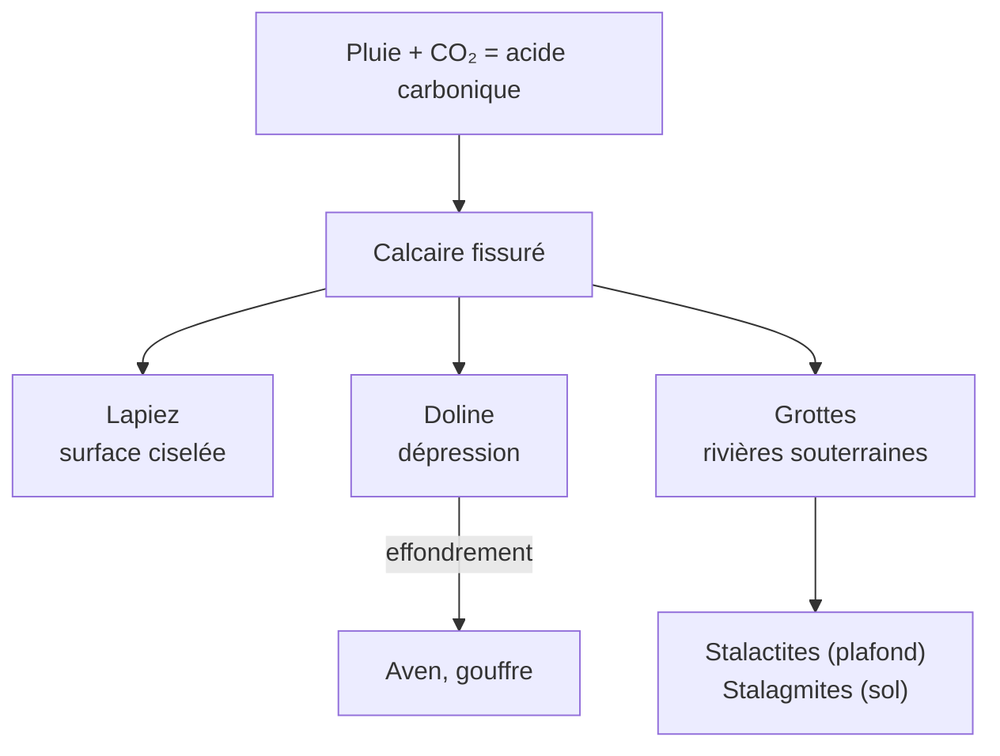
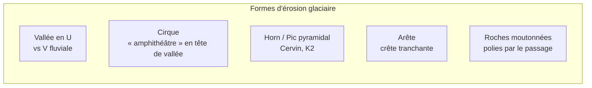

# Géomorphologie

La géomorphologie étudie les formes du relief terrestre et les processus qui les façonnent. C'est une discipline du **temps long** : la plupart des paysages que nous voyons résultent de l'action de l'eau, du vent, de la glace et de la gravité sur des millions d'années. À chaque pas en montagne, vous marchez sur le travail d'une rivière qui n'existe peut-être plus.

## Le grand cycle des reliefs

```mermaid
flowchart LR
    Tectonique[Forces internes<br/>tectonique, volcanisme] -->|crée le relief| Relief[Relief]
    Relief -->|altération| Meteorisation[Météorisation<br/>fragmentation]
    Meteorisation -->|transport| Erosion[Érosion]
    Erosion -->|dépôt| Sediment[Sédimentation]
    Sediment -->|enfouissement<br/>compaction| Roches[Roches sédimentaires]
    Roches -.->|nouveau soulèvement.-> Relief
```

Deux forces s'opposent en permanence :
- **Forces internes** (tectonique, volcanisme) qui *construisent* le relief
- **Forces externes** (climat, gravité) qui le *détruisent*

Un Himalaya s'élève de ~5 mm/an mais s'érode à un rythme comparable. Sans la tectonique, la Terre serait depuis longtemps plate.

## Météorisation — comment les roches se désagrègent

### Météorisation physique (mécanique)

Fragmentation sans changement chimique.

| Processus | Mécanisme | Où |
|---|---|---|
| **Thermoclastie** (gélifraction) | L'eau gèle dans les fissures, augmente de volume (+9 %), fait éclater la roche | Hautes montagnes, régions tempérées froides |
| **Haloclastie** | Cristallisation de sels dans les pores | Bords de mer, déserts |
| **Désagrégation granulaire** | Cycles de dilatation/contraction thermique journaliers | Déserts (jour chaud, nuit froide) |
| **Décohésion** (déchargement) | Détente de la roche quand l'érosion enlève le poids au-dessus | Massifs granitiques (exfoliation en pelures d'oignon — Half Dome, Yosemite) |

### Météorisation chimique

Modification de la composition de la roche par réactions avec l'eau, l'oxygène, le CO₂.

| Processus | Réaction | Forme produite |
|---|---|---|
| **Dissolution** | Calcaire + eau + CO₂ → bicarbonate de calcium soluble | **Karst** : grottes, dolines, lapiez, poljés |
| **Hydrolyse** | Feldspath + eau → argile + sable de quartz | Altération des granites, profils latéritiques tropicaux |
| **Oxydation** | Fer + O₂ → oxydes (rouille) | Coloration rouge des roches |

**Exemple emblématique** — Le karst. Les Causses, les gorges du Verdon, Pirate's Cave en Croatie, le plateau du Yunnan en Chine : tous façonnés par la dissolution lente du calcaire sur des millions d'années.



## Les grands agents d'érosion

### Eau — l'agent dominant

#### Eau courante (érosion fluviale)

Une rivière creuse, transporte et dépose. Trois stades correspondent à trois formes typiques :

| Stade | Pente | Forme dominante | Exemple |
|---|---|---|---|
| **Jeunesse** (amont) | forte | Vallée en V étroite, gorges, cascades | Verdon, Tarn, Grand Canyon |
| **Maturité** (milieu) | moyenne | Méandres divagants, terrasses alluviales | Seine, Loire, Meuse |
| **Vieillesse** (aval) | faible | Plaine d'inondation, delta | Mississippi, Nil, Mékong |

**Méandre** : la rivière creuse la rive concave (vitesse maximale) et dépose sur la rive convexe — d'où la migration progressive des méandres jusqu'à former des recoupements (« bras morts »).

#### Eau marine

| Forme | Origine |
|---|---|
| **Falaises** | Recul du trait de côte sous l'action des vagues — Étretat (Normandie), Cliffs of Moher (Irlande) |
| **Arches, aiguilles** | Falaises percées puis effondrées (l'Aiguille d'Étretat, Old Man of Hoy en Écosse) |
| **Plages** | Accumulation de sédiments fins |
| **Cordons littoraux, tombolos** | Sédiments piégés entre une île et le continent (Mont-Saint-Michel à marée basse) |

#### Eau souterraine

Cf. karst plus haut.

### Glace — la sculptrice puissante

Un glacier érode 10 à 100 fois plus vite qu'une rivière. Il rabote la roche au lieu de la creuser.



**Formes d'érosion** :
- **Vallée en U** : creusée par un glacier, fond large et plat (vs vallée en V des rivières) — vallée de Chamonix, fjords norvégiens
- **Cirque** : forme d'amphithéâtre à la naissance d'un glacier
- **Horn** : pic pyramidal isolé taillé par plusieurs cirques convergents — le **Cervin** en est l'exemple parfait
- **Arête** : crête aiguë entre deux cirques voisins
- **Fjord** : vallée glaciaire envahie par la mer après la fonte (Norvège, Patagonie, Nouvelle-Zélande)

**Formes de dépôt (moraines)** :
- **Moraine frontale** : amas en bout de glacier
- **Moraine latérale** : sur les bords
- **Moraine de fond** : étalée sous le glacier
- **Drumlins** : collines allongées, façonnées par l'écoulement
- **Eskers** : crêtes sinueuses, anciens lits de rivières sous-glaciaires

### Vent (éolien) — l'agent des espaces dégagés

Efficace surtout dans les déserts et bords de mer (peu de végétation pour fixer le sol).

| Forme | Origine |
|---|---|
| **Dunes barkhanes** | Dunes en croissant, pointes dans le sens du vent dominant (Sahara) |
| **Dunes transverses** | Crêtes perpendiculaires au vent (Erg Chebbi, Maroc) |
| **Dunes paraboliques** | Croissant inversé, fixées par la végétation (côtes atlantiques) |
| **Yardangs** | Crêtes profilées par l'abrasion éolienne (désert de Lout, Iran) |
| **Loess** | Dépôt de fines particules silteuses transportées par le vent — sols très fertiles (plateau de Loess en Chine, 640 000 km²) |

### Gravité — les mouvements de masse

Action directe du poids quand un versant devient instable.

| Type | Vitesse | Exemple |
|---|---|---|
| **Éboulement** | très rapide | Chutes de blocs en montagne |
| **Glissement de terrain** | rapide à lent | Le **Vaiont** (Italie, 1963) : 260 millions de m³ s'effondrent dans un barrage, 2 000 morts |
| **Coulée de débris** (lahar, lave torrentielle) | rapide | Lahars du Nevado del Ruiz (Colombie, 1985) : 25 000 morts |
| **Solifluxion** | très lent | Cm/an en zone périglaciaire — versants ondulés |

## Les grands reliefs terrestres

### Montagnes

| Type | Âge | Caractéristiques | Exemples |
|---|---|---|---|
| **Jeunes** | <100 Ma | Sommets aigus, fortes pentes, séismes/volcanisme actifs | Himalaya, Alpes, Andes, Rocheuses |
| **Anciennes** | >250 Ma | Arrondies, érodées, pas ou peu d'activité | Appalaches, Oural, Massif central, Hercynides |
| **Volcaniques** | très variable | Cônes isolés, parfois alignés (point chaud) | Hawaï, Réunion, Cantal |

### Plateaux

Vastes surfaces planes en altitude — Tibet (4 500 m), Plateau du Colorado (Grand Canyon), Massif central (1 000-1 800 m).

### Plaines

- **Alluviales** : Beauce, Mésopotamie, plaine du Pô — sols riches, agriculture
- **Côtières** : plaine atlantique américaine
- **Abyssales** : fonds océaniques (~4 000 m), couvrent 50 % de la surface terrestre

### Volcans — classification par forme

| Type | Pente | Magma | Exemple |
|---|---|---|---|
| **Bouclier** | douce | Très fluide (basaltique) | Hawaï (Mauna Loa), Piton de la Fournaise |
| **Stratovolcan** | raide | Visqueux, explosif | Fuji, Vésuve, Saint Helens |
| **Caldeira** | dépression circulaire | Effondrement après éruption catastrophique | Yellowstone, Santorin, Crater Lake |
| **Maar** | cratère plat | Explosion phréatomagmatique | Lac Pavin, Auvergne |

## Pourquoi cela compte aujourd'hui

- **Aménagement du territoire** : où construire ? Quels risques d'éboulement, d'inondation, d'érosion côtière ?
- **Recul du trait de côte** : 30 cm/an en moyenne sur les côtes sableuses françaises (Lacanau, Soulac)
- **Glaciers en fonte** : libération d'eau, instabilité de versants jadis pris dans la glace (effondrement du glacier de la Marmolada, 2022)
- **Karst et stockage CO₂** : altération des roches silicatées = puits naturel de carbone
- **Permafrost en dégel** : nouvelles formes (thermokarst), libération de méthane

Voir [[Pétrologie et Cycle des Roches]] pour le contexte plus large des roches, et [[Risques Géologiques]] pour les conséquences sur les populations.
