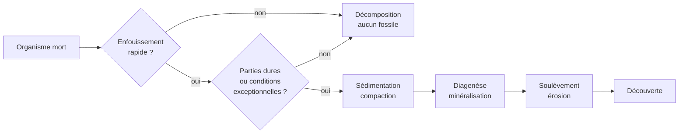
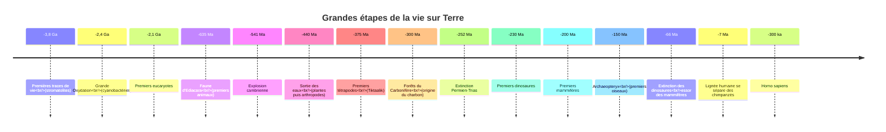

# Paléontologie et Histoire de la Vie

La paléontologie reconstruit l'histoire du vivant à partir de ses traces minéralisées. Elle est née comme curiosité érudite (Cuvier, début XIXe), s'est imposée comme preuve de l'évolution (Darwin), et fournit aujourd'hui des données essentielles sur le climat ancien, les extinctions et la trajectoire actuelle de la biodiversité.

## La fossilisation — une exception, pas la règle

La plupart des organismes morts disparaissent sans laisser de trace : ils sont mangés, oxydés, désintégrés. Pour qu'un fossile se forme, plusieurs conditions doivent se réunir.

**Conditions favorables** :
- Enfouissement rapide (avant que charognards et bactéries ne fassent leur travail)
- Présence de parties dures (os, dents, coquilles)
- Milieu peu oxygéné (fond marin calme, tourbière, lac anoxique)
- Sédiments fins (calcaires, argiles)

**Conséquence biaisée** : nous connaissons beaucoup mieux les organismes marins à coquille que les vers de terre ou les méduses. Notre vision de la vie passée est statistiquement déformée.

## Types de fossilisation

| Type | Processus | Exemple emblématique |
|---|---|---|
| **Permineralisation** | Les minéraux dissous remplissent les pores | Bois pétrifié (Petrified Forest, Arizona) |
| **Remplacement** | Le matériau original est dissous puis remplacé minéral par minéral | Pyritisation des ammonites, silicification |
| **Moule et contre-moule** | Empreinte externe ou interne après dissolution de l'organisme | Coquillages dans le calcaire |
| **Carbonisation** | Compression qui laisse un film de carbone | Empreintes de feuilles, fossiles de Burgess Shale |
| **Inclusion** | Piégeage dans un milieu inerte | Insectes dans l'ambre, mammouths dans le permafrost sibérien |
| **Ichnofossiles** | Traces, terriers, empreintes de pas, coprolithes (excréments fossilisés) | Pistes de dinosaures, terriers de vers |
| **Biomarqueurs** | Molécules organiques résiduelles | Stéranes dans les schistes (preuves de vie il y a 1,6 Ga) |

## Gisements exceptionnels — les « Lagerstätten »

Quelques sites au monde ont préservé des organismes mous (méduses, vers, embryons) — fenêtres uniques sur des écosystèmes entiers.

| Site | Âge | Importance |
|---|---|---|
| **Burgess Shale** (Canada) | ~508 Ma | Explosion cambrienne — révèle des phylums entiers disparus (*Anomalocaris*, *Hallucigenia*) |
| **Chengjiang** (Chine) | ~518 Ma | Encore plus ancien que Burgess, mêmes types de préservation |
| **Solnhofen** (Allemagne) | ~150 Ma | *Archaeopteryx*, chaînon entre dinosaures et oiseaux |
| **La Brea Tar Pits** (Los Angeles) | ~50 000 ans | Mammifères du Pléistocène (mammouths, smilodons) piégés dans le bitume |
| **Messel** (Allemagne) | ~47 Ma | Mammifères éocènes avec fourrure et contenu intestinal préservés |

## Les cinq (et bientôt six) grandes extinctions

Sur l'échelle géologique, la vie a connu cinq épisodes d'effondrement massif de la biodiversité. Une sixième est en cours — causée par une seule espèce, *Homo sapiens*.

| Extinction | Date | Pertes estimées | Cause principale |
|---|---|---|---|
| **1. Ordovicien-Silurien** | ~444 Ma | ~85 % des espèces marines | Glaciation rapide, chute du niveau marin |
| **2. Dévonien tardif** | ~372 Ma | ~75 % des espèces | Anoxie océanique, refroidissement |
| **3. Permien-Trias** « Great Dying » | ~252 Ma | ~96 % des espèces marines, ~70 % terrestres | Trapps de Sibérie (volcanisme massif), réchauffement et acidification — **la plus grave de toutes** |
| **4. Trias-Jurassique** | ~201 Ma | ~80 % des espèces | Trapps centre-atlantiques, ouverture de la Pangée |
| **5. Crétacé-Paléogène (K-Pg)** | ~66 Ma | ~75 % des espèces, **fin des dinosaures non-aviens** | Impact astéroïde (Chicxulub, Mexique) + trapps du Deccan |
| **6. Actuelle (« Anthropocène »)** | en cours | ~1 million d'espèces menacées (IPBES 2019) | Activités humaines : destruction d'habitat, climat, pollution, surexploitation |

**Point important** : après chaque extinction, la vie a repris — mais cela a pris **5 à 30 millions d'années** pour retrouver la diversité antérieure. À l'échelle d'une civilisation humaine, c'est définitif.

## Histoire de la vie en grandes étapes

## Fossiles emblématiques

| Fossile | Importance |
|---|---|
| **Lucy** (*Australopithecus afarensis*, 3,2 Ma, Éthiopie) | Bipédie ancienne, ancêtre lointain de la lignée humaine |
| **Tiktaalik** (~375 Ma, Arctique canadien) | Chaînon poisson-tétrapode : nageoires devenant pattes |
| **Archaeopteryx** (~150 Ma, Solnhofen) | Chaînon dinosaure-oiseau : plumes + dents + queue osseuse |
| **Ambulocetus** (~49 Ma, Pakistan) | Ancêtre semi-aquatique des cétacés : la baleine descend d'un mammifère terrestre |
| **Otzi** (5 300 ans, Alpes) | Pas un fossile au sens strict, mais une momie naturelle — une mine d'informations sur l'âge du cuivre |
| **Stromatolites** (jusqu'à 3,5 Ga) | Tapis de cyanobactéries — les plus anciennes traces de vie complexe |

## Outils du paléontologue moderne

La paléontologie ne se résume plus à creuser :
- **Tomographie** (CT-scan) : voir l'intérieur d'un fossile sans le casser
- **Géochimie isotopique** : reconstruire le climat, le régime alimentaire (isotopes du carbone), la migration
- **Paléogénétique** : extraire de l'ADN ancien (jusqu'à ~1 Ma en permafrost — Néandertal, mammouth, ours des cavernes)
- **Modélisation biomécanique** : simuler la marche d'un *T. rex* ou la morsure d'un mégalodon

Voir [[Temps Géologique et Stratigraphie]] pour le détail des ères et périodes.
