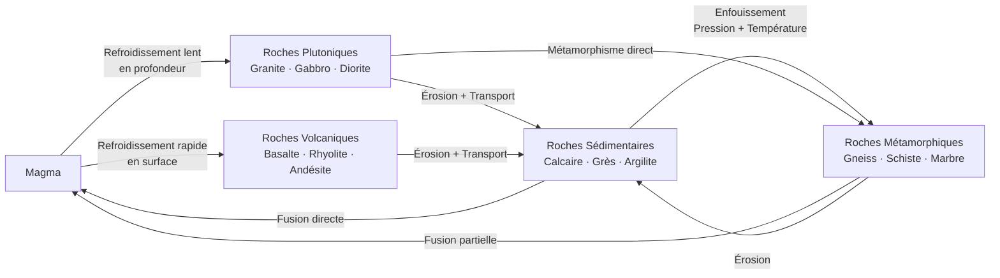

# Pétrologie et Cycle des Roches

### Roches Magmatiques (Ignées)

**Formation**
- Cristallisation magma (roche fondue)
- Silicates fondus + gaz dissous (H₂O, CO₂, SO₂)

**Classification selon Texture**

**Plutoniques (Intrusives)**
- Refroidissement lent en profondeur
- Cristaux visibles (phanéritiques), gros
- **Granite** :
  - Felsique (>65% SiO₂)
  - Quartz + Feldspaths (orthose, plagioclases) + Micas
  - Continentale, batholithes
  - Rose, gris, blanc
- **Diorite** : intermédiaire, plagioclases + amphiboles
- **Gabbro** : mafique (<52% SiO₂), plagioclases + pyroxènes, sombre, croûte océanique

**Volcaniques (Extrusives)**
- Refroidissement rapide en surface
- Cristaux invisibles (aphanitiques) ou verre (obsidienne)
- **Basalte** : équivalent gabbro, noir, dorsales, Hawaii, trapps
- **Andésite** : intermédiaire, arcs volcaniques
- **Rhyolite** : équivalent granite, claire
- **Obsidienne** : verre volcanique, refroidissement instantané, noir brillant
- **Ponce** : très vésiculaire (bulles), flotte sur eau
- **Tuf** : cendres volcaniques consolidées

**Série de Bowen**
- Ordre cristallisation minéraux depuis magma (Norman Bowen, 1928)
- **Continue** : plagioclases (Ca → Na)
- **Discontinue** : olivine → pyroxène → amphibole → biotite
- Quartz + feldspaths alcalins + muscovite (derniers)

### Roches Sédimentaires

**Formation**
1. **Altération** : désagrégation roches (météorisation physique, chimique)
2. **Érosion** : transport (eau, vent, glace, gravité)
3. **Sédimentation** : dépôt sédiments
4. **Diagenèse** : compaction + cimentation → roche

**Classification**

**Détritiques (Clastiques)**
- Fragments roches préexistantes
- **Conglomérat, Brèche** : galets (>2 mm), arrondis ou anguleux
- **Grès** : sable (0,06-2 mm), quartz dominant, ciment siliceux/calcaire/ferrugineux
- **Siltite** : silt (0,004-0,06 mm)
- **Argilite, Schiste** : argile (<0,004 mm), feuilleté

**Chimiques et Biochimiques**
- Précipitation ions dissous ou biogénique
- **Calcaire** : CaCO₃, coquilles organismes, récifs coralliens, grottes (dissolution)
  - Craie : microorganismes (coccolithes)
  - Calcaires oolithiques, bioclastiques
- **Dolomie** : CaMg(CO₃)₂
- **Évaporites** : évaporation eau salée
  - Halite (NaCl), Gypse (CaSO₄·2H₂O), Sylvite (KCl)
  - Bassins fermés (Mer Morte, Great Salt Lake)
- **Silex, Chert** : SiO₂, spicules éponges, radiolaires
- **Charbon** : végétaux compactés (tourbe → lignite → houille → anthracite)
- **Pétrole** : matière organique (plancton), température, pression, temps

**Structures Sédimentaires**
- **Stratification** : lits horizontaux
- **Rides (ripple marks)**, **Fentes dessiccation**, **Granoclassement**
- Indicateurs paléoenvironnement

### Roches Métamorphiques

**Métamorphisme**
- Transformation minéralogique/texturale roches solides
- **Facteurs** : température (200-800°C), pression (quelques kb-dizaines kb), fluides (H₂O, CO₂)
- **Pas de fusion** (sinon = magma)

**Types de Métamorphisme**

**Régional (Dynamothermique)**
- Grande échelle, chaînes montagnes, subduction
- Température + Pression
- **Grades** :
  - **Bas** : schistes (ardoise), phyllades
  - **Moyen** : micaschistes, gneiss
  - **Élevé** : gneiss œillés, migmatites (début fusion)
  - **Très élevé** : granulites, éclogites (haute pression)
- **Foliation** : orientation minéraux plats (micas) → schistosité

**Contact (Thermique)**
- Proximité intrusion magmatique
- Chaleur dominante
- **Auréole métamorphique** : marbres (calcaire cuit), cornéennes (argile)
- Pas de foliation marquée

**Hydrothermal**
- Fluides chauds, altération minéraux
- Métasomatose : changement composition chimique
- Gisements métallifères (or, argent, cuivre)

**Cataclastique (Dynamique)**
- Pression mécanique (failles)
- Broyage, brèches, mylonites

**Roches Métamorphiques Courantes**
- **Ardoise** : argile, bas grade, toits
- **Schiste** : foliation, micas abondants
- **Gneiss** : bandes claires/sombres (litage), feldspaths + quartz + micas
- **Marbre** : calcaire recristallisé, calcite grossière, sculpture (Carrare)
- **Quartzite** : grès métamorphisé, très dur
- **Amphibolite** : amphiboles + plagioclases
- **Éclogite** : très haute pression (subduction), grenat + pyroxène (omphacite), dense

### Cycle des Roches

**Processus Continu**
- Aucune roche "définitive"
- Magma → Ignée → Érosion → Sédimentaire → Métamorphisme → Métamorphique → Fusion → Magma
- Raccourcis possibles (ignée → métamorphique directement, etc.)
- Échelles temps : millions-milliards années

