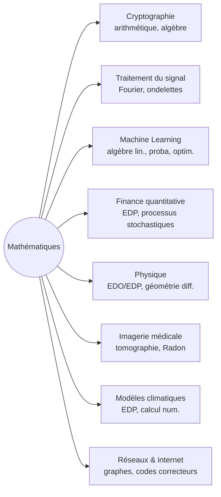

# Applications des Mathématiques

Les mathématiques ne sont pas qu'un édifice théorique : la quasi-totalité des technologies modernes repose sur des outils mathématiques. Cette note relie les notions étudiées en Lycée, Sup et Spé à leurs usages concrets — du chiffrement de ta connexion bancaire à l'imagerie médicale, en passant par les modèles climatiques.

> [!abstract] Principe
> Une même notion mathématique apparaît souvent dans des domaines totalement différents. La transformée de Fourier sert aussi bien à compresser une chanson (MP3) qu'à reconnaître une signature gravitationnelle. L'algèbre linéaire est partout : moteurs de recherche, IA, ingénierie. **C'est la généralité abstraite qui rend les maths puissantes.**

## Vue d'ensemble

## Cryptographie

La sécurité d'Internet repose entièrement sur des problèmes mathématiques *difficiles à inverser*.

### RSA — factorisation des grands nombres

Multiplier deux grands nombres premiers est facile ; retrouver les facteurs d'un produit à 2048 bits est aujourd'hui impossible en pratique. C'est sur cette asymétrie qu'est bâti **RSA** (1977).

**Maths utilisées** :
- Théorème de Fermat : $a^{p-1} \equiv 1 \pmod{p}$ pour $p$ premier, $\gcd(a,p) = 1$
- Théorème d'Euler généralisé, indicatrice $\varphi(n)$
- Algorithme d'Euclide étendu (calcul d'inverse modulaire)

**Tu utilises RSA** : chaque fois que ton navigateur affiche le cadenas de connexion sécurisée (handshake TLS).

### Courbes elliptiques (ECC)

Cryptographie plus moderne, utilisée par Bitcoin, Signal, iMessage. Repose sur la difficulté du logarithme discret sur des courbes elliptiques — des objets purement géométriques au départ.

### Cryptographie post-quantique

L'ordinateur quantique cassera RSA et ECC. Les nouvelles propositions (Kyber, Dilithium) reposent sur la difficulté de problèmes de **réseaux euclidiens** (lattices) — un domaine de géométrie/algèbre linéaire qui était académique il y a 20 ans.

Voir [[Arithmétique]] (Math Sup) et [[Cryptographie]] (Computer Science).

## Traitement du signal et compression

### Transformée de Fourier — décomposer en fréquences

Tout signal périodique peut s'écrire comme somme de sinus et cosinus (Fourier, 1822). La **FFT** (Fast Fourier Transform, 1965) calcule cette décomposition en $O(n \log n)$ au lieu de $O(n^2)$ — sans elle, la téléphonie mobile, le Wi-Fi et la radio numérique seraient impossibles.

**Applications directes** :
- **MP3, AAC, Opus** : on supprime les fréquences inaudibles (compression psycho-acoustique)
- **JPEG** : transformée en cosinus discrète (DCT) sur des blocs 8×8 pixels
- **Imagerie médicale** (IRM) : reconstruction par transformée de Fourier inverse
- **Radio FM, 5G** : modulation/démodulation par OFDM (multiporteuses Fourier)

### Ondelettes (Wavelets)

Évolution de Fourier quand le signal n'est pas stationnaire (musique, image avec contours nets). Base mathématique de **JPEG2000** et des codecs vidéo modernes.

Voir [[Séries de Fourier]] (Math Spé).

## Machine Learning et intelligence artificielle

### Algèbre linéaire — l'épine dorsale

Un réseau de neurones est, mathématiquement, une composition d'**applications linéaires** (multiplications de matrices) entrecoupées de **fonctions non linéaires** (ReLU, sigmoïde). Un GPU = un calculateur matriciel.

**Notions de Math Sup directement utilisées** :
- Matrices, produit matriciel, transposée
- Espaces vectoriels, dimension
- Décomposition en valeurs singulières (SVD)
- Norme, distance, produit scalaire

### Calcul différentiel — l'apprentissage

Entraîner un modèle = minimiser une fonction de perte = trouver son minimum par **descente de gradient**. Le calcul des gradients dans un réseau utilise la règle de la chaîne (composition de dérivées) — c'est la **rétropropagation**.

**Notions** :
- Dérivées partielles, gradient
- Règle de la chaîne (Math Sup)
- Optimisation convexe / non convexe
- Théorème du point fixe (convergence)

### Probabilités — l'incertitude

- **Régression bayésienne** : théorème de Bayes appliqué aux modèles
- **Modèles génératifs** (GPT, diffusion) : on modélise une distribution de probabilité sur des données
- **Inférence variationnelle** : Kullback-Leibler entre distributions

Voir [[Probabilités Prépa]], [[Algèbre Linéaire]].

## Finance quantitative

### Modèle de Black-Scholes (1973, Nobel d'Économie 1997)

Évalue le prix d'une option financière. Le sous-jacent (cours d'une action) est modélisé par un **mouvement brownien géométrique**, et le prix de l'option vérifie une **équation aux dérivées partielles** parabolique :

$$\frac{\partial V}{\partial t} + \frac{1}{2}\sigma^2 S^2 \frac{\partial^2 V}{\partial S^2} + rS\frac{\partial V}{\partial S} - rV = 0$$

**Maths utilisées** :
- Calcul stochastique (lemme d'Itô)
- EDP, méthodes numériques (différences finies)
- Probabilités, martingales

### Gestion de portefeuille (Markowitz, Nobel 1990)

Optimiser un portefeuille = problème quadratique sous contraintes — **optimisation convexe**. Repose sur l'algèbre linéaire (matrice de covariance) et le calcul matriciel.

## Physique et ingénierie

### Équations de Maxwell — l'électromagnétisme

Quatre équations aux dérivées partielles décrivent tout l'électromagnétisme classique. Conséquence directe : la lumière est une onde électromagnétique, sa vitesse $c = 1/\sqrt{\mu_0 \varepsilon_0}$.

### Équations de Navier-Stokes — fluides

EDP non linéaires qui régissent l'écoulement de l'air autour d'une aile, du sang dans une artère, des courants océaniques. Leur solubilité générale est l'un des [[#Problèmes du millénaire|7 problèmes du millénaire]] (Clay Institute, prime : 1 M$).

### Relativité générale (Einstein, 1915)

L'espace-temps est une **variété pseudo-riemannienne**. La géométrie différentielle, qui semblait abstraite, est devenue le langage de la physique du XXe siècle.

$$R_{\mu\nu} - \frac{1}{2}g_{\mu\nu}R + \Lambda g_{\mu\nu} = \frac{8\pi G}{c^4} T_{\mu\nu}$$

### Mécanique quantique

L'espace des états est un **espace de Hilbert** (Math Spé : [[Espaces Préhilbertiens]] généralisés en dimension infinie). Les observables sont des opérateurs auto-adjoints. C'est de l'algèbre linéaire avancée.

## Imagerie médicale — la transformée de Radon

Un **scanner CT** prend des projections aux rayons X sous tous les angles. Reconstruire l'image en 3D = inverser la **transformée de Radon** (1917, devenue utile 50 ans plus tard).

L'**IRM** utilise la transformée de Fourier inverse pour reconstruire l'image à partir des signaux mesurés dans le k-space.

## Réseaux, internet et codes correcteurs

### Graphes et routage

Internet est un graphe (~80 000 systèmes autonomes). Le **routage** (OSPF, BGP) calcule des plus courts chemins par des algorithmes type **Dijkstra** ou **Bellman-Ford**. Voir [[Théorie des Graphes]].

### Codes correcteurs d'erreurs

Quand tu envoies un message par satellite ou que tu lis un Blu-ray rayé, des bits peuvent être perdus. Les **codes de Reed-Solomon** (utilisés dans les QR codes, CD, communications spatiales) permettent de corriger jusqu'à un certain nombre d'erreurs.

**Maths** : corps finis $\mathbb{F}_{q}$, polynômes sur $\mathbb{F}_q$ (Math Sup [[Polynômes]], [[Arithmétique]]).

### PageRank — Google (1998)

L'algorithme original de Google ramène le classement des pages web au calcul d'un **vecteur propre dominant** d'une matrice stochastique (~chaîne de Markov). De l'algèbre linéaire pure, transformée en empire industriel.

## Climat, épidémiologie, biologie

### Modèles climatiques

EDP couplées (atmosphère, océan, glace) résolues sur des supercalculateurs. Discrétisation par éléments finis ou différences finies. Tout le calcul numérique de Math Sup/Spé.

### Modèle SIR (épidémiologie)

Système d'équations différentielles modélisant une épidémie :
$$\frac{dS}{dt} = -\beta SI \qquad \frac{dI}{dt} = \beta SI - \gamma I \qquad \frac{dR}{dt} = \gamma I$$

Le fameux **R₀** est $\beta/\gamma$. Le COVID a popularisé ce modèle dans le grand public.

### Dynamique des populations

Équations de Lotka-Volterra (proies-prédateurs), modèles de réaction-diffusion (formation des motifs sur les pelages). Toutes des EDO/EDP.

## Problèmes du millénaire

Sept problèmes énoncés en 2000 par le Clay Mathematics Institute, dotés chacun de **1 million de dollars**. Un seul a été résolu (Poincaré, par Perelman, 2003, qui a refusé le prix et la médaille Fields).

| Problème | Domaine | Statut |
|---|---|---|
| **P vs NP** | Informatique théorique | Ouvert |
| **Hypothèse de Riemann** | Théorie des nombres | Ouvert |
| **Yang-Mills et masse** | Physique mathématique | Ouvert |
| **Navier-Stokes** | EDP | Ouvert |
| **Hodge** | Géométrie algébrique | Ouvert |
| **Birch et Swinnerton-Dyer** | Courbes elliptiques | Ouvert |
| **Conjecture de Poincaré** | Topologie | **Résolu** (Perelman, 2003) |

## Ce que cela dit

Une notion mathématique purement « pour le plaisir » devient régulièrement, des décennies plus tard, le pilier d'une technologie. Les courbes elliptiques (étudiées au XIXe pour résoudre des intégrales) sécurisent ton iMessage. La théorie des groupes de Galois (mort à 20 ans en duel) fait partie des fondements des codes correcteurs. Les espaces de Hilbert (abstraction d'Hilbert vers 1900) sont devenus la mécanique quantique.

**Eugene Wigner**, physicien, a appelé cela « l'efficacité déraisonnable des mathématiques dans les sciences naturelles » (1960). Personne ne sait vraiment pourquoi ça marche aussi bien.
