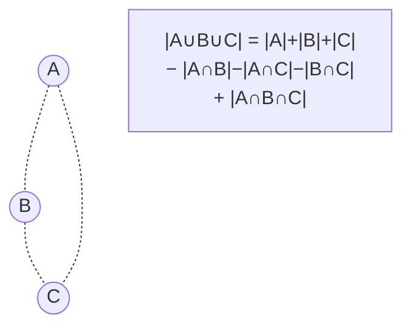

# Combinatoire Avancée

La combinatoire compte. Mais elle compte des objets que l'intuition n'attrape plus dès qu'on dépasse quelques cas : combien de façons d'arranger un Rubik's cube ? Combien de parties d'échecs possibles ? Combien de fonctions $f: A \to B$ ? Au-delà du dénombrement basique du Lycée (arrangements, combinaisons), il existe une boîte à outils raffinée — bijections, principe d'inclusion-exclusion, séries génératrices — qui permet de résoudre des problèmes en apparence inabordables.

> [!abstract] Programme
> Bijections, principe d'inclusion-exclusion, partitions, formules de Stirling, séries génératrices, principe des tiroirs, méthode probabiliste, double comptage. Niveau Math Sup/Spé approfondi, olympiades, prépa concours.

## 1. Rappels et notations

| Objet | Cardinal |
|---|---|
| Permutations de $n$ objets | $n!$ |
| Arrangements $A_n^p$ ($p$ parmi $n$, ordre) | $\frac{n!}{(n-p)!}$ |
| Combinaisons $\binom{n}{p}$ ($p$ parmi $n$, sans ordre) | $\frac{n!}{p!(n-p)!}$ |
| Fonctions $f: A \to B$ | $|B|^{|A|}$ |
| Fonctions injectives $A \to B$ | $A_{|B|}^{|A|}$ si $|A| \leq |B|$ |
| Parties d'un ensemble à $n$ éléments | $2^n$ |

> [!important] Formule du binôme de Newton
> $$(a+b)^n = \sum_{k=0}^n \binom{n}{k} a^k b^{n-k}$$

## 2. Bijections — le cœur de la combinatoire

**Principe** : pour montrer que deux ensembles ont le même cardinal, il suffit d'exhiber une bijection entre eux. Souvent plus élégant qu'un calcul direct.

> [!example] Identité $\binom{n}{p} = \binom{n}{n-p}$
> *Preuve combinatoire* : choisir les $p$ éléments d'une partie revient à choisir les $n-p$ éléments du complémentaire. Bijection « partie ↔ son complémentaire ». Démonstration en une ligne.

> [!example] Identité de Vandermonde
> $$\binom{m+n}{r} = \sum_{k=0}^{r} \binom{m}{k}\binom{n}{r-k}$$
> *Preuve combinatoire* : choisir $r$ personnes parmi $m$ hommes et $n$ femmes revient à choisir $k$ hommes et $r-k$ femmes pour chaque $k$.

## 3. Principe d'inclusion-exclusion

> [!important] Inclusion-exclusion
> Pour des ensembles finis $A_1, \dots, A_n$ :
> $$\left|\bigcup_{i=1}^n A_i\right| = \sum_i |A_i| - \sum_{i<j} |A_i \cap A_j| + \sum_{i<j<k} |A_i \cap A_j \cap A_k| - \cdots + (-1)^{n+1} |A_1 \cap \cdots \cap A_n|$$

### Application — dérangements

Un **dérangement** est une permutation sans point fixe (personne n'a son propre chapeau). Combien y en a-t-il sur $n$ éléments ?

$$D_n = n! \sum_{k=0}^n \frac{(-1)^k}{k!} \approx \frac{n!}{e}$$

> [!example] Problème du vestiaire
> $n$ personnes déposent leur chapeau au vestiaire. Le préposé les redistribue au hasard. La probabilité qu'**aucune** ne récupère le sien tend vers $1/e \approx 36{,}8\%$ — indépendamment de $n$. Contre-intuitif !

## 4. Partitions

### 4.1 Partition d'un entier

Une **partition** de $n$ est une écriture $n = \lambda_1 + \lambda_2 + \cdots + \lambda_k$ avec $\lambda_1 \geq \lambda_2 \geq \cdots \geq \lambda_k \geq 1$.

Exemple : partitions de 4 : $4,\; 3+1,\; 2+2,\; 2+1+1,\; 1+1+1+1$ → $p(4) = 5$.

Pas de formule fermée pour $p(n)$ ! Mais une magnifique fonction génératrice (Euler) :
$$\sum_{n \geq 0} p(n) x^n = \prod_{k \geq 1} \frac{1}{1 - x^k}$$

Ramanujan a découvert des congruences spectaculaires :
$$p(5k+4) \equiv 0 \pmod{5}, \quad p(7k+5) \equiv 0 \pmod{7}, \quad p(11k+6) \equiv 0 \pmod{11}$$

### 4.2 Nombres de Stirling

**Stirling de seconde espèce** $S(n, k)$ : nombre de façons de partitionner un ensemble de $n$ éléments en $k$ parties non vides.

$$S(n, k) = k \cdot S(n-1, k) + S(n-1, k-1)$$

Valeurs : $S(n, 1) = 1$, $S(n, n) = 1$, $S(4, 2) = 7$.

**Lien avec les surjections** : nombre de surjections $A \to B$ avec $|A| = n$, $|B| = k$ est $k! \cdot S(n, k)$.

### 4.3 Nombres de Bell

$B(n) = \sum_{k=0}^n S(n, k)$ = nombre total de partitions d'un ensemble de $n$ éléments.

$B(0) = 1,\; B(1) = 1,\; B(2) = 2,\; B(3) = 5,\; B(4) = 15,\; B(5) = 52,\; B(10) = 115\,975$.

## 5. Séries génératrices — l'outil le plus puissant

> [!abstract] Idée
> À une suite $(a_n)$, on associe la **série génératrice**
> $$A(x) = \sum_{n \geq 0} a_n x^n$$
> Manipuler $A(x)$ algébriquement (multiplications, dérivations) résout des problèmes combinatoires.

### 5.1 Cas modèle — la suite de Fibonacci

$F_0 = 0,\; F_1 = 1,\; F_n = F_{n-1} + F_{n-2}$.

Sa série génératrice $F(x) = \sum F_n x^n$ vérifie :
$$F(x) = \frac{x}{1 - x - x^2}$$

Décomposition en éléments simples → formule explicite (Binet) :
$$F_n = \frac{\varphi^n - \psi^n}{\sqrt{5}}, \quad \varphi = \frac{1+\sqrt{5}}{2}, \quad \psi = \frac{1-\sqrt{5}}{2}$$

### 5.2 Coefficient $[x^n] f(x)$

Notation : $[x^n] f(x)$ désigne le coefficient de $x^n$ dans $f(x)$.

| Série | Coefficient |
|---|---|
| $\frac{1}{1-x}$ | $[x^n] = 1$ pour tout $n$ |
| $\frac{1}{(1-x)^k}$ | $[x^n] = \binom{n+k-1}{k-1}$ |
| $e^x$ | $[x^n] = \frac{1}{n!}$ (série exponentielle) |
| $(1+x)^n$ | $[x^k] = \binom{n}{k}$ |

### 5.3 Méthode

1. Traduire le problème en équation sur la série génératrice
2. Résoudre algébriquement (souvent par fractions rationnelles)
3. Extraire le coefficient cherché

## 6. Principe des tiroirs (pigeonhole)

> [!important] Principe des tiroirs (Dirichlet)
> Si on range $n+1$ objets dans $n$ tiroirs, au moins un tiroir contient au moins 2 objets.
>
> **Forme générale** : ranger $kn+1$ objets dans $n$ tiroirs → au moins un tiroir avec $k+1$ objets.

Trivial dans l'énoncé, dévastateur en application.

> [!example] Applications classiques
> 1. **Tirage anniversaires** : dans un groupe de 23 personnes, probabilité ≥ 50 % que deux partagent un anniversaire (paradoxe des anniversaires)
> 2. **Cheveux** : à Paris (~10 millions d'habitants, ~150 000 cheveux par personne max), au moins **deux Parisiens ont exactement le même nombre de cheveux**
> 3. **Sous-suite monotone** (Erdős-Szekeres) : toute suite de $n^2 + 1$ réels distincts contient une sous-suite monotone de longueur $n+1$

## 7. Méthode probabiliste (Erdős)

**Idée géniale** : pour prouver qu'un objet combinatoire **existe**, on en construit un au hasard et on montre qu'il a la propriété recherchée avec probabilité positive.

> [!example] Théorème (Erdős, 1947) — Coloriages de Ramsey
> $R(k, k) > 2^{k/2}$ pour $k$ assez grand.
>
> *Esquisse* : on colore $K_n$ aléatoirement en 2 couleurs. La probabilité qu'un sous-graphe $K_k$ donné soit monochrome est $2^{1-\binom{k}{2}}$. Si $n < 2^{k/2}$, l'espérance du nombre de $K_k$ monochromes est $< 1$, donc il existe un coloriage sans aucun. CQFD.
>
> Aucune méthode constructive connue ne donne d'aussi bonnes bornes.

## 8. Double comptage

Compter une même quantité de **deux façons différentes**, puis identifier — produit souvent des identités élégantes.

> [!example] $\sum_{k=0}^n \binom{n}{k} = 2^n$
> *Méthode 1* : binôme de Newton avec $a = b = 1$.
> *Méthode 2 (double comptage)* : on compte les parties d'un ensemble à $n$ éléments. Soit $|2^E| = 2^n$ (chaque élément y est ou pas). Soit $\sum \binom{n}{k}$ (compter par taille). Égalité.

> [!example] Identité du capitaine
> $$k\binom{n}{k} = n\binom{n-1}{k-1}$$
> Choisir une équipe de $k$ joueurs et son capitaine. Soit on choisit l'équipe ($\binom{n}{k}$) puis le capitaine ($k$). Soit on choisit le capitaine ($n$) puis les $k-1$ autres équipiers ($\binom{n-1}{k-1}$).

## 9. Combinatoire des mots

Combien de mots de $n$ lettres sur un alphabet de taille $k$, sans deux lettres consécutives identiques ? Plus généralement, énumérations sous contraintes — utilisé en bio-informatique (séquences génomiques, motifs), compression de texte, théorie de l'information.

**Outils** : automates finis, séries génératrices, matrices de transfert.

## 10. Théorie de Ramsey — l'ordre dans le chaos

> [!quote] Théorème de Ramsey
> Pour tout $r, k$, il existe $N(r, k)$ tel que dans tout coloriage des arêtes de $K_N$ en $r$ couleurs, on trouve un $K_k$ monochrome.

**Slogan** : « Complete disorder is impossible. »

**Cas connu** : $R(3,3) = 6$ — dans tout groupe de 6 personnes, il y a soit 3 qui se connaissent mutuellement, soit 3 qui s'ignorent mutuellement. $R(5,5)$ reste inconnu (entre 43 et 48).

## 11. Quelques nombres et suites célèbres

| Suite | Définition | Apparaît dans |
|---|---|---|
| **Catalan** $C_n = \frac{1}{n+1}\binom{2n}{n}$ | $1, 1, 2, 5, 14, 42, \dots$ | Parenthésages, arbres binaires, chemins sous-diagonaux |
| **Bell** $B_n$ | nombre de partitions d'un ensemble | $1, 1, 2, 5, 15, 52, \dots$ |
| **Fibonacci** $F_n$ | $F_n = F_{n-1}+F_{n-2}$ | Croissance, nature, finance |
| **Stirling** $S(n,k)$ | partitions en $k$ blocs | Algèbre, surjections |
| **Catalan en 3D** | nombres de Motzkin, Schröder | Chemins contraints |

Voir [[Dénombrement]] (Lycée) et [[Probabilités Prépa]] (Math Spé) pour les bases.
