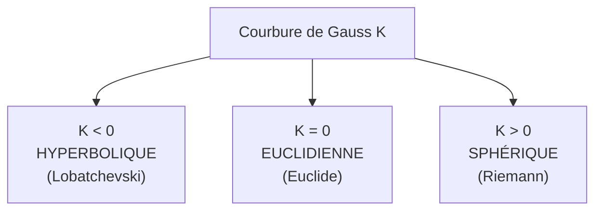

# Géométrie Non-Euclidienne

Pendant 2 000 ans, la géométrie d'Euclide a été *la* géométrie — au point qu'on la croyait dictée par la raison ou par la nature elle-même. Au XIXe siècle, trois mathématiciens découvrent indépendamment qu'on peut construire des géométries cohérentes mais *différentes* d'Euclide, en changeant un seul axiome. Cette révélation aura un impact phénoménal : sans elle, pas de relativité générale, et notre vision de l'espace, du temps et de l'univers serait différente.

> [!abstract] Question fondatrice
> Le **cinquième postulat d'Euclide** (postulat des parallèles) est-il une conséquence des quatre premiers, ou un axiome indépendant ?

## 1. Le cinquième postulat — 2 000 ans de tentatives

### 1.1 Les Éléments d'Euclide (~300 av. J.-C.)

Euclide pose 5 postulats, dont les 4 premiers sont simples :
1. Par deux points passe une unique droite
2. Tout segment se prolonge en droite
3. Étant donné un centre et un rayon, on peut tracer un cercle
4. Tous les angles droits sont égaux

Le 5e est plus alambiqué :

> [!quote] 5e postulat (formulation originale)
> Si une droite, coupant deux autres droites, fait avec elles des angles intérieurs du même côté dont la somme est inférieure à deux droits, ces deux droites, prolongées à l'infini, se rencontrent du côté où la somme des angles est inférieure à deux droits.

Formulation moderne équivalente (**axiome de Playfair**) :
> Par un point hors d'une droite, il passe **une et une seule** parallèle à cette droite.

### 1.2 Tentatives de démonstration

Pendant deux millénaires, des dizaines de mathématiciens (Proclus, Omar Khayyam, Nasir al-Din al-Tusi, Saccheri, Lambert) tentent de **déduire** le 5e des 4 autres. Tous échouent — mais chaque tentative s'approche de la vérité : le 5e est indépendant.

**Saccheri** (1733) va le plus loin : il suppose le 5e faux et déroule les conséquences en espérant tomber sur une contradiction. Il déduit des théorèmes étranges mais cohérents… qu'il rejette par préjugé esthétique. Il rate la découverte de la géométrie hyperbolique.

### 1.3 Naissance de la géométrie non-euclidienne (~1830)

Trois découvertes simultanées et indépendantes :
- **Carl Friedrich Gauss** (Allemagne, 1810s — non publié de son vivant, crainte du « tollé des béotiens »)
- **Nikolaï Lobatchevski** (Russie, 1829-1830)
- **János Bolyai** (Hongrie, 1832)

Ils construisent une géométrie où le 5e postulat est **remplacé** par : « par un point hors d'une droite passent **une infinité** de parallèles ». Tout reste cohérent. Naissance de la **géométrie hyperbolique**.

## 2. Trois géométries — comparaison

| | Euclidienne | Hyperbolique | Sphérique (elliptique) |
|---|---|---|---|
| **Modèle visuel** | Plan, table | Selle de cheval, pseudosphère | Surface de la Terre |
| **Courbure** $K$ | $0$ | $< 0$ | $> 0$ |
| **Parallèles à une droite par un point extérieur** | exactement 1 | une infinité | aucune (toutes se coupent) |
| **Somme des angles d'un triangle** | $= \pi$ | $< \pi$ | $> \pi$ |
| **Théorème de Pythagore** | $a^2 + b^2 = c^2$ | $\cosh c = \cosh a \cdot \cosh b$ | $\cos c = \cos a \cdot \cos b$ |
| **Circonférence d'un cercle** de rayon $r$ | $2\pi r$ | $2\pi \sinh r > 2\pi r$ | $2\pi \sin r < 2\pi r$ |

> [!important] Théorème de Gauss-Bonnet
> Pour un triangle géodésique sur une surface de courbure $K$ :
> $$(\alpha + \beta + \gamma) - \pi = \int_T K\, dA$$
>
> L'**excès** ou le **défaut angulaire** d'un triangle mesure la courbure totale du domaine. Sur un plan ($K = 0$), la somme vaut $\pi$ exactement.

## 3. Géométrie sphérique

C'est la plus intuitive : la surface d'une sphère. Les « droites » deviennent les **grands cercles** (cercles dont le centre coïncide avec celui de la sphère).

**Conséquences** :
- Sur Terre, le plus court chemin entre Paris et Tokyo passe par le pôle (Nord) — c'est pourquoi les avions empruntent cette route apparemment détournée sur une carte plate
- Deux grands cercles distincts se coupent toujours en deux points antipodaux : **pas de parallèles**
- Un triangle dont les trois sommets sont équateur/pôle a trois angles droits — somme = $3\pi/2$

> [!example] Triangle géant
> Sur la Terre, prenez le pôle Nord, l'équateur à 0° de longitude, l'équateur à 90° Est. Les trois côtés du triangle sont des arcs de grands cercles, chacun de 10 000 km. Les trois angles sont des angles droits. Somme = 270° ≠ 180°.

**Modèle mathématique** : sphère $\mathbb{S}^2$ dans $\mathbb{R}^3$. Géodésiques = grands cercles.

## 4. Géométrie hyperbolique

La moins intuitive — il faut s'aider de **modèles** plats pour la visualiser.

### 4.1 Modèles classiques

| Modèle | Description |
|---|---|
| **Disque de Poincaré** | Le plan hyperbolique est représenté dans le disque unité. Les géodésiques sont des arcs de cercle perpendiculaires au bord (ou des diamètres). Distance qui explose près du bord. |
| **Demi-plan de Poincaré** | $\{(x, y) : y > 0\}$. Géodésiques = demi-droites verticales et demi-cercles centrés sur l'axe $Ox$. |
| **Modèle de Klein** | Disque, géodésiques = cordes droites. Moins conforme mais plus simple visuellement. |
| **Pseudosphère** (Beltrami) | Surface en forme de trompette, courbure $= -1$ partout. |

### 4.2 Conséquences contre-intuitives

- Un triangle hyperbolique a une **aire maximale** : $\pi - (\alpha+\beta+\gamma)$. Plus le triangle est grand, plus ses angles diminuent.
- Il existe des triangles **idéaux** dont les trois sommets sont à l'infini, avec angles nuls et aire $\pi$.
- La circonférence d'un cercle croît **exponentiellement** avec le rayon — la géométrie hyperbolique a énormément de « place ».

### 4.3 Œuvres d'Escher

Les gravures *Cercle limite I-IV* de **M.C. Escher** (1958-1960) sont des représentations artistiques du disque de Poincaré — pavages réguliers où les motifs rapetissent en allant vers le bord. Escher s'inspirait des travaux du géomètre H.S.M. Coxeter.

## 5. Géométrie riemannienne — l'unification

**Bernhard Riemann** (1854, leçon d'habilitation à Göttingen, Gauss dans le public) propose un cadre général : étudier des **variétés** munies d'une **métrique** locale (façon de mesurer les distances). Le plan, la sphère, le plan hyperbolique, et **toutes les surfaces lisses** deviennent des cas particuliers.

> [!important] Métrique riemannienne
> Une métrique sur une variété est la donnée, en chaque point, d'un produit scalaire sur l'espace tangent. La distance entre deux points est alors l'infimum des longueurs des chemins reliant ces points.

C'est ce langage qui permettra à Einstein de formuler la relativité générale.

## 6. Relativité générale — la géométrie devient physique

**Einstein** (1915) : la gravitation n'est pas une force, c'est la **courbure de l'espace-temps**.

> [!quote] Einstein
> « L'espace-temps dit à la matière comment se mouvoir ; la matière dit à l'espace-temps comment se courber. » (Wheeler)

### 6.1 Équation d'Einstein

$$G_{\mu\nu} + \Lambda g_{\mu\nu} = \frac{8\pi G}{c^4} T_{\mu\nu}$$

- $G_{\mu\nu}$ : tenseur d'Einstein (courbure)
- $g_{\mu\nu}$ : tenseur métrique de l'espace-temps
- $T_{\mu\nu}$ : tenseur énergie-impulsion (matière/énergie)
- $\Lambda$ : constante cosmologique

### 6.2 Conséquences vérifiées

| Prédiction | Vérification |
|---|---|
| Déviation de la lumière par le Soleil | Éclipse de 1919 (Eddington) |
| Précession du périhélie de Mercure | Connue depuis 1859, expliquée par Einstein |
| Décalage gravitationnel des fréquences | Pound-Rebka, 1959 |
| GPS — corrections relativistes (33 µs/jour) | Sans elles, le GPS dériverait de ~11 km/jour |
| Ondes gravitationnelles | Détectées par LIGO en 2015 (Nobel 2017) |
| Trous noirs | Image directe Event Horizon Telescope, 2019 (M87*), 2022 (Sgr A*) |

## 7. La topologie de l'univers

Quelle est la **forme** globale de l'univers ?
- **Plat** (euclidien) — possible si la densité critique est atteinte
- **Sphérique** (refermé sur lui-même) — univers fini sans bord
- **Hyperbolique** (en selle) — infini, expansion accélérée

Les mesures du **fond diffus cosmologique** (CMB) par WMAP et Planck indiquent un univers compatible avec un univers **plat** à 0,4 % près. Mais on ne sait pas s'il est réellement infini, ou seulement très grand.

## 8. Applications inattendues

| Domaine | Usage |
|---|---|
| **Cartographie** | Pas de projection plane parfaite — Mercator déforme les surfaces (Groenland gigantesque), équidistante déforme les angles. C'est inévitable : la sphère n'est pas isométrique au plan |
| **Architecture, design** | Pavages hyperboliques (Escher), structures à courbure négative (selle, paraboloïde) |
| **Imagerie médicale** | Le cerveau a une géométrie complexe — les analyses d'IRM utilisent souvent des espaces hyperboliques |
| **Théorie de l'apprentissage** | Embeddings hyperboliques pour les hiérarchies (taxonomies, arbres) : la croissance exponentielle du volume hyperbolique correspond naturellement aux arbres |
| **Réseaux complexes** | Beaucoup de réseaux réels (Internet, biologique) ont une structure mieux capturée en géométrie hyperbolique |
| **Cryptographie post-quantique** | Réseaux euclidiens, mais aussi structures géométriques exotiques |

## 9. Ce qu'il faut retenir

1. La géométrie d'Euclide n'est pas la seule possible. Elle décrit le plan local de notre expérience quotidienne, mais à grande échelle (univers) ou à petite (relativité), des géométries plus générales sont nécessaires.
2. Trois géométries selon le **signe de la courbure** : $K = 0$ (Euclide), $K < 0$ (hyperbolique), $K > 0$ (sphérique).
3. La **géométrie riemannienne** les unifie comme cas particuliers.
4. **Sans géométrie non-euclidienne, pas de relativité générale**, donc pas de GPS qui marche, pas de cosmologie moderne, pas de compréhension des trous noirs.
5. Ce qui semblait pure spéculation au XIXe siècle est devenu fondamental au XXe.

Voir [[Géométrie Plane]] et [[Géométrie dans l'Espace]] pour la géométrie classique (Lycée), et [[Espaces Euclidiens]] (Math Sup) pour les structures linéaires sous-jacentes.
