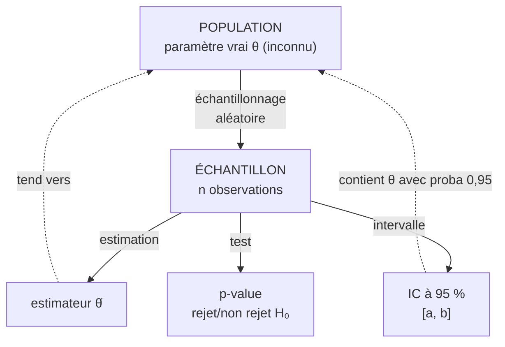
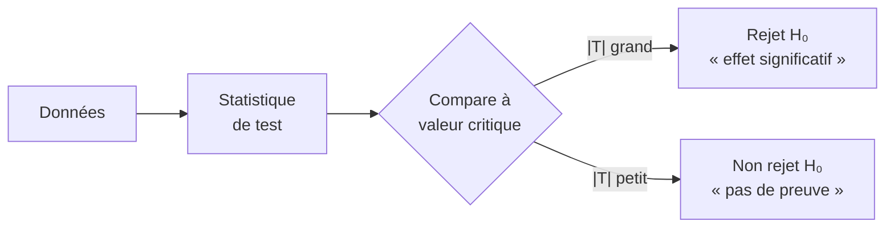

# Statistiques Inférentielles

Les **statistiques descriptives** résument des données qu'on a sous les yeux. Les **statistiques inférentielles** font un saut beaucoup plus audacieux : à partir d'un **échantillon** (quelques centaines de personnes), elles tirent des conclusions sur une **population entière** (plusieurs millions). C'est cet outil qui permet aux sondages, aux essais cliniques et aux études scientifiques d'exister.

> [!abstract] Question centrale
> Si je mesure quelque chose sur un échantillon, **que puis-je dire de la population entière** — et avec quelle marge d'erreur ?

## Vue d'ensemble

## 1. Estimation ponctuelle

### 1.1 Estimateur — définition

> [!abstract] Estimateur
> Un **estimateur** $\hat{\theta}$ d'un paramètre $\theta$ est une variable aléatoire calculée à partir d'un échantillon $(X_1, \dots, X_n)$. Elle prend une valeur particulière (estimation) une fois l'échantillon réalisé.

**Exemples classiques** :
- Moyenne empirique $\bar{X}_n = \frac{1}{n}\sum X_i$ pour estimer la moyenne $\mu$
- Variance empirique corrigée $S_n^2 = \frac{1}{n-1}\sum(X_i - \bar{X}_n)^2$ pour estimer $\sigma^2$
- Fréquence $\hat{p} = k/n$ pour estimer une proportion $p$

### 1.2 Qualités d'un estimateur

| Qualité | Définition | Importance |
|---|---|---|
| **Sans biais** | $\mathbb{E}[\hat{\theta}] = \theta$ | En moyenne, on tape juste |
| **Convergent** | $\hat{\theta}_n \to \theta$ en probabilité | Plus on a de données, plus on est précis |
| **Efficace** | Variance minimale parmi les sans biais | Précision optimale pour un $n$ donné |

> [!warning] Pourquoi diviser par $n-1$ pour la variance ?
> La variance empirique $\frac{1}{n}\sum(X_i - \bar{X})^2$ est **biaisée** : elle sous-estime $\sigma^2$ car on utilise $\bar{X}$ au lieu de $\mu$. Diviser par $n-1$ corrige ce biais (correction de Bessel).

## 2. Théorèmes limites — pourquoi ça marche

### 2.1 Loi des grands nombres

> [!important] LGN (forme faible)
> Si $X_1, \dots, X_n$ sont i.i.d. d'espérance $\mu$, alors :
> $$\bar{X}_n = \frac{X_1 + \cdots + X_n}{n} \xrightarrow{\text{prob.}} \mu \quad \text{quand } n \to \infty$$

**Conséquence pratique** : sur un grand échantillon, la moyenne empirique est très proche de la moyenne théorique. C'est pourquoi un sondage de 1 000 personnes peut estimer un score national avec ~3 points d'incertitude.

### 2.2 Théorème central limite (TCL) — le théorème-clé

> [!important] Théorème Central Limite
> Pour $X_1, \dots, X_n$ i.i.d. d'espérance $\mu$ et de variance $\sigma^2 < +\infty$ :
> $$\sqrt{n} \cdot \frac{\bar{X}_n - \mu}{\sigma} \xrightarrow{\mathcal{L}} \mathcal{N}(0, 1)$$
>
> Autrement dit, la moyenne empirique, **quelle que soit la loi des $X_i$**, suit approximativement une loi normale dès que $n$ est assez grand.

**C'est ce miracle qui fait fonctionner toute l'inférence** : on n'a pas besoin de connaître la loi exacte des données, la moyenne devient gaussienne par magie. En pratique, $n \geq 30$ suffit pour la plupart des distributions.

## 3. Intervalles de confiance (IC)

### 3.1 Idée

Au lieu de donner *un* nombre comme estimation, on donne **une fourchette** assortie d'un niveau de confiance.

> [!abstract] Définition
> Un **intervalle de confiance** $[A_n, B_n]$ pour $\theta$ au niveau $1 - \alpha$ est un intervalle aléatoire tel que :
> $$\mathbb{P}(A_n \leq \theta \leq B_n) = 1 - \alpha$$
>
> Niveaux usuels : $\alpha = 5\%$ (IC à 95 %), $\alpha = 1\%$ (IC à 99 %).

### 3.2 IC pour une moyenne (variance connue)

Si $X_i \sim \mathcal{N}(\mu, \sigma^2)$ ou par TCL pour $n$ grand :
$$\text{IC}_{1-\alpha}(\mu) = \left[\bar{X}_n - z_{1-\alpha/2} \cdot \frac{\sigma}{\sqrt{n}},\; \bar{X}_n + z_{1-\alpha/2} \cdot \frac{\sigma}{\sqrt{n}}\right]$$

avec $z_{0{,}975} \approx 1{,}96$ pour un IC à 95 %.

### 3.3 IC pour une proportion

Si $\hat{p} = k/n$ estime une proportion :
$$\text{IC}_{95\%}(p) \approx \left[\hat{p} - 1{,}96 \sqrt{\frac{\hat{p}(1-\hat{p})}{n}},\; \hat{p} + 1{,}96\sqrt{\frac{\hat{p}(1-\hat{p})}{n}}\right]$$

> [!example] Sondage politique
> Sur $n = 1\,000$ personnes, $k = 540$ disent voter pour le candidat A. Donc $\hat{p} = 0{,}54$.
>
> Marge d'erreur : $1{,}96 \times \sqrt{0{,}54 \cdot 0{,}46 / 1000} \approx 0{,}031$.
>
> **IC à 95 %** : $[0{,}509,\; 0{,}571]$ — on est *raisonnablement sûr* que le score réel est entre 50,9 % et 57,1 %. C'est ce qu'on appelle la « marge d'erreur de ±3 % » dans la presse.

> [!warning] Interprétation correcte d'un IC
> Un IC à 95 % **ne signifie pas** « il y a 95 % de chances que θ soit dans l'intervalle » (θ est fixe, pas aléatoire). Il signifie : « si on répétait l'expérience 100 fois, environ 95 des intervalles construits contiendraient θ ».

## 4. Tests d'hypothèses

### 4.1 Cadre général

On formule deux hypothèses contradictoires :
- $H_0$ : **hypothèse nulle** (pas d'effet, statu quo)
- $H_1$ : **hypothèse alternative** (l'effet existe)

On calcule une **statistique de test** à partir des données, et on décide de rejeter ou non $H_0$.

### 4.2 Types d'erreur

| Réalité \ Décision | Ne pas rejeter $H_0$ | Rejeter $H_0$ |
|---|---|---|
| $H_0$ vraie | Bonne décision | **Erreur de type I** ($\alpha$) — faux positif |
| $H_1$ vraie | **Erreur de type II** ($\beta$) — faux négatif | Bonne décision |

- $\alpha$ (**niveau** du test) : probabilité de rejeter à tort $H_0$. Typiquement 5 %.
- $1 - \beta$ (**puissance** du test) : probabilité de détecter un vrai effet.

**Trade-off** : baisser $\alpha$ augmente $\beta$. La seule façon de réduire les deux est d'augmenter $n$.

### 4.3 p-value

> [!important] p-value
> La **p-value** est la probabilité, *sous l'hypothèse $H_0$ vraie*, d'obtenir une statistique aussi extrême (ou plus) que celle observée.
>
> **Règle de décision** : si $p < \alpha$, on rejette $H_0$.

> [!warning] Ce que la p-value n'est PAS
> - Elle n'est **pas** la probabilité que $H_0$ soit vraie
> - Elle n'est **pas** la probabilité qu'on se trompe en rejetant
> - $p = 0{,}04$ n'est pas « deux fois plus convaincant » que $p = 0{,}08$
>
> La crise de réplicabilité scientifique (psychologie, médecine) tient en partie à des abus de p-value — sélection des résultats significatifs (« p-hacking »), seuil arbitraire de 5 %.

### 4.4 Tests classiques

| Test | Quand l'utiliser | Statistique |
|---|---|---|
| **Test de Student (t-test)** | Comparer une moyenne à une valeur, ou deux moyennes | $T = \frac{\bar{X} - \mu_0}{S/\sqrt{n}}$ suit loi de Student $t_{n-1}$ |
| **Test du χ² d'ajustement** | Une distribution observée colle-t-elle à une distribution théorique ? | $\chi^2 = \sum \frac{(O_i - E_i)^2}{E_i}$ |
| **Test du χ² d'indépendance** | Deux variables qualitatives sont-elles indépendantes ? | Idem sur tableau de contingence |
| **Test de Fisher (F-test)** | Comparer deux variances | $F = S_1^2 / S_2^2$ |
| **Test de Kolmogorov-Smirnov** | Comparer une distribution à une distribution théorique (non paramétrique) | Sup de l'écart entre fonctions de répartition |
| **ANOVA** | Comparer **plusieurs** moyennes simultanément | Décomposition de la variance |

> [!example] Essai clinique — un médicament marche-t-il ?
> Deux groupes (placebo vs médicament), 100 patients chacun, on mesure une amélioration. On veut tester :
> - $H_0$ : pas de différence entre les deux groupes
> - $H_1$ : le médicament a un effet
>
> Le t-test donne $p = 0{,}003$. Comme $p < 0{,}05$, on rejette $H_0$ : l'effet observé est **trop improbable** sous l'hypothèse de « pas de différence ». Le médicament a un effet (au niveau de 5 %).

## 5. Régression linéaire

Modèle le plus utilisé en sciences appliquées : on cherche à expliquer une variable $Y$ par une variable $X$.

### 5.1 Modèle

$$Y_i = \beta_0 + \beta_1 X_i + \varepsilon_i, \quad \varepsilon_i \sim \mathcal{N}(0, \sigma^2)$$

### 5.2 Estimation — moindres carrés

On minimise la somme des carrés des résidus :
$$\hat{\beta}_1 = \frac{\sum (X_i - \bar{X})(Y_i - \bar{Y})}{\sum (X_i - \bar{X})^2}, \qquad \hat{\beta}_0 = \bar{Y} - \hat{\beta}_1 \bar{X}$$

### 5.3 Coefficient de détermination $R^2$

$$R^2 = 1 - \frac{\text{SCR}}{\text{SCT}}$$

avec SCR = somme des carrés des résidus, SCT = somme totale. $R^2 \in [0, 1]$ : proche de 1 = modèle bien ajusté.

> [!warning] Corrélation n'est pas causalité
> Une forte corrélation $X \leftrightarrow Y$ peut venir de :
> - $X$ cause $Y$ (causalité directe)
> - $Y$ cause $X$ (inversion)
> - Une variable cachée $Z$ cause les deux (confondant)
> - Le hasard pur (corrélations fortuites sur petits échantillons)
>
> *Exemple célèbre* : consommation de chocolat par habitant et nombre de prix Nobel par pays sont fortement corrélés. Mais c'est probablement le PIB qui cause les deux.

### 5.4 Régression multiple, logistique, non linéaire

Extensions naturelles : plusieurs variables explicatives, variable $Y$ binaire (régression logistique), formes non linéaires (polynomiale, exponentielle). Base de la statistique appliquée moderne et de l'apprentissage supervisé.

## 6. Approche bayésienne — alternative

Là où le frequentisme considère $\theta$ comme fixe et inconnu, le **bayésien** considère $\theta$ comme une variable aléatoire avec une distribution.

> [!important] Théorème de Bayes (en inférence)
> $$\underbrace{p(\theta \mid \text{données})}_{\text{posterior}} \propto \underbrace{p(\text{données} \mid \theta)}_{\text{vraisemblance}} \cdot \underbrace{p(\theta)}_{\text{prior}}$$

**Avantages** :
- Permet d'intégrer un savoir a priori
- L'interprétation des IC (« intervalles crédibles ») est intuitive : « il y a 95 % de chances que $\theta$ y soit »
- Naturel pour la mise à jour séquentielle (mises à jour bayésiennes)

**Inconvénient** : le choix du prior est subjectif et peut influencer les conclusions, surtout sur petits échantillons.

L'IA moderne (modèles génératifs, réseaux bayésiens) repose largement sur cette approche.

## 7. Pièges à connaître

| Piège | Description |
|---|---|
| **p-hacking** | Multiplier les tests jusqu'à en trouver un significatif par hasard |
| **HARKing** | Hypothesising After Results are Known — inventer l'hypothèse a posteriori |
| **Survivor bias** | Échantillon non aléatoire (on n'étudie que les survivants/disponibles) |
| **Simpson's paradox** | Une tendance dans des sous-groupes s'inverse en agrégeant |
| **Régression vers la moyenne** | Les extrêmes tendent à se rapprocher de la moyenne au mesurage suivant |
| **Multiple testing** | Tester 100 hypothèses au niveau 5 %, c'est en trouver ~5 fausses-positives en moyenne — d'où corrections (Bonferroni, FDR) |
