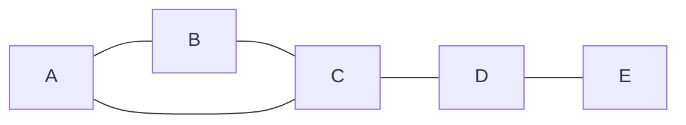
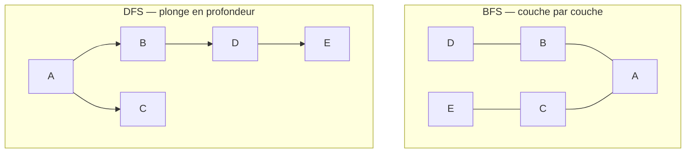

# Théorie des Graphes

Un **graphe** est une structure aussi simple que puissante : des points (sommets) reliés par des traits (arêtes). Inventée par Euler en 1736 pour résoudre une énigme de promenade à Königsberg, la théorie des graphes est aujourd'hui partout — du GPS qui calcule ton itinéraire au moteur de recommandation de Netflix, en passant par les neurones d'un réseau profond.

> [!abstract] Programme
> Définitions, types de graphes, représentations, parcours (BFS, DFS), plus courts chemins (Dijkstra, Bellman-Ford), arbres couvrants minimaux, coloration, planarité. Programme typique de NSI/option informatique en prépa.

## 1. Définitions de base

### 1.1 Graphe non orienté

> [!abstract] Définition — Graphe
> Un **graphe** $G = (V, E)$ est la donnée d'un ensemble fini de **sommets** $V$ (vertices) et d'un ensemble d'**arêtes** $E \subset \{\{u,v\} : u,v \in V\}$.
>
> - $|V| = n$ : ordre du graphe
> - $|E| = m$ : taille du graphe



### 1.2 Vocabulaire

| Terme | Définition |
|---|---|
| **Voisin** | $v$ est voisin de $u$ s'il existe une arête $\{u,v\}$ |
| **Degré** $\deg(v)$ | Nombre d'arêtes incidentes à $v$ |
| **Chemin** | Suite d'arêtes consécutives |
| **Cycle** | Chemin qui revient au sommet de départ |
| **Connexe** | Tout sommet est accessible depuis tout autre |
| **Composante connexe** | Sous-graphe connexe maximal |

> [!important] Lemme des poignées de main (Euler, 1736)
> Dans tout graphe non orienté :
> $$\sum_{v \in V} \deg(v) = 2|E|$$
> *Corollaire* : le nombre de sommets de degré impair est toujours pair.

### 1.3 Graphes orientés (digraphes)

Les arêtes deviennent des **arcs** $(u, v)$ avec un sens. On distingue alors :
- **Degré entrant** $\deg^{-}(v)$ : nombre d'arcs arrivant en $v$
- **Degré sortant** $\deg^{+}(v)$ : nombre d'arcs partant de $v$

## 2. Familles importantes

| Famille | Caractéristique | Exemples d'usage |
|---|---|---|
| **Complet** $K_n$ | toutes les paires de sommets reliées | $\binom{n}{2}$ arêtes |
| **Biparti** | $V$ partitionné en $A \cup B$, arêtes entre $A$ et $B$ uniquement | Affectations, mariages stables |
| **Arbre** | connexe et sans cycle | $n-1$ arêtes pour $n$ sommets |
| **Forêt** | acyclique (union d'arbres) | Structures hiérarchiques |
| **Planaire** | dessinable sans croisement d'arêtes | Circuits imprimés, cartes |
| **DAG** (orienté acyclique) | pas de cycle | Dépendances de tâches, généalogie |
| **Pondéré** | arêtes munies d'un poids | Routage, distances |

> [!example] Théorème d'Euler pour les arbres
> Un graphe à $n$ sommets est un arbre **si et seulement si** il est connexe et possède exactement $n-1$ arêtes.

## 3. Représentations en machine

| Représentation | Espace | Test arête existante | Lister voisins | Quand utiliser |
|---|---|---|---|---|
| **Matrice d'adjacence** | $O(n^2)$ | $O(1)$ | $O(n)$ | Graphes denses, $n$ petit |
| **Liste d'adjacence** | $O(n+m)$ | $O(\deg v)$ | $O(\deg v)$ | Graphes creux (cas le plus fréquent) |

```python
# Liste d'adjacence en Python
graphe = {
    'A': ['B', 'C'],
    'B': ['A', 'C'],
    'C': ['A', 'B', 'D'],
    'D': ['C', 'E'],
    'E': ['D']
}
```

## 4. Parcours de graphes

### 4.1 Parcours en largeur (BFS — Breadth-First Search)

Explore le graphe couche par couche depuis un sommet de départ. Utilise une **file** (FIFO).

```python
from collections import deque

def bfs(graphe, depart):
    visite = {depart}
    file = deque([depart])
    ordre = []
    while file:
        u = file.popleft()
        ordre.append(u)
        for v in graphe[u]:
            if v not in visite:
                visite.add(v)
                file.append(v)
    return ordre
```

**Complexité** : $O(n + m)$.
**Application principale** : plus court chemin en nombre d'arêtes (graphe non pondéré).

### 4.2 Parcours en profondeur (DFS — Depth-First Search)

Plonge le plus loin possible avant de revenir. Utilise une **pile** (ou la récursion).

```python
def dfs(graphe, depart, visite=None):
    if visite is None:
        visite = set()
    visite.add(depart)
    for v in graphe[depart]:
        if v not in visite:
            dfs(graphe, v, visite)
    return visite
```

**Complexité** : $O(n + m)$.
**Applications** :
- Détection de cycles
- Tri topologique (DAG)
- Recherche de composantes (fortement) connexes (Tarjan, Kosaraju)



## 5. Plus courts chemins

### 5.1 Dijkstra (1956)

Plus court chemin depuis une source dans un graphe **à poids positifs**.

> [!important] Algorithme de Dijkstra
> 1. Initialiser $d[s] = 0$ et $d[v] = +\infty$ pour les autres sommets
> 2. À chaque étape, sélectionner le sommet $u$ non visité de distance minimale
> 3. **Relâcher** ses voisins : si $d[u] + w(u,v) < d[v]$, mettre à jour $d[v]$
> 4. Marquer $u$ comme visité ; recommencer

**Complexité** : $O((n+m) \log n)$ avec un tas de priorité.
**Utilisé par** : Google Maps, OSPF (routage Internet), jeux vidéo (pathfinding).

### 5.2 Bellman-Ford

Plus lent ($O(nm)$) mais accepte les **poids négatifs** et détecte les cycles négatifs. Utilisé en protocole de routage RIP.

### 5.3 Floyd-Warshall

Calcule **tous les plus courts chemins entre toutes les paires** en $O(n^3)$. Programmation dynamique élégante : si $d[i][j][k]$ est la distance de $i$ à $j$ via uniquement les sommets $\{1, \dots, k\}$,
$$d[i][j][k] = \min(d[i][j][k-1],\; d[i][k][k-1] + d[k][j][k-1])$$

### 5.4 A\* — guidé par heuristique

Comme Dijkstra mais avec une **heuristique** $h(v)$ qui estime la distance restante. Si $h$ est admissible (n'overestime jamais), A* est optimal. Standard en IA de jeux vidéo, robotique.

## 6. Arbres couvrants minimaux

Sur un graphe pondéré connexe, un **arbre couvrant minimal** (ACM) connecte tous les sommets en minimisant la somme des poids.

| Algorithme | Approche | Complexité |
|---|---|---|
| **Kruskal** | Trier les arêtes, ajouter si elle ne crée pas de cycle (union-find) | $O(m \log m)$ |
| **Prim** | Faire croître l'arbre depuis un sommet, comme Dijkstra | $O((n+m) \log n)$ |

**Application** : conception de réseaux (électriques, télécoms) à coût minimal, clustering.

## 7. Coloration

> [!abstract] Définition
> Une **$k$-coloration** d'un graphe est une assignation d'une couleur parmi $k$ à chaque sommet, telle que deux voisins n'aient jamais la même couleur. Le **nombre chromatique** $\chi(G)$ est le plus petit $k$ possible.

**Applications** :
- Affectation de fréquences radio (canaux non interférents)
- Allocation de registres dans un compilateur
- Planning (deux cours simultanés ne peuvent partager une salle ni un enseignant)

> [!quote] Théorème des quatre couleurs (Appel & Haken, 1976)
> Toute carte planaire peut être coloriée avec au plus 4 couleurs. Première grande démonstration **assistée par ordinateur** — démontrant 1 936 configurations à la main aurait été infaisable.

## 8. Problèmes célèbres et NP-complétude

| Problème | En français | Complexité connue |
|---|---|---|
| **Plus court chemin** | Dijkstra | $P$ |
| **Cycle eulérien** | passer par toutes les **arêtes** une fois | $P$ (Euler : possible ssi tous sommets de degré pair, connexe) |
| **Cycle hamiltonien** | passer par tous les **sommets** une fois | **NP-complet** |
| **Voyageur de commerce (TSP)** | tournée minimale | **NP-difficile** |
| **Coloration optimale** | $\chi(G) = k$ ? | **NP-complet** pour $k \geq 3$ |
| **Couplage maximum** | trouver un couplage de taille max | $P$ (algorithme d'Edmonds) |
| **Flot maximum** | Ford-Fulkerson | $P$ |
| **Clique max** | sous-graphe complet de taille max | **NP-complet** |

> [!warning] Königsberg et Euler
> Le **problème des sept ponts de Königsberg** : peut-on traverser chaque pont exactement une fois ? Euler répond en 1736 : non, car un cycle eulérien exige que **tous les sommets soient de degré pair**. Cette résolution est considérée comme l'**acte de naissance de la théorie des graphes**.

## 9. Planarité et formule d'Euler

> [!important] Formule d'Euler pour les polyèdres / graphes planaires (1750)
> Pour tout graphe planaire connexe à $n$ sommets, $m$ arêtes, $f$ faces (y compris la face externe) :
> $$n - m + f = 2$$

**Conséquence remarquable** : un graphe planaire à $n \geq 3$ sommets a au plus $3n - 6$ arêtes. Donc $K_5$ (5 sommets, 10 arêtes > 9) et $K_{3,3}$ (6 sommets, 9 arêtes mais structure bipartie) ne sont pas planaires — c'est le **théorème de Kuratowski**.

## 10. Applications modernes

| Domaine | Usage |
|---|---|
| **PageRank (Google)** | Vecteur propre d'une matrice stochastique sur le graphe des liens hypertextes |
| **Réseaux sociaux** | Détection de communautés, influence, propagation virale |
| **GPS, navigation** | A*, Dijkstra sur graphe routier |
| **Compilateurs** | Allocation de registres (coloration), dépendances entre instructions |
| **Bio-informatique** | Assemblage de génome (graphe de De Bruijn) |
| **Réseaux de neurones graphiques (GNN)** | Apprentissage sur structures non régulières |
| **Vérification logicielle** | Graphes de flot de contrôle, model checking |
