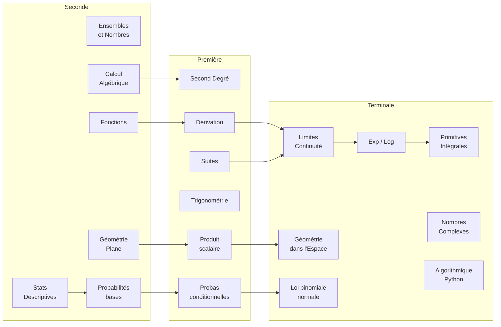
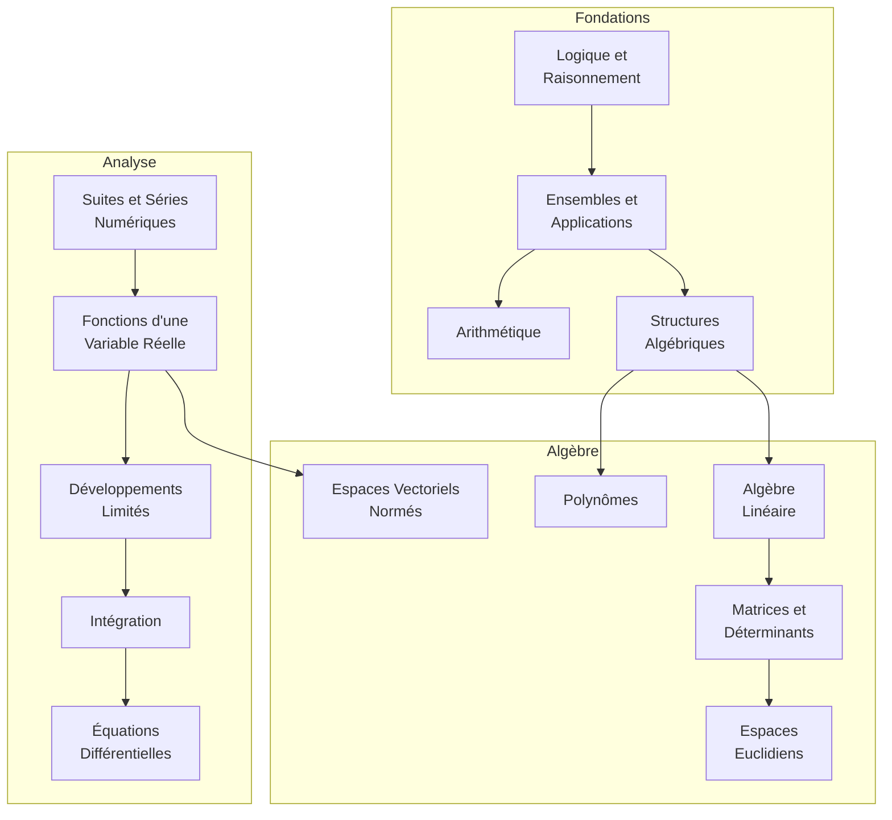
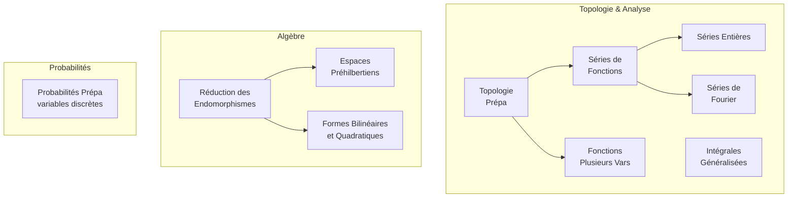

# Mathématiques — Index et Roadmap

Cette note est la **porte d'entrée** de la partie Mathématiques du vault. Elle organise les chapitres par niveau, montre les dépendances entre concepts, et indique l'ordre dans lequel les aborder.

## Structure du dossier

```
Mathematics/
├── Index.md                          (ce fichier)
├── Formulaire.md                     (toutes les formules clés)
├── Méthodes de Démonstration.md      (techniques de preuve)
├── Démonstrations Classiques.md      (preuves canoniques)
├── Comment Montrer Que.md            (recettes pratiques)
├── Glossaire des Symboles.md         (∀ ∃ ⇔ …)
├── Erreurs Classiques.md             (pièges courants)
├── Applications des Mathématiques.md (usages : crypto, ML, physique)
├── Lycée/                            (Seconde — Terminale)
├── Math Sup/                         (MPSI, 1re année prépa)
├── Math Spé/                         (MP, 2e année prépa)
└── Approfondissements/               (sujets hors programme : graphes, etc.)
```

## Roadmap par niveau

### Lycée (Seconde → Terminale)



### Math Sup (MPSI) — Année 1 de prépa



### Math Spé (MP) — Année 2 de prépa



## Dépendances transversales

Quelques notions servent de **pré-requis cachés** à plusieurs chapitres :

| Notion fondatrice | Utilisée dans |
|---|---|
| Logique, quantificateurs | Tous les chapitres rigoureux |
| Récurrence | Suites, polynômes, démonstrations |
| Algèbre linéaire | Matrices, géométrie, réduction, EDP |
| Calcul différentiel | Analyse, physique, optimisation, ML |
| Probabilités | Statistiques, physique stat, finance, IA |

## Sujets hors programme — Approfondissements

Pour aller au-delà du curriculum standard :

- [[Théorie des Graphes]] — algorithmique, réseaux, NSI
- [[Statistiques Inférentielles]] — tests, IC, régression
- [[Combinatoire Avancée]] — bijections, séries génératrices, Ramsey
- [[Géométrie Non-Euclidienne]] — hyperbolique, sphérique, relativité
- [[Théorie des Nombres]] — RSA, Fermat, Riemann
- [[Applications des Mathématiques]] — vue panoramique des usages

## Ressources transversales

Si tu travailles un chapitre, ces notes sont **toujours utiles à avoir sous la main** :

- [[Formulaire]] — toutes les formules essentielles en un coup d'œil
- [[Méthodes de Démonstration]] — comment construire une preuve (récurrence, absurde, etc.)
- [[Démonstrations Classiques]] — preuves canoniques à connaître
- [[Comment Montrer Que]] — recettes pratiques par type de question
- [[Glossaire des Symboles]] — lecture des symboles mathématiques
- [[Erreurs Classiques]] — pièges habituels à éviter

## Conseils d'apprentissage

> [!tip] Comment travailler les maths efficacement
> 1. **Lire la définition deux fois** : une pour la forme, une pour le sens
> 2. **Construire mentalement un exemple** avant de regarder les exemples du cours
> 3. **Refaire les démonstrations** sans les regarder — c'est le seul moyen de les comprendre
> 4. **S'attaquer aux exercices types** en notant ses blocages
> 5. **Espacer les révisions** (système de répétition espacée — le vault dispose du plugin Spaced Repetition)

> [!warning] Les pièges du « j'ai compris »
> Comprendre une démonstration en la lisant ≠ savoir la refaire. Comprendre un concept ≠ savoir l'appliquer. Le vrai test est la **production**, pas la **reconnaissance**.

> [!quote] Paul Halmos
> « La seule façon d'apprendre les mathématiques, c'est de faire des mathématiques. »
