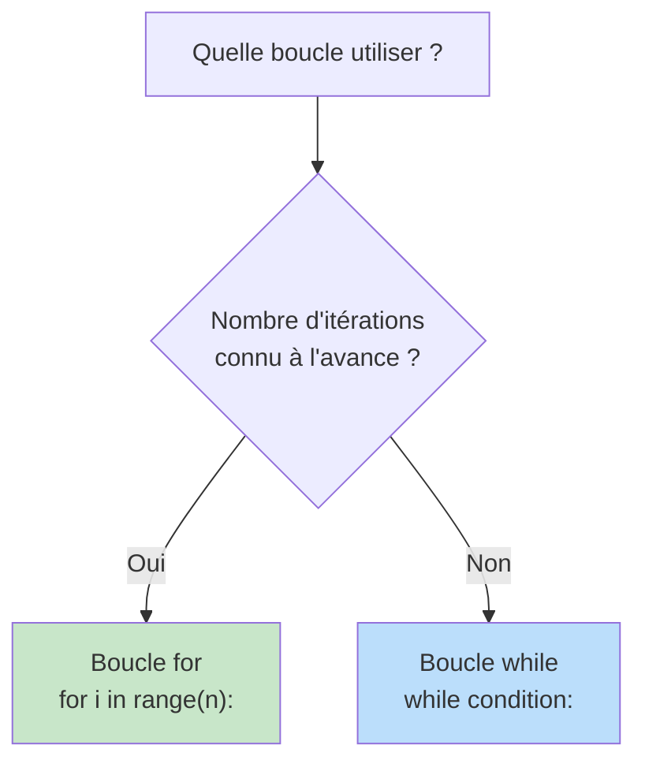
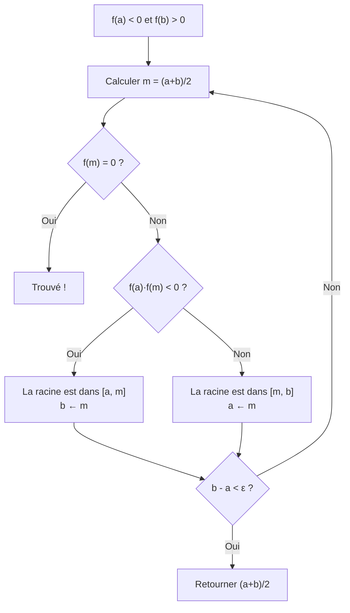

# Algorithmique et Python

L'algorithmique fait partie intégrante du programme de mathématiques au lycée. On utilise Python pour implémenter des algorithmes liés aux notions mathématiques : fonctions, suites, probabilités, statistiques.

> [!quote] Prérequis
> Aucun — ce chapitre accompagne tous les autres.


## Bases de Python

### Variables et types

```python
# Entier
n = 42

# Flottant (nombre décimal)
x = 3.14

# Chaîne de caractères
nom = "Euler"

# Booléen
est_premier = True
```

### Opérations arithmétiques

| Opération | Syntaxe | Exemple | Résultat |
|---|---|---|---|
| Addition | `+` | `3 + 2` | `5` |
| Soustraction | `-` | `7 - 4` | `3` |
| Multiplication | `*` | `3 * 5` | `15` |
| Division | `/` | `7 / 2` | `3.5` |
| Division entière | `//` | `7 // 2` | `3` |
| Modulo (reste) | `%` | `7 % 2` | `1` |
| Puissance | `**` | `2 ** 10` | `1024` |


## Structures conditionnelles

```python
if condition:
    # bloc si vrai
elif autre_condition:
    # bloc si autre condition vraie
else:
    # bloc sinon
```

> [!example] Exemple — Valeur absolue
> ```python
> def valeur_absolue(x):
>     if x >= 0:
>         return x
>     else:
>         return -x
> ```


## Boucles

### Boucle `for` (nombre d'itérations connu)

```python
# Afficher les nombres de 0 à 9
for i in range(10):
    print(i)

# Somme des entiers de 1 à n
def somme(n):
    s = 0
    for i in range(1, n + 1):
        s = s + i
    return s
```

### Boucle `while` (condition d'arrêt)

```python
# Trouver le plus petit n tel que 2^n > 1000
n = 0
while 2**n <= 1000:
    n = n + 1
print(n)  # Affiche 10
```




## Fonctions

```python
def nom_fonction(paramètres):
    """Description de la fonction"""
    # Instructions
    return résultat
```

> [!example] Exemple — Fonction mathématique
> ```python
> def f(x):
>     return x**2 - 3*x + 2
>
> # Évaluation
> print(f(0))   # 2
> print(f(1))   # 0
> print(f(2))   # 0
> ```


## Applications aux mathématiques

### Suites

```python
# Suite arithmétique
def suite_arithmetique(u0, r, n):
    """Calcule u_n pour u_{n+1} = u_n + r"""
    u = u0
    for _ in range(n):
        u = u + r
    return u

# Suite géométrique
def suite_geometrique(u0, q, n):
    """Calcule u_n pour u_{n+1} = u_n * q"""
    u = u0
    for _ in range(n):
        u = u * q
    return u

# Suite récurrente quelconque
def suite_recurrente(u0, f, n):
    """Calcule u_n pour u_{n+1} = f(u_n)"""
    u = u0
    for _ in range(n):
        u = f(u)
    return u
```

> [!tip] Seuil
> Trouver le plus petit $n$ tel que $u_n > M$ :
> ```python
> def seuil(u0, f, M):
>     u = u0
>     n = 0
>     while u <= M:
>         u = f(u)
>         n += 1
>     return n
> ```

### Dichotomie (résolution d'équations)

```python
def dichotomie(f, a, b, epsilon):
    """Trouve x dans [a,b] tel que f(x) ≈ 0
    Condition : f(a) et f(b) de signes opposés"""
    while b - a > epsilon:
        m = (a + b) / 2
        if f(a) * f(m) <= 0:
            b = m
        else:
            a = m
    return (a + b) / 2
```



> [!important] Lien avec le TVI
> La dichotomie est l'implémentation algorithmique du [[Limites et Continuité|théorème des valeurs intermédiaires]].

### Méthode de Newton

```python
def newton(f, df, x0, epsilon, max_iter=100):
    """Résolution de f(x) = 0 par la méthode de Newton
    df = dérivée de f"""
    x = x0
    for _ in range(max_iter):
        x = x - f(x) / df(x)
        if abs(f(x)) < epsilon:
            return x
    return x
```

### Statistiques

```python
def moyenne(liste):
    return sum(liste) / len(liste)

def variance(liste):
    m = moyenne(liste)
    return sum((x - m)**2 for x in liste) / len(liste)

def ecart_type(liste):
    return variance(liste)**0.5
```

### Simulation de probabilités

```python
import random

def simuler_lancers_de(n):
    """Simule n lancers d'un dé à 6 faces"""
    resultats = [0] * 6  # compteurs pour chaque face
    for _ in range(n):
        face = random.randint(1, 6)
        resultats[face - 1] += 1
    # Fréquences
    return [r / n for r in resultats]

# Loi des grands nombres en action :
# Plus n est grand, plus les fréquences → 1/6
```

### Intégration numérique (méthode des rectangles)

```python
def integrale_rectangles(f, a, b, n):
    """Approximation de l'intégrale de f sur [a,b]
    par la méthode des rectangles à gauche"""
    h = (b - a) / n
    s = 0
    for i in range(n):
        s += f(a + i * h)
    return s * h
```

### Tests de primalité

```python
def est_premier(n):
    """Teste si n est un nombre premier"""
    if n < 2:
        return False
    for d in range(2, int(n**0.5) + 1):
        if n % d == 0:
            return False
    return True

def crible_eratosthene(n):
    """Retourne tous les nombres premiers ≤ n"""
    est_p = [True] * (n + 1)
    est_p[0] = est_p[1] = False
    for i in range(2, int(n**0.5) + 1):
        if est_p[i]:
            for j in range(i*i, n + 1, i):
                est_p[j] = False
    return [i for i in range(n + 1) if est_p[i]]
```


## Complexité algorithmique (notion)

> [!abstract] Notion de complexité
> La **complexité** d'un algorithme mesure le nombre d'opérations en fonction de la taille de l'entrée $n$.

| Complexité | Nom | Exemple |
|---|---|---|
| $O(1)$ | Constante | Accès à un élément d'une liste |
| $O(\log n)$ | Logarithmique | Dichotomie |
| $O(n)$ | Linéaire | Recherche séquentielle |
| $O(n \log n)$ | Quasi-linéaire | Tri efficace |
| $O(n^2)$ | Quadratique | Tri par insertion |
| $O(2^n)$ | Exponentielle | Force brute |


## À retenir

> [!important] Les points clés
> 1. `for` quand on connaît le nombre d'itérations, `while` sinon
> 2. **Dichotomie** = version algorithmique du TVI, complexité $O(\log n)$
> 3. Simuler des expériences aléatoires avec `random` pour vérifier la **loi des grands nombres**
> 4. Les suites récurrentes se programment naturellement avec une boucle
