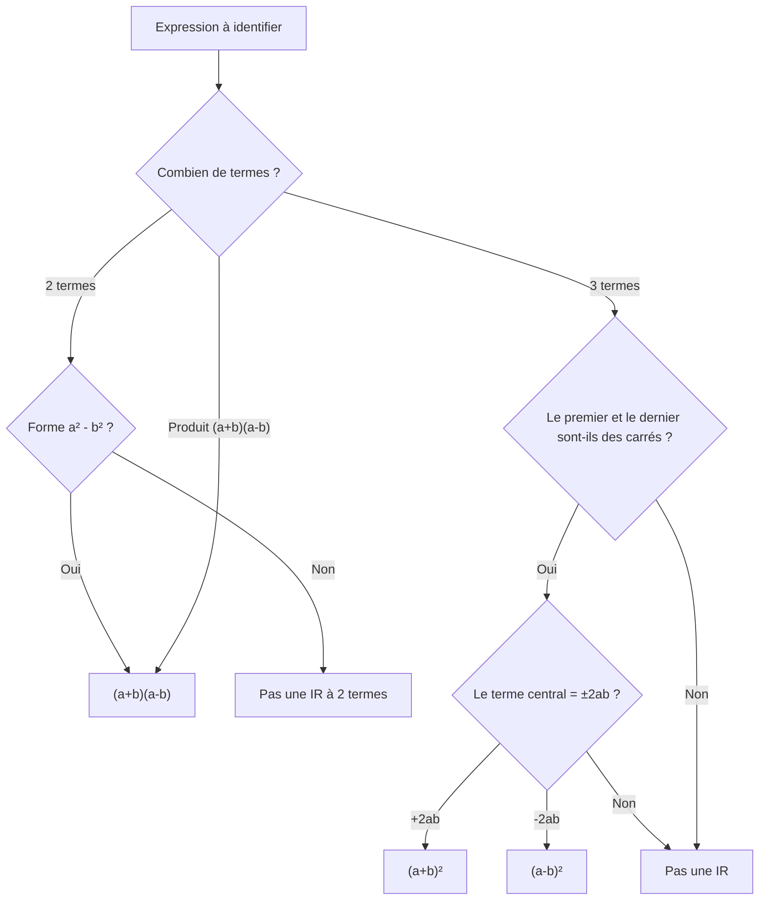
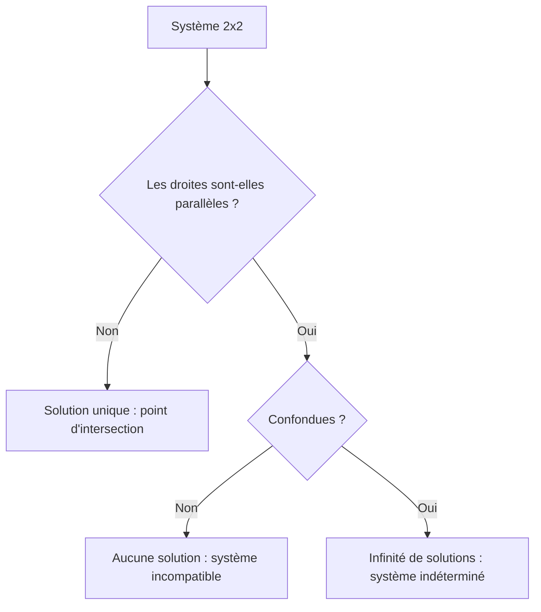

# Calcul Algébrique

Le calcul algébrique est l'outil fondamental pour transformer, simplifier et résoudre des expressions mathématiques. La maîtrise de ces techniques est essentielle pour toute la suite du programme.

## 1. Développer et factoriser

### 1.1 Développer

**Développer**, c'est transformer un produit en somme.

On utilise la **distributivité** de la multiplication par rapport à l'addition :

$$k(a + b) = ka + kb$$

$$k(a - b) = ka - kb$$

Pour un produit de deux facteurs à deux termes (double distributivité) :

$$(a + b)(c + d) = ac + ad + bc + bd$$

> [!example] Exemple : développer $(2x + 3)(x - 5)$
> $$(2x + 3)(x - 5) = 2x \cdot x + 2x \cdot (-5) + 3 \cdot x + 3 \cdot (-5)$$
> $$= 2x^2 - 10x + 3x - 15$$
> $$= 2x^2 - 7x - 15$$

### 1.2 Factoriser

**Factoriser**, c'est transformer une somme en produit. C'est l'opération inverse du développement.

**Mise en facteur commun** : on identifie un facteur commun à tous les termes.

$$ka + kb = k(a + b)$$

> [!example] Exemple : factoriser $6x^3 - 15x^2 + 9x$
> Le facteur commun est $3x$ :
> $$6x^3 - 15x^2 + 9x = 3x(2x^2 - 5x + 3)$$

> [!tip] Méthode pour trouver le facteur commun
> 1. Trouver le PGCD des coefficients.
> 2. Prendre la plus petite puissance de $x$ apparaissant dans chaque terme.
> 3. Le facteur commun est le produit des deux.

## 2. Identités remarquables

Les trois identités remarquables sont des formules incontournables. Elles fonctionnent dans les deux sens : développement et factorisation.

### 2.1 Carré d'une somme

$$\boxed{(a + b)^2 = a^2 + 2ab + b^2}$$

> [!example] Exemple
> $(3x + 5)^2 = (3x)^2 + 2 \cdot 3x \cdot 5 + 5^2 = 9x^2 + 30x + 25$

### 2.2 Carré d'une différence

$$\boxed{(a - b)^2 = a^2 - 2ab + b^2}$$

> [!example] Exemple
> $(2x - 7)^2 = (2x)^2 - 2 \cdot 2x \cdot 7 + 7^2 = 4x^2 - 28x + 49$

### 2.3 Produit somme-différence

$$\boxed{(a + b)(a - b) = a^2 - b^2}$$

> [!example] Exemple (développement)
> $(x + \sqrt{3})(x - \sqrt{3}) = x^2 - (\sqrt{3})^2 = x^2 - 3$

> [!example] Exemple (factorisation)
> $16x^2 - 9 = (4x)^2 - 3^2 = (4x + 3)(4x - 3)$

> [!warning] Erreurs fréquentes
> - $(a + b)^2 \neq a^2 + b^2$ : il manque le double produit $2ab$.
> - $(a - b)^2 \neq a^2 - b^2$ : attention, $a^2 - b^2 = (a+b)(a-b)$ est la troisième identité.

### 2.4 Arbre de décision pour les identités remarquables

## 3. Fractions

### 3.1 Règles de calcul

Pour $b \neq 0$ et $d \neq 0$ :

| Opération | Formule |
|-----------|---------|
| Addition (même dénominateur) | $\frac{a}{b} + \frac{c}{b} = \frac{a+c}{b}$ |
| Addition (dénominateurs différents) | $\frac{a}{b} + \frac{c}{d} = \frac{ad + bc}{bd}$ |
| Multiplication | $\frac{a}{b} \times \frac{c}{d} = \frac{ac}{bd}$ |
| Division | $\frac{a}{b} \div \frac{c}{d} = \frac{a}{b} \times \frac{d}{c} = \frac{ad}{bc}$ |
| Simplification | $\frac{ka}{kb} = \frac{a}{b}$ pour $k \neq 0$ |

> [!tip] Méthode pour additionner des fractions
> 1. Trouver le **dénominateur commun** (PPCM des dénominateurs).
> 2. Multiplier numérateur et dénominateur de chaque fraction pour obtenir ce dénominateur.
> 3. Additionner les numérateurs.
> 4. Simplifier si possible.

> [!example] Exemple : calculer $\frac{3}{4} + \frac{5}{6}$
> Le PPCM de $4$ et $6$ est $12$.
> $$\frac{3}{4} + \frac{5}{6} = \frac{3 \times 3}{4 \times 3} + \frac{5 \times 2}{6 \times 2} = \frac{9}{12} + \frac{10}{12} = \frac{19}{12}$$

### 3.2 Fractions algébriques

Les mêmes règles s'appliquent aux fractions contenant des variables.

> [!example] Exemple : simplifier $\frac{x^2 - 4}{x^2 + 4x + 4}$
> On factorise numérateur et dénominateur :
> - Numérateur : $x^2 - 4 = (x-2)(x+2)$
> - Dénominateur : $x^2 + 4x + 4 = (x+2)^2$
>
> $$\frac{x^2 - 4}{x^2 + 4x + 4} = \frac{(x-2)(x+2)}{(x+2)^2} = \frac{x-2}{x+2} \quad (x \neq -2)$$

## 4. Racines carrées dans les calculs

### 4.1 Simplification de radicaux

Pour simplifier $\sqrt{n}$, on cherche le plus grand carré parfait qui divise $n$.

> [!example] Exemple : simplifier $\sqrt{48}$
> $48 = 16 \times 3$, donc $\sqrt{48} = \sqrt{16 \times 3} = 4\sqrt{3}$

### 4.2 Rationalisation du dénominateur

Il est d'usage d'éliminer les racines carrées au dénominateur.

**Cas simple** : on multiplie numérateur et dénominateur par la racine.

$$\frac{a}{\sqrt{b}} = \frac{a}{\sqrt{b}} \times \frac{\sqrt{b}}{\sqrt{b}} = \frac{a\sqrt{b}}{b}$$

**Cas avec somme/différence** : on utilise la quantité conjuguée.

$$\frac{a}{c + \sqrt{b}} = \frac{a(c - \sqrt{b})}{(c + \sqrt{b})(c - \sqrt{b})} = \frac{a(c - \sqrt{b})}{c^2 - b}$$

> [!example] Exemple : rationaliser $\frac{6}{3 + \sqrt{5}}$
> $$\frac{6}{3 + \sqrt{5}} = \frac{6(3 - \sqrt{5})}{(3 + \sqrt{5})(3 - \sqrt{5})} = \frac{6(3 - \sqrt{5})}{9 - 5} = \frac{6(3 - \sqrt{5})}{4} = \frac{3(3 - \sqrt{5})}{2}$$

## 5. Systèmes d'équations à deux inconnues

### 5.1 Définition

Un système de deux équations à deux inconnues $x$ et $y$ s'écrit :

$$\begin{cases} ax + by = e \\ cx + dy = f \end{cases}$$

Résoudre le système, c'est trouver tous les couples $(x, y)$ qui vérifient **simultanément** les deux équations.

### 5.2 Méthode par substitution

1. Isoler une inconnue dans l'une des équations.
2. Remplacer dans l'autre équation.
3. Résoudre l'équation à une inconnue obtenue.
4. Calculer l'autre inconnue.

> [!example] Exemple : résoudre par substitution
> $$\begin{cases} 2x + y = 7 \\ x - 3y = -4 \end{cases}$$
>
> **Étape 1** : on isole $y$ dans la première équation : $y = 7 - 2x$.
>
> **Étape 2** : on substitue dans la seconde : $x - 3(7 - 2x) = -4$.
>
> **Étape 3** : $x - 21 + 6x = -4 \Rightarrow 7x = 17 \Rightarrow x = \frac{17}{7}$.
>
> **Étape 4** : $y = 7 - 2 \times \frac{17}{7} = \frac{49 - 34}{7} = \frac{15}{7}$.
>
> Solution : $\left(\frac{17}{7},\, \frac{15}{7}\right)$.

### 5.3 Méthode par combinaisons linéaires

1. Multiplier les équations pour obtenir des coefficients opposés pour une inconnue.
2. Additionner les équations pour éliminer cette inconnue.
3. Résoudre et substituer.

> [!example] Exemple : résoudre par combinaisons
> $$\begin{cases} 3x + 2y = 12 \quad (L_1) \\ 5x - 3y = 1 \quad (L_2) \end{cases}$$
>
> Pour éliminer $y$, on calcule $3 \times (L_1) + 2 \times (L_2)$ :
> $$9x + 6y + 10x - 6y = 36 + 2$$
> $$19x = 38 \Rightarrow x = 2$$
>
> On substitue dans $(L_1)$ : $3 \times 2 + 2y = 12 \Rightarrow 2y = 6 \Rightarrow y = 3$.
>
> Solution : $(2,\, 3)$.

### 5.4 Interprétation graphique

Chaque équation linéaire représente une **droite** dans le plan. Le système admet :
- **une unique solution** si les droites sont sécantes (cas général) ;
- **aucune solution** si les droites sont parallèles (non confondues) ;
- **une infinité de solutions** si les droites sont confondues.

## 6. Inéquations

### 6.1 Règles fondamentales

Pour résoudre une inéquation, on applique les mêmes opérations que pour une équation, avec une règle cruciale :

> [!warning] Règle du signe
> Lorsqu'on **multiplie ou divise** les deux membres d'une inéquation par un nombre **négatif**, on **inverse le sens** de l'inégalité.
> $$a < b \quad \xRightarrow{\times (-1)} \quad -a > -b$$

### 6.2 Inéquations du premier degré

> [!example] Exemple : résoudre $3x - 7 \geq 2x + 5$
> $$3x - 7 \geq 2x + 5$$
> $$3x - 2x \geq 5 + 7$$
> $$x \geq 12$$
> L'ensemble solution est $S = [12;\, +\infty[$.

> [!example] Exemple avec changement de sens : résoudre $-4x + 3 > 11$
> $$-4x + 3 > 11$$
> $$-4x > 8$$
> $$x < -2 \quad \text{(on divise par $-4$ : le sens change)}$$
> L'ensemble solution est $S = ]-\infty;\, -2[$.

### 6.3 Inéquations produit et quotient : tableau de signes

Pour résoudre une inéquation de la forme $A(x) \times B(x) \geq 0$ ou $\frac{A(x)}{B(x)} \leq 0$, on utilise un **tableau de signes**.

**Méthode** :
1. Trouver les valeurs qui annulent chaque facteur.
2. Étudier le signe de chaque facteur sur chaque intervalle.
3. Appliquer la règle des signes pour le produit ou le quotient.

> [!example] Exemple : résoudre $(2x - 6)(x + 1) \leq 0$
> Les racines sont $x = 3$ (annule $2x - 6$) et $x = -1$ (annule $x + 1$).
>
> | $x$ | $-\infty$ | | $-1$ | | $3$ | | $+\infty$ |
> |-----|-----------|---|------|---|-----|---|-----------|
> | $2x - 6$ | $-$ | | $-$ | | $0$ | $+$ | |
> | $x + 1$ | $-$ | | $0$ | $+$ | | $+$ | |
> | Produit | $+$ | | $0$ | $-$ | $0$ | $+$ | |
>
> $(2x - 6)(x + 1) \leq 0$ pour $x \in [-1;\, 3]$.

## 7. Exercices types corrigés

### Exercice 1 : Identités remarquables

**Énoncé** : Développer et réduire :
a) $(5x - 3)^2$
b) $(2x + 1)(2x - 1)$
c) $(x + 3)^2 - (x - 3)^2$

> [!example] Correction
> a) $(5x - 3)^2 = 25x^2 - 30x + 9$
>
> b) $(2x + 1)(2x - 1) = 4x^2 - 1$
>
> c) On développe chaque carré :
> $(x + 3)^2 - (x - 3)^2 = (x^2 + 6x + 9) - (x^2 - 6x + 9) = 12x$
>
> **Ou** bien par la différence de carrés avec $a = (x+3)$ et $b = (x-3)$ :
> $= [(x+3) + (x-3)][(x+3) - (x-3)] = 2x \cdot 6 = 12x$

### Exercice 2 : Factorisation

**Énoncé** : Factoriser les expressions suivantes :
a) $x^2 - 6x + 9$
b) $4x^2 - 25$
c) $x^3 - x$

> [!example] Correction
> a) $x^2 - 6x + 9 = x^2 - 2 \cdot x \cdot 3 + 3^2 = (x - 3)^2$
>
> b) $4x^2 - 25 = (2x)^2 - 5^2 = (2x + 5)(2x - 5)$
>
> c) $x^3 - x = x(x^2 - 1) = x(x + 1)(x - 1)$

### Exercice 3 : Système d'équations

**Énoncé** : Deux nombres ont pour somme $53$ et pour différence $17$. Quels sont ces nombres ?

> [!example] Correction
> Posons $x$ le plus grand et $y$ le plus petit.
> $$\begin{cases} x + y = 53 \\ x - y = 17 \end{cases}$$
>
> En additionnant les deux équations : $2x = 70$, donc $x = 35$.
> En substituant : $35 + y = 53$, donc $y = 18$.
>
> Les deux nombres sont $35$ et $18$.
>
> Vérification : $35 + 18 = 53$ et $35 - 18 = 17$.

### Exercice 4 : Inéquation avec tableau de signes

**Énoncé** : Résoudre $\frac{3x + 6}{x - 2} \leq 0$.

> [!example] Correction
> Le numérateur $3x + 6 = 3(x + 2)$ s'annule pour $x = -2$.
> Le dénominateur $x - 2$ s'annule pour $x = 2$. **Valeur interdite** : $x \neq 2$.
>
> Tableau de signes :
>
> | $x$ | $-\infty$ | | $-2$ | | $2$ | | $+\infty$ |
> |-----|-----------|---|------|---|-----|---|-----------|
> | $3x + 6$ | $-$ | | $0$ | $+$ | | $+$ | |
> | $x - 2$ | $-$ | | $-$ | | $0$ | $+$ | |
> | Quotient | $+$ | | $0$ | $-$ | | $+$ | |
>
> $\frac{3x+6}{x-2} \leq 0$ pour $x \in [-2;\, 2[$.
>
> On inclut $-2$ (le quotient y vaut $0$) mais on exclut $2$ (valeur interdite).

### Exercice 5 : Rationalisation

**Énoncé** : Rationaliser et simplifier $\frac{\sqrt{5} + \sqrt{3}}{\sqrt{5} - \sqrt{3}}$.

> [!example] Correction
> On multiplie par la quantité conjuguée :
> $$\frac{\sqrt{5} + \sqrt{3}}{\sqrt{5} - \sqrt{3}} \times \frac{\sqrt{5} + \sqrt{3}}{\sqrt{5} + \sqrt{3}} = \frac{(\sqrt{5} + \sqrt{3})^2}{(\sqrt{5})^2 - (\sqrt{3})^2}$$
>
> Numérateur : $(\sqrt{5} + \sqrt{3})^2 = 5 + 2\sqrt{15} + 3 = 8 + 2\sqrt{15}$
>
> Dénominateur : $5 - 3 = 2$
>
> $$\frac{8 + 2\sqrt{15}}{2} = 4 + \sqrt{15}$$

## 8. À retenir

> [!tip] À retenir
> - **Trois identités remarquables** : $(a \pm b)^2 = a^2 \pm 2ab + b^2$ et $(a+b)(a-b) = a^2 - b^2$.
> - $(a+b)^2 \neq a^2 + b^2$ : ne jamais oublier le double produit.
> - **Factoriser** = transformer en produit ; **développer** = transformer en somme.
> - Pour additionner des fractions, il faut un **dénominateur commun**.
> - Quand on multiplie/divise une inéquation par un **nombre négatif**, on **inverse** le sens.
> - Pour les inéquations produit/quotient, on fait un **tableau de signes**.
> - Les systèmes $2 \times 2$ se résolvent par **substitution** ou **combinaisons linéaires**.

*Voir aussi* : [[Ensembles et Nombres]] | [[Fonctions]] | [[Second Degré]] | [[Dérivation]]
