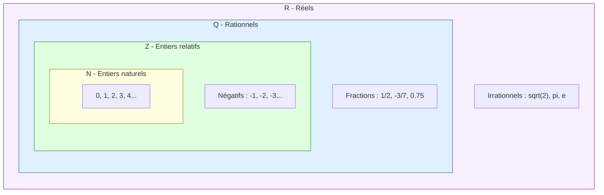

# Ensembles et Nombres

## 1. Les ensembles de nombres

Les nombres que l'on utilise en mathématiques sont organisés en ensembles emboîtés. Chaque ensemble étend le précédent pour répondre à de nouveaux besoins.

### 1.1 Les grands ensembles

| Ensemble | Notation | Description | Exemples |
|----------|----------|-------------|----------|
| Entiers naturels | $\mathbb{N}$ | Nombres pour compter | $0, 1, 2, 3, \ldots$ |
| Entiers relatifs | $\mathbb{Z}$ | Ajout des négatifs | $\ldots, -2, -1, 0, 1, 2, \ldots$ |
| Rationnels | $\mathbb{Q}$ | Fractions $\frac{p}{q}$ avec $q \neq 0$ | $\frac{1}{2},\; -\frac{3}{7},\; 0{,}75$ |
| Réels | $\mathbb{R}$ | Tous les nombres sur la droite | $\sqrt{2},\; \pi,\; e$ |

> [!important] Inclusions des ensembles
> $$\mathbb{N} \subset \mathbb{Z} \subset \mathbb{Q} \subset \mathbb{R}$$
> Tout entier naturel est un entier relatif, tout entier relatif est un rationnel, et tout rationnel est un réel.

### 1.2 Diagramme d'inclusion

### 1.3 Notations complémentaires

- $\mathbb{N}^*$ : entiers naturels **sans le zéro**, c'est-à-dire $\{1, 2, 3, \ldots\}$
- $\mathbb{Z}^*$ : entiers relatifs **sans le zéro**
- $\mathbb{R}^+$ : réels positifs ou nuls
- $\mathbb{R}^-$ : réels négatifs ou nuls
- $\mathbb{R}^*$ : réels non nuls

> [!tip] Comment savoir si un nombre est rationnel ?
> Un nombre est rationnel si et seulement si son écriture décimale est **finie** ou **périodique**.
> - $0{,}333\ldots = \frac{1}{3}$ est rationnel (période 3)
> - $\sqrt{2} = 1{,}41421356\ldots$ est irrationnel (pas de période)

## 2. Intervalles et notation

Un **intervalle** est une partie de $\mathbb{R}$ contenant tous les réels compris entre deux bornes.

### 2.1 Types d'intervalles

| Notation | Ensemble | Description |
|----------|----------|-------------|
| $[a;\, b]$ | $\{x \in \mathbb{R} \mid a \leq x \leq b\}$ | Intervalle fermé |
| $]a;\, b[$ | $\{x \in \mathbb{R} \mid a < x < b\}$ | Intervalle ouvert |
| $[a;\, b[$ | $\{x \in \mathbb{R} \mid a \leq x < b\}$ | Fermé à gauche, ouvert à droite |
| $]a;\, b]$ | $\{x \in \mathbb{R} \mid a < x \leq b\}$ | Ouvert à gauche, fermé à droite |
| $[a;\, +\infty[$ | $\{x \in \mathbb{R} \mid x \geq a\}$ | Semi-droite fermée |
| $]-\infty;\, b]$ | $\{x \in \mathbb{R} \mid x \leq b\}$ | Semi-droite fermée |
| $]-\infty;\, +\infty[$ | $\mathbb{R}$ | La droite réelle entière |

> [!warning] Attention
> Les bornes $+\infty$ et $-\infty$ ne sont **jamais** incluses : on utilise toujours un crochet ouvert de leur côté.

### 2.2 Opérations sur les intervalles

- **Réunion** : $[1;\, 3] \cup [5;\, 7]$ = ensemble des $x$ dans $[1;\, 3]$ **ou** dans $[5;\, 7]$
- **Intersection** : $[1;\, 5] \cap [3;\, 7] = [3;\, 5]$

## 3. Valeur absolue

### 3.1 Définition

> [!important] Définition
> La **valeur absolue** d'un réel $x$, notée $|x|$, est définie par :
> $$|x| = \begin{cases} x & \text{si } x \geq 0 \\ -x & \text{si } x < 0 \end{cases}$$
> Géométriquement, $|x|$ est la **distance** de $x$ à l'origine $0$ sur la droite réelle.

### 3.2 Propriétés fondamentales

Pour tous réels $x, y$ et pour $a > 0$ :

1. $|x| \geq 0$ et $|x| = 0 \iff x = 0$
2. $|xy| = |x| \cdot |y|$
3. $\left|\frac{x}{y}\right| = \frac{|x|}{|y|}$ pour $y \neq 0$
4. **Inégalité triangulaire** : $|x + y| \leq |x| + |y|$

### 3.3 Résolution d'équations et inéquations avec valeur absolue

| Condition | Équivalence |
|-----------|-------------|
| $\|x\| = a$ | $x = a$ ou $x = -a$ |
| $\|x\| \leq a$ | $-a \leq x \leq a$ |
| $\|x\| \geq a$ | $x \leq -a$ ou $x \geq a$ |
| $\|x - c\| \leq a$ | $c - a \leq x \leq c + a$ |

> [!tip] Interprétation géométrique
> $|x - c| \leq a$ signifie que la distance entre $x$ et $c$ est au plus $a$.
> L'ensemble solution est l'intervalle $[c - a;\, c + a]$, centré en $c$ et de rayon $a$.

## 4. Puissances et racines carrées

### 4.1 Puissances entières

Pour $a \in \mathbb{R}$ et $n \in \mathbb{N}^*$ :

$$a^n = \underbrace{a \times a \times \cdots \times a}_{n \text{ fois}}$$

**Conventions** : $a^0 = 1$ (pour $a \neq 0$) et $a^1 = a$.

### 4.2 Règles de calcul sur les puissances

Pour $a, b \in \mathbb{R}$ non nuls et $m, n \in \mathbb{Z}$ :

| Règle | Formule |
|-------|---------|
| Produit de même base | $a^m \times a^n = a^{m+n}$ |
| Quotient de même base | $\frac{a^m}{a^n} = a^{m-n}$ |
| Puissance de puissance | $(a^m)^n = a^{m \times n}$ |
| Puissance d'un produit | $(ab)^n = a^n \cdot b^n$ |
| Puissance d'un quotient | $\left(\frac{a}{b}\right)^n = \frac{a^n}{b^n}$ |
| Exposant négatif | $a^{-n} = \frac{1}{a^n}$ |

> [!example] Exemple : simplifier $\frac{2^5 \times 2^3}{2^4}$
> $$\frac{2^5 \times 2^3}{2^4} = \frac{2^{5+3}}{2^4} = \frac{2^8}{2^4} = 2^{8-4} = 2^4 = 16$$

### 4.3 Racines carrées

> [!important] Définition
> Pour tout réel $a \geq 0$, la **racine carrée** de $a$, notée $\sqrt{a}$, est l'unique réel **positif** dont le carré vaut $a$ :
> $$\sqrt{a} \geq 0 \quad \text{et} \quad (\sqrt{a})^2 = a$$

**Propriétés** (pour $a \geq 0$ et $b > 0$) :

- $\sqrt{a \times b} = \sqrt{a} \times \sqrt{b}$
- $\sqrt{\frac{a}{b}} = \frac{\sqrt{a}}{\sqrt{b}}$
- $\sqrt{a^2} = |a|$ (valeur absolue de $a$, car $a$ peut être négatif)

> [!warning] Erreurs fréquentes
> - $\sqrt{a + b} \neq \sqrt{a} + \sqrt{b}$ en général. Contre-exemple : $\sqrt{9 + 16} = \sqrt{25} = 5 \neq 3 + 4 = 7$.
> - $\sqrt{a^2} = |a|$ et non pas $a$. Par exemple $\sqrt{(-3)^2} = \sqrt{9} = 3 = |-3|$.

> [!example] Exemple : simplifier $\sqrt{72}$
> $$\sqrt{72} = \sqrt{36 \times 2} = \sqrt{36} \times \sqrt{2} = 6\sqrt{2}$$

## 5. Nombres premiers

### 5.1 Définition

> [!important] Définition
> Un entier naturel $p \geq 2$ est dit **premier** s'il n'admet exactement que deux diviseurs : $1$ et lui-même.

Les premiers nombres premiers sont : $2, 3, 5, 7, 11, 13, 17, 19, 23, 29, 31, \ldots$

> [!tip] Remarque
> $2$ est le seul nombre premier pair. Tout nombre premier supérieur à $2$ est impair.
> $1$ n'est **pas** un nombre premier (il n'a qu'un seul diviseur).

### 5.2 Théorème fondamental de l'arithmétique

> [!important] Théorème
> Tout entier naturel $n \geq 2$ se décompose de manière **unique** (à l'ordre près) en un produit de facteurs premiers.

> [!example] Exemple : décomposer $360$
> $$360 = 2 \times 180 = 2 \times 2 \times 90 = 2^2 \times 2 \times 45 = 2^3 \times 45 = 2^3 \times 9 \times 5 = 2^3 \times 3^2 \times 5$$

### 5.3 Crible d'Ératosthène

Pour trouver tous les nombres premiers jusqu'à $n$ :
1. Écrire tous les entiers de $2$ à $n$.
2. Le premier nombre non barré ($2$) est premier. Barrer tous ses multiples.
3. Passer au nombre suivant non barré ($3$) et barrer ses multiples.
4. Répéter jusqu'à avoir traité tous les nombres $\leq \sqrt{n}$.

## 6. Divisibilité

### 6.1 Définition

> [!important] Définition
> Soient $a \in \mathbb{Z}$ et $b \in \mathbb{Z}^*$. On dit que $b$ **divise** $a$ (noté $b \mid a$) s'il existe un entier $k \in \mathbb{Z}$ tel que :
> $$a = k \times b$$
> On dit alors que $a$ est un **multiple** de $b$, ou que $b$ est un **diviseur** de $a$.

### 6.2 Critères de divisibilité

| Diviseur | Critère |
|----------|---------|
| $2$ | Le chiffre des unités est pair ($0, 2, 4, 6, 8$) |
| $3$ | La somme des chiffres est divisible par $3$ |
| $4$ | Le nombre formé par les deux derniers chiffres est divisible par $4$ |
| $5$ | Le chiffre des unités est $0$ ou $5$ |
| $9$ | La somme des chiffres est divisible par $9$ |
| $10$ | Le chiffre des unités est $0$ |

> [!example] Exemple : $1\,764$ est-il divisible par $3$ ? par $4$ ?
> - Somme des chiffres : $1 + 7 + 6 + 4 = 18$. Or $18$ est divisible par $3$, donc $1\,764$ est divisible par $3$.
> - Deux derniers chiffres : $64$. Or $64 = 16 \times 4$, donc $1\,764$ est divisible par $4$.

### 6.3 Division euclidienne

> [!important] Théorème de la division euclidienne
> Pour tout entier $a \in \mathbb{Z}$ et tout entier $b \in \mathbb{N}^*$, il existe un **unique** couple $(q, r) \in \mathbb{Z} \times \mathbb{N}$ tel que :
> $$a = b \times q + r \quad \text{avec} \quad 0 \leq r < b$$
> $q$ est le **quotient** et $r$ le **reste** de la division euclidienne de $a$ par $b$.

> [!example] Exemple : division euclidienne de $157$ par $12$
> $$157 = 12 \times 13 + 1$$
> Donc $q = 13$ et $r = 1$. On a bien $0 \leq 1 < 12$.

### 6.4 PGCD et PPCM

- Le **PGCD** (plus grand commun diviseur) de $a$ et $b$ est le plus grand entier qui divise à la fois $a$ et $b$.
- Le **PPCM** (plus petit commun multiple) de $a$ et $b$ est le plus petit entier positif qui est multiple de $a$ et de $b$.

**Relation fondamentale** : pour $a, b \in \mathbb{N}^*$ :

$$\text{PGCD}(a, b) \times \text{PPCM}(a, b) = a \times b$$

> [!example] Exemple : PGCD(24, 36)
> Décompositions : $24 = 2^3 \times 3$ et $36 = 2^2 \times 3^2$.
> On prend les puissances minimales des facteurs communs :
> $$\text{PGCD}(24, 36) = 2^2 \times 3 = 12$$
> $$\text{PPCM}(24, 36) = 2^3 \times 3^2 = 72$$
> Vérification : $12 \times 72 = 864 = 24 \times 36$

## 7. Exercices types corrigés

### Exercice 1 : Appartenance aux ensembles

**Énoncé** : Indiquer le plus petit ensemble de nombres auquel appartiennent les nombres suivants :
$7$ ; $-3$ ; $\frac{2}{5}$ ; $\sqrt{9}$ ; $\sqrt{5}$ ; $\pi$

> [!example] Correction
> - $7 \in \mathbb{N}$ (entier naturel)
> - $-3 \in \mathbb{Z}$ (entier relatif, pas naturel car négatif)
> - $\frac{2}{5} = 0{,}4 \in \mathbb{Q}$ (rationnel, pas entier)
> - $\sqrt{9} = 3 \in \mathbb{N}$ (entier naturel)
> - $\sqrt{5} \in \mathbb{R} \setminus \mathbb{Q}$ (irrationnel)
> - $\pi \in \mathbb{R} \setminus \mathbb{Q}$ (irrationnel)

### Exercice 2 : Intervalles

**Énoncé** : Résoudre $|2x - 3| \leq 5$ et exprimer la solution sous forme d'intervalle.

> [!example] Correction
> $|2x - 3| \leq 5$ équivaut à $-5 \leq 2x - 3 \leq 5$.
>
> On ajoute $3$ partout :
> $$-5 + 3 \leq 2x \leq 5 + 3$$
> $$-2 \leq 2x \leq 8$$
>
> On divise par $2$ :
> $$-1 \leq x \leq 4$$
>
> L'ensemble solution est $S = [-1;\, 4]$.

### Exercice 3 : Simplification de racines carrées

**Énoncé** : Simplifier $A = 3\sqrt{50} - 2\sqrt{18} + \sqrt{8}$.

> [!example] Correction
> On décompose chaque radicande :
> - $\sqrt{50} = \sqrt{25 \times 2} = 5\sqrt{2}$
> - $\sqrt{18} = \sqrt{9 \times 2} = 3\sqrt{2}$
> - $\sqrt{8} = \sqrt{4 \times 2} = 2\sqrt{2}$
>
> Donc :
> $$A = 3 \times 5\sqrt{2} - 2 \times 3\sqrt{2} + 2\sqrt{2} = 15\sqrt{2} - 6\sqrt{2} + 2\sqrt{2} = 11\sqrt{2}$$

### Exercice 4 : Décomposition en facteurs premiers

**Énoncé** : Décomposer $2\,520$ en produit de facteurs premiers, puis en déduire le nombre de diviseurs de $2\,520$.

> [!example] Correction
> Décomposition :
> $$2\,520 = 2 \times 1\,260 = 2^2 \times 630 = 2^3 \times 315 = 2^3 \times 3 \times 105 = 2^3 \times 3^2 \times 35 = 2^3 \times 3^2 \times 5 \times 7$$
>
> Le nombre de diviseurs d'un entier $n = p_1^{\alpha_1} \times \cdots \times p_k^{\alpha_k}$ est :
> $$d(n) = (\alpha_1 + 1)(\alpha_2 + 1) \cdots (\alpha_k + 1)$$
>
> Donc le nombre de diviseurs de $2\,520$ est :
> $$d(2\,520) = (3+1)(2+1)(1+1)(1+1) = 4 \times 3 \times 2 \times 2 = 48$$

### Exercice 5 : PGCD par l'algorithme d'Euclide

**Énoncé** : Calculer $\text{PGCD}(252, 198)$ par l'algorithme d'Euclide.

> [!example] Correction
> On applique des divisions euclidiennes successives :
> $$252 = 198 \times 1 + 54$$
> $$198 = 54 \times 3 + 36$$
> $$54 = 36 \times 1 + 18$$
> $$36 = 18 \times 2 + 0$$
>
> Le dernier reste non nul est $18$, donc $\text{PGCD}(252, 198) = 18$.

## 8. À retenir

> [!tip] À retenir
> - Les ensembles de nombres sont emboîtés : $\mathbb{N} \subset \mathbb{Z} \subset \mathbb{Q} \subset \mathbb{R}$.
> - Un nombre est rationnel si et seulement si son développement décimal est fini ou périodique.
> - $|x - a| \leq r$ signifie $x \in [a - r;\, a + r]$.
> - $\sqrt{a^2} = |a|$ (et non pas $a$).
> - $\sqrt{a+b} \neq \sqrt{a} + \sqrt{b}$.
> - Tout entier $\geq 2$ se décompose de manière unique en produit de facteurs premiers.
> - L'algorithme d'Euclide permet de calculer le PGCD de deux entiers.

*Voir aussi* : [[Calcul Algébrique]] | [[Fonctions]] | [[Second Degré]]
