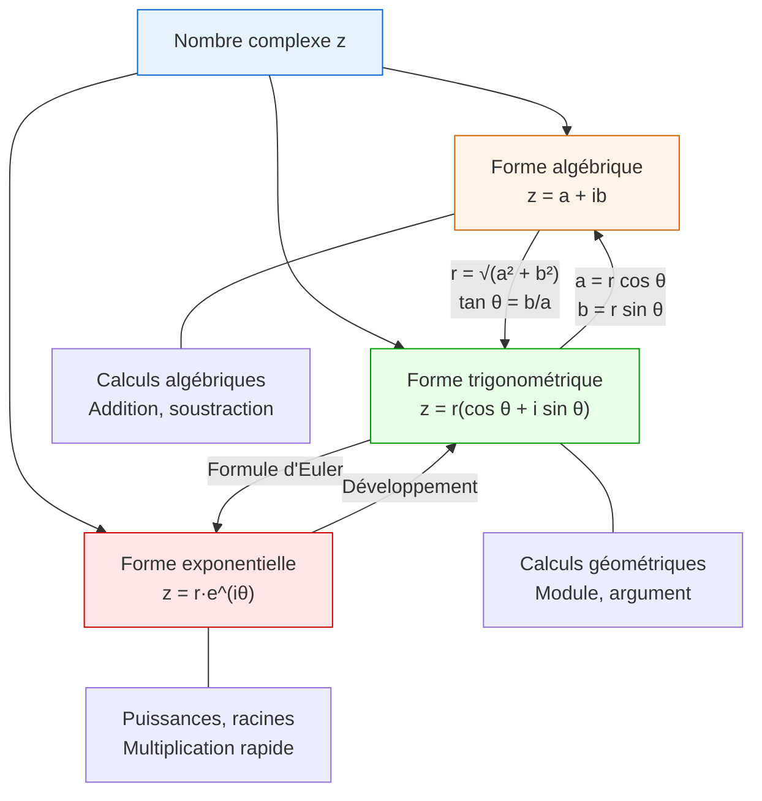

# Nombres Complexes

> [!tip] Pourquoi les nombres complexes ?
> Les nombres complexes sont nés d'un besoin : résoudre **toutes** les équations polynomiales. L'équation $x^2 + 1 = 0$ n'a pas de solution dans $\mathbb{R}$, mais elle en a deux dans $\mathbb{C}$ : $i$ et $-i$. Les nombres complexes interviennent en physique (électricité, mécanique quantique), en géométrie, et dans de nombreuses branches des [[Index|mathématiques]].

## 1. L'ensemble $\mathbb{C}$ et la forme algébrique

### 1.1 Définition du nombre imaginaire $i$

On introduit un nombre $i$ tel que :

$$i^2 = -1$$

> [!important] Définition : Nombre complexe
> Un **nombre complexe** est un nombre de la forme :
> $$z = a + ib$$
> où $a \in \mathbb{R}$ et $b \in \mathbb{R}$.
> - $a = \text{Re}(z)$ est la **partie réelle** de $z$.
> - $b = \text{Im}(z)$ est la **partie imaginaire** de $z$.
> - Cette écriture est appelée la **forme algébrique** de $z$.

L'ensemble des nombres complexes est noté $\mathbb{C}$. On a l'inclusion :

$$\mathbb{N} \subset \mathbb{Z} \subset \mathbb{Q} \subset \mathbb{R} \subset \mathbb{C}$$

> [!warning] Attention
> La partie imaginaire $\text{Im}(z)$ est un **nombre réel**, pas un nombre imaginaire. Pour $z = 3 + 5i$, on a $\text{Im}(z) = 5$ (et non $5i$).

### 1.2 Égalité de deux nombres complexes

Deux nombres complexes $z_1 = a_1 + ib_1$ et $z_2 = a_2 + ib_2$ sont égaux si et seulement si :

$$a_1 = a_2 \quad \text{et} \quad b_1 = b_2$$

C'est le principe d'**identification des parties réelle et imaginaire**.

### 1.3 Puissances de $i$

Les puissances de $i$ sont cycliques de période 4 :

| $n$ | $i^0$ | $i^1$ | $i^2$ | $i^3$ | $i^4$ | $i^5$ | $i^6$ | $i^7$ |
|-----|-------|-------|-------|-------|-------|-------|-------|-------|
| $i^n$ | $1$ | $i$ | $-1$ | $-i$ | $1$ | $i$ | $-1$ | $-i$ |

Règle générale : pour tout $n \in \mathbb{Z}$, on effectue la division euclidienne de $n$ par $4$ : $n = 4q + r$, alors $i^n = i^r$.

## 2. Le plan complexe

### 2.1 Affixe d'un point

> [!important] Définition : Plan complexe
> On munit le plan d'un repère orthonormé $(O, \vec{u}, \vec{v})$.
> - L'axe des abscisses est appelé **axe réel**.
> - L'axe des ordonnées est appelé **axe imaginaire**.
> - Le plan ainsi muni est appelé **plan complexe** (ou plan d'Argand-Gauss).
>
> À tout nombre complexe $z = a + ib$ on associe le point $M(a, b)$ du plan. On dit que $z$ est l'**affixe** du point $M$, et que $M$ est l'**image** de $z$.

De même, le vecteur $\vec{w}$ de coordonnées $(a, b)$ a pour affixe $z = a + ib$.

### 2.2 Nombres réels et imaginaires purs dans le plan

- Si $b = 0$ : $z = a$ est réel, le point $M$ est sur l'axe réel.
- Si $a = 0$ : $z = ib$ est **imaginaire pur**, le point $M$ est sur l'axe imaginaire.

## 3. Conjugué et module

### 3.1 Conjugué

> [!important] Définition : Conjugué
> Le **conjugué** de $z = a + ib$ est le nombre complexe :
> $$\bar{z} = a - ib$$
> Géométriquement, le point d'affixe $\bar{z}$ est le symétrique de $M(z)$ par rapport à l'axe réel.

**Propriétés du conjugué :**

Pour tous $z, z_1, z_2 \in \mathbb{C}$ :

1. $\overline{z_1 + z_2} = \bar{z_1} + \bar{z_2}$
2. $\overline{z_1 \cdot z_2} = \bar{z_1} \cdot \bar{z_2}$
3. $\overline{\left(\frac{z_1}{z_2}\right)} = \frac{\bar{z_1}}{\bar{z_2}}$ (pour $z_2 \neq 0$)
4. $\bar{\bar{z}} = z$
5. $z + \bar{z} = 2\,\text{Re}(z)$
6. $z - \bar{z} = 2i\,\text{Im}(z)$
7. $z \cdot \bar{z} = a^2 + b^2 \in \mathbb{R}^+$
8. $z \in \mathbb{R} \iff z = \bar{z}$
9. $z$ est imaginaire pur $\iff z = -\bar{z}$

### 3.2 Module

> [!important] Définition : Module
> Le **module** de $z = a + ib$ est le réel positif :
> $$|z| = \sqrt{a^2 + b^2} = \sqrt{z \cdot \bar{z}}$$
> Géométriquement, $|z|$ est la distance du point $M(z)$ à l'origine $O$ :
> $$|z| = OM$$

**Propriétés du module :**

Pour tous $z, z_1, z_2 \in \mathbb{C}$ :

1. $|z| = 0 \iff z = 0$
2. $|z| = |\bar{z}|$
3. $|z_1 \cdot z_2| = |z_1| \cdot |z_2|$
4. $\left|\frac{z_1}{z_2}\right| = \frac{|z_1|}{|z_2|}$ (pour $z_2 \neq 0$)
5. $|z^n| = |z|^n$
6. **Inégalité triangulaire** : $|z_1 + z_2| \leq |z_1| + |z_2|$
7. $|z_1 - z_2|$ est la distance entre les points d'affixe $z_1$ et $z_2$.

## 4. Opérations sur les nombres complexes

### 4.1 Addition et soustraction

Si $z_1 = a_1 + ib_1$ et $z_2 = a_2 + ib_2$ :

$$z_1 + z_2 = (a_1 + a_2) + i(b_1 + b_2)$$

> [!tip] Interprétation géométrique
> L'addition des affixes correspond à l'addition des vecteurs : c'est une **translation**. Si $z' = z + z_0$, le point $M'$ est l'image de $M$ par la translation de vecteur d'affixe $z_0$.

### 4.2 Multiplication

$$z_1 \cdot z_2 = (a_1 a_2 - b_1 b_2) + i(a_1 b_2 + a_2 b_1)$$

On développe en utilisant $i^2 = -1$.

> [!example] Exemple
> $(2 + 3i)(1 - 4i) = 2 \cdot 1 + 2 \cdot (-4i) + 3i \cdot 1 + 3i \cdot (-4i)$
> $= 2 - 8i + 3i - 12i^2$
> $= 2 - 5i - 12(-1) = 14 - 5i$

### 4.3 Division

Pour diviser par $z_2 \neq 0$, on multiplie numérateur et dénominateur par le conjugué de $z_2$ :

$$\frac{z_1}{z_2} = \frac{z_1 \cdot \bar{z_2}}{z_2 \cdot \bar{z_2}} = \frac{z_1 \cdot \bar{z_2}}{|z_2|^2}$$

> [!example] Exemple
> $$\frac{3 + i}{1 - 2i} = \frac{(3+i)(1+2i)}{(1-2i)(1+2i)} = \frac{3 + 6i + i + 2i^2}{1 + 4} = \frac{1 + 7i}{5} = \frac{1}{5} + \frac{7}{5}i$$

### 4.4 Inverse

$$\frac{1}{z} = \frac{\bar{z}}{|z|^2}$$

## 5. Les différentes formes d'un nombre complexe

## 6. Forme trigonométrique

### 6.1 Argument d'un nombre complexe

> [!important] Définition : Argument
> Soit $z \neq 0$ un nombre complexe de module $r = |z|$ et d'image $M$ dans le plan complexe. L'**argument** de $z$, noté $\arg(z)$, est la mesure (en radians) de l'angle :
> $$\arg(z) = \left(\vec{u}, \overrightarrow{OM}\right) \pmod{2\pi}$$

L'argument est défini **modulo $2\pi$**. On note $\arg(z) \equiv \theta \pmod{2\pi}$ ou $\arg(z) = \theta\ [2\pi]$.

### 6.2 Détermination de l'argument

Si $z = a + ib$ avec $r = |z|$ :

$$\cos\theta = \frac{a}{r}, \quad \sin\theta = \frac{b}{r}$$

> [!warning] Attention
> Utiliser $\tan\theta = \frac{b}{a}$ ne suffit pas : il faut aussi vérifier les signes de $\cos\theta$ et $\sin\theta$ pour déterminer le bon quadrant.

**Arguments remarquables :**

| $z$ | $1$ | $-1$ | $i$ | $-i$ | $1+i$ | $1-i$ |
|-----|-----|------|-----|------|-------|-------|
| $\arg(z)$ | $0$ | $\pi$ | $\frac{\pi}{2}$ | $-\frac{\pi}{2}$ | $\frac{\pi}{4}$ | $-\frac{\pi}{4}$ |

### 6.3 Écriture trigonométrique

> [!important] Définition : Forme trigonométrique
> Tout nombre complexe $z \neq 0$ s'écrit :
> $$z = r(\cos\theta + i\sin\theta)$$
> où $r = |z| > 0$ et $\theta = \arg(z)$.

**Propriétés de l'argument :**

Pour $z_1, z_2 \neq 0$ :

1. $\arg(z_1 z_2) = \arg(z_1) + \arg(z_2) \pmod{2\pi}$
2. $\arg\left(\frac{z_1}{z_2}\right) = \arg(z_1) - \arg(z_2) \pmod{2\pi}$
3. $\arg(z^n) = n \cdot \arg(z) \pmod{2\pi}$
4. $\arg(\bar{z}) = -\arg(z) \pmod{2\pi}$

### 6.4 Multiplication en forme trigonométrique

Si $z_1 = r_1(\cos\theta_1 + i\sin\theta_1)$ et $z_2 = r_2(\cos\theta_2 + i\sin\theta_2)$ :

$$z_1 z_2 = r_1 r_2 \left[\cos(\theta_1 + \theta_2) + i\sin(\theta_1 + \theta_2)\right]$$

> [!tip] Interprétation géométrique
> Multiplier par $z_2$ revient à effectuer une **rotation** d'angle $\arg(z_2)$ combinée à une **homothétie** de rapport $|z_2|$ centrée en $O$.

## 7. Forme exponentielle et formule d'Euler

### 7.1 Formule d'Euler

> [!important] Théorème : Formule d'Euler
> Pour tout $\theta \in \mathbb{R}$ :
> $$e^{i\theta} = \cos\theta + i\sin\theta$$

Cette formule établit le lien fondamental entre la fonction exponentielle et les fonctions trigonométriques.

**Conséquences immédiates :**

$$\cos\theta = \frac{e^{i\theta} + e^{-i\theta}}{2}, \quad \sin\theta = \frac{e^{i\theta} - e^{-i\theta}}{2i}$$

**Cas particuliers célèbres :**

- $e^{i\pi} = -1$ (identité d'Euler : $e^{i\pi} + 1 = 0$)
- $e^{i\pi/2} = i$
- $e^{2i\pi} = 1$

### 7.2 Forme exponentielle

> [!important] Définition : Forme exponentielle
> Tout nombre complexe $z \neq 0$ de module $r$ et d'argument $\theta$ s'écrit :
> $$z = r\,e^{i\theta}$$

> [!example] Exemple : Passage entre les formes
> Soit $z = 1 + i\sqrt{3}$.
>
> **Forme algébrique :** $z = 1 + i\sqrt{3}$ (donnée).
>
> **Module :** $|z| = \sqrt{1^2 + (\sqrt{3})^2} = \sqrt{1+3} = 2$
>
> **Argument :** $\cos\theta = \frac{1}{2}$, $\sin\theta = \frac{\sqrt{3}}{2}$, donc $\theta = \frac{\pi}{3}$.
>
> **Forme trigonométrique :** $z = 2\left(\cos\frac{\pi}{3} + i\sin\frac{\pi}{3}\right)$
>
> **Forme exponentielle :** $z = 2\,e^{i\pi/3}$

## 8. Formule de Moivre

> [!important] Théorème : Formule de Moivre
> Pour tout $\theta \in \mathbb{R}$ et tout $n \in \mathbb{Z}$ :
> $$(\cos\theta + i\sin\theta)^n = \cos(n\theta) + i\sin(n\theta)$$
> Ou de manière équivalente : $(e^{i\theta})^n = e^{in\theta}$

### Application : linéarisation

La formule de Moivre, combinée à la formule du binôme, permet de **linéariser** les puissances de $\cos\theta$ et $\sin\theta$.

> [!example] Exemple : Exprimer $\cos(3\theta)$ en fonction de $\cos\theta$
> D'après la formule de Moivre :
> $\cos(3\theta) + i\sin(3\theta) = (\cos\theta + i\sin\theta)^3$
>
> En développant avec le binôme de Newton :
> $= \cos^3\theta + 3i\cos^2\theta\sin\theta + 3i^2\cos\theta\sin^2\theta + i^3\sin^3\theta$
> $= \cos^3\theta - 3\cos\theta\sin^2\theta + i(3\cos^2\theta\sin\theta - \sin^3\theta)$
>
> Par identification de la partie réelle :
> $$\cos(3\theta) = \cos^3\theta - 3\cos\theta\sin^2\theta = 4\cos^3\theta - 3\cos\theta$$

## 9. Racines $n$-ièmes de l'unité

### 9.1 Définition et calcul

> [!important] Théorème : Racines $n$-ièmes de l'unité
> Les solutions de l'équation $z^n = 1$ dans $\mathbb{C}$ sont les $n$ nombres complexes :
> $$\omega_k = e^{2ik\pi/n}, \quad k \in \{0, 1, 2, \ldots, n-1\}$$
> On note souvent $\omega = e^{2i\pi/n}$ la racine primitive, et alors $\omega_k = \omega^k$.

### 9.2 Propriétés géométriques

Les racines $n$-ièmes de l'unité forment un **polygone régulier** à $n$ côtés inscrit dans le cercle unité, avec un sommet en $z = 1$.

### 9.3 Somme des racines

$$\sum_{k=0}^{n-1} \omega^k = 0$$

Cette propriété est fondamentale. Elle découle de la factorisation :

$$z^n - 1 = (z-1)(z^{n-1} + z^{n-2} + \cdots + z + 1)$$

> [!example] Exemple : Racines cubiques de l'unité ($n = 3$)
> Les solutions de $z^3 = 1$ sont :
> - $\omega_0 = 1$
> - $\omega_1 = e^{2i\pi/3} = -\frac{1}{2} + i\frac{\sqrt{3}}{2}$
> - $\omega_2 = e^{4i\pi/3} = -\frac{1}{2} - i\frac{\sqrt{3}}{2}$
>
> Elles forment un triangle équilatéral inscrit dans le cercle unité.
>
> On vérifie : $1 + \omega_1 + \omega_2 = 1 - \frac{1}{2} + i\frac{\sqrt{3}}{2} - \frac{1}{2} - i\frac{\sqrt{3}}{2} = 0$ ✓

### 9.4 Racines $n$-ièmes d'un nombre complexe quelconque

> [!important] Théorème
> Les solutions de $z^n = z_0$ où $z_0 = r_0 e^{i\theta_0}$ ($z_0 \neq 0$) sont :
> $$z_k = r_0^{1/n}\, e^{i(\theta_0 + 2k\pi)/n}, \quad k \in \{0, 1, \ldots, n-1\}$$

## 10. Interprétation géométrique des opérations

### 10.1 Translation

La transformation $z \mapsto z + b$ (où $b \in \mathbb{C}$) est la **translation** de vecteur d'affixe $b$.

### 10.2 Homothétie

La transformation $z \mapsto \lambda z$ (où $\lambda \in \mathbb{R}^*$) est l'**homothétie** de centre $O$ et de rapport $\lambda$.

### 10.3 Rotation

La transformation $z \mapsto e^{i\alpha} z$ (où $\alpha \in \mathbb{R}$) est la **rotation** de centre $O$ et d'angle $\alpha$.

### 10.4 Similitude directe

La transformation $z \mapsto az + b$ (où $a, b \in \mathbb{C}$, $a \neq 0$) est une **similitude directe** :
- de rapport $|a|$ (homothétie)
- d'angle $\arg(a)$ (rotation)
- suivie d'une translation de vecteur d'affixe $b$.

> [!tip] Résumé des transformations
> | Transformation | Expression | Module | Argument |
> |---|---|---|---|
> | Translation | $z' = z + b$ | conservé (distances) | — |
> | Rotation centre $O$ | $z' = e^{i\alpha} z$ | $\|z'\| = \|z\|$ | $\arg(z') = \arg(z) + \alpha$ |
> | Homothétie centre $O$ | $z' = \lambda z$ | $\|z'\| = \|\lambda\| \cdot \|z\|$ | argument conservé ou $+\pi$ |
> | Similitude | $z' = az + b$ | $\|a\| \cdot \|z\| + \ldots$ | combinaison |

## 11. Équations dans $\mathbb{C}$

### 11.1 Équation du second degré

Soit l'équation $az^2 + bz + c = 0$ avec $a, b, c \in \mathbb{R}$ et $a \neq 0$.

On calcule le discriminant $\Delta = b^2 - 4ac$.

> [!important] Les trois cas
> **Cas 1 : $\Delta > 0$** — Deux solutions réelles distinctes :
> $$z_1 = \frac{-b - \sqrt{\Delta}}{2a}, \quad z_2 = \frac{-b + \sqrt{\Delta}}{2a}$$
>
> **Cas 2 : $\Delta = 0$** — Une solution réelle double :
> $$z_0 = \frac{-b}{2a}$$
>
> **Cas 3 : $\Delta < 0$** — Deux solutions complexes conjuguées :
> $$z_1 = \frac{-b - i\sqrt{|\Delta|}}{2a}, \quad z_2 = \frac{-b + i\sqrt{|\Delta|}}{2a} = \bar{z_1}$$

> [!example] Exemple
> Résoudre $z^2 - 2z + 5 = 0$.
>
> $\Delta = 4 - 20 = -16 < 0$
>
> $\sqrt{|\Delta|} = 4$
>
> $z_1 = \frac{2 - 4i}{2} = 1 - 2i$ et $z_2 = \frac{2 + 4i}{2} = 1 + 2i$
>
> **Vérification :** $(1+2i)^2 - 2(1+2i) + 5 = 1 + 4i - 4 - 2 - 4i + 5 = 0$ ✓

### 11.2 Équations à coefficients complexes

Lorsque les coefficients $a, b, c$ sont complexes, la méthode du discriminant fonctionne toujours mais il faut calculer une racine carrée complexe.

> [!tip] Racine carrée d'un complexe
> Pour trouver $\delta$ tel que $\delta^2 = \Delta$ avec $\Delta = \alpha + i\beta$ :
> On pose $\delta = x + iy$ et on résout le système :
> $$\begin{cases} x^2 - y^2 = \alpha \\ 2xy = \beta \\ x^2 + y^2 = |\Delta| = \sqrt{\alpha^2 + \beta^2} \end{cases}$$

### 11.3 Résolution de $z^n = z_0$

Voir la section 9.4 sur les racines $n$-ièmes.

### 11.4 Équations faisant intervenir le conjugué

Pour résoudre une équation contenant $z$ et $\bar{z}$, on pose $z = x + iy$ et on identifie parties réelle et imaginaire.

> [!example] Exemple
> Résoudre $2z + 3\bar{z} = 7 + i$.
>
> On pose $z = x + iy$ donc $\bar{z} = x - iy$.
> $2(x+iy) + 3(x-iy) = 7 + i$
> $(2x + 3x) + i(2y - 3y) = 7 + i$
> $5x - iy = 7 + i$
>
> Par identification : $5x = 7$ et $-y = 1$
> Donc $x = \frac{7}{5}$ et $y = -1$.
>
> Solution : $z = \frac{7}{5} - i$.

## 12. Exercices types corrigés

### Exercice 1 : Forme algébrique

> [!example] Énoncé
> Mettre sous forme algébrique : $Z = \frac{(2+i)^2}{1-3i}$

**Solution :**

*Étape 1 :* Calculer $(2+i)^2$
$(2+i)^2 = 4 + 4i + i^2 = 4 + 4i - 1 = 3 + 4i$

*Étape 2 :* Diviser par $1 - 3i$ en multipliant par le conjugué
$$Z = \frac{(3+4i)(1+3i)}{(1-3i)(1+3i)} = \frac{3 + 9i + 4i + 12i^2}{1 + 9} = \frac{3 + 13i - 12}{10} = \frac{-9 + 13i}{10}$$

$$\boxed{Z = -\frac{9}{10} + \frac{13}{10}i}$$

### Exercice 2 : Module et argument

> [!example] Énoncé
> Déterminer le module et l'argument de $z = -1 + i$.

**Solution :**

*Module :* $|z| = \sqrt{(-1)^2 + 1^2} = \sqrt{2}$

*Argument :* $\cos\theta = \frac{-1}{\sqrt{2}}$ et $\sin\theta = \frac{1}{\sqrt{2}}$

Donc $\theta = \pi - \frac{\pi}{4} = \frac{3\pi}{4}$.

*Forme exponentielle :* $\boxed{z = \sqrt{2}\,e^{i\cdot 3\pi/4}}$

### Exercice 3 : Formule de Moivre

> [!example] Énoncé
> Calculer $(1+i)^{10}$.

**Solution :**

*Étape 1 :* Écrire $1+i$ sous forme exponentielle.
$|1+i| = \sqrt{2}$, $\arg(1+i) = \frac{\pi}{4}$
Donc $1+i = \sqrt{2}\,e^{i\pi/4}$

*Étape 2 :* Appliquer la puissance.
$(1+i)^{10} = (\sqrt{2})^{10}\,e^{i \cdot 10\pi/4} = 2^5\,e^{i \cdot 5\pi/2}$

$= 32\,e^{i(\frac{5\pi}{2} - 2\pi)} = 32\,e^{i\pi/2} = 32i$

$$\boxed{(1+i)^{10} = 32i}$$

### Exercice 4 : Lieu géométrique

> [!example] Énoncé
> Déterminer l'ensemble des points $M$ d'affixe $z$ tels que $|z - 2 + i| = 3$.

**Solution :**

On écrit $|z - (2 - i)| = 3$.

Soit $A$ le point d'affixe $z_A = 2 - i$.

L'ensemble des points $M$ tels que $|z - z_A| = 3$ est le **cercle** de centre $A(2, -1)$ et de rayon $3$.

$$\boxed{\text{C'est le cercle de centre } A(2, -1) \text{ et de rayon } 3}$$

### Exercice 5 : Racines de l'unité et géométrie

> [!example] Énoncé
> Déterminer les racines quatrièmes de l'unité. Montrer qu'elles forment un carré.

**Solution :**

On résout $z^4 = 1$.

$$z_k = e^{2ik\pi/4} = e^{ik\pi/2}, \quad k \in \{0, 1, 2, 3\}$$

- $z_0 = e^{0} = 1$
- $z_1 = e^{i\pi/2} = i$
- $z_2 = e^{i\pi} = -1$
- $z_3 = e^{i3\pi/2} = -i$

Les quatre points images sont $(1,0)$, $(0,1)$, $(-1,0)$, $(0,-1)$.

Ces quatre points sont situés sur le cercle unité, et deux points consécutifs sont séparés par un angle de $\frac{\pi}{2} = 90°$. De plus, les quatre côtés ont tous pour longueur :

$$|z_1 - z_0| = |i - 1| = \sqrt{2}$$

Ils forment donc bien un **carré** inscrit dans le cercle unité.

### Exercice 6 : Transformation géométrique

> [!example] Énoncé
> On considère la transformation $f : z \mapsto (1+i)z + 2$.
> Déterminer la nature de $f$ et ses éléments caractéristiques.

**Solution :**

On a $f(z) = az + b$ avec $a = 1+i$ et $b = 2$.

$|a| = |1+i| = \sqrt{2}$ et $\arg(a) = \frac{\pi}{4}$.

Comme $|a| \neq 1$, il s'agit d'une **similitude directe** de rapport $\sqrt{2}$ et d'angle $\frac{\pi}{4}$.

*Centre de la similitude :* point fixe, on résout $z = (1+i)z + 2$ :
$z - (1+i)z = 2$
$z(1 - 1 - i) = 2$
$-iz = 2$
$z = \frac{2}{-i} = \frac{2i}{i \cdot (-i)} = \frac{2i}{1} = 2i$

Mais vérifions : $-iz = 2 \Rightarrow z = \frac{2}{-i} = \frac{2 \cdot i}{-i \cdot i} = \frac{2i}{1} = 2i$

Le centre est le point $\Omega$ d'affixe $2i$.

$$\boxed{f \text{ est une similitude directe de centre } \Omega(0,2), \text{ de rapport } \sqrt{2} \text{ et d'angle } \frac{\pi}{4}}$$

## Liens

- [[Index]] — vue d'ensemble du dossier Mathématiques
- [[Géométrie Plane]] — interprétation géométrique des complexes (affixe, module, argument)
- [[Trigonométrie]] — forme trigonométrique et formules d'Euler
- [[Second Degré]] — résolution dans $\mathbb{C}$ des équations à coefficients réels
- [[Polynômes]] — extension en Math Sup : racines, factorisation sur $\mathbb{C}$
- [[Formulaire]] — formules d'addition, duplication, etc.
