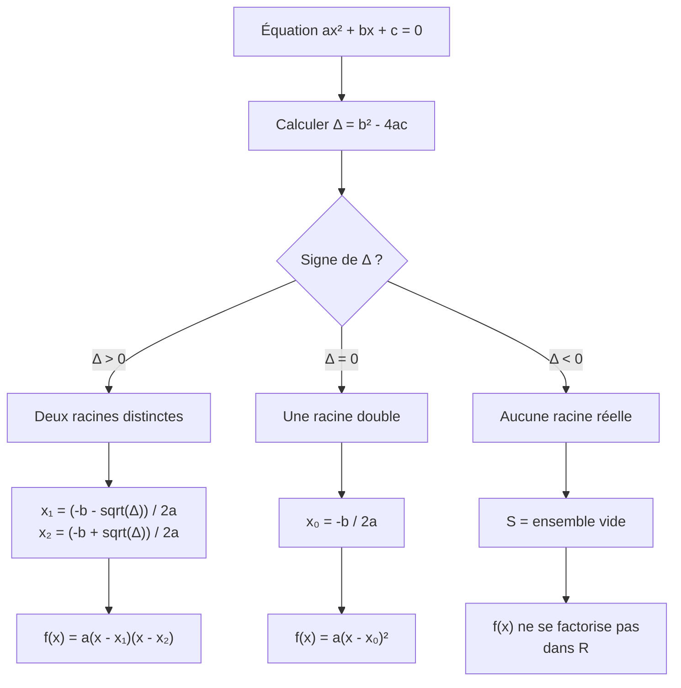
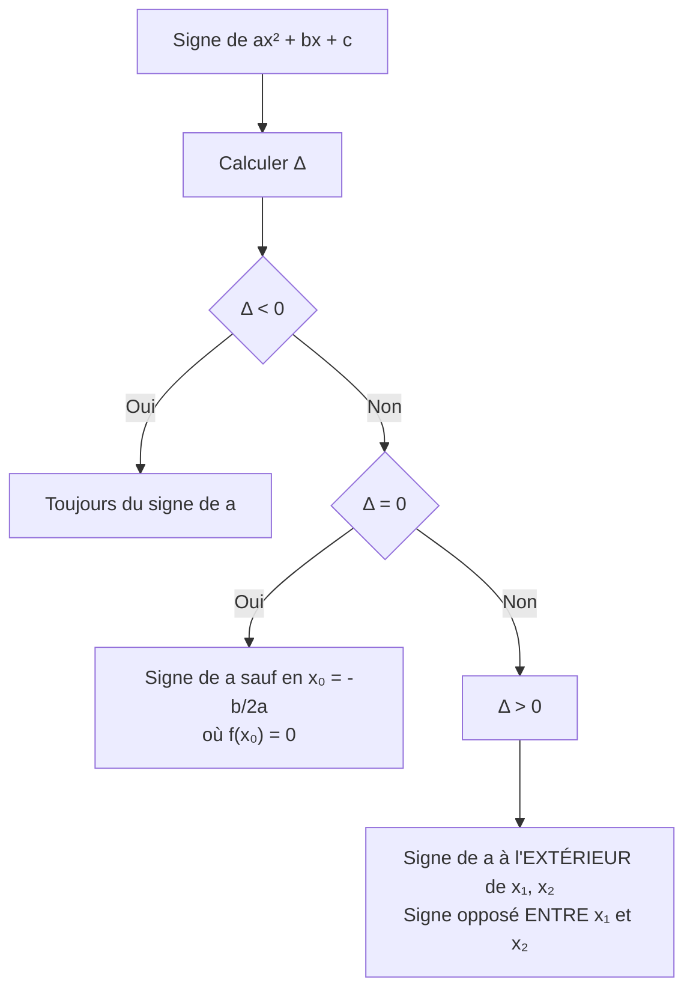

# Second Degré

L'étude des trinômes du second degré est un pilier de l'algèbre au lycée. Elle permet de résoudre des équations, d'étudier des signes et d'analyser des paraboles.

## 1. Le trinôme du second degré

### 1.1 Définition

> [!important] Définition
> Un **trinôme du second degré** est une fonction polynôme de la forme :
> $$f(x) = ax^2 + bx + c$$
> où $a$, $b$, $c$ sont des réels avec $a \neq 0$.
>
> Sa courbe représentative est une **parabole** :
> - tournée vers le **haut** si $a > 0$
> - tournée vers le **bas** si $a < 0$

### 1.2 Les trois formes du trinôme

| Forme | Expression | Utilité principale |
|-------|------------|-------------------|
| **Développée** | $f(x) = ax^2 + bx + c$ | Lecture directe des coefficients |
| **Canonique** | $f(x) = a(x - \alpha)^2 + \beta$ | Sommet de la parabole $(\alpha;\, \beta)$ |
| **Factorisée** | $f(x) = a(x - x_1)(x - x_2)$ | Racines $x_1$ et $x_2$ (si elles existent) |

## 2. Forme canonique

### 2.1 Formule

> [!important] Forme canonique
> Tout trinôme $f(x) = ax^2 + bx + c$ s'écrit sous la forme :
> $$f(x) = a\left(x - \alpha\right)^2 + \beta$$
> avec :
> $$\alpha = -\frac{b}{2a} \qquad \text{et} \qquad \beta = f(\alpha) = -\frac{\Delta}{4a}$$
> où $\Delta = b^2 - 4ac$ est le **discriminant**.

Le point $S(\alpha;\, \beta)$ est le **sommet** de la parabole.

### 2.2 Méthode de mise sous forme canonique

> [!example] Exemple : mettre $f(x) = 2x^2 - 12x + 7$ sous forme canonique
> **Étape 1** : on identifie $a = 2$, $b = -12$, $c = 7$.
>
> **Étape 2** : on calcule $\alpha$ et $\beta$ :
> $$\alpha = -\frac{-12}{2 \times 2} = 3$$
> $$\beta = f(3) = 2 \times 9 - 12 \times 3 + 7 = 18 - 36 + 7 = -11$$
>
> **Étape 3** : on écrit la forme canonique :
> $$f(x) = 2(x - 3)^2 - 11$$
>
> Le sommet de la parabole est $S(3;\, -11)$.

## 3. Le discriminant et les racines

### 3.1 Discriminant

> [!important] Définition
> Le **discriminant** du trinôme $ax^2 + bx + c$ est le nombre :
> $$\Delta = b^2 - 4ac$$
> Il détermine le nombre de solutions de l'équation $ax^2 + bx + c = 0$.

### 3.2 Résolution selon le signe de $\Delta$

### 3.3 Formules des racines

> [!important] Théorème
> Soit $f(x) = ax^2 + bx + c$ avec $a \neq 0$ et $\Delta = b^2 - 4ac$.
>
> - Si $\Delta > 0$ : deux racines distinctes
> $$x_1 = \frac{-b - \sqrt{\Delta}}{2a} \qquad x_2 = \frac{-b + \sqrt{\Delta}}{2a}$$
>
> - Si $\Delta = 0$ : une racine double
> $$x_0 = -\frac{b}{2a}$$
>
> - Si $\Delta < 0$ : **pas de racine réelle**

> [!example] Exemple : résoudre $3x^2 - 5x + 2 = 0$
> $a = 3$, $b = -5$, $c = 2$.
>
> $$\Delta = (-5)^2 - 4 \times 3 \times 2 = 25 - 24 = 1 > 0$$
>
> Deux racines :
> $$x_1 = \frac{5 - \sqrt{1}}{6} = \frac{5 - 1}{6} = \frac{4}{6} = \frac{2}{3}$$
> $$x_2 = \frac{5 + \sqrt{1}}{6} = \frac{5 + 1}{6} = \frac{6}{6} = 1$$
>
> Donc $S = \left\{\frac{2}{3};\, 1\right\}$.

> [!example] Exemple : résoudre $x^2 + 4x + 4 = 0$
> $\Delta = 16 - 16 = 0$. Racine double : $x_0 = \frac{-4}{2} = -2$.
>
> Donc $S = \{-2\}$.

> [!example] Exemple : résoudre $x^2 + x + 1 = 0$
> $\Delta = 1 - 4 = -3 < 0$. Pas de solution réelle.
>
> $S = \emptyset$.

## 4. Somme et produit des racines

### 4.1 Relations de Viète

> [!important] Théorème (Relations de Viète)
> Si $x_1$ et $x_2$ sont les racines de $ax^2 + bx + c = 0$ ($\Delta \geq 0$), alors :
> $$x_1 + x_2 = -\frac{b}{a}$$
> $$x_1 \times x_2 = \frac{c}{a}$$

> [!tip] Utilité
> Ces relations permettent de vérifier rapidement des calculs ou de trouver un trinôme connaissant ses racines :
> $$f(x) = a\left[x^2 - (x_1 + x_2)x + x_1 x_2\right]$$

> [!example] Exemple : trouver un trinôme ayant pour racines $3$ et $-5$
> $x_1 + x_2 = 3 + (-5) = -2$ et $x_1 \cdot x_2 = 3 \times (-5) = -15$.
>
> Un trinôme possible est : $f(x) = x^2 + 2x - 15$.
>
> Vérification : $\Delta = 4 + 60 = 64$, $x = \frac{-2 \pm 8}{2}$, ce qui donne $3$ et $-5$.

## 5. Signe du trinôme

### 5.1 Règle du signe

> [!important] Théorème (signe du trinôme)
> Soit $f(x) = ax^2 + bx + c$ avec $a \neq 0$.
>
> - **Si $\Delta < 0$** : $f(x)$ est du **signe de $a$** pour tout $x \in \mathbb{R}$.
> - **Si $\Delta = 0$** : $f(x)$ est du **signe de $a$** pour tout $x \neq x_0$, et $f(x_0) = 0$.
> - **Si $\Delta > 0$** : $f(x)$ est du **signe de $a$** à l'**extérieur** des racines, et du **signe opposé à $a$** entre les racines.

### 5.2 Tableaux de signes

**Cas $\Delta > 0$, $a > 0$** (parabole tournée vers le haut) :

| $x$ | $-\infty$ | | $x_1$ | | $x_2$ | | $+\infty$ |
|-----|-----------|---|-------|---|-------|---|-----------|
| $f(x)$ | $+$ | | $0$ | $-$ | $0$ | | $+$ |

**Cas $\Delta > 0$, $a < 0$** (parabole tournée vers le bas) :

| $x$ | $-\infty$ | | $x_1$ | | $x_2$ | | $+\infty$ |
|-----|-----------|---|-------|---|-------|---|-----------|
| $f(x)$ | $-$ | | $0$ | $+$ | $0$ | | $-$ |

> [!tip] Astuce mnémotechnique
> « Le signe de $a$ à l'**e**xtérieur » : la lettre **a** et le mot **e**xtérieur commencent par des voyelles.

### 5.3 Schéma récapitulatif

## 6. Factorisation du trinôme

### 6.1 Formules de factorisation

Selon la valeur de $\Delta$ :

- **$\Delta > 0$** : $f(x) = a(x - x_1)(x - x_2)$
- **$\Delta = 0$** : $f(x) = a(x - x_0)^2$
- **$\Delta < 0$** : pas de factorisation dans $\mathbb{R}$

> [!example] Exemple : factoriser $f(x) = 2x^2 + x - 6$
> $\Delta = 1 + 48 = 49 > 0$, donc $\sqrt{\Delta} = 7$.
>
> $$x_1 = \frac{-1 - 7}{4} = \frac{-8}{4} = -2 \qquad x_2 = \frac{-1 + 7}{4} = \frac{6}{4} = \frac{3}{2}$$
>
> $$f(x) = 2(x + 2)\left(x - \frac{3}{2}\right) = (x + 2)(2x - 3)$$

> [!tip] Simplification
> On peut distribuer le coefficient $a$ dans l'un des facteurs pour obtenir des coefficients entiers, comme montré ci-dessus.

## 7. Inéquations du second degré

### 7.1 Méthode générale

Pour résoudre $ax^2 + bx + c \geq 0$ (ou $\leq$, $>$, $<$) :

1. **Calculer** $\Delta$.
2. **Déterminer** les racines (si elles existent).
3. **Dresser** le tableau de signes.
4. **Lire** la solution sur le tableau.

> [!example] Exemple : résoudre $-x^2 + 3x - 2 \geq 0$
> $a = -1$, $b = 3$, $c = -2$.
>
> $\Delta = 9 - 8 = 1 > 0$.
>
> $$x_1 = \frac{-3 - 1}{-2} = 2 \qquad x_2 = \frac{-3 + 1}{-2} = 1$$
>
> Donc les racines sont $1$ et $2$, avec $a = -1 < 0$.
>
> Tableau de signes :
>
> | $x$ | $-\infty$ | | $1$ | | $2$ | | $+\infty$ |
> |-----|-----------|---|-----|---|-----|---|-----------|
> | $-x^2 + 3x - 2$ | $-$ | | $0$ | $+$ | $0$ | | $-$ |
>
> Le trinôme est $\geq 0$ pour $x \in [1;\, 2]$.

> [!example] Exemple : résoudre $x^2 + 2x + 5 > 0$
> $\Delta = 4 - 20 = -16 < 0$. Pas de racine réelle.
>
> Comme $a = 1 > 0$ et $\Delta < 0$, le trinôme est **strictement positif** pour tout $x \in \mathbb{R}$.
>
> L'ensemble solution est $S = \mathbb{R}$.

## 8. Variations et courbe du trinôme

### 8.1 Tableau de variations

Pour $f(x) = ax^2 + bx + c$, le sommet est $S\left(-\frac{b}{2a};\, f\left(-\frac{b}{2a}\right)\right)$.

**Si $a > 0$** :

| $x$ | $-\infty$ | | $-\frac{b}{2a}$ | | $+\infty$ |
|-----|-----------|---|------------------|---|-----------|
| $f(x)$ | $+\infty$ | $\searrow$ | $f\left(-\frac{b}{2a}\right)$ (minimum) | $\nearrow$ | $+\infty$ |

**Si $a < 0$** :

| $x$ | $-\infty$ | | $-\frac{b}{2a}$ | | $+\infty$ |
|-----|-----------|---|------------------|---|-----------|
| $f(x)$ | $-\infty$ | $\nearrow$ | $f\left(-\frac{b}{2a}\right)$ (maximum) | $\searrow$ | $-\infty$ |

### 8.2 Axe de symétrie

La parabole admet un **axe de symétrie** vertical d'équation :

$$x = -\frac{b}{2a}$$

Cet axe passe par le sommet.

### 8.3 Intersections avec les axes

- **Axe des ordonnées** : le point $(0;\, c)$, c'est-à-dire $f(0) = c$.
- **Axe des abscisses** : les racines $x_1$ et $x_2$ (si $\Delta \geq 0$).

## 9. Exercices types corrigés

### Exercice 1 : Résolution complète

**Énoncé** : Soit $f(x) = x^2 - 6x + 5$.
a) Calculer le discriminant et les racines.
b) Factoriser $f(x)$.
c) Écrire la forme canonique.
d) Dresser le tableau de signes.
e) Résoudre $f(x) \leq 0$.

> [!example] Correction
> a) $a = 1$, $b = -6$, $c = 5$.
> $$\Delta = 36 - 20 = 16 > 0$$
> $$x_1 = \frac{6 - 4}{2} = 1 \qquad x_2 = \frac{6 + 4}{2} = 5$$
>
> b) $f(x) = (x - 1)(x - 5)$
>
> c) $\alpha = -\frac{-6}{2} = 3$ et $\beta = f(3) = 9 - 18 + 5 = -4$.
> $$f(x) = (x - 3)^2 - 4$$
>
> d) $a = 1 > 0$, donc positif à l'extérieur des racines :
>
> | $x$ | $-\infty$ | | $1$ | | $5$ | | $+\infty$ |
> |-----|-----------|---|-----|---|-----|---|-----------|
> | $f(x)$ | $+$ | | $0$ | $-$ | $0$ | | $+$ |
>
> e) $f(x) \leq 0$ pour $x \in [1;\, 5]$.

### Exercice 2 : Problème concret

**Énoncé** : Un projectile est lancé verticalement. Sa hauteur (en mètres) en fonction du temps $t$ (en secondes) est donnée par $h(t) = -5t^2 + 30t + 2$.
a) À quelle hauteur le projectile est-il lancé ?
b) Quand atteint-il sa hauteur maximale ? Quelle est cette hauteur ?
c) Quand retombe-t-il au sol ?

> [!example] Correction
> a) La hauteur initiale est $h(0) = 2$ m.
>
> b) Le sommet est atteint en $t = -\frac{30}{2 \times (-5)} = 3$ s.
> $h(3) = -5 \times 9 + 30 \times 3 + 2 = -45 + 90 + 2 = 47$ m.
> La hauteur maximale est $47$ m, atteinte à $t = 3$ s.
>
> c) On résout $h(t) = 0$, soit $-5t^2 + 30t + 2 = 0$.
> $\Delta = 900 + 40 = 940$, $\sqrt{\Delta} = 2\sqrt{235}$.
> $$t = \frac{-30 \pm 2\sqrt{235}}{-10} = 3 \pm \frac{\sqrt{235}}{5}$$
>
> On garde la valeur positive : $t = 3 + \frac{\sqrt{235}}{5} \approx 3 + 3{,}07 \approx 6{,}07$ s.
>
> Le projectile retombe au sol après environ $6{,}07$ secondes.

### Exercice 3 : Paramètre

**Énoncé** : Pour quelles valeurs du paramètre $m$ l'équation $x^2 - 2mx + m + 2 = 0$ admet-elle deux solutions réelles distinctes ?

> [!example] Correction
> On calcule le discriminant :
> $$\Delta = (-2m)^2 - 4 \times 1 \times (m + 2) = 4m^2 - 4m - 8$$
>
> L'équation admet deux solutions distinctes si et seulement si $\Delta > 0$ :
> $$4m^2 - 4m - 8 > 0$$
> $$m^2 - m - 2 > 0$$
>
> On résout $m^2 - m - 2 = 0$ :
> $\Delta' = 1 + 8 = 9$, $m_1 = \frac{1 - 3}{2} = -1$, $m_2 = \frac{1 + 3}{2} = 2$.
>
> Comme le coefficient de $m^2$ est positif, $m^2 - m - 2 > 0$ à l'extérieur des racines.
>
> Donc $\Delta > 0$ pour $m \in ]-\infty;\, -1[ \cup ]2;\, +\infty[$.

### Exercice 4 : Inéquation avec quotient

**Énoncé** : Résoudre $\frac{x^2 - 4}{x^2 - x - 6} \geq 0$.

> [!example] Correction
> **Numérateur** : $x^2 - 4 = (x - 2)(x + 2)$, racines $x = 2$ et $x = -2$.
>
> **Dénominateur** : $x^2 - x - 6$, $\Delta = 1 + 24 = 25$, racines $x = \frac{1 - 5}{2} = -2$ et $x = \frac{1 + 5}{2} = 3$.
>
> Donc $x^2 - x - 6 = (x + 2)(x - 3)$. **Valeurs interdites** : $x \neq -2$ et $x \neq 3$.
>
> On simplifie : $\frac{(x-2)(x+2)}{(x+2)(x-3)} = \frac{x-2}{x-3}$ pour $x \neq -2$.
>
> Tableau de signes de $\frac{x-2}{x-3}$ :
>
> | $x$ | $-\infty$ | | $2$ | | $3$ | | $+\infty$ |
> |-----|-----------|---|-----|---|-----|---|-----------|
> | $x - 2$ | $-$ | | $0$ | $+$ | | $+$ | |
> | $x - 3$ | $-$ | | $-$ | | $0$ | $+$ | |
> | Quotient | $+$ | | $0$ | $-$ | | $+$ | |
>
> Le quotient est $\geq 0$ sur $]-\infty;\, 2] \cup ]3;\, +\infty[$, mais on exclut $x = -2$.
>
> $$S = ]-\infty;\, -2[ \cup ]-2;\, 2] \cup ]3;\, +\infty[$$

## 10. À retenir

> [!tip] À retenir
> - $\Delta = b^2 - 4ac$ détermine le nombre de racines : 2 si $\Delta > 0$, 1 si $\Delta = 0$, 0 si $\Delta < 0$.
> - Formules des racines : $x = \frac{-b \pm \sqrt{\Delta}}{2a}$.
> - **Somme** : $x_1 + x_2 = -\frac{b}{a}$. **Produit** : $x_1 x_2 = \frac{c}{a}$.
> - Signe du trinôme : **signe de $a$ à l'extérieur** des racines.
> - Le sommet de la parabole est en $x = -\frac{b}{2a}$ : c'est un **minimum** si $a > 0$, un **maximum** si $a < 0$.
> - Pour les inéquations du second degré : discriminant, racines, tableau de signes, lecture.

*Voir aussi* : [[Calcul Algébrique]] | [[Fonctions]] | [[Dérivation]] | [[Ensembles et Nombres]]
