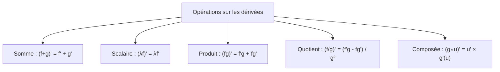
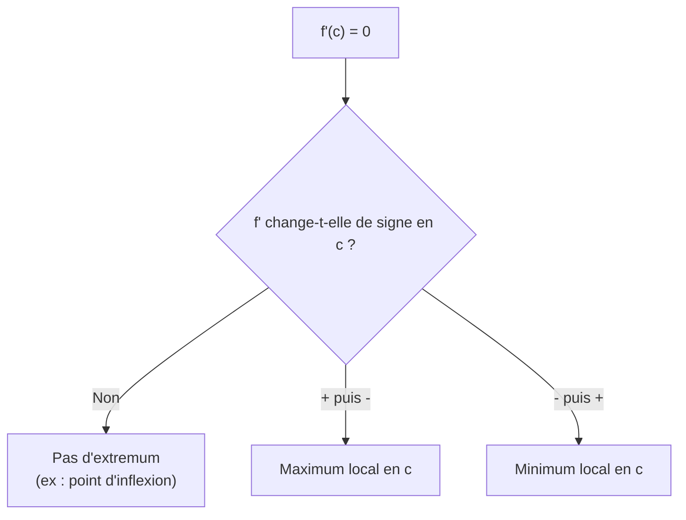

# Dérivation

La dérivation est l'outil fondamental de l'analyse pour étudier les variations d'une fonction. Elle repose sur la notion de taux d'accroissement et fournit une interprétation géométrique puissante via la tangente.

## 1. Taux d'accroissement et nombre dérivé

### 1.1 Taux d'accroissement

> [!important] Définition
> Soit $f$ une fonction définie sur un intervalle $I$ et $a \in I$. Pour tout $h \neq 0$ tel que $a + h \in I$, le **taux d'accroissement** de $f$ entre $a$ et $a + h$ est :
> $$\tau(h) = \frac{f(a + h) - f(a)}{h}$$

Géométriquement, $\tau(h)$ est la **pente de la sécante** passant par les points $A(a;\, f(a))$ et $M(a+h;\, f(a+h))$ de la courbe.

### 1.2 Nombre dérivé

> [!important] Définition
> Si le taux d'accroissement $\tau(h)$ admet une **limite finie** quand $h \to 0$, on dit que $f$ est **dérivable en $a$**, et cette limite est le **nombre dérivé** de $f$ en $a$, noté $f'(a)$ :
> $$f'(a) = \lim_{h \to 0} \frac{f(a + h) - f(a)}{h}$$

> [!example] Exemple : calculer $f'(2)$ pour $f(x) = x^2$
> $$\tau(h) = \frac{(2 + h)^2 - 2^2}{h} = \frac{4 + 4h + h^2 - 4}{h} = \frac{4h + h^2}{h} = 4 + h$$
>
> $$f'(2) = \lim_{h \to 0} (4 + h) = 4$$

> [!example] Exemple : calculer $f'(a)$ pour $f(x) = x^3$
> $$\tau(h) = \frac{(a+h)^3 - a^3}{h} = \frac{a^3 + 3a^2h + 3ah^2 + h^3 - a^3}{h}$$
> $$= \frac{3a^2h + 3ah^2 + h^3}{h} = 3a^2 + 3ah + h^2$$
>
> $$f'(a) = \lim_{h \to 0} (3a^2 + 3ah + h^2) = 3a^2$$

## 2. Interprétation géométrique : la tangente

### 2.1 Équation de la tangente

> [!important] Théorème
> Si $f$ est dérivable en $a$, alors la **tangente** à la courbe $\mathcal{C}_f$ au point $A(a;\, f(a))$ a pour équation :
> $$\boxed{y = f'(a)(x - a) + f(a)}$$
> Le nombre dérivé $f'(a)$ est le **coefficient directeur** (la pente) de la tangente au point d'abscisse $a$.

### 2.2 Interprétation

Quand $h \to 0$, la sécante passant par $A$ et $M$ tend vers la **tangente** en $A$. Le nombre dérivé est donc la pente limite de cette sécante.

> [!example] Exemple : tangente à $f(x) = x^2 - 3x + 1$ en $x = 2$
> **Étape 1** : calculer $f(2) = 4 - 6 + 1 = -1$.
>
> **Étape 2** : calculer $f'(x) = 2x - 3$, puis $f'(2) = 4 - 3 = 1$.
>
> **Étape 3** : l'équation de la tangente est :
> $$y = 1 \times (x - 2) + (-1) = x - 3$$

### 2.3 Cas particuliers

- Si $f'(a) = 0$ : la tangente est **horizontale** (parallèle à l'axe des abscisses).
- Si $f'(a) > 0$ : la tangente est **ascendante** (de gauche à droite).
- Si $f'(a) < 0$ : la tangente est **descendante** (de gauche à droite).

## 3. Fonction dérivée

### 3.1 Définition

> [!important] Définition
> Si $f$ est dérivable en tout point d'un intervalle $I$, la **fonction dérivée** $f'$ est la fonction qui à tout $x \in I$ associe le nombre dérivé $f'(x)$.

### 3.2 Tableau des dérivées des fonctions de référence

| Fonction $f(x)$ | Dérivée $f'(x)$ | Ensemble de dérivabilité |
|------------------|------------------|--------------------------|
| $k$ (constante) | $0$ | $\mathbb{R}$ |
| $x$ | $1$ | $\mathbb{R}$ |
| $x^2$ | $2x$ | $\mathbb{R}$ |
| $x^3$ | $3x^2$ | $\mathbb{R}$ |
| $x^n$ ($n \in \mathbb{N}^*$) | $nx^{n-1}$ | $\mathbb{R}$ |
| $\frac{1}{x}$ | $-\frac{1}{x^2}$ | $\mathbb{R}^*$ |
| $\frac{1}{x^n}$ ($n \in \mathbb{N}^*$) | $-\frac{n}{x^{n+1}}$ | $\mathbb{R}^*$ |
| $\sqrt{x}$ | $\frac{1}{2\sqrt{x}}$ | $]0;\, +\infty[$ |

> [!tip] Formule clé à retenir
> La dérivée de $x^n$ est $nx^{n-1}$ : on « descend » l'exposant comme coefficient et on diminue l'exposant de $1$.

## 4. Opérations sur les dérivées

### 4.1 Somme et produit par un scalaire

> [!important] Règles de dérivation (somme et scalaire)
> Soient $f$ et $g$ dérivables sur $I$ et $\lambda \in \mathbb{R}$.
> $$(f + g)' = f' + g'$$
> $$(\lambda f)' = \lambda f'$$

> [!example] Exemple : dériver $f(x) = 3x^4 - 5x^2 + 7x - 2$
> $$f'(x) = 3 \times 4x^3 - 5 \times 2x + 7 = 12x^3 - 10x + 7$$

### 4.2 Produit

> [!important] Dérivée d'un produit
> $$(fg)' = f'g + fg'$$
> « dérivée du premier fois le second, plus le premier fois dérivée du second »

> [!example] Exemple : dériver $f(x) = (2x + 1)(x^2 - 3)$
> On pose $u(x) = 2x + 1$ et $v(x) = x^2 - 3$.
>
> $u'(x) = 2$ et $v'(x) = 2x$.
>
> $$f'(x) = u'v + uv' = 2(x^2 - 3) + (2x + 1)(2x) = 2x^2 - 6 + 4x^2 + 2x = 6x^2 + 2x - 6$$

### 4.3 Quotient

> [!important] Dérivée d'un quotient
> Pour $g(x) \neq 0$ :
> $$\left(\frac{f}{g}\right)' = \frac{f'g - fg'}{g^2}$$

> [!warning] Attention
> L'ordre compte dans la formule du quotient. Retenir « dérivée du numérateur fois dénominateur **moins** numérateur fois dérivée du dénominateur, le tout divisé par le carré du dénominateur ».

> [!example] Exemple : dériver $f(x) = \frac{x + 1}{x - 2}$
> $u(x) = x + 1$, $u'(x) = 1$, $v(x) = x - 2$, $v'(x) = 1$.
>
> $$f'(x) = \frac{1 \times (x - 2) - (x + 1) \times 1}{(x - 2)^2} = \frac{x - 2 - x - 1}{(x - 2)^2} = \frac{-3}{(x - 2)^2}$$

### 4.4 Composée (dérivation en chaîne)

> [!important] Dérivée d'une composée
> Si $f = g \circ u$, c'est-à-dire $f(x) = g(u(x))$, alors :
> $$f'(x) = u'(x) \times g'(u(x))$$
> On dérive la fonction « extérieure » appliquée à $u(x)$, et on multiplie par la dérivée de $u$.

**Cas fréquents** :

| Fonction | Dérivée |
|----------|---------|
| $[u(x)]^n$ | $n \cdot u'(x) \cdot [u(x)]^{n-1}$ |
| $\frac{1}{u(x)}$ | $-\frac{u'(x)}{[u(x)]^2}$ |
| $\sqrt{u(x)}$ | $\frac{u'(x)}{2\sqrt{u(x)}}$ |

> [!example] Exemple : dériver $f(x) = (3x^2 - 1)^4$
> On pose $u(x) = 3x^2 - 1$, donc $u'(x) = 6x$ et $g(t) = t^4$, donc $g'(t) = 4t^3$.
>
> $$f'(x) = 6x \times 4(3x^2 - 1)^3 = 24x(3x^2 - 1)^3$$

> [!example] Exemple : dériver $f(x) = \sqrt{2x + 5}$
> On pose $u(x) = 2x + 5$, $u'(x) = 2$.
>
> $$f'(x) = \frac{2}{2\sqrt{2x + 5}} = \frac{1}{\sqrt{2x + 5}}$$

### 4.5 Résumé des formules

## 5. Lien dérivée-variations

### 5.1 Théorème fondamental

> [!important] Théorème (lien dérivée-variations)
> Soit $f$ une fonction dérivable sur un intervalle $I$.
>
> - Si $f'(x) > 0$ pour tout $x \in I$, alors $f$ est **strictement croissante** sur $I$.
> - Si $f'(x) < 0$ pour tout $x \in I$, alors $f$ est **strictement décroissante** sur $I$.
> - Si $f'(x) = 0$ pour tout $x \in I$, alors $f$ est **constante** sur $I$.

> [!warning] Attention à la réciproque
> Si $f$ est croissante sur $I$, on peut seulement affirmer que $f'(x) \geq 0$ (avec un $\geq$, pas un $>$).
> La dérivée peut s'annuler en des points isolés sans que la fonction cesse d'être strictement croissante (exemple : $f(x) = x^3$ en $x = 0$).

### 5.2 Méthode pour étudier les variations

1. Calculer $f'(x)$.
2. Résoudre $f'(x) = 0$ pour trouver les valeurs critiques.
3. Étudier le signe de $f'(x)$ sur chaque intervalle.
4. En déduire le tableau de variations de $f$.

## 6. Tableau de variations à partir de la dérivée

### 6.1 Méthode complète

> [!example] Exemple complet : $f(x) = x^3 - 3x + 1$
> **Étape 1** : $f'(x) = 3x^2 - 3 = 3(x^2 - 1) = 3(x - 1)(x + 1)$
>
> **Étape 2** : $f'(x) = 0 \iff x = -1$ ou $x = 1$.
>
> **Étape 3** : signe de $f'(x)$ :
>
> | $x$ | $-\infty$ | | $-1$ | | $1$ | | $+\infty$ |
> |-----|-----------|---|------|---|-----|---|-----------|
> | $x + 1$ | $-$ | | $0$ | $+$ | | $+$ | |
> | $x - 1$ | $-$ | | $-$ | | $0$ | $+$ | |
> | $f'(x) = 3(x+1)(x-1)$ | $+$ | | $0$ | $-$ | $0$ | $+$ | |
>
> **Étape 4** : valeurs de $f$ aux points critiques :
> - $f(-1) = -1 + 3 + 1 = 3$
> - $f(1) = 1 - 3 + 1 = -1$
>
> **Tableau de variations** :
>
> | $x$ | $-\infty$ | | $-1$ | | $1$ | | $+\infty$ |
> |-----|-----------|---|------|---|-----|---|-----------|
> | $f'(x)$ | $+$ | | $0$ | $-$ | $0$ | $+$ | |
> | $f(x)$ | $-\infty$ | $\nearrow$ | $3$ | $\searrow$ | $-1$ | $\nearrow$ | $+\infty$ |

### 6.2 Autre exemple avec un quotient

> [!example] Exemple : $f(x) = \frac{x^2 + 1}{x}$ sur $]0;\, +\infty[$
> On réécrit : $f(x) = x + \frac{1}{x}$.
>
> $f'(x) = 1 - \frac{1}{x^2} = \frac{x^2 - 1}{x^2}$.
>
> Sur $]0;\, +\infty[$, le dénominateur $x^2 > 0$ toujours. Le signe de $f'$ est celui du numérateur $x^2 - 1 = (x-1)(x+1)$.
>
> Sur $]0;\, +\infty[$, $x + 1 > 0$ toujours, donc le signe est celui de $x - 1$.
>
> - $f'(x) < 0$ pour $x \in ]0;\, 1[$
> - $f'(x) = 0$ pour $x = 1$
> - $f'(x) > 0$ pour $x \in ]1;\, +\infty[$
>
> $f(1) = 1 + 1 = 2$.
>
> | $x$ | $0$ | | $1$ | | $+\infty$ |
> |-----|-----|---|-----|---|-----------|
> | $f'(x)$ | | $-$ | $0$ | $+$ | |
> | $f(x)$ | $+\infty$ | $\searrow$ | $2$ | $\nearrow$ | $+\infty$ |
>
> $f$ admet un **minimum** de $2$ en $x = 1$.

## 7. Extremums

### 7.1 Condition nécessaire

> [!important] Théorème
> Si $f$ est dérivable sur un intervalle ouvert $I$ et admet un **extremum local** en $c \in I$, alors :
> $$f'(c) = 0$$

> [!warning] Attention
> La réciproque est **fausse** : $f'(c) = 0$ ne garantit pas un extremum.
> Exemple : $f(x) = x^3$. On a $f'(0) = 0$ mais $x = 0$ n'est **pas** un extremum (c'est un point d'inflexion).

### 7.2 Condition suffisante

> [!important] Théorème (condition suffisante)
> Si $f'$ **change de signe** en $c$, alors $f$ admet un extremum local en $c$ :
> - Si $f'$ passe de **positif à négatif** : $f$ admet un **maximum local** en $c$.
> - Si $f'$ passe de **négatif à positif** : $f$ admet un **minimum local** en $c$.

## 8. Applications classiques

### 8.1 Optimisation

La dérivation permet de résoudre des problèmes d'optimisation : trouver le maximum ou le minimum d'une grandeur.

**Méthode** :
1. Mettre le problème en équation : exprimer la grandeur à optimiser en fonction d'une variable $x$.
2. Déterminer le domaine de $x$ (contraintes du problème).
3. Dériver, étudier le signe de la dérivée.
4. Identifier l'extremum et conclure.

> [!example] Exemple : aire maximale d'un rectangle de périmètre fixé
> Un rectangle a un périmètre de $20$ cm. Quelles dimensions maximisent son aire ?
>
> Notons $x$ la longueur. La largeur est $\frac{20 - 2x}{2} = 10 - x$.
> Contrainte : $0 < x < 10$.
>
> L'aire est $A(x) = x(10 - x) = 10x - x^2$.
>
> $A'(x) = 10 - 2x$.
>
> $A'(x) = 0 \iff x = 5$.
>
> $A'(x) > 0$ pour $x < 5$ et $A'(x) < 0$ pour $x > 5$.
>
> Donc $A$ est maximale en $x = 5$, avec $A(5) = 25$ cm$^2$.
>
> Le rectangle d'aire maximale est un **carré** de coté $5$ cm.

### 8.2 Approximation affine

> [!important] Approximation affine
> Pour $x$ proche de $a$, si $f$ est dérivable en $a$ :
> $$f(x) \approx f(a) + f'(a)(x - a)$$
> C'est l'approximation de $f$ par sa tangente au voisinage de $a$.

> [!example] Exemple : approximation de $\sqrt{101}$
> On pose $f(x) = \sqrt{x}$, $a = 100$, $f(100) = 10$, $f'(x) = \frac{1}{2\sqrt{x}}$, $f'(100) = \frac{1}{20}$.
>
> $$\sqrt{101} \approx 10 + \frac{1}{20}(101 - 100) = 10 + \frac{1}{20} = 10{,}05$$
>
> Valeur exacte : $\sqrt{101} \approx 10{,}0499\ldots$ L'approximation est excellente.

## 9. Exercices types corrigés

### Exercice 1 : Calcul de dérivée

**Énoncé** : Calculer la dérivée de chaque fonction.
a) $f(x) = 4x^3 - 2x^2 + 7x - 5$
b) $g(x) = (x^2 + 1)(3x - 2)$
c) $h(x) = \frac{2x + 1}{x^2 + 3}$

> [!example] Correction
> a) $f'(x) = 12x^2 - 4x + 7$
>
> b) Produit avec $u = x^2 + 1$, $u' = 2x$, $v = 3x - 2$, $v' = 3$ :
> $$g'(x) = 2x(3x - 2) + (x^2 + 1) \times 3 = 6x^2 - 4x + 3x^2 + 3 = 9x^2 - 4x + 3$$
>
> c) Quotient avec $u = 2x + 1$, $u' = 2$, $v = x^2 + 3$, $v' = 2x$ :
> $$h'(x) = \frac{2(x^2 + 3) - (2x + 1)(2x)}{(x^2 + 3)^2} = \frac{2x^2 + 6 - 4x^2 - 2x}{(x^2 + 3)^2} = \frac{-2x^2 - 2x + 6}{(x^2 + 3)^2}$$

### Exercice 2 : Tangente

**Énoncé** : Déterminer l'équation de la tangente à la courbe de $f(x) = \frac{1}{x}$ au point d'abscisse $x = 2$.

> [!example] Correction
> $f(2) = \frac{1}{2}$.
>
> $f'(x) = -\frac{1}{x^2}$, donc $f'(2) = -\frac{1}{4}$.
>
> Tangente : $y = f'(2)(x - 2) + f(2) = -\frac{1}{4}(x - 2) + \frac{1}{2}$
>
> $$y = -\frac{1}{4}x + \frac{1}{2} + \frac{1}{2} = -\frac{1}{4}x + 1$$

### Exercice 3 : Étude complète

**Énoncé** : Étudier les variations de $f(x) = 2x^3 - 9x^2 + 12x - 4$ et déterminer ses extremums.

> [!example] Correction
> **Dérivée** : $f'(x) = 6x^2 - 18x + 12 = 6(x^2 - 3x + 2) = 6(x - 1)(x - 2)$
>
> $f'(x) = 0 \iff x = 1$ ou $x = 2$.
>
> **Signe de $f'$** :
>
> | $x$ | $-\infty$ | | $1$ | | $2$ | | $+\infty$ |
> |-----|-----------|---|-----|---|-----|---|-----------|
> | $x - 1$ | $-$ | | $0$ | $+$ | | $+$ | |
> | $x - 2$ | $-$ | | $-$ | | $0$ | $+$ | |
> | $f'(x)$ | $+$ | | $0$ | $-$ | $0$ | $+$ | |
>
> **Valeurs** :
> - $f(1) = 2 - 9 + 12 - 4 = 1$
> - $f(2) = 16 - 36 + 24 - 4 = 0$
>
> **Tableau de variations** :
>
> | $x$ | $-\infty$ | | $1$ | | $2$ | | $+\infty$ |
> |-----|-----------|---|-----|---|-----|---|-----------|
> | $f'(x)$ | $+$ | | $0$ | $-$ | $0$ | $+$ | |
> | $f(x)$ | $-\infty$ | $\nearrow$ | $1$ | $\searrow$ | $0$ | $\nearrow$ | $+\infty$ |
>
> **Extremums** :
> - $f$ admet un **maximum local** de $1$ en $x = 1$ ($f'$ passe de $+$ à $-$).
> - $f$ admet un **minimum local** de $0$ en $x = 2$ ($f'$ passe de $-$ à $+$).

### Exercice 4 : Dérivée d'une composée

**Énoncé** : Dériver $f(x) = \frac{1}{(2x - 3)^2}$.

> [!example] Correction
> On écrit $f(x) = (2x - 3)^{-2}$.
>
> On pose $u(x) = 2x - 3$, $u'(x) = 2$.
>
> $$f'(x) = -2 \times u'(x) \times [u(x)]^{-3} = -2 \times 2 \times (2x - 3)^{-3} = \frac{-4}{(2x - 3)^3}$$

### Exercice 5 : Optimisation

**Énoncé** : On découpe aux quatre coins d'une feuille de carton rectangulaire de $30$ cm par $20$ cm des carrés de côté $x$ cm, puis on plie pour former une boîte sans couvercle. Quelle valeur de $x$ maximise le volume ?

> [!example] Correction
> Après pliage, la boîte a pour dimensions :
> - Longueur : $30 - 2x$
> - Largeur : $20 - 2x$
> - Hauteur : $x$
>
> Contrainte : $0 < x < 10$ (pour que les dimensions restent positives).
>
> Volume : $V(x) = x(30 - 2x)(20 - 2x)$.
>
> On développe : $V(x) = x(600 - 60x - 40x + 4x^2) = x(4x^2 - 100x + 600)$
> $$V(x) = 4x^3 - 100x^2 + 600x$$
>
> $V'(x) = 12x^2 - 200x + 600 = 4(3x^2 - 50x + 150)$
>
> $V'(x) = 0 \iff 3x^2 - 50x + 150 = 0$
>
> $\Delta = 2500 - 1800 = 700$, $\sqrt{\Delta} = 10\sqrt{7}$.
>
> $$x = \frac{50 \pm 10\sqrt{7}}{6} = \frac{25 \pm 5\sqrt{7}}{3}$$
>
> $x_1 = \frac{25 - 5\sqrt{7}}{3} \approx \frac{25 - 13{,}23}{3} \approx 3{,}92$ cm (dans $]0;\, 10[$)
>
> $x_2 = \frac{25 + 5\sqrt{7}}{3} \approx \frac{25 + 13{,}23}{3} \approx 12{,}74$ cm (hors de $]0;\, 10[$)
>
> On vérifie que $V'$ passe de positif à négatif en $x_1$ : c'est un **maximum**.
>
> $$V\left(\frac{25 - 5\sqrt{7}}{3}\right) \approx V(3{,}92) \approx 3{,}92 \times 22{,}16 \times 12{,}16 \approx 1\,056 \text{ cm}^3$$
>
> Le volume est maximal (environ $1\,056$ cm$^3$) pour $x \approx 3{,}9$ cm.

## 10. À retenir

> [!tip] À retenir
> - Le **nombre dérivé** $f'(a) = \lim_{h \to 0} \frac{f(a+h) - f(a)}{h}$ est la pente de la tangente en $a$.
> - **Tangente** en $a$ : $y = f'(a)(x - a) + f(a)$.
> - Dérivée de $x^n$ : $nx^{n-1}$. Dérivée de $\frac{1}{x}$ : $-\frac{1}{x^2}$. Dérivée de $\sqrt{x}$ : $\frac{1}{2\sqrt{x}}$.
> - **Produit** : $(uv)' = u'v + uv'$. **Quotient** : $\left(\frac{u}{v}\right)' = \frac{u'v - uv'}{v^2}$.
> - **Composée** : $(g \circ u)' = u' \times g'(u)$.
> - $f' > 0 \Rightarrow f$ croissante. $f' < 0 \Rightarrow f$ décroissante.
> - Extremum local en $c$ implique $f'(c) = 0$ (condition nécessaire). Le changement de signe de $f'$ confirme l'extremum (condition suffisante).
> - Pour l'**optimisation** : modéliser, dériver, résoudre $f'(x) = 0$, vérifier le changement de signe.

*Voir aussi* : [[Fonctions]] | [[Second Degré]] | [[Calcul Algébrique]] | [[Ensembles et Nombres]]
