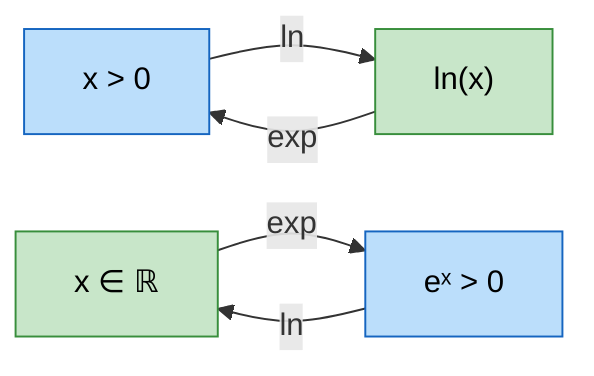

# Exponentielle et Logarithme

Les fonctions exponentielle et logarithme népérien sont deux des fonctions les plus importantes de l'analyse. Réciproques l'une de l'autre, elles interviennent dans la modélisation de phénomènes naturels (croissance, décroissance radioactive, intérêts composés) et sont omniprésentes en physique, chimie, biologie et économie. Cette fiche s'appuie sur les notions de [[Limites et Continuité]] et prépare l'étude des [[Primitives et Intégrales]].

> [!quote] Richard Feynman
> *"L'exponentielle est la fonction la plus importante de toutes les mathématiques."*


## 1. La fonction exponentielle

### Définition

> [!important] Définition
> La **fonction exponentielle**, notée $\exp$ ou $x \mapsto e^x$, est l'unique fonction $f$ définie et dérivable sur $\mathbb{R}$ telle que :
> $$\boxed{f' = f \quad \text{et} \quad f(0) = 1}$$

### Valeurs fondamentales

$$\exp(0) = 1 \qquad \exp(1) = e \approx 2{,}718\,28$$

Le nombre $e$ est un nombre **irrationnel** (et même transcendant).

### Propriété fondamentale

> [!important] Propriété algébrique fondamentale
> Pour tous réels $a$ et $b$ :
> $$\boxed{e^{a+b} = e^a \cdot e^b}$$
> C'est cette propriété qui transforme les **sommes en produits**.

### Propriétés algébriques complètes

De la propriété fondamentale, on déduit :

| Propriété | Formule |
|---|---|
| Produit | $e^{a+b} = e^a \cdot e^b$ |
| Quotient | $e^{a-b} = \dfrac{e^a}{e^b}$ |
| Inverse | $e^{-a} = \dfrac{1}{e^a}$ |
| Puissance | $(e^a)^n = e^{na}$ |
| Positivité | $e^x > 0$ pour tout $x \in \mathbb{R}$ |
| Neutralité | $e^0 = 1$ |

> [!warning] Attention
> $e^{a \cdot b} \neq e^a \cdot e^b$ en général ! La formule concerne la **somme** des exposants, pas le produit.
> Par exemple : $e^{2 \times 3} = e^6$, tandis que $e^2 \cdot e^3 = e^5$.

### Signe de l'exponentielle

> [!tip] Propriété essentielle
> Pour tout $x \in \mathbb{R}$ : $e^x > 0$.
> L'exponentielle est **toujours strictement positive**. Elle ne s'annule jamais.


## 2. Étude de la fonction exponentielle

### Dérivée

$$\boxed{\left(e^x\right)' = e^x}$$

Plus généralement, par composition :

$$\boxed{\left(e^{u(x)}\right)' = u'(x) \cdot e^{u(x)}}$$

### Variations

Comme $e^x > 0$ pour tout $x$, la fonction exponentielle est **strictement croissante** sur $\mathbb{R}$.

### Limites

$$\lim_{x \to +\infty} e^x = +\infty \qquad \lim_{x \to -\infty} e^x = 0$$

### Tableau de variations

| $x$ | $-\infty$ | | $+\infty$ |
|---|---|---|---|
| $e^x$ | $0^+$ | $\nearrow$ | $+\infty$ |

### Équation et inéquation

> [!important] Règles de résolution
> - $e^a = e^b \iff a = b$ (l'exponentielle est **injective**)
> - $e^a < e^b \iff a < b$ (l'exponentielle est **strictement croissante**)


## 3. Croissances comparées (exponentielle vs polynômes)

> [!important] Théorème de croissance comparée
> Pour tout entier $n \geq 1$ :
> $$\boxed{\lim_{x \to +\infty} \frac{e^x}{x^n} = +\infty}$$
> L'exponentielle **domine** toute puissance de $x$ en $+\infty$.

Corollaires utiles :

$$\lim_{x \to +\infty} x^n e^{-x} = 0 \qquad \lim_{x \to -\infty} x^n e^{x} = 0$$

> [!tip] Comment retenir
> "L'exponentielle l'emporte toujours sur les polynômes." En cas de forme indéterminée $0 \times \infty$ entre un polynôme et une exponentielle, c'est l'exponentielle qui impose la limite.


## 4. La fonction logarithme népérien

### Définition

> [!important] Définition
> La fonction **logarithme népérien**, notée $\ln$, est la **réciproque** de la fonction exponentielle.
> $$\boxed{y = \ln(x) \iff x = e^y} \qquad \text{pour } x > 0$$
> Son domaine de définition est $]0, +\infty[$.

### Relation fondamentale exp/ln



$$\boxed{e^{\ln x} = x \quad (x > 0)} \qquad \boxed{\ln(e^x) = x \quad (x \in \mathbb{R})}$$

### Valeurs fondamentales

$$\ln(1) = 0 \qquad \ln(e) = 1$$

### Propriétés algébriques de ln

> [!important] Propriétés fondamentales
> Pour tous réels $a > 0$ et $b > 0$, et pour tout entier $n$ :
>
> | Propriété | Formule |
> |---|---|
> | Produit | $\ln(ab) = \ln(a) + \ln(b)$ |
> | Quotient | $\ln\left(\dfrac{a}{b}\right) = \ln(a) - \ln(b)$ |
> | Inverse | $\ln\left(\dfrac{1}{a}\right) = -\ln(a)$ |
> | Puissance | $\ln(a^n) = n\ln(a)$ |
> | Racine carrée | $\ln(\sqrt{a}) = \dfrac{1}{2}\ln(a)$ |

> [!tip] Le logarithme transforme les produits en sommes
> C'est la propriété qui rend le logarithme si utile : il "descend" les opérations d'un cran de complexité.
> - Multiplications deviennent additions
> - Divisions deviennent soustractions
> - Puissances deviennent multiplications

> [!warning] Piège classique
> $\ln(a + b) \neq \ln(a) + \ln(b)$ ! La formule concerne le **produit**, pas la somme.


## 5. Étude de la fonction logarithme népérien

### Dérivée

$$\boxed{(\ln x)' = \frac{1}{x}} \quad \text{pour } x > 0$$

Plus généralement, par composition :

$$\boxed{(\ln u(x))' = \frac{u'(x)}{u(x)}} \quad \text{pour } u(x) > 0$$

### Variations

Comme $\dfrac{1}{x} > 0$ pour tout $x > 0$, la fonction $\ln$ est **strictement croissante** sur $]0, +\infty[$.

### Limites

$$\lim_{x \to +\infty} \ln(x) = +\infty \qquad \lim_{x \to 0^+} \ln(x) = -\infty$$

### Tableau de variations

| $x$ | $0^+$ | | $+\infty$ |
|---|---|---|---|
| $\ln(x)$ | $-\infty$ | $\nearrow$ | $+\infty$ |

### Équation et inéquation

> [!important] Règles de résolution
> - $\ln(a) = \ln(b) \iff a = b$ (avec $a, b > 0$)
> - $\ln(a) < \ln(b) \iff a < b$ (avec $a, b > 0$)


## 6. Croissances comparées (ln vs puissances)

> [!important] Théorème de croissance comparée
> Pour tout entier $n \geq 1$ :
> $$\boxed{\lim_{x \to +\infty} \frac{\ln(x)}{x^n} = 0}$$
> Le logarithme **croît moins vite** que toute puissance positive de $x$.

Limite associée en $0^+$ :

$$\lim_{x \to 0^+} x^n \ln(x) = 0$$

> [!tip] Hiérarchie de croissance
> En $+\infty$ :
> $$\ln(x) \ll x^n \ll e^x$$
> Le logarithme est "dominé" par les puissances, qui sont elles-mêmes "dominées" par l'exponentielle.


## 7. Relation graphique entre exp et ln

Les courbes de $\exp$ et $\ln$ sont **symétriques par rapport à la droite** $y = x$ (première bissectrice). C'est une propriété générale de toute fonction et de sa réciproque.

> [!tip] Conséquences graphiques
> - La courbe de $\exp$ passe par $(0, 1)$ : la courbe de $\ln$ passe par $(1, 0)$.
> - La tangente à $\exp$ en $x = 0$ a pour pente $1$ : la tangente à $\ln$ en $x = 1$ a aussi pour pente $1$.
> - $\exp$ a une asymptote horizontale $y = 0$ en $-\infty$ : $\ln$ a une asymptote verticale $x = 0$.

### Visualisation animée (Manim)

> [!note] Ce que montre l'animation
> On trace $e^x$, puis on fait apparaître $\ln x$ comme son **image miroir** par rapport à la première bissectrice $y = x$. Des couples de points symétriques — $(0, 1)$ sur $\exp$ et $(1, 0)$ sur $\ln$, ou $(1, e)$ et $(e, 1)$ — sont reliés par des segments perpendiculaires à $y = x$. C'est l'illustration géométrique du fait que $\ln$ est la **fonction réciproque** de $\exp$.

```manim
# Rendu : manimgl exp_ln.py ExpEtLogReciproques
from manimlib import *
import numpy as np


class ExpEtLogReciproques(Scene):
    def construct(self):
        axes = Axes(x_range=(-4, 4), y_range=(-4, 4), height=7, width=7)
        self.play(ShowCreation(axes))

        # Première bissectrice y = x : l'axe de symétrie
        bissectrice = DashedLine(axes.c2p(-4, -4), axes.c2p(4, 4), color=GREY_B)
        self.play(ShowCreation(bissectrice))

        # Courbe de l'exponentielle
        c_exp = axes.get_graph(lambda x: np.exp(x), x_range=(-4, 1.38), color=BLUE)
        lab_exp = Tex("e^x", color=BLUE).next_to(axes.c2p(1.3, np.exp(1.3)), RIGHT)
        self.play(ShowCreation(c_exp), Write(lab_exp))
        self.wait()

        # Courbe du logarithme = image de exp par la symétrie d'axe y = x
        c_ln = axes.get_graph(lambda x: np.log(x), x_range=(0.02, 4), color=GREEN)
        lab_ln = Tex(r"\ln x", color=GREEN).next_to(axes.c2p(3.6, np.log(3.6)), UP)
        reflet = c_exp.copy().set_color(GREEN)
        self.play(Transform(reflet, c_ln), Write(lab_ln), run_time=3)
        self.wait()

        # Couples de points symétriques par rapport à y = x
        for x, y in [(0, 1), (1, np.e)]:
            A = Dot(axes.c2p(x, y), color=BLUE)
            B = Dot(axes.c2p(y, x), color=GREEN)
            lien = DashedLine(A.get_center(), B.get_center(), color=GREY_B)
            self.play(FadeIn(A), FadeIn(B), ShowCreation(lien), run_time=0.8)

        note = Tex(r"e^x \text{ et } \ln x : \text{ symétriques par rapport à } y=x")
        note.to_edge(UP).set_backstroke()
        self.play(Write(note))
        self.wait(2)
```


## 8. Fonction exponentielle de base $a$

> [!important] Définition
> Pour $a > 0$, la fonction exponentielle de base $a$ est définie par :
> $$\boxed{a^x = e^{x \ln a}}$$

### Cas particuliers selon la valeur de $a$

| Condition | Comportement de $a^x$ |
|---|---|
| $a > 1$ | Strictement croissante, $\lim_{x \to +\infty} a^x = +\infty$ |
| $a = 1$ | Constante égale à $1$ |
| $0 < a < 1$ | Strictement décroissante, $\lim_{x \to +\infty} a^x = 0$ |

### Dérivée

$$(a^x)' = \ln(a) \cdot a^x$$

> [!example] Application : modèle de croissance
> Une population double tous les 5 ans. Si $P_0$ est la population initiale :
> $P(t) = P_0 \cdot 2^{t/5} = P_0 \cdot e^{(t \ln 2)/5}$
> Le taux de croissance continu est $\dfrac{\ln 2}{5} \approx 0{,}139$, soit environ $13{,}9\%$ par an.


## 9. Logarithme décimal

> [!important] Définition
> Le **logarithme décimal** (ou logarithme en base $10$), noté $\log$ ou $\log_{10}$, est défini par :
> $$\boxed{\log(x) = \frac{\ln(x)}{\ln(10)}}$$

### Propriété caractéristique

$$\log(10) = 1 \qquad \log(10^n) = n$$

Le logarithme décimal donne l'**ordre de grandeur** d'un nombre : $\log(x)$ est le nombre de chiffres de $x$ moins $1$ (pour $x$ entier).

### Applications

- **Échelle de Richter** (séismes) : magnitude = $\log$ de l'énergie
- **Décibels** (son) : $L = 10\log\left(\dfrac{I}{I_0}\right)$
- **pH** (chimie) : $\text{pH} = -\log[\text{H}^+]$


## 10. Exercices types corrigés

### Exercice 1 : Simplifications

> [!example] Énoncé
> Simplifier les expressions suivantes :
> 1. $e^{2\ln 3}$
> 2. $\ln(e^5 \cdot e^{-2})$
> 3. $e^{\ln 4 + \ln 5}$

**Correction :**

1. $e^{2\ln 3} = e^{\ln(3^2)} = e^{\ln 9} = 9$

2. $\ln(e^5 \cdot e^{-2}) = \ln(e^{5-2}) = \ln(e^3) = 3$

3. $e^{\ln 4 + \ln 5} = e^{\ln(4 \times 5)} = e^{\ln 20} = 20$


### Exercice 2 : Résolution d'équations

> [!example] Énoncé
> Résoudre dans $\mathbb{R}$ :
> 1. $e^{2x-1} = e^{x+3}$
> 2. $\ln(x^2 - 3) = \ln(2x)$
> 3. $2^x = 5$

**Correction :**

**1.** $e^{2x-1} = e^{x+3} \iff 2x - 1 = x + 3 \iff x = 4$.

**2.** Conditions d'existence : $x^2 - 3 > 0$ et $2x > 0$, soit $x > \sqrt{3}$.

$\ln(x^2 - 3) = \ln(2x) \iff x^2 - 3 = 2x \iff x^2 - 2x - 3 = 0$

$(x-3)(x+1) = 0$, donc $x = 3$ ou $x = -1$.

Comme $x > \sqrt{3}$, la seule solution est $x = 3$.

**3.** $2^x = 5 \iff e^{x\ln 2} = 5 \iff x\ln 2 = \ln 5 \iff x = \dfrac{\ln 5}{\ln 2} \approx 2{,}322$.


### Exercice 3 : Étude de fonction

> [!example] Énoncé
> Soit $f(x) = xe^{-x}$.
> 1. Déterminer le domaine de définition.
> 2. Calculer les limites aux bornes.
> 3. Calculer $f'(x)$ et étudier les variations.
> 4. Dresser le tableau de variations.

**Correction :**

**1.** $f$ est définie sur $\mathbb{R}$ (produit de fonctions définies sur $\mathbb{R}$).

**2.** Limites :
- $\displaystyle\lim_{x \to +\infty} xe^{-x} = \lim_{x \to +\infty} \frac{x}{e^x} = 0$ (croissances comparées : $e^x$ domine $x$)
- $\displaystyle\lim_{x \to -\infty} xe^{-x}$ : quand $x \to -\infty$, $e^{-x} \to +\infty$ et $x \to -\infty$, donc $xe^{-x} \to -\infty$.

**3.** $f'(x) = 1 \cdot e^{-x} + x \cdot (-1) \cdot e^{-x} = e^{-x}(1 - x)$.

Comme $e^{-x} > 0$, le signe de $f'(x)$ est celui de $(1-x)$ :
- $f'(x) > 0$ si $x < 1$ : $f$ croissante
- $f'(x) < 0$ si $x > 1$ : $f$ décroissante

Maximum en $x = 1$ : $f(1) = 1 \cdot e^{-1} = \dfrac{1}{e}$.

**4.** Tableau de variations :

| $x$ | $-\infty$ | | $1$ | | $+\infty$ |
|---|---|---|---|---|---|
| $f'(x)$ | | $+$ | $0$ | $-$ | |
| $f(x)$ | $-\infty$ | $\nearrow$ | $\dfrac{1}{e}$ | $\searrow$ | $0$ |


### Exercice 4 : Résolution d'inéquation

> [!example] Énoncé
> Résoudre $\ln(x+1) \geq 2$.

**Correction :**

Condition d'existence : $x + 1 > 0 \iff x > -1$.

$\ln(x+1) \geq 2 \iff x+1 \geq e^2 \iff x \geq e^2 - 1$

L'ensemble des solutions est $[e^2 - 1, +\infty[$.

Numériquement : $e^2 - 1 \approx 6{,}389$.


### Exercice 5 : Dérivation composée

> [!example] Énoncé
> Calculer la dérivée de $g(x) = \ln(x^2 + 1)$.

**Correction :**

On utilise la formule $(\ln u)' = \dfrac{u'}{u}$ avec $u(x) = x^2 + 1$ :

$$g'(x) = \frac{2x}{x^2 + 1}$$

On peut vérifier : $g'(0) = 0$ (la courbe a une tangente horizontale en $x = 0$, ce qui est cohérent car $g$ est paire et admet un minimum en $0$).


### Exercice 6 : Croissances comparées

> [!example] Énoncé
> Calculer $\displaystyle\lim_{x \to +\infty} \frac{e^x - x^3}{e^x + x^2}$.

**Correction :**

On factorise numérateur et dénominateur par $e^x$ :

$$\frac{e^x - x^3}{e^x + x^2} = \frac{e^x\left(1 - \dfrac{x^3}{e^x}\right)}{e^x\left(1 + \dfrac{x^2}{e^x}\right)} = \frac{1 - \dfrac{x^3}{e^x}}{1 + \dfrac{x^2}{e^x}}$$

Par les croissances comparées : $\dfrac{x^3}{e^x} \to 0$ et $\dfrac{x^2}{e^x} \to 0$ quand $x \to +\infty$.

Donc la limite vaut $\dfrac{1 - 0}{1 + 0} = 1$.
