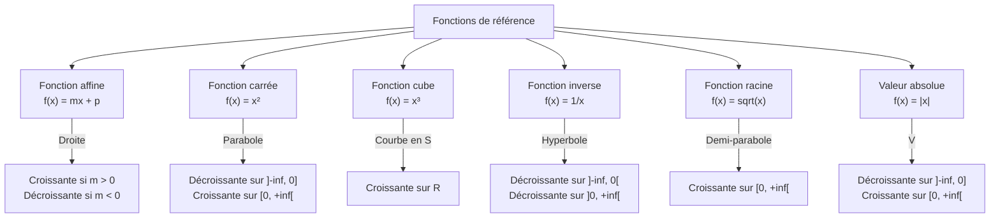
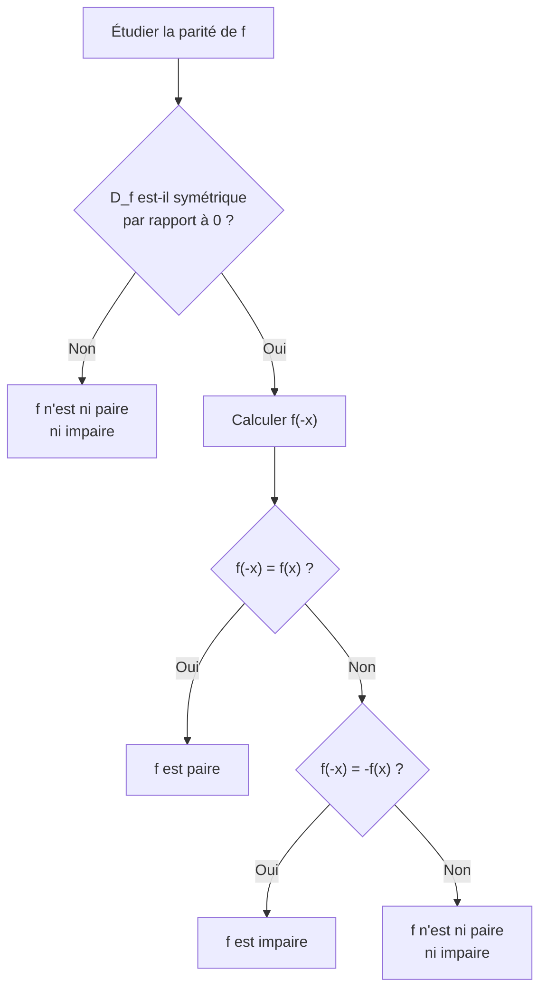

# Fonctions

La notion de fonction est au coeur de l'analyse mathématique. Une fonction modélise une relation de dépendance entre deux grandeurs.

## 1. Notion de fonction

### 1.1 Définition

> [!important] Définition
> Une **fonction** $f$ définie sur un ensemble $D_f \subset \mathbb{R}$ est un procédé qui, à chaque nombre $x$ de $D_f$, associe un **unique** nombre réel noté $f(x)$.
>
> On note : $f : D_f \to \mathbb{R},\quad x \mapsto f(x)$

- $D_f$ est l'**ensemble de définition** de $f$.
- $f(x)$ est l'**image** de $x$ par $f$.
- Si $f(x) = y$, on dit que $x$ est un **antécédent** de $y$ par $f$.

> [!warning] Attention
> Un élément $y$ peut avoir **plusieurs antécédents** (ou aucun), mais chaque $x$ de $D_f$ a **une seule image**.

### 1.2 Ensemble de définition

Pour déterminer $D_f$, il faut exclure les valeurs de $x$ qui rendent l'expression impossible :
- **Dénominateur nul** : si $f(x) = \frac{A(x)}{B(x)}$, on exclut $B(x) = 0$.
- **Racine d'un nombre négatif** : si $f(x) = \sqrt{A(x)}$, on impose $A(x) \geq 0$.

> [!example] Exemple : déterminer $D_f$ pour $f(x) = \frac{\sqrt{x - 1}}{x - 3}$
> - Il faut $x - 1 \geq 0$, soit $x \geq 1$.
> - Il faut $x - 3 \neq 0$, soit $x \neq 3$.
>
> Donc $D_f = [1;\, 3[ \cup ]3;\, +\infty[$.

## 2. Courbe représentative et lecture graphique

### 2.1 Courbe représentative

> [!important] Définition
> La **courbe représentative** $\mathcal{C}_f$ d'une fonction $f$ est l'ensemble des points $M(x;\, f(x))$ pour $x \in D_f$.
>
> Un point $M(a;\, b)$ appartient à $\mathcal{C}_f$ si et seulement si $b = f(a)$.

### 2.2 Lecture graphique

Sur la courbe de $f$, on peut lire :
- L'**image** de $a$ : on se place en $x = a$, on lit l'ordonnée du point correspondant.
- Les **antécédents** de $b$ : on trace la droite $y = b$ et on lit les abscisses des points d'intersection.

### 2.3 Résolutions graphiques

- $f(x) = k$ : les abscisses des points d'intersection de $\mathcal{C}_f$ avec la droite $y = k$.
- $f(x) > k$ : les intervalles où la courbe est **au-dessus** de la droite $y = k$.
- $f(x) = g(x)$ : les abscisses des points d'intersection de $\mathcal{C}_f$ et $\mathcal{C}_g$.
- $f(x) > g(x)$ : les intervalles où $\mathcal{C}_f$ est **au-dessus** de $\mathcal{C}_g$.

## 3. Fonctions de référence

### 3.1 Vue d'ensemble

### 3.2 Fonction affine : $f(x) = mx + p$

- **Ensemble de définition** : $\mathbb{R}$
- **Courbe** : droite de pente $m$ et d'ordonnée à l'origine $p$
- Si $m > 0$ : $f$ est **strictement croissante**
- Si $m < 0$ : $f$ est **strictement décroissante**
- Si $m = 0$ : $f$ est **constante** ($f(x) = p$)
- Cas particulier $p = 0$ : fonction linéaire $f(x) = mx$

### 3.3 Fonction carrée : $f(x) = x^2$

- **Ensemble de définition** : $\mathbb{R}$
- **Image** : $[0;\, +\infty[$
- **Variations** :

| $x$ | $-\infty$ | | $0$ | | $+\infty$ |
|-----|-----------|---|-----|---|-----------|
| $f(x) = x^2$ | | $\searrow$ | $0$ | $\nearrow$ | |

- **Courbe** : parabole de sommet $O(0;\, 0)$, tournée vers le haut
- **Symétrie** : la courbe est symétrique par rapport à l'axe des ordonnées (fonction paire)

### 3.4 Fonction cube : $f(x) = x^3$

- **Ensemble de définition** : $\mathbb{R}$
- **Image** : $\mathbb{R}$
- **Variations** : strictement croissante sur $\mathbb{R}$

| $x$ | $-\infty$ | | $+\infty$ |
|-----|-----------|---|-----------|
| $f(x) = x^3$ | $-\infty$ | $\nearrow$ | $+\infty$ |

- **Symétrie** : la courbe est symétrique par rapport à l'origine (fonction impaire)

### 3.5 Fonction inverse : $f(x) = \frac{1}{x}$

- **Ensemble de définition** : $\mathbb{R}^* = ]-\infty;\, 0[ \cup ]0;\, +\infty[$
- **Variations** : strictement décroissante sur $]-\infty;\, 0[$ et sur $]0;\, +\infty[$ **séparément**

| $x$ | $-\infty$ | | $0$ | | $+\infty$ |
|-----|-----------|---|-----|---|-----------|
| $f(x) = \frac{1}{x}$ | $0^-$ | $\searrow$ | $\parallel$ | $\searrow$ | $0^+$ |

- **Courbe** : hyperbole, avec deux branches dans les quadrants I et III
- **Asymptotes** : axe des abscisses (horizontale) et axe des ordonnées (verticale)
- **Symétrie** : fonction impaire (symétrie par rapport à l'origine)

> [!warning] Attention
> On ne dit **pas** que $f(x) = \frac{1}{x}$ est décroissante sur $\mathbb{R}^*$. Elle est décroissante sur chacun des deux intervalles **séparément**, mais pas sur leur réunion (car $\frac{1}{-1} = -1 < 1 = \frac{1}{1}$ alors que $-1 < 1$).

### 3.6 Fonction racine carrée : $f(x) = \sqrt{x}$

- **Ensemble de définition** : $[0;\, +\infty[$
- **Image** : $[0;\, +\infty[$
- **Variations** : strictement croissante sur $[0;\, +\infty[$

| $x$ | $0$ | | $+\infty$ |
|-----|-----|---|-----------|
| $f(x) = \sqrt{x}$ | $0$ | $\nearrow$ | $+\infty$ |

- **Courbe** : demi-parabole couchée, partant de l'origine
- La croissance **ralentit** : la courbe s'aplatit de plus en plus

## 4. Sens de variation

### 4.1 Définitions

> [!important] Définition
> Soit $f$ une fonction définie sur un intervalle $I$.
> - $f$ est **croissante** sur $I$ si : pour tous $a, b \in I$, $a \leq b \Rightarrow f(a) \leq f(b)$.
> - $f$ est **décroissante** sur $I$ si : pour tous $a, b \in I$, $a \leq b \Rightarrow f(a) \geq f(b)$.
> - $f$ est **strictement croissante** si l'implication est stricte ($<$ au lieu de $\leq$).

En termes intuitifs :
- **Croissante** : quand $x$ augmente, $f(x)$ augmente (ou reste constant).
- **Décroissante** : quand $x$ augmente, $f(x)$ diminue (ou reste constant).

### 4.2 Tableau de variations

Un tableau de variations résume le comportement global de la fonction.

> [!example] Exemple : tableau de variations de $f(x) = -x^2 + 4x - 1$
>
> Cette fonction est un trinôme du second degré avec $a = -1 < 0$. Le sommet est en $x = -\frac{b}{2a} = -\frac{4}{-2} = 2$.
>
> $f(2) = -4 + 8 - 1 = 3$.
>
> | $x$ | $-\infty$ | | $2$ | | $+\infty$ |
> |-----|-----------|---|-----|---|-----------|
> | $f(x)$ | $-\infty$ | $\nearrow$ | $3$ | $\searrow$ | $-\infty$ |

### 4.3 Extremums

> [!important] Définition
> - $f$ admet un **maximum** $M$ en $x_0$ si $f(x_0) = M$ et $f(x) \leq M$ pour tout $x \in D_f$.
> - $f$ admet un **minimum** $m$ en $x_0$ si $f(x_0) = m$ et $f(x) \geq m$ pour tout $x \in D_f$.
> - On parle de maximum/minimum **local** si la propriété n'est vérifiée que sur un voisinage de $x_0$.

## 5. Parité et symétries

### 5.1 Fonctions paires

> [!important] Définition
> $f$ est **paire** si pour tout $x \in D_f$ : $-x \in D_f$ et $f(-x) = f(x)$.
>
> Sa courbe est **symétrique par rapport à l'axe des ordonnées**.

Exemples : $x \mapsto x^2$, $x \mapsto |x|$, $x \mapsto \cos(x)$.

### 5.2 Fonctions impaires

> [!important] Définition
> $f$ est **impaire** si pour tout $x \in D_f$ : $-x \in D_f$ et $f(-x) = -f(x)$.
>
> Sa courbe est **symétrique par rapport à l'origine** $O$.

Exemples : $x \mapsto x^3$, $x \mapsto \frac{1}{x}$, $x \mapsto \sin(x)$.

### 5.3 Vérification pratique

> [!example] Exemple : étudier la parité de $f(x) = x^3 + x$
> - $D_f = \mathbb{R}$ qui est symétrique par rapport à $0$.
> - $f(-x) = (-x)^3 + (-x) = -x^3 - x = -(x^3 + x) = -f(x)$.
> - Donc $f$ est **impaire**.

## 6. Composition de fonctions

### 6.1 Définition

> [!important] Définition
> Si $f$ et $g$ sont deux fonctions, la **composée** $g \circ f$ (lire « $g$ rond $f$ ») est la fonction définie par :
> $$(g \circ f)(x) = g(f(x))$$
> On applique **d'abord** $f$, **puis** $g$ au résultat.

> [!warning] Attention
> En général, $g \circ f \neq f \circ g$. La composition n'est **pas commutative**.

### 6.2 Ensemble de définition de $g \circ f$

$x \in D_{g \circ f}$ si et seulement si :
1. $x \in D_f$ (on peut calculer $f(x)$), et
2. $f(x) \in D_g$ (on peut calculer $g(f(x))$).

> [!example] Exemple
> Soit $f(x) = 2x + 1$ et $g(x) = x^2$.
> - $(g \circ f)(x) = g(f(x)) = g(2x + 1) = (2x + 1)^2 = 4x^2 + 4x + 1$
> - $(f \circ g)(x) = f(g(x)) = f(x^2) = 2x^2 + 1$
>
> On constate bien que $g \circ f \neq f \circ g$.

### 6.3 Variations de la composée

| $f$ sur $I$ | $g$ sur $f(I)$ | $g \circ f$ sur $I$ |
|-------------|----------------|---------------------|
| Croissante | Croissante | **Croissante** |
| Croissante | Décroissante | **Décroissante** |
| Décroissante | Croissante | **Décroissante** |
| Décroissante | Décroissante | **Croissante** |

> [!tip] Astuce mnémotechnique
> Même sens de variation donne croissante, sens contraires donne décroissante. C'est la **règle des signes** appliquée aux variations.

## 7. Transformations de courbes

### 7.1 Translations

| Transformation | Nouvelle fonction | Effet sur la courbe |
|----------------|-------------------|---------------------|
| Translation de vecteur $\vec{u}(a;\, 0)$ | $g(x) = f(x - a)$ | Décalage horizontal de $a$ vers la droite |
| Translation de vecteur $\vec{v}(0;\, b)$ | $g(x) = f(x) + b$ | Décalage vertical de $b$ vers le haut |

### 7.2 Symétries

| Transformation | Nouvelle fonction | Effet |
|----------------|-------------------|-------|
| Symétrie / axe Oy | $g(x) = f(-x)$ | Réflexion horizontale |
| Symétrie / axe Ox | $g(x) = -f(x)$ | Réflexion verticale |
| Symétrie / origine | $g(x) = -f(-x)$ | Rotation de $180°$ |

## 8. Exercices types corrigés

### Exercice 1 : Ensemble de définition

**Énoncé** : Déterminer l'ensemble de définition de $f(x) = \frac{1}{\sqrt{3 - 2x}}$.

> [!example] Correction
> Il faut :
> - $3 - 2x > 0$ (strictement positif car au dénominateur et sous racine)
> - $3 > 2x$
> - $x < \frac{3}{2}$
>
> Donc $D_f = \left]-\infty;\, \frac{3}{2}\right[$.

### Exercice 2 : Lecture graphique

**Énoncé** : Soit $f$ une fonction dont le tableau de variations est :

| $x$ | $-3$ | | $-1$ | | $2$ | | $5$ |
|-----|------|---|------|---|-----|---|-----|
| $f(x)$ | $1$ | $\nearrow$ | $4$ | $\searrow$ | $-2$ | $\nearrow$ | $3$ |

a) Quel est le maximum de $f$ sur $[-3;\, 5]$ ? En quelle valeur est-il atteint ?
b) Combien l'équation $f(x) = 0$ admet-elle de solutions ?

> [!example] Correction
> a) Le maximum est $f(-1) = 4$, atteint en $x = -1$.
>
> b) La droite $y = 0$ croise la courbe :
> - entre $-3$ et $-1$ : non, car $f$ va de $1$ à $4$ (toujours $> 0$)
> - entre $-1$ et $2$ : oui, car $f$ passe de $4$ à $-2$ (par le théorème des valeurs intermédiaires, elle s'annule une fois)
> - entre $2$ et $5$ : oui, car $f$ passe de $-2$ à $3$ (elle s'annule une fois)
>
> L'équation $f(x) = 0$ admet **deux solutions**.

### Exercice 3 : Parité

**Énoncé** : Montrer que $f(x) = \frac{x}{x^2 + 1}$ est impaire.

> [!example] Correction
> $D_f = \mathbb{R}$ (car $x^2 + 1 > 0$ pour tout $x$). L'ensemble est symétrique par rapport à $0$.
>
> $$f(-x) = \frac{-x}{(-x)^2 + 1} = \frac{-x}{x^2 + 1} = -\frac{x}{x^2 + 1} = -f(x)$$
>
> Donc $f$ est **impaire**. Sa courbe est symétrique par rapport à l'origine.

### Exercice 4 : Composition

**Énoncé** : Soit $f(x) = \sqrt{x}$ et $g(x) = 1 - 2x$. Déterminer $(f \circ g)(x)$, son ensemble de définition, et ses variations.

> [!example] Correction
> $(f \circ g)(x) = f(g(x)) = f(1 - 2x) = \sqrt{1 - 2x}$
>
> **Ensemble de définition** : il faut $1 - 2x \geq 0$, soit $x \leq \frac{1}{2}$. Donc $D_{f \circ g} = \left]-\infty;\, \frac{1}{2}\right]$.
>
> **Variations** :
> - $g$ est décroissante sur $\left]-\infty;\, \frac{1}{2}\right]$ (fonction affine avec $m = -2 < 0$).
> - $f$ est croissante sur $[0;\, +\infty[$.
> - Décroissante $\circ$ croissante = **décroissante** (sens contraires).
>
> Donc $f \circ g$ est **décroissante** sur $\left]-\infty;\, \frac{1}{2}\right]$.

## 9. À retenir

> [!tip] À retenir
> - Une fonction associe à chaque $x$ de $D_f$ **une unique** image $f(x)$.
> - Pour trouver $D_f$ : exclure les divisions par $0$ et les racines de nombres négatifs.
> - **Fonctions de référence** : affine (droite), carrée (parabole), cube (S), inverse (hyperbole), racine (demi-parabole).
> - Le **tableau de variations** résume la croissance/décroissance et les extremums.
> - **Paire** : $f(-x) = f(x)$, symétrie par rapport à l'axe $Oy$.
> - **Impaire** : $f(-x) = -f(x)$, symétrie par rapport à l'origine.
> - $(g \circ f)(x) = g(f(x))$ : on applique $f$ **puis** $g$.
> - **Même sens** de variation donne composée croissante ; **sens contraires** donne composée décroissante.

*Voir aussi* : [[Ensembles et Nombres]] | [[Calcul Algébrique]] | [[Second Degré]] | [[Dérivation]]
