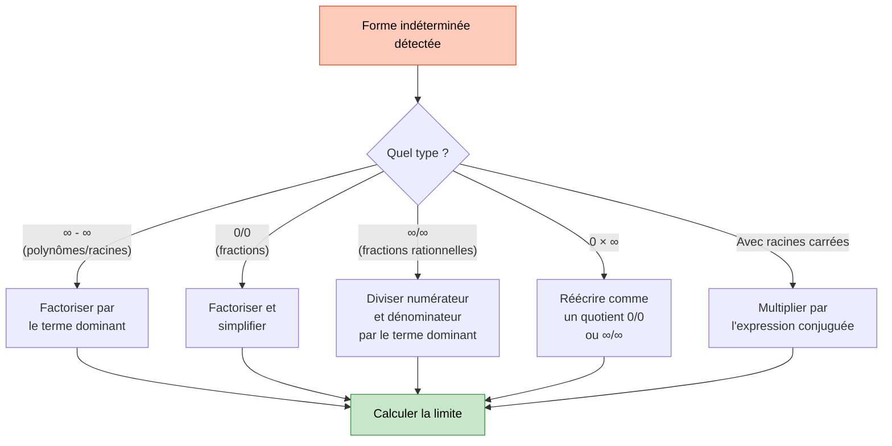
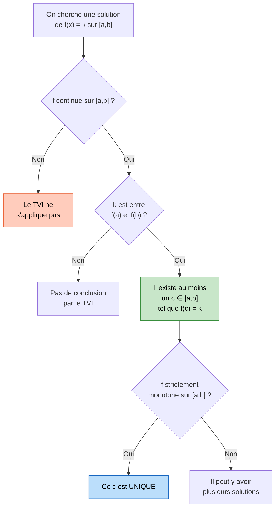

# Limites et Continuité

L'étude des limites et de la continuité constitue le coeur de l'analyse mathématique en Terminale. Ces notions formalisent l'idée intuitive de "tendre vers" et permettent de décrire le comportement des fonctions aux bornes de leur domaine. Elles s'appuient sur les bases posées en [[Suites]] et en [[Trigonométrie]], et préparent l'étude des fonctions [[Exponentielle et Logarithme|exponentielle et logarithme]] ainsi que des [[Primitives et Intégrales|intégrales]].

> [!quote] Augustin-Louis Cauchy
> *"On doit donner une base solide et rigoureuse aux notions vagues de limite et d'infiniment petit."*


## 1. Limite d'une fonction en un point

### Limite finie en un point

> [!important] Définition
> On dit que $f$ a pour **limite** $\ell \in \mathbb{R}$ quand $x$ tend vers $a$ si, pour tout intervalle ouvert $I$ contenant $\ell$, il existe un intervalle ouvert $J$ contenant $a$ tel que pour tout $x \in J \cap D_f$ (avec $x \neq a$) : $f(x) \in I$.
>
> **Notation :** $\displaystyle\lim_{x \to a} f(x) = \ell$

En termes plus concrets : $f(x)$ peut être rendu aussi proche de $\ell$ qu'on le souhaite, pourvu que $x$ soit suffisamment proche de $a$.

### Limite infinie en un point

> [!important] Définition
> On dit que $\displaystyle\lim_{x \to a} f(x) = +\infty$ si, pour tout réel $M > 0$, il existe $\delta > 0$ tel que :
> $$0 < |x - a| < \delta \implies f(x) > M$$

> [!example] Exemple
> $\displaystyle\lim_{x \to 0} \frac{1}{x^2} = +\infty$ : quand $x$ s'approche de $0$, $\frac{1}{x^2}$ devient aussi grand qu'on veut.

### Limites à gauche et à droite

On distingue :
- **Limite à gauche** : $\displaystyle\lim_{x \to a^-} f(x)$ (on s'approche par les valeurs inférieures à $a$)
- **Limite à droite** : $\displaystyle\lim_{x \to a^+} f(x)$ (on s'approche par les valeurs supérieures à $a$)

> [!tip] Critère d'existence
> $\displaystyle\lim_{x \to a} f(x)$ existe si et seulement si les limites à gauche et à droite existent et sont **égales**.


## 2. Limite d'une fonction en l'infini

### Limite finie en $+\infty$

> [!important] Définition
> $\displaystyle\lim_{x \to +\infty} f(x) = \ell$ si $f(x)$ peut être rendu aussi proche de $\ell$ qu'on le souhaite dès que $x$ est **suffisamment grand**.

### Limite infinie en $+\infty$

> [!important] Définition
> $\displaystyle\lim_{x \to +\infty} f(x) = +\infty$ si $f(x)$ dépasse tout nombre fixé d'avance dès que $x$ est suffisamment grand.

### Limites de référence

| Fonction | $\displaystyle\lim_{x \to +\infty}$ | $\displaystyle\lim_{x \to -\infty}$ |
|---|---|---|
| $x^n$ ($n$ pair) | $+\infty$ | $+\infty$ |
| $x^n$ ($n$ impair) | $+\infty$ | $-\infty$ |
| $\dfrac{1}{x}$ | $0^+$ | $0^-$ |
| $\dfrac{1}{x^n}$ | $0$ | $0$ |
| $\sqrt{x}$ | $+\infty$ | -- |


## 3. Opérations sur les limites

> [!important] Tableau des opérations

**Somme :**

| $\lim f$ | $\ell$ | $\ell$ | $\ell$ | $+\infty$ | $-\infty$ | $+\infty$ |
|---|---|---|---|---|---|---|
| $\lim g$ | $\ell'$ | $+\infty$ | $-\infty$ | $+\infty$ | $-\infty$ | $-\infty$ |
| $\lim(f+g)$ | $\ell + \ell'$ | $+\infty$ | $-\infty$ | $+\infty$ | $-\infty$ | **FI** |

**Produit :**

| $\lim f$ | $\ell$ | $\ell > 0$ | $\ell < 0$ | $+\infty$ | $+\infty$ | $-\infty$ | $0$ |
|---|---|---|---|---|---|---|---|
| $\lim g$ | $\ell'$ | $+\infty$ | $+\infty$ | $+\infty$ | $-\infty$ | $-\infty$ | $\pm\infty$ |
| $\lim(fg)$ | $\ell\ell'$ | $+\infty$ | $-\infty$ | $+\infty$ | $-\infty$ | $+\infty$ | **FI** |

**Quotient ($g \neq 0$) :**

| $\lim f$ | $\ell$ | $\ell \neq 0$ | $+\infty$ | $\pm\infty$ |
|---|---|---|---|---|
| $\lim g$ | $\ell' \neq 0$ | $0$ | $\ell'$ | $\pm\infty$ |
| $\lim(f/g)$ | $\ell/\ell'$ | $\pm\infty$ | $\pm\infty$ | **FI** |

> [!warning] Formes indéterminées (FI)
> Il y a **quatre formes indéterminées** classiques :
> $$\frac{0}{0} \qquad \frac{\infty}{\infty} \qquad +\infty - \infty \qquad 0 \times \infty$$
> Une forme indéterminée signifie qu'on ne peut **pas** conclure sans calcul supplémentaire.


## 4. Lever une forme indéterminée



> [!tip] Méthode générale pour les polynômes et fractions rationnelles
> **En $+\infty$ ou $-\infty$ :** on factorise par le terme de **plus haut degré**.
>
> Exemple : $\displaystyle\lim_{x \to +\infty} \frac{3x^2 - x + 1}{2x^2 + 5} = \lim_{x \to +\infty} \frac{x^2(3 - 1/x + 1/x^2)}{x^2(2 + 5/x^2)} = \frac{3}{2}$


## 5. Théorèmes de comparaison

### Théorème des gendarmes

> [!important] Théorème
> Si, au voisinage de $a$ (ou de $+\infty$) :
> $$g(x) \leq f(x) \leq h(x)$$
> et si $\displaystyle\lim g(x) = \lim h(x) = \ell$, alors $\displaystyle\lim f(x) = \ell$.

> [!example] Exemple classique
> Montrer que $\displaystyle\lim_{x \to +\infty} \frac{\sin x}{x} = 0$.
>
> Pour tout $x > 0$ : $-1 \leq \sin x \leq 1$, donc $\dfrac{-1}{x} \leq \dfrac{\sin x}{x} \leq \dfrac{1}{x}$.
>
> Comme $\displaystyle\lim_{x \to +\infty} \frac{-1}{x} = \lim_{x \to +\infty} \frac{1}{x} = 0$, par le théorème des gendarmes : $\displaystyle\lim_{x \to +\infty} \frac{\sin x}{x} = 0$.

### Théorème de comparaison (minoration/majoration)

> [!important] Théorème
> - Si $f(x) \geq g(x)$ au voisinage de $a$ et $\displaystyle\lim g(x) = +\infty$, alors $\displaystyle\lim f(x) = +\infty$.
> - Si $f(x) \leq g(x)$ au voisinage de $a$ et $\displaystyle\lim g(x) = -\infty$, alors $\displaystyle\lim f(x) = -\infty$.


## 6. Asymptotes

### Asymptote horizontale

> [!important] Définition
> La droite $y = \ell$ est **asymptote horizontale** à la courbe de $f$ en $+\infty$ (resp. $-\infty$) si :
> $$\lim_{x \to +\infty} f(x) = \ell \quad \left(\text{resp. } \lim_{x \to -\infty} f(x) = \ell\right)$$

### Asymptote verticale

> [!important] Définition
> La droite $x = a$ est **asymptote verticale** à la courbe de $f$ si :
> $$\lim_{x \to a^+} f(x) = \pm\infty \quad \text{ou} \quad \lim_{x \to a^-} f(x) = \pm\infty$$

### Asymptote oblique

> [!important] Définition
> La droite $y = mx + p$ est **asymptote oblique** à la courbe de $f$ en $+\infty$ si :
> $$\lim_{x \to +\infty} [f(x) - (mx + p)] = 0$$
>
> Pour la trouver :
> 1. $m = \displaystyle\lim_{x \to +\infty} \frac{f(x)}{x}$
> 2. $p = \displaystyle\lim_{x \to +\infty} [f(x) - mx]$

> [!example] Exemple
> $f(x) = \dfrac{x^2 + 1}{x} = x + \dfrac{1}{x}$.
>
> - $\displaystyle\lim_{x \to +\infty} \frac{f(x)}{x} = \lim_{x \to +\infty} \frac{x^2+1}{x^2} = 1 = m$
> - $\displaystyle\lim_{x \to +\infty} [f(x) - x] = \lim_{x \to +\infty} \frac{1}{x} = 0 = p$
>
> Donc $y = x$ est **asymptote oblique** en $+\infty$ (et en $-\infty$ aussi).
> De plus, $\displaystyle\lim_{x \to 0^+} f(x) = +\infty$ et $\displaystyle\lim_{x \to 0^-} f(x) = -\infty$ : $x = 0$ est **asymptote verticale**.


## 7. Continuité

### Définition

> [!important] Définition
> Une fonction $f$ est **continue en $a$** si :
> $$\lim_{x \to a} f(x) = f(a)$$
> Cela suppose trois conditions :
> 1. $f$ est définie en $a$,
> 2. $\displaystyle\lim_{x \to a} f(x)$ existe,
> 3. cette limite vaut $f(a)$.

> [!important] Continuité sur un intervalle
> $f$ est **continue sur un intervalle $I$** si elle est continue en tout point de $I$.

### Fonctions continues classiques

> [!tip] Admis au lycée
> Les fonctions suivantes sont continues sur leur domaine de définition :
> - Fonctions polynomiales
> - Fonctions rationnelles (quotient de polynômes)
> - Fonctions $\sqrt{x}$, $|x|$
> - Fonctions trigonométriques ($\cos$, $\sin$, $\tan$)
> - Fonctions [[Exponentielle et Logarithme|$\exp$ et $\ln$]]
>
> La **somme**, le **produit**, le **quotient** (si dénominateur non nul) et la **composée** de fonctions continues sont continues.


## 8. Théorème des valeurs intermédiaires (TVI)

> [!important] Théorème des valeurs intermédiaires
> Si $f$ est **continue sur $[a, b]$**, alors pour tout réel $k$ compris entre $f(a)$ et $f(b)$, il existe **au moins un** réel $c \in [a, b]$ tel que :
> $$f(c) = k$$

### Corollaire : version avec unicité

> [!important] Corollaire (TVI avec stricte monotonie)
> Si $f$ est **continue et strictement monotone sur $[a, b]$**, alors pour tout réel $k$ compris entre $f(a)$ et $f(b)$, il existe **un unique** réel $c \in [a, b]$ tel que $f(c) = k$.




## 9. Application du TVI : existence de solutions

> [!example] Exemple fondamental
> Montrer que l'équation $x^3 + x - 1 = 0$ admet une unique solution sur $\mathbb{R}$.
>
> Soit $f(x) = x^3 + x - 1$.
>
> **Continuité :** $f$ est polynomiale, donc continue sur $\mathbb{R}$.
>
> **Stricte monotonie :** $f'(x) = 3x^2 + 1 > 0$ pour tout $x \in \mathbb{R}$. Donc $f$ est **strictement croissante** sur $\mathbb{R}$.
>
> **Valeurs aux bornes :**
> - $f(0) = -1 < 0$
> - $f(1) = 1 > 0$
>
> **Conclusion :** $f$ est continue et strictement croissante sur $[0, 1]$, $f(0) < 0 < f(1)$.
> Par le corollaire du TVI, il existe un **unique** $c \in ]0, 1[$ tel que $f(c) = 0$.
>
> Par stricte monotonie sur $\mathbb{R}$ tout entier, cette solution est l'unique solution sur $\mathbb{R}$.

> [!tip] Méthode de dichotomie
> Pour approcher la solution, on peut utiliser la **dichotomie** : on coupe l'intervalle en deux et on teste le signe au milieu.
> - $f(0{,}5) = 0{,}125 + 0{,}5 - 1 = -0{,}375 < 0$ : la solution est dans $]0{,}5\,;\, 1[$
> - $f(0{,}75) \approx 0{,}172 > 0$ : la solution est dans $]0{,}5\,;\, 0{,}75[$
> - Etc.

### Visualisation animée (Manim)

> [!note] Ce que montre l'animation
> Comme $f(x) = x^3 + x - 1$ est **continue** et change de signe entre $a = 0$ ($f(0) = -1 < 0$) et $b = 1$ ($f(1) = 1 > 0$), le théorème des valeurs intermédiaires garantit qu'elle **traverse** la droite $y = 0$. L'animation exécute la **dichotomie** : à chaque étape on teste le signe au milieu de l'intervalle et on garde la moitié qui encadre la racine. Le crochet se resserre et le point $c$ tel que $f(c) = 0$ apparaît : on *voit* l'existence et l'unicité de la solution.

```manim
# Rendu : manimgl tvi_dichotomie.py TVIDichotomie
from manimlib import *
import numpy as np


class TVIDichotomie(Scene):
    def construct(self):
        def f(x):
            return x**3 + x - 1

        axes = Axes(x_range=(0, 1, 0.25), y_range=(-1.5, 1.5, 0.5), height=6, width=10)
        courbe = axes.get_graph(f, color=BLUE)
        lab = Tex("f(x)=x^3+x-1", color=BLUE).next_to(axes.c2p(0.9, f(0.9)), UR)
        self.play(ShowCreation(axes), ShowCreation(courbe), Write(lab))

        # f continue, f(0) < 0 < f(1) : changement de signe
        a, b = 0.0, 1.0
        self.play(FadeIn(Dot(axes.c2p(a, f(a)), color=RED)),
                  FadeIn(Dot(axes.c2p(b, f(b)), color=GREEN)))
        niveau = DashedLine(axes.c2p(0, 0), axes.c2p(1, 0), color=GREY_B)  # y = k = 0
        self.play(ShowCreation(niveau))

        # Dichotomie : le crochet [a, b] se resserre autour de la racine
        crochet = Line(axes.c2p(a, 0), axes.c2p(b, 0), color=YELLOW, stroke_width=8)
        self.play(ShowCreation(crochet))
        for _ in range(7):
            m = (a + b) / 2
            milieu = Dot(axes.c2p(m, 0), color=YELLOW, radius=0.04)
            vert = DashedLine(axes.c2p(m, 0), axes.c2p(m, f(m)), color=GREY_B)
            pt = Dot(axes.c2p(m, f(m)), color=YELLOW)
            self.play(FadeIn(milieu), ShowCreation(vert), FadeIn(pt), run_time=0.4)
            if f(m) > 0:
                b = m
            else:
                a = m
            nouveau = Line(axes.c2p(a, 0), axes.c2p(b, 0), color=YELLOW, stroke_width=8)
            self.play(Transform(crochet, nouveau), FadeOut(vert), FadeOut(pt),
                      run_time=0.4)

        c = Dot(axes.c2p((a + b) / 2, 0), color=ORANGE)
        lab_c = Tex("c", color=ORANGE).next_to(c, DOWN, buff=0.15)
        self.play(FadeIn(c), Write(lab_c))
        note = Tex(r"f \text{ continue},\ f(a)<0<f(b)\ \Rightarrow\ \exists\,c,\ f(c)=0")
        note.to_edge(UP).set_backstroke()
        self.play(Write(note))
        self.wait(2)
```


## 10. Exercices types corrigés

### Exercice 1 : Calcul de limites

> [!example] Énoncé
> Calculer les limites suivantes :
> 1. $\displaystyle\lim_{x \to +\infty} \frac{3x^3 - 2x + 1}{5x^3 + x^2 - 4}$
> 2. $\displaystyle\lim_{x \to 2} \frac{x^2 - 4}{x - 2}$
> 3. $\displaystyle\lim_{x \to +\infty} \left(\sqrt{x^2 + x} - x\right)$

**Correction :**

**1.** Forme indéterminée $\dfrac{\infty}{\infty}$. On factorise par $x^3$ :

$$\frac{3x^3 - 2x + 1}{5x^3 + x^2 - 4} = \frac{x^3(3 - 2/x^2 + 1/x^3)}{x^3(5 + 1/x - 4/x^3)} \xrightarrow[x \to +\infty]{} \frac{3}{5}$$

**2.** Forme indéterminée $\dfrac{0}{0}$. On factorise :

$$\frac{x^2 - 4}{x - 2} = \frac{(x-2)(x+2)}{x-2} = x + 2 \xrightarrow[x \to 2]{} 4$$

**3.** Forme indéterminée $\infty - \infty$. On multiplie par l'expression conjuguée :

$$\sqrt{x^2 + x} - x = \frac{(\sqrt{x^2+x} - x)(\sqrt{x^2+x} + x)}{\sqrt{x^2+x} + x} = \frac{x^2 + x - x^2}{\sqrt{x^2+x} + x} = \frac{x}{\sqrt{x^2+x} + x}$$

Pour $x > 0$ : $\sqrt{x^2 + x} = x\sqrt{1 + 1/x}$, donc :

$$\frac{x}{x\sqrt{1+1/x} + x} = \frac{1}{\sqrt{1+1/x} + 1} \xrightarrow[x \to +\infty]{} \frac{1}{2}$$


### Exercice 2 : Asymptotes

> [!example] Énoncé
> Déterminer les asymptotes de $f(x) = \dfrac{2x^2 + 3x - 1}{x + 1}$.

**Correction :**

**Asymptote verticale :** $f$ n'est pas définie en $x = -1$.

$\displaystyle\lim_{x \to -1^+} f(x) = \lim_{x \to -1^+} \frac{2-3-1}{0^+} = \frac{-2}{0^+} = -\infty$

$\displaystyle\lim_{x \to -1^-} f(x) = +\infty$

Donc $x = -1$ est **asymptote verticale**.

**Asymptote oblique :** On effectue la division euclidienne :

$2x^2 + 3x - 1 = (x+1)(2x+1) - 2$

Donc $f(x) = 2x + 1 - \dfrac{2}{x+1}$.

$\displaystyle\lim_{x \to \pm\infty} [f(x) - (2x+1)] = \lim_{x \to \pm\infty} \frac{-2}{x+1} = 0$

Donc $y = 2x + 1$ est **asymptote oblique** en $+\infty$ et en $-\infty$.


### Exercice 3 : Théorème des gendarmes

> [!example] Énoncé
> Montrer que $\displaystyle\lim_{x \to +\infty} \frac{x + \cos x}{x} = 1$.

**Correction :**

Pour tout $x > 0$ : $-1 \leq \cos x \leq 1$, donc :

$$\frac{x - 1}{x} \leq \frac{x + \cos x}{x} \leq \frac{x + 1}{x}$$

$$1 - \frac{1}{x} \leq \frac{x + \cos x}{x} \leq 1 + \frac{1}{x}$$

Or $\displaystyle\lim_{x \to +\infty} \left(1 - \frac{1}{x}\right) = \lim_{x \to +\infty} \left(1 + \frac{1}{x}\right) = 1$.

Par le théorème des gendarmes : $\displaystyle\lim_{x \to +\infty} \frac{x + \cos x}{x} = 1$.


### Exercice 4 : Application du TVI

> [!example] Énoncé
> Montrer que l'équation $\cos(x) = x$ admet une unique solution sur $[0, \pi/2]$.

**Correction :**

Soit $g(x) = \cos(x) - x$, définie et continue sur $[0, \pi/2]$.

- $g(0) = \cos(0) - 0 = 1 > 0$
- $g(\pi/2) = \cos(\pi/2) - \pi/2 = -\pi/2 < 0$

De plus, $g'(x) = -\sin(x) - 1 < 0$ pour tout $x \in [0, \pi/2]$, donc $g$ est **strictement décroissante**.

Par le corollaire du TVI, il existe un **unique** $c \in ]0, \pi/2[$ tel que $g(c) = 0$, c'est-à-dire $\cos(c) = c$.
