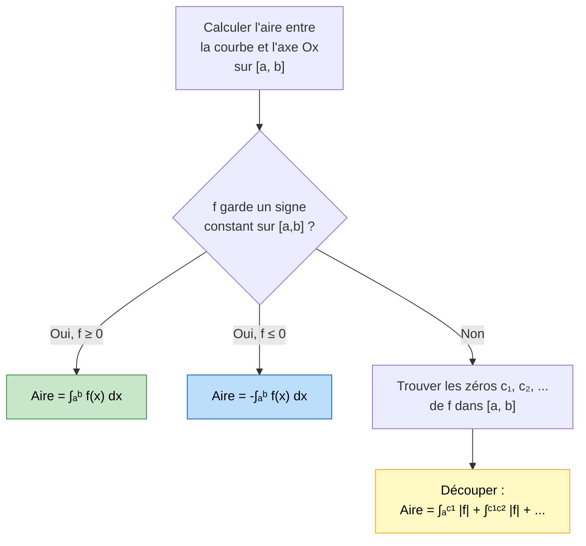

# Primitives et Intégrales

Le calcul intégral est l'un des deux grands piliers du calcul infinitésimal (avec la dérivation). Il permet de calculer des aires, des volumes, des moyennes, et intervient dans toutes les sciences. Cette fiche s'appuie sur les notions de [[Limites et Continuité]] et sur les propriétés de la fonction [[Exponentielle et Logarithme|exponentielle et du logarithme]].

> [!quote] Gottfried Wilhelm Leibniz
> *"Il est indigne d'hommes excellents de perdre des heures comme des esclaves dans le labeur du calcul, lequel pourrait être confié sans risque à n'importe qui si des machines étaient utilisées."*


## 1. Notion de primitive

### Définition

> [!important] Définition
> Soit $f$ une fonction définie sur un intervalle $I$.
> Une fonction $F$ est une **primitive** de $f$ sur $I$ si, pour tout $x \in I$ :
> $$\boxed{F'(x) = f(x)}$$

> [!example] Exemple
> $F(x) = x^3$ est une primitive de $f(x) = 3x^2$ sur $\mathbb{R}$ car $F'(x) = 3x^2 = f(x)$.

### Unicité à une constante près

> [!important] Théorème fondamental
> Si $F$ est une primitive de $f$ sur un intervalle $I$, alors **toutes** les primitives de $f$ sur $I$ sont de la forme :
> $$\boxed{F(x) + C \quad \text{où } C \in \mathbb{R}}$$

> [!tip] Justification
> Si $F$ et $G$ sont deux primitives de $f$, alors $(F - G)' = f - f = 0$ sur $I$.
> Or une fonction de dérivée nulle sur un intervalle est constante. Donc $F - G = C$.

> [!warning] Attention
> L'intervalle est essentiel ! Sur un domaine non connexe (par exemple $\mathbb{R}^*$), la constante peut être différente sur chaque composante connexe.

### Primitive passant par un point donné

> [!important] Propriété
> Il existe une **unique** primitive $F$ de $f$ sur $I$ vérifiant la condition initiale $F(x_0) = y_0$.

> [!example] Exemple
> Trouver la primitive $F$ de $f(x) = 2x$ telle que $F(1) = 5$.
>
> Les primitives de $2x$ sont $F(x) = x^2 + C$.
> $F(1) = 1 + C = 5$, donc $C = 4$.
> Ainsi $F(x) = x^2 + 4$.


## 2. Tableau des primitives usuelles

> [!important] Primitives fondamentales

| Fonction $f(x)$ | Primitive $F(x)$ | Domaine |
|---|---|---|
| $k$ (constante) | $kx$ | $\mathbb{R}$ |
| $x^n$ ($n \neq -1$) | $\dfrac{x^{n+1}}{n+1}$ | $\mathbb{R}$ si $n \in \mathbb{N}$, $]0,+\infty[$ sinon |
| $\dfrac{1}{x}$ | $\ln\|x\|$ | $]0,+\infty[$ ou $]-\infty,0[$ |
| $\dfrac{1}{x^2}$ | $-\dfrac{1}{x}$ | $]0,+\infty[$ ou $]-\infty,0[$ |
| $\dfrac{1}{\sqrt{x}}$ | $2\sqrt{x}$ | $]0,+\infty[$ |
| $e^x$ | $e^x$ | $\mathbb{R}$ |
| $e^{ax}$ ($a \neq 0$) | $\dfrac{1}{a}e^{ax}$ | $\mathbb{R}$ |
| $\cos(x)$ | $\sin(x)$ | $\mathbb{R}$ |
| $\sin(x)$ | $-\cos(x)$ | $\mathbb{R}$ |
| $\cos(ax + b)$ | $\dfrac{1}{a}\sin(ax+b)$ | $\mathbb{R}$ |
| $\sin(ax + b)$ | $-\dfrac{1}{a}\cos(ax+b)$ | $\mathbb{R}$ |
| $\dfrac{1}{\cos^2(x)}$ | $\tan(x)$ | $]-\frac{\pi}{2}, \frac{\pi}{2}[$ |

### Primitives avec composition

> [!important] Formules avec $u = u(x)$
> Si $u$ est une fonction dérivable :
>
> | $f(x)$ | $F(x)$ | Condition |
> |---|---|---|
> | $u' \cdot u^n$ ($n \neq -1$) | $\dfrac{u^{n+1}}{n+1}$ | |
> | $\dfrac{u'}{u}$ | $\ln\|u\|$ | $u \neq 0$ |
> | $u' \cdot e^u$ | $e^u$ | |
> | $\dfrac{u'}{2\sqrt{u}}$ | $\sqrt{u}$ | $u > 0$ |
> | $u' \cdot \cos(u)$ | $\sin(u)$ | |
> | $u' \cdot \sin(u)$ | $-\cos(u)$ | |

> [!tip] Comment reconnaître la forme $\frac{u'}{u}$
> Si au numérateur on voit (à un coefficient près) la dérivée du dénominateur, c'est la forme $\frac{u'}{u}$ dont une primitive est $\ln|u|$.
>
> Exemple : $\displaystyle\int \frac{2x}{x^2+1}\,dx = \ln(x^2+1) + C$ car $(x^2+1)' = 2x$.


## 3. L'intégrale d'une fonction continue

### Définition

> [!important] Définition
> Soit $f$ une fonction **continue** sur un intervalle $[a, b]$. On appelle **intégrale de $f$ de $a$ à $b$** le nombre réel :
> $$\boxed{\int_a^b f(x)\,dx = F(b) - F(a)}$$
> où $F$ est une primitive **quelconque** de $f$ sur $[a, b]$.

On note aussi $\left[F(x)\right]_a^b = F(b) - F(a)$.

> [!tip] Pourquoi le choix de la primitive n'importe pas
> Si $G = F + C$ est une autre primitive, alors $G(b) - G(a) = F(b) + C - F(a) - C = F(b) - F(a)$. La constante s'annule.

### Interprétation géométrique

> [!important] Aire sous la courbe
> Si $f$ est **continue et positive** sur $[a, b]$, alors $\displaystyle\int_a^b f(x)\,dx$ représente l'**aire** de la surface délimitée par :
> - la courbe de $f$,
> - l'axe des abscisses,
> - les droites verticales $x = a$ et $x = b$.

Si $f$ change de signe, l'intégrale calcule l'aire **algébrique** (les parties sous l'axe comptent négativement).

> [!warning] Aire vs intégrale
> Pour calculer l'**aire géométrique** (toujours positive) quand $f$ change de signe, on calcule :
> $$\mathcal{A} = \int_a^b |f(x)|\,dx$$
> ce qui nécessite de découper l'intervalle aux points où $f$ s'annule.



### Visualisation animée (Manim)

> [!note] Ce que montre l'animation
> On approche l'aire sous la courbe par des **rectangles** (somme de Riemann). En affinant la subdivision ($\Delta x \to 0$), l'aire totale des rectangles tend vers la valeur exacte de l'intégrale $\int_a^b f(x)\,dx$. C'est la définition intuitive de l'intégrale comme « somme continue ».

```manim
# Rendu : manimgl riemann.py SommesDeRiemann
from manimlib import *


class SommesDeRiemann(Scene):
    def construct(self):
        def f(x):
            return 0.2 * x**2 + 0.5

        axes = Axes(x_range=(0, 5), y_range=(0, 6), height=6, width=10)
        courbe = axes.get_graph(f, x_range=(0, 4), color=BLUE)
        self.play(ShowCreation(axes), ShowCreation(courbe))

        a, b = 0, 4  # bornes de l'intégrale

        # On part d'une subdivision grossière (rectangles larges)
        rects = axes.get_riemann_rectangles(
            courbe, x_range=(a, b), dx=1.0, fill_opacity=0.6)
        self.play(FadeIn(rects))
        self.wait()

        # On affine : dx -> 0, l'aire des rectangles converge vers l'intégrale
        for dx in [0.5, 0.25, 0.1, 0.05]:
            nouveaux = axes.get_riemann_rectangles(
                courbe, x_range=(a, b), dx=dx, fill_opacity=0.6)
            self.play(Transform(rects, nouveaux), run_time=1.2)
            self.wait(0.3)

        legende = Tex(
            r"\sum_k f(x_k)\,\Delta x \;\xrightarrow[\Delta x \to 0]{}\;",
            r"\int_a^b f(x)\,dx",
        ).to_edge(UP).set_backstroke()
        self.play(Write(legende))
        self.wait(2)
```


## 4. Propriétés de l'intégrale

### Linéarité

> [!important] Propriété
> Pour toutes fonctions continues $f$ et $g$ sur $[a, b]$ et tout réel $\lambda$ :
> $$\boxed{\int_a^b [f(x) + g(x)]\,dx = \int_a^b f(x)\,dx + \int_a^b g(x)\,dx}$$
> $$\boxed{\int_a^b \lambda f(x)\,dx = \lambda \int_a^b f(x)\,dx}$$

### Relation de Chasles

> [!important] Propriété
> Pour tout $c$ entre $a$ et $b$ (ou même en dehors) :
> $$\boxed{\int_a^b f(x)\,dx = \int_a^c f(x)\,dx + \int_c^b f(x)\,dx}$$

### Convention d'orientation

$$\int_a^a f(x)\,dx = 0 \qquad \int_b^a f(x)\,dx = -\int_a^b f(x)\,dx$$

### Positivité

> [!important] Propriété
> Si $f \geq 0$ sur $[a, b]$ (avec $a \leq b$), alors :
> $$\int_a^b f(x)\,dx \geq 0$$

**Conséquence (comparaison) :** Si $f \leq g$ sur $[a, b]$, alors :
$$\int_a^b f(x)\,dx \leq \int_a^b g(x)\,dx$$

### Inégalité triangulaire

$$\left|\int_a^b f(x)\,dx\right| \leq \int_a^b |f(x)|\,dx$$


## 5. Valeur moyenne d'une fonction

> [!important] Définition
> La **valeur moyenne** de $f$ sur l'intervalle $[a, b]$ est :
> $$\boxed{\mu = \frac{1}{b - a}\int_a^b f(x)\,dx}$$

> [!tip] Interprétation
> La valeur moyenne $\mu$ est la hauteur du rectangle de base $[a, b]$ ayant la même aire que la surface sous la courbe de $f$.

> [!example] Exemple
> Valeur moyenne de $f(x) = x^2$ sur $[0, 3]$ :
>
> $$\mu = \frac{1}{3 - 0}\int_0^3 x^2\,dx = \frac{1}{3}\left[\frac{x^3}{3}\right]_0^3 = \frac{1}{3} \times \frac{27}{3} = \frac{1}{3} \times 9 = 3$$


## 6. Relation intégrale-primitive (théorème fondamental)

> [!important] Théorème fondamental de l'analyse
> Si $f$ est continue sur un intervalle $I$ et $a \in I$, alors la fonction :
> $$F(x) = \int_a^x f(t)\,dt$$
> est l'unique primitive de $f$ sur $I$ qui s'annule en $a$ : $F(a) = 0$ et $F'(x) = f(x)$.

Ce théorème établit le lien fondamental entre l'opération de dérivation et celle d'intégration : ce sont des opérations **réciproques**.

> [!example] Exemple
> Soit $F(x) = \displaystyle\int_0^x e^{-t^2}\,dt$.
>
> Alors $F'(x) = e^{-x^2}$ et $F(0) = 0$.
>
> (Note : $F$ n'a pas d'expression explicite en termes de fonctions usuelles, mais le théorème nous assure qu'elle est bien définie et dérivable.)


## 7. Intégration par parties

### Formule

> [!important] Théorème (Intégration par parties)
> Si $u$ et $v$ sont deux fonctions de classe $\mathcal{C}^1$ sur $[a, b]$, alors :
> $$\boxed{\int_a^b u'(x) v(x)\,dx = \Big[u(x) v(x)\Big]_a^b - \int_a^b u(x) v'(x)\,dx}$$

> [!tip] Quand utiliser l'intégration par parties ?
> - Quand le produit $f(x) = u'(x) v(x)$ apparaît et que l'intégrale de $u(x)v'(x)$ est **plus simple** que l'originale.
> - Cas typiques : $\int x e^x\,dx$, $\int x \cos x\,dx$, $\int \ln x\,dx$.

### Choix de $u'$ et $v$

La règle mnémotechnique **LAET** (Logarithme, Arc-fonction, Exponentielle, Trigonométrique) peut guider le choix de $v$ : on choisit $v$ en priorité parmi les fonctions les plus à gauche dans cette liste (car elles se simplifient en dérivant).

> [!example] Exemple 1 : $\int_0^1 x e^x\,dx$
>
> On pose $v(x) = x$ (qui se simplifie en dérivant) et $u'(x) = e^x$.
> Donc $v'(x) = 1$ et $u(x) = e^x$.
>
> $$\int_0^1 x e^x\,dx = \Big[x e^x\Big]_0^1 - \int_0^1 1 \cdot e^x\,dx$$
> $$= (1 \cdot e^1 - 0) - \Big[e^x\Big]_0^1 = e - (e - 1) = 1$$

> [!example] Exemple 2 : $\int_1^e \ln x\,dx$
>
> On écrit $\ln x = 1 \cdot \ln x$ et on pose $u'(x) = 1$ et $v(x) = \ln x$.
> Donc $u(x) = x$ et $v'(x) = \dfrac{1}{x}$.
>
> $$\int_1^e \ln x\,dx = \Big[x \ln x\Big]_1^e - \int_1^e x \cdot \frac{1}{x}\,dx$$
> $$= (e \cdot 1 - 1 \cdot 0) - \int_1^e 1\,dx = e - (e - 1) = 1$$


## 8. Exercices types corrigés

### Exercice 1 : Calculs de primitives

> [!example] Énoncé
> Déterminer les primitives des fonctions suivantes :
> 1. $f(x) = 3x^2 - 4x + 7$
> 2. $g(x) = \dfrac{2x+1}{x^2+x+3}$
> 3. $h(x) = \sin(3x+1)$

**Correction :**

**1.** $F(x) = x^3 - 2x^2 + 7x + C$

**2.** On reconnaît la forme $\dfrac{u'}{u}$ car $(x^2+x+3)' = 2x+1$.

$G(x) = \ln(x^2+x+3) + C$

(Note : $x^2+x+3 > 0$ pour tout $x$ car $\Delta = 1 - 12 < 0$, donc pas besoin de valeur absolue.)

**3.** $H(x) = -\dfrac{1}{3}\cos(3x+1) + C$


### Exercice 2 : Calcul d'intégrales

> [!example] Énoncé
> Calculer les intégrales suivantes :
> 1. $\displaystyle\int_0^2 (x^3 - 3x + 1)\,dx$
> 2. $\displaystyle\int_0^{\pi} \sin(x)\,dx$
> 3. $\displaystyle\int_1^e \dfrac{1}{x}\,dx$

**Correction :**

**1.**

$$\int_0^2 (x^3 - 3x + 1)\,dx = \left[\frac{x^4}{4} - \frac{3x^2}{2} + x\right]_0^2 = \left(\frac{16}{4} - \frac{12}{2} + 2\right) - 0 = 4 - 6 + 2 = 0$$

**2.**

$$\int_0^{\pi} \sin(x)\,dx = \Big[-\cos(x)\Big]_0^{\pi} = -\cos(\pi) + \cos(0) = -(-1) + 1 = 2$$

**3.**

$$\int_1^e \frac{1}{x}\,dx = \Big[\ln(x)\Big]_1^e = \ln(e) - \ln(1) = 1 - 0 = 1$$


### Exercice 3 : Aire entre deux courbes

> [!example] Énoncé
> Calculer l'aire délimitée par les courbes de $f(x) = x^2$ et $g(x) = x$ sur $[0, 1]$.

**Correction :**

Sur $[0, 1]$, comparons $f$ et $g$ : $x - x^2 = x(1-x) \geq 0$, donc $g(x) \geq f(x)$.

L'aire entre les deux courbes est :

$$\mathcal{A} = \int_0^1 [g(x) - f(x)]\,dx = \int_0^1 (x - x^2)\,dx$$

$$= \left[\frac{x^2}{2} - \frac{x^3}{3}\right]_0^1 = \frac{1}{2} - \frac{1}{3} = \frac{1}{6}$$

L'aire vaut $\dfrac{1}{6}$ unité d'aire.


### Exercice 4 : Valeur moyenne

> [!example] Énoncé
> Calculer la valeur moyenne de $f(x) = e^{2x}$ sur $[0, 1]$.

**Correction :**

$$\mu = \frac{1}{1 - 0}\int_0^1 e^{2x}\,dx = \left[\frac{1}{2}e^{2x}\right]_0^1 = \frac{1}{2}e^2 - \frac{1}{2} = \frac{e^2 - 1}{2}$$

Numériquement : $\mu \approx \dfrac{7{,}389 - 1}{2} \approx 3{,}195$.


### Exercice 5 : Intégration par parties

> [!example] Énoncé
> Calculer $\displaystyle\int_0^1 (2x+1)e^{-x}\,dx$.

**Correction :**

On pose $v(x) = 2x+1$ et $u'(x) = e^{-x}$.

Donc $v'(x) = 2$ et $u(x) = -e^{-x}$.

$$\int_0^1 (2x+1)e^{-x}\,dx = \Big[-(2x+1)e^{-x}\Big]_0^1 - \int_0^1 (-e^{-x}) \cdot 2\,dx$$

$$= \Big[-(2x+1)e^{-x}\Big]_0^1 + 2\int_0^1 e^{-x}\,dx$$

Calcul du crochet :

$$\Big[-(2x+1)e^{-x}\Big]_0^1 = -3e^{-1} - (-1) = 1 - \frac{3}{e}$$

Calcul de l'intégrale restante :

$$2\int_0^1 e^{-x}\,dx = 2\Big[-e^{-x}\Big]_0^1 = 2(-e^{-1} + 1) = 2 - \frac{2}{e}$$

Total :

$$1 - \frac{3}{e} + 2 - \frac{2}{e} = 3 - \frac{5}{e}$$


### Exercice 6 : Primitive de ln

> [!example] Énoncé
> Montrer que $\displaystyle\int_1^e x\ln(x)\,dx = \dfrac{e^2 + 1}{4}$.

**Correction :**

Intégration par parties : $v(x) = \ln(x)$, $u'(x) = x$.

$v'(x) = \dfrac{1}{x}$, $u(x) = \dfrac{x^2}{2}$.

$$\int_1^e x\ln(x)\,dx = \left[\frac{x^2}{2}\ln(x)\right]_1^e - \int_1^e \frac{x^2}{2} \cdot \frac{1}{x}\,dx$$

$$= \left(\frac{e^2}{2} \cdot 1 - \frac{1}{2} \cdot 0\right) - \int_1^e \frac{x}{2}\,dx$$

$$= \frac{e^2}{2} - \left[\frac{x^2}{4}\right]_1^e = \frac{e^2}{2} - \frac{e^2}{4} + \frac{1}{4} = \frac{e^2}{4} + \frac{1}{4} = \frac{e^2 + 1}{4}$$
