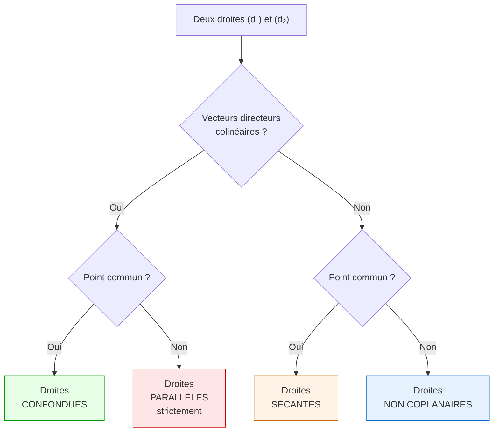
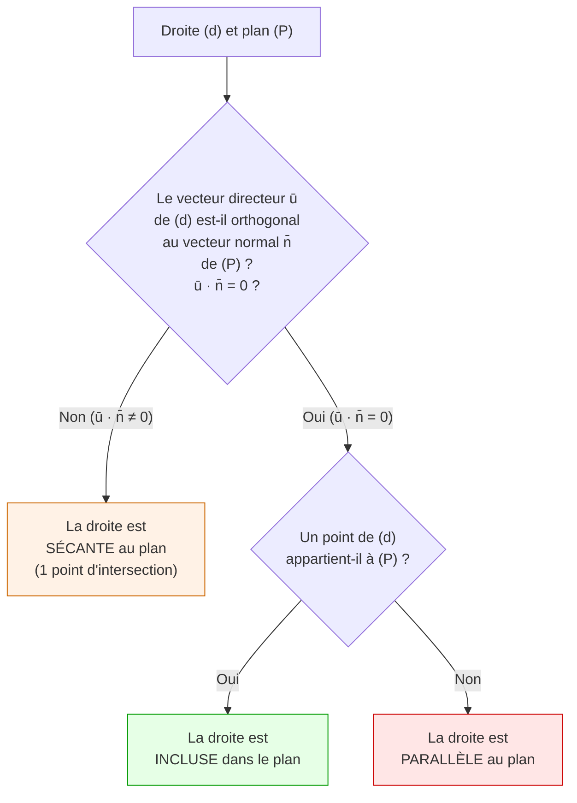
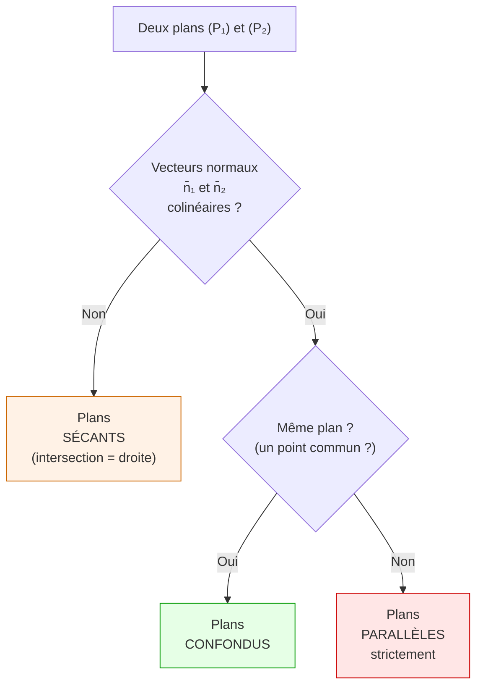

# Partie II : Géométrie dans l'espace (Terminale)

## 5. Repère de l'espace

### 5.1 Repère cartésien

> [!important] Définition : Repère de l'espace
> Un **repère** de l'espace est constitué d'un point $O$ et de trois vecteurs $\vec{i}$, $\vec{j}$, $\vec{k}$ non coplanaires.
> - Si les trois vecteurs sont deux à deux orthogonaux et de norme 1 : repère **orthonormé**.
> - On note le repère $(O, \vec{i}, \vec{j}, \vec{k})$.

Tout point $M$ de l'espace est repéré par trois coordonnées $(x, y, z)$ :

$$\overrightarrow{OM} = x\vec{i} + y\vec{j} + z\vec{k}$$

### 5.2 Distance et milieu dans l'espace

**Distance :**
$$AB = \sqrt{(x_B-x_A)^2 + (y_B-y_A)^2 + (z_B-z_A)^2}$$

**Milieu :**
$$I\left(\frac{x_A+x_B}{2}\;;\;\frac{y_A+y_B}{2}\;;\;\frac{z_A+z_B}{2}\right)$$

## 6. Vecteurs dans l'espace

### 6.1 Coordonnées

$$\overrightarrow{AB} = \begin{pmatrix} x_B - x_A \\ y_B - y_A \\ z_B - z_A \end{pmatrix}$$

### 6.2 Opérations

Les opérations (addition, multiplication par un scalaire, relation de Chasles) se généralisent composante par composante.

### 6.3 Colinéarité et coplanarité

> [!important] Colinéarité et coplanarité
> - $\vec{u}$ et $\vec{v}$ sont **colinéaires** si $\vec{u} = k\vec{v}$ pour un certain $k \in \mathbb{R}$ (ou $\vec{v} = \vec{0}$).
> - Trois vecteurs $\vec{u}$, $\vec{v}$, $\vec{w}$ sont **coplanaires** s'il existe $a, b \in \mathbb{R}$ tels que $\vec{w} = a\vec{u} + b\vec{v}$.
>
> Quatre points $A$, $B$, $C$, $D$ sont **coplanaires** si et seulement si $\overrightarrow{AB}$, $\overrightarrow{AC}$, $\overrightarrow{AD}$ sont coplanaires.

## 7. Droites dans l'espace

### 7.1 Représentation paramétrique

> [!important] Définition : Représentation paramétrique d'une droite
> Une droite $(d)$ passant par $A(x_A, y_A, z_A)$ et de vecteur directeur $\vec{u}(a, b, c)$ admet la représentation paramétrique :
> $$\begin{cases} x = x_A + at \\ y = y_A + bt \\ z = z_A + ct \end{cases}, \quad t \in \mathbb{R}$$

> [!example] Exemple
> Droite passant par $A(1, 2, -1)$ et de vecteur directeur $\vec{u}(3, -1, 2)$ :
> $$\begin{cases} x = 1 + 3t \\ y = 2 - t \\ z = -1 + 2t \end{cases}, \quad t \in \mathbb{R}$$

### 7.2 Droite définie par deux points

Si la droite passe par $A$ et $B$, on prend $\vec{u} = \overrightarrow{AB}$ comme vecteur directeur.

## 8. Plans dans l'espace

### 8.1 Équation cartésienne d'un plan

> [!important] Définition : Équation cartésienne d'un plan
> Un plan $(\mathcal{P})$ admet une équation de la forme :
> $$ax + by + cz + d = 0$$
> où $(a, b, c) \neq (0, 0, 0)$.
>
> Le vecteur $\vec{n} = \begin{pmatrix} a \\ b \\ c \end{pmatrix}$ est un **vecteur normal** au plan.

> [!tip] Déterminer l'équation d'un plan
> **Connaissant un point $A$ et un vecteur normal $\vec{n}(a,b,c)$ :**
>
> $M(x,y,z) \in (\mathcal{P}) \iff \overrightarrow{AM} \cdot \vec{n} = 0$
>
> Soit : $a(x-x_A) + b(y-y_A) + c(z-z_A) = 0$

> [!example] Exemple
> Plan passant par $A(1, 0, 2)$ de vecteur normal $\vec{n}(2, -3, 1)$ :
>
> $2(x-1) - 3(y-0) + 1(z-2) = 0$
>
> $2x - 3y + z - 4 = 0$

### 8.2 Représentation paramétrique d'un plan

Un plan passant par $A$ et dirigé par $\vec{u}$ et $\vec{v}$ (non colinéaires) :

$$\begin{cases} x = x_A + su_1 + tv_1 \\ y = y_A + su_2 + tv_2 \\ z = z_A + su_3 + tv_3 \end{cases}, \quad (s, t) \in \mathbb{R}^2$$

## 9. Positions relatives

### 9.1 Positions relatives de deux droites

> [!warning] Attention
> Dans l'espace (contrairement au plan), deux droites non parallèles peuvent ne **pas** se couper : elles sont alors **non coplanaires** (on dit parfois « gauches »).

### 9.2 Positions relatives d'une droite et d'un plan

### 9.3 Positions relatives de deux plans

## 10. Produit scalaire dans l'espace

### 10.1 Définition

> [!important] Produit scalaire dans l'espace
> Dans un repère orthonormé, si $\vec{u} = \begin{pmatrix} x \\ y \\ z \end{pmatrix}$ et $\vec{v} = \begin{pmatrix} x' \\ y' \\ z' \end{pmatrix}$ :
> $$\vec{u} \cdot \vec{v} = xx' + yy' + zz'$$
>
> La formule avec l'angle reste valable :
> $$\vec{u} \cdot \vec{v} = \|\vec{u}\| \times \|\vec{v}\| \times \cos(\vec{u}, \vec{v})$$

### 10.2 Norme

$$\|\vec{u}\| = \sqrt{\vec{u} \cdot \vec{u}} = \sqrt{x^2 + y^2 + z^2}$$

### 10.3 Orthogonalité

$$\vec{u} \perp \vec{v} \iff \vec{u} \cdot \vec{v} = 0 \iff xx' + yy' + zz' = 0$$

## 11. Orthogonalité dans l'espace

### 11.1 Droite orthogonale à un plan

> [!important] Définition
> Une droite $(d)$ est **orthogonale** à un plan $(\mathcal{P})$ si elle est orthogonale à toutes les droites de $(\mathcal{P})$.
>
> **En pratique :** $(d) \perp (\mathcal{P}) \iff$ le vecteur directeur de $(d)$ est un vecteur normal de $(\mathcal{P})$.

> [!tip] Critère pratique
> Il suffit de vérifier que le vecteur directeur de $(d)$ est orthogonal à **deux** vecteurs non colinéaires du plan.

### 11.2 Plans orthogonaux

Deux plans sont **perpendiculaires** si leurs vecteurs normaux sont perpendiculaires :

$$(\mathcal{P}_1) \perp (\mathcal{P}_2) \iff \vec{n_1} \cdot \vec{n_2} = 0$$

## 12. Distances

### 12.1 Distance d'un point à un plan

> [!important] Formule : Distance point-plan
> La distance du point $M_0(x_0, y_0, z_0)$ au plan $(\mathcal{P}) : ax + by + cz + d = 0$ est :
> $$d(M_0, \mathcal{P}) = \frac{|ax_0 + by_0 + cz_0 + d|}{\sqrt{a^2 + b^2 + c^2}}$$

> [!example] Exemple
> Distance du point $A(1, 2, 3)$ au plan $(\mathcal{P}) : 2x - y + 2z - 1 = 0$ :
>
> $d(A, \mathcal{P}) = \frac{|2(1) - 1(2) + 2(3) - 1|}{\sqrt{4+1+4}} = \frac{|2-2+6-1|}{\sqrt{9}} = \frac{5}{3}$

### 12.2 Distance d'un point à une droite

> [!important] Formule : Distance point-droite (dans l'espace)
> La distance du point $M$ à la droite $(d)$ passant par $A$ et de vecteur directeur $\vec{u}$ est :
> $$d(M, d) = \frac{\|\overrightarrow{AM} \wedge \vec{u}\|}{\|\vec{u}\|}$$
> (où $\wedge$ désigne le **produit vectoriel**, hors programme strict mais utilisable en exercice).
>
> **Méthode alternative (au programme) :** on calcule le projeté orthogonal $H$ de $M$ sur $(d)$, puis $d(M, d) = MH$.

**Calcul du projeté orthogonal $H$ :**

$H$ est le point de $(d)$ tel que $\overrightarrow{AH} = t\vec{u}$ avec :

$$t = \frac{\overrightarrow{AM} \cdot \vec{u}}{\|\vec{u}\|^2}$$

Puis $d(M, d) = MH = \|\overrightarrow{MH}\|$.

> [!example] Exemple
> Soit la droite $(d)$ passant par $A(0,0,0)$ de vecteur $\vec{u}(1,0,0)$ et le point $M(2,3,4)$.
>
> $\overrightarrow{AM} = (2,3,4)$
>
> $t = \frac{(2,3,4) \cdot (1,0,0)}{1} = 2$
>
> $H = A + 2\vec{u} = (2, 0, 0)$
>
> $d(M, d) = MH = \sqrt{0+9+16} = \sqrt{25} = 5$

### 12.3 Distance entre deux droites parallèles

Si $(d_1)$ et $(d_2)$ sont parallèles, on prend un point $A$ de $(d_1)$ et on calcule $d(A, d_2)$.

### 12.4 Distance entre deux droites non coplanaires

Si $(d_1)$ et $(d_2)$ sont non coplanaires, la distance entre elles est la distance entre les deux plans parallèles qui les contiennent respectivement.

On peut aussi utiliser la formule avec le projeté commun perpendiculaire.
