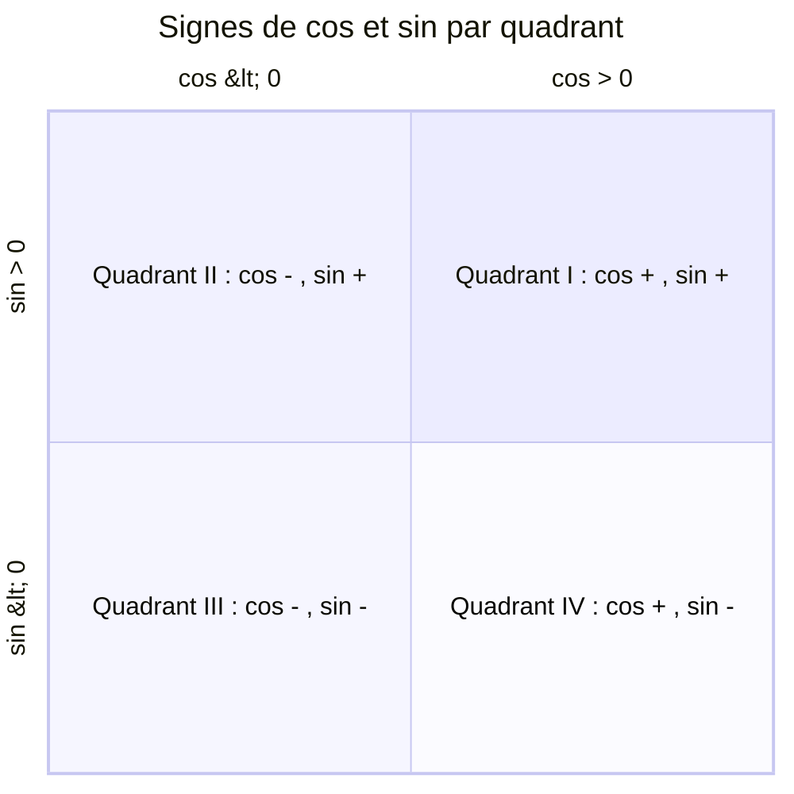
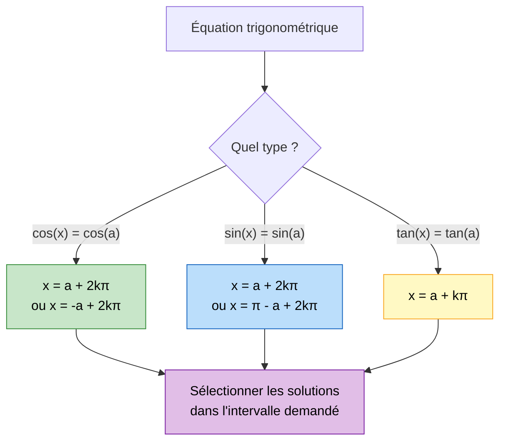

# Trigonométrie

La trigonométrie est l'étude des relations entre les angles et les longueurs. Au lycée, elle se construit autour du **cercle trigonométrique** et constitue un outil essentiel pour l'analyse, la géométrie et les [[Suites|suites numériques]]. Elle prépare aussi aux [[Limites et Continuité|limites]] et à l'étude des fonctions en Terminale.

> [!quote] Leonhard Euler
> *"Rien ne se fait dans l'univers en quoi ne se manifeste quelque rapport de maximum ou de minimum."*

## 1. Le cercle trigonométrique

> [!important] Définition
> Le **cercle trigonométrique** est le cercle de centre $O$ (origine du repère) et de rayon $1$, orienté dans le **sens direct** (sens inverse des aiguilles d'une montre, appelé aussi sens trigonométrique).

Tout point $M$ du cercle est repéré par un angle $\theta$ (mesuré depuis le point $A(1, 0)$ sur l'axe des abscisses). Les coordonnées de $M$ sont :

$$M = (\cos\theta,\; \sin\theta)$$

> [!tip] Relation fondamentale
> Pour tout angle $\theta$ :
> $$\boxed{\cos^2\theta + \sin^2\theta = 1}$$
> C'est une conséquence directe du théorème de Pythagore appliqué au triangle $OHM$ où $H$ est le projeté de $M$ sur l'axe des abscisses.

## 2. Radians et degrés

> [!important] Définition
> Le **radian** est l'unité d'angle telle qu'un angle de $1$ radian intercepte un arc de longueur $1$ sur le cercle trigonométrique (de rayon $1$).

### Conversion

$$\boxed{\pi \text{ rad} = 180\degree}$$

| Degrés | $0\degree$ | $30\degree$ | $45\degree$ | $60\degree$ | $90\degree$ | $120\degree$ | $135\degree$ | $150\degree$ | $180\degree$ | $270\degree$ | $360\degree$ |
|---|---|---|---|---|---|---|---|---|---|---|---|
| Radians | $0$ | $\dfrac{\pi}{6}$ | $\dfrac{\pi}{4}$ | $\dfrac{\pi}{3}$ | $\dfrac{\pi}{2}$ | $\dfrac{2\pi}{3}$ | $\dfrac{3\pi}{4}$ | $\dfrac{5\pi}{6}$ | $\pi$ | $\dfrac{3\pi}{2}$ | $2\pi$ |

> [!tip] Formules de conversion
> - Degrés vers radians : $\alpha_{\text{rad}} = \alpha_{\text{deg}} \times \dfrac{\pi}{180}$
> - Radians vers degrés : $\alpha_{\text{deg}} = \alpha_{\text{rad}} \times \dfrac{180}{\pi}$

## 3. Cosinus, sinus, tangente

### Définitions sur le cercle

Pour un angle $\theta$, le point $M$ sur le cercle trigonométrique a pour coordonnées $(\cos\theta, \sin\theta)$.

- $\cos\theta$ est l'**abscisse** de $M$
- $\sin\theta$ est l'**ordonnée** de $M$
- La **tangente** est définie par :

$$\boxed{\tan\theta = \frac{\sin\theta}{\cos\theta}} \quad \text{(définie si } \cos\theta \neq 0\text{)}$$

### Domaines de variation

| Fonction | Domaine de définition | Ensemble image | Période |
|---|---|---|---|
| $\cos$ | $\mathbb{R}$ | $[-1, 1]$ | $2\pi$ |
| $\sin$ | $\mathbb{R}$ | $[-1, 1]$ | $2\pi$ |
| $\tan$ | $\mathbb{R} \setminus \left\{\dfrac{\pi}{2} + k\pi,\; k \in \mathbb{Z}\right\}$ | $\mathbb{R}$ | $\pi$ |

### Parité

- $\cos$ est **paire** : $\cos(-\theta) = \cos\theta$
- $\sin$ est **impaire** : $\sin(-\theta) = -\sin\theta$
- $\tan$ est **impaire** : $\tan(-\theta) = -\tan\theta$

## 4. Valeurs remarquables

> [!important] Tableau à connaître par coeur

| $\theta$ | $0$ | $\dfrac{\pi}{6}$ | $\dfrac{\pi}{4}$ | $\dfrac{\pi}{3}$ | $\dfrac{\pi}{2}$ | $\pi$ |
|---|---|---|---|---|---|---|
| $\cos\theta$ | $1$ | $\dfrac{\sqrt{3}}{2}$ | $\dfrac{\sqrt{2}}{2}$ | $\dfrac{1}{2}$ | $0$ | $-1$ |
| $\sin\theta$ | $0$ | $\dfrac{1}{2}$ | $\dfrac{\sqrt{2}}{2}$ | $\dfrac{\sqrt{3}}{2}$ | $1$ | $0$ |
| $\tan\theta$ | $0$ | $\dfrac{1}{\sqrt{3}}$ | $1$ | $\sqrt{3}$ | non définie | $0$ |

> [!tip] Astuce mnémotechnique
> Pour le cosinus, retenir la séquence des numérateurs : $\sqrt{4}, \sqrt{3}, \sqrt{2}, \sqrt{1}, \sqrt{0}$ divisés par $2$.
> Soit : $\dfrac{2}{2}, \dfrac{\sqrt{3}}{2}, \dfrac{\sqrt{2}}{2}, \dfrac{1}{2}, \dfrac{0}{2}$
> Pour le sinus, c'est la même séquence **dans l'ordre inverse**.

## 5. Signes dans les quadrants

| Quadrant | Intervalle de $\theta$ | $\cos\theta$ | $\sin\theta$ | $\tan\theta$ |
|---|---|---|---|---|
| I | $\left[0, \dfrac{\pi}{2}\right]$ | $+$ | $+$ | $+$ |
| II | $\left[\dfrac{\pi}{2}, \pi\right]$ | $-$ | $+$ | $-$ |
| III | $\left[\pi, \dfrac{3\pi}{2}\right]$ | $-$ | $-$ | $+$ |
| IV | $\left[\dfrac{3\pi}{2}, 2\pi\right]$ | $+$ | $-$ | $-$ |

> [!tip] Moyen mnémotechnique
> En partant du quadrant I et en tournant dans le sens trigonométrique, la tangente est positive dans les quadrants **impairs** (I et III).

## 6. Angles associés

Les formules des angles associés permettent de se ramener au premier quadrant.

| Relation | $\cos$ | $\sin$ |
|---|---|---|
| $\pi - \theta$ | $-\cos\theta$ | $\sin\theta$ |
| $\pi + \theta$ | $-\cos\theta$ | $-\sin\theta$ |
| $-\theta$ | $\cos\theta$ | $-\sin\theta$ |
| $\dfrac{\pi}{2} - \theta$ | $\sin\theta$ | $\cos\theta$ |
| $\dfrac{\pi}{2} + \theta$ | $-\sin\theta$ | $\cos\theta$ |

> [!warning] Attention
> $\cos\left(\dfrac{\pi}{2} - \theta\right) = \sin\theta$ : c'est la relation de **complémentarité** (co-sinus = sinus du complémentaire).

## 7. Formules d'addition

> [!important] Formules fondamentales

$$\boxed{\cos(a + b) = \cos a \cos b - \sin a \sin b}$$

$$\boxed{\cos(a - b) = \cos a \cos b + \sin a \sin b}$$

$$\boxed{\sin(a + b) = \sin a \cos b + \cos a \sin b}$$

$$\boxed{\sin(a - b) = \sin a \cos b - \cos a \sin b}$$

$$\boxed{\tan(a + b) = \frac{\tan a + \tan b}{1 - \tan a \tan b}} \quad \text{(si le dénominateur est non nul)}$$

> [!tip] Démonstration de $\cos(a - b)$
> On considère les points $M_1 = (\cos a, \sin a)$ et $M_2 = (\cos b, \sin b)$ sur le cercle trigonométrique.
> Le produit scalaire $\vec{OM_1} \cdot \vec{OM_2} = \cos a \cos b + \sin a \sin b$.
> Or $\vec{OM_1} \cdot \vec{OM_2} = 1 \times 1 \times \cos(a - b)$.
> D'où $\cos(a - b) = \cos a \cos b + \sin a \sin b$.

## 8. Formules de duplication

En posant $a = b$ dans les formules d'addition :

$$\boxed{\cos(2a) = \cos^2 a - \sin^2 a = 2\cos^2 a - 1 = 1 - 2\sin^2 a}$$

$$\boxed{\sin(2a) = 2 \sin a \cos a}$$

$$\boxed{\tan(2a) = \frac{2\tan a}{1 - \tan^2 a}}$$

### Formules de linéarisation (déduites des formules de duplication)

$$\cos^2 a = \frac{1 + \cos(2a)}{2} \qquad \sin^2 a = \frac{1 - \cos(2a)}{2}$$

> [!tip] Utilité
> Les formules de linéarisation sont très utiles pour le calcul de [[Primitives et Intégrales|primitives]] de fonctions trigonométriques.

## 9. Équations trigonométriques

### Résolution de $\cos(x) = \cos(a)$

> [!important] Théorème
> $$\cos(x) = \cos(a) \iff x = a + 2k\pi \quad \text{ou} \quad x = -a + 2k\pi \quad (k \in \mathbb{Z})$$

On écrit aussi : $x \equiv \pm a \pmod{2\pi}$.

### Résolution de $\sin(x) = \sin(a)$

> [!important] Théorème
> $$\sin(x) = \sin(a) \iff x = a + 2k\pi \quad \text{ou} \quad x = \pi - a + 2k\pi \quad (k \in \mathbb{Z})$$

### Résolution de $\tan(x) = \tan(a)$

> [!important] Théorème
> $$\tan(x) = \tan(a) \iff x = a + k\pi \quad (k \in \mathbb{Z})$$

> [!warning] Attention
> Toujours vérifier le **domaine de définition** et, si l'équation est posée sur un **intervalle donné**, sélectionner les solutions appartenant à cet intervalle.

## 10. Exercices types corrigés

### Exercice 1 : Valeurs exactes

> [!example] Énoncé
> Calculer les valeurs exactes de $\cos\left(\dfrac{5\pi}{12}\right)$ et $\sin\left(\dfrac{5\pi}{12}\right)$.

**Correction :**

On remarque que $\dfrac{5\pi}{12} = \dfrac{\pi}{4} + \dfrac{\pi}{6}$.

En utilisant les formules d'addition :

$$\cos\left(\frac{5\pi}{12}\right) = \cos\left(\frac{\pi}{4} + \frac{\pi}{6}\right) = \cos\frac{\pi}{4}\cos\frac{\pi}{6} - \sin\frac{\pi}{4}\sin\frac{\pi}{6}$$

$$= \frac{\sqrt{2}}{2} \cdot \frac{\sqrt{3}}{2} - \frac{\sqrt{2}}{2} \cdot \frac{1}{2} = \frac{\sqrt{6} - \sqrt{2}}{4}$$

$$\sin\left(\frac{5\pi}{12}\right) = \sin\left(\frac{\pi}{4} + \frac{\pi}{6}\right) = \sin\frac{\pi}{4}\cos\frac{\pi}{6} + \cos\frac{\pi}{4}\sin\frac{\pi}{6}$$

$$= \frac{\sqrt{2}}{2} \cdot \frac{\sqrt{3}}{2} + \frac{\sqrt{2}}{2} \cdot \frac{1}{2} = \frac{\sqrt{6} + \sqrt{2}}{4}$$

### Exercice 2 : Résoudre une équation

> [!example] Énoncé
> Résoudre sur $[0, 2\pi[$ l'équation $2\cos^2(x) - \cos(x) - 1 = 0$.

**Correction :**

On pose $X = \cos(x)$. L'équation devient :

$$2X^2 - X - 1 = 0$$

Discriminant : $\Delta = 1 + 8 = 9$. Donc :

$$X = \frac{1 + 3}{4} = 1 \quad \text{ou} \quad X = \frac{1 - 3}{4} = -\frac{1}{2}$$

**Cas 1 :** $\cos(x) = 1 \Rightarrow x = 0$.

**Cas 2 :** $\cos(x) = -\dfrac{1}{2} \Rightarrow x = \dfrac{2\pi}{3}$ ou $x = \dfrac{4\pi}{3}$.

L'ensemble des solutions sur $[0, 2\pi[$ est : $\left\{0,\; \dfrac{2\pi}{3},\; \dfrac{4\pi}{3}\right\}$.

### Exercice 3 : Simplification avec les formules de duplication

> [!example] Énoncé
> Simplifier $A = \cos^2(x) - \sin^2(x) + 2\sin(x)\cos(x)$.

**Correction :**

On reconnaît les formules de duplication :
- $\cos^2(x) - \sin^2(x) = \cos(2x)$
- $2\sin(x)\cos(x) = \sin(2x)$

Donc :

$$A = \cos(2x) + \sin(2x)$$

On peut aussi mettre sous la forme $R\cos(2x - \varphi)$ :

$$A = \sqrt{2}\cos\left(2x - \frac{\pi}{4}\right)$$

(car $\cos(2x) + \sin(2x) = \sqrt{2}\left(\frac{1}{\sqrt{2}}\cos(2x) + \frac{1}{\sqrt{2}}\sin(2x)\right) = \sqrt{2}\cos\left(2x - \frac{\pi}{4}\right)$)

### Exercice 4 : Résoudre une équation en sinus

> [!example] Énoncé
> Résoudre sur $\mathbb{R}$ l'équation $\sin(3x) = \sin\left(x + \dfrac{\pi}{4}\right)$.

**Correction :**

D'après le formulaire :

$\sin(\alpha) = \sin(\beta) \iff \alpha = \beta + 2k\pi$ ou $\alpha = \pi - \beta + 2k\pi$.

**Cas 1 :** $3x = x + \dfrac{\pi}{4} + 2k\pi$

$2x = \dfrac{\pi}{4} + 2k\pi$, donc $x = \dfrac{\pi}{8} + k\pi$.

**Cas 2 :** $3x = \pi - x - \dfrac{\pi}{4} + 2k\pi$

$4x = \dfrac{3\pi}{4} + 2k\pi$, donc $x = \dfrac{3\pi}{16} + \dfrac{k\pi}{2}$.

L'ensemble des solutions est :

$$\mathcal{S} = \left\{\frac{\pi}{8} + k\pi,\; k \in \mathbb{Z}\right\} \cup \left\{\frac{3\pi}{16} + \frac{k\pi}{2},\; k \in \mathbb{Z}\right\}$$

### Exercice 5 : Prouver une identité

> [!example] Énoncé
> Montrer que pour tout $x \in \mathbb{R}$ :
> $$\cos(x) + \cos\left(x + \frac{2\pi}{3}\right) + \cos\left(x + \frac{4\pi}{3}\right) = 0$$

**Correction :**

En utilisant la formule d'addition $\cos(a + b) = \cos a \cos b - \sin a \sin b$ :

$$\cos\left(x + \frac{2\pi}{3}\right) = \cos x \cos\frac{2\pi}{3} - \sin x \sin\frac{2\pi}{3} = -\frac{1}{2}\cos x - \frac{\sqrt{3}}{2}\sin x$$

$$\cos\left(x + \frac{4\pi}{3}\right) = \cos x \cos\frac{4\pi}{3} - \sin x \sin\frac{4\pi}{3} = -\frac{1}{2}\cos x + \frac{\sqrt{3}}{2}\sin x$$

Somme :

$$\cos x + \left(-\frac{1}{2}\cos x - \frac{\sqrt{3}}{2}\sin x\right) + \left(-\frac{1}{2}\cos x + \frac{\sqrt{3}}{2}\sin x\right)$$

$$= \cos x - \frac{1}{2}\cos x - \frac{1}{2}\cos x = 0$$
