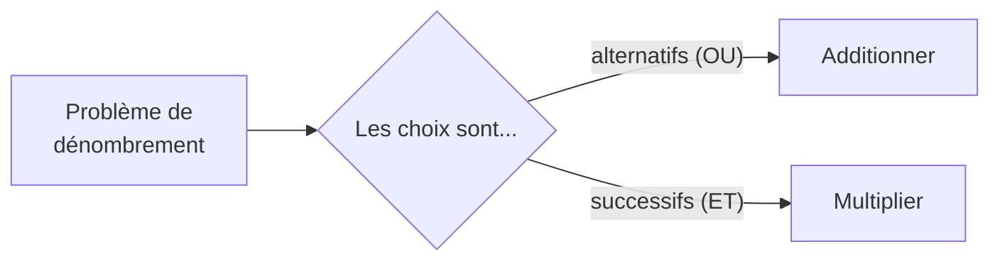
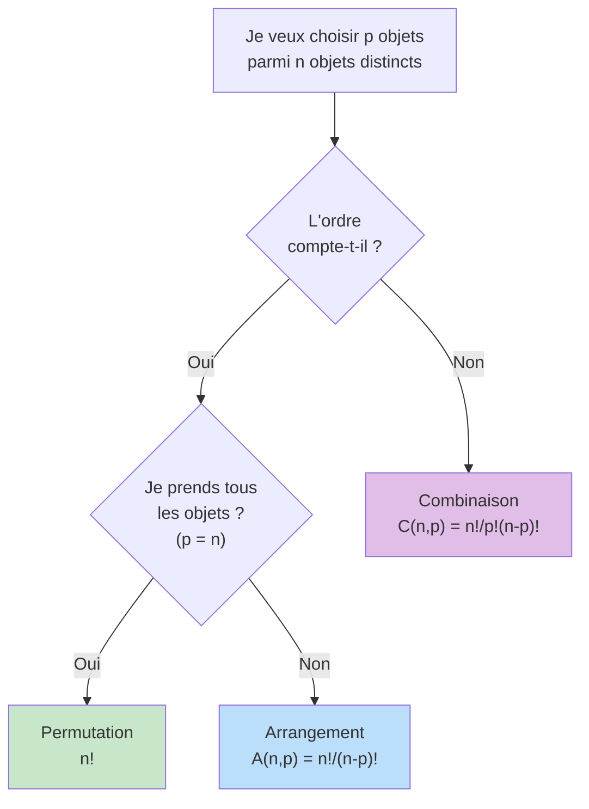

# Dénombrement

Le dénombrement consiste à **compter** le nombre d'éléments d'un ensemble fini. C'est un outil indispensable en probabilités : pour calculer une probabilité, il faut souvent compter les cas favorables et les cas totaux.

> [!quote] Prérequis
> [[Ensembles et Nombres]], [[Probabilités]]

## Principes fondamentaux

### Principe additif

> [!abstract] Principe additif
> Si deux ensembles $A$ et $B$ sont **disjoints** ($A \cap B = \emptyset$), alors :
> $$\text{Card}(A \cup B) = \text{Card}(A) + \text{Card}(B)$$

**En pratique :** quand on fait un choix **OU** un autre (alternatives exclusives), on **additionne**.

### Principe multiplicatif

> [!abstract] Principe multiplicatif
> Si un choix se décompose en étapes successives indépendantes avec $n_1$ possibilités pour la 1ère étape, $n_2$ pour la 2ème, etc. :
> $$\text{Nombre total} = n_1 \times n_2 \times \cdots \times n_k$$

**En pratique :** quand on fait un choix **ET** un autre (étapes successives), on **multiplie**.

> [!example] Exemple
> Un code est formé de 2 lettres suivies de 3 chiffres.
> - 26 choix pour chaque lettre, 10 choix pour chaque chiffre
> - Total : $26 \times 26 \times 10 \times 10 \times 10 = 676\,000$ codes possibles

## La factorielle

> [!abstract] Définition
> Pour tout entier $n \geq 0$ :
> $$n! = n \times (n-1) \times (n-2) \times \cdots \times 2 \times 1$$
> Par convention : $0! = 1$.

| $n$ | $n!$ |
|---|---|
| 0 | 1 |
| 1 | 1 |
| 2 | 2 |
| 3 | 6 |
| 4 | 24 |
| 5 | 120 |
| 6 | 720 |
| 7 | 5 040 |
| 8 | 40 320 |
| 10 | 3 628 800 |

> [!tip] Propriété fondamentale
> $n! = n \times (n-1)!$ pour tout $n \geq 1$.

**Interprétation :** $n!$ est le nombre de façons d'**ordonner** $n$ objets distincts (permutations).

## Permutations

> [!abstract] Définition
> Une **permutation** de $n$ éléments est un arrangement ordonné de **tous** ces éléments.
> $$\text{Nombre de permutations de } n \text{ éléments} = n!$$

> [!example] Exemple
> De combien de façons peut-on asseoir 5 personnes autour d'une table en ligne ?
>
> $5! = 120$ façons.

> [!warning] Table ronde
> Autour d'une table **ronde**, on fixe une personne et on permute les autres : $(n-1)!$ arrangements.

## Arrangements

> [!abstract] Définition
> Un **arrangement** de $p$ éléments parmi $n$ ($p \leq n$) est un choix **ordonné** de $p$ éléments parmi $n$ éléments distincts.
> $$A_n^p = \frac{n!}{(n-p)!} = n \times (n-1) \times \cdots \times (n-p+1)$$

C'est le nombre de façons de choisir $p$ éléments **en tenant compte de l'ordre**.

> [!example] Exemple
> Dans une classe de 30 élèves, on élit un président, un vice-président et un trésorier.
>
> $A_{30}^3 = 30 \times 29 \times 28 = 24\,360$ possibilités.

## Combinaisons

> [!abstract] Définition
> Une **combinaison** de $p$ éléments parmi $n$ est un choix **non ordonné** de $p$ éléments parmi $n$.
> $$\binom{n}{p} = \frac{n!}{p!(n-p)!} = \frac{A_n^p}{p!}$$
> Se lit "$p$ parmi $n$" ou "combinaison de $n$ choose $p$".

**L'idée :** on divise les arrangements par $p!$ car l'ordre ne compte pas.

### Valeurs utiles

| | $p=0$ | $p=1$ | $p=2$ | $p=3$ | $p=4$ | $p=5$ |
|---|---|---|---|---|---|---|
| $n=0$ | 1 | | | | | |
| $n=1$ | 1 | 1 | | | | |
| $n=2$ | 1 | 2 | 1 | | | |
| $n=3$ | 1 | 3 | 3 | 1 | | |
| $n=4$ | 1 | 4 | 6 | 4 | 1 | |
| $n=5$ | 1 | 5 | 10 | 10 | 5 | 1 |

C'est le **triangle de Pascal**.

### Propriétés essentielles

> [!important] Propriétés des combinaisons
> 1. **Symétrie :** $\binom{n}{p} = \binom{n}{n-p}$
> 2. **Bords :** $\binom{n}{0} = \binom{n}{n} = 1$
> 3. **Formule de Pascal :** $\binom{n}{p} = \binom{n-1}{p-1} + \binom{n-1}{p}$
> 4. **Somme :** $\displaystyle\sum_{p=0}^{n} \binom{n}{p} = 2^n$

> [!example] Exemple
> De combien de façons peut-on choisir une équipe de 3 joueurs parmi 10 ?
>
> L'ordre ne compte pas → $\binom{10}{3} = \frac{10!}{3! \cdot 7!} = \frac{10 \times 9 \times 8}{3 \times 2 \times 1} = 120$

## Formule du binôme de Newton

> [!abstract] Théorème — Binôme de Newton
> Pour tous $a, b \in \mathbb{R}$ et $n \in \mathbb{N}$ :
> $$(a + b)^n = \sum_{k=0}^{n} \binom{n}{k} a^k b^{n-k}$$

> [!example] Exemples
> $(a+b)^2 = a^2 + 2ab + b^2$
>
> $(a+b)^3 = a^3 + 3a^2b + 3ab^2 + b^3$
>
> $(a+b)^4 = a^4 + 4a^3b + 6a^2b^2 + 4ab^3 + b^4$

> [!tip] Cas particuliers utiles
> - $a = 1, b = 1$ : $\sum_{k=0}^{n} \binom{n}{k} = 2^n$ (nombre total de parties d'un ensemble à $n$ éléments)
> - $a = 1, b = -1$ : $\sum_{k=0}^{n} (-1)^k \binom{n}{k} = 0$

## L'arbre de décision : quel outil utiliser ?

> [!important] Résumé rapide
> | Situation | Ordre ? | Formule |
> |---|---|---|
> | Ordonner $n$ objets | Oui | $n!$ |
> | Choisir $p$ parmi $n$, **avec** ordre | Oui | $A_n^p = \frac{n!}{(n-p)!}$ |
> | Choisir $p$ parmi $n$, **sans** ordre | Non | $\binom{n}{p} = \frac{n!}{p!(n-p)!}$ |
> | $n$ choix successifs avec remise, $p$ fois | Oui | $n^p$ |

## Avec ou sans remise ?

> [!warning] Attention à la répétition
> - **Sans remise** (défaut) : chaque objet est choisi au plus une fois → arrangements et combinaisons classiques
> - **Avec remise** : un objet peut être choisi plusieurs fois
>   - Ordonné avec remise : $n^p$ (p-uplets)
>   - Non ordonné avec remise : $\binom{n+p-1}{p}$ (combinaisons avec répétition)

> [!example] Exemple — Tirage avec remise
> On lance un dé 4 fois. Nombre de résultats possibles : $6^4 = 1\,296$ (ordonné, avec remise).

## Exercices types

> [!example] Exercice 1 — Mot de passe
> Un mot de passe contient 4 caractères choisis parmi 26 lettres et 10 chiffres, sans répétition.
>
> **Solution :** C'est un arrangement de 4 parmi 36 (l'ordre compte, sans remise) :
> $A_{36}^4 = 36 \times 35 \times 34 \times 33 = 1\,413\,720$

> [!example] Exercice 2 — Comité
> On choisit un comité de 4 personnes parmi 12 dont au moins 2 femmes (7 femmes, 5 hommes).
>
> **Solution :** On décompose par cas :
> - 2F et 2H : $\binom{7}{2} \times \binom{5}{2} = 21 \times 10 = 210$
> - 3F et 1H : $\binom{7}{3} \times \binom{5}{1} = 35 \times 5 = 175$
> - 4F et 0H : $\binom{7}{4} = 35$
>
> Total : $210 + 175 + 35 = 420$

> [!example] Exercice 3 — Binôme de Newton
> Développer $(2x - 3)^4$.
>
> **Solution :**
> $(2x - 3)^4 = \sum_{k=0}^{4} \binom{4}{k} (2x)^k (-3)^{4-k}$
>
> $= 81 - 216x + 216x^2 - 96x^3 + 16x^4$

## À retenir

> [!important] Les points clés
> 1. **Principe multiplicatif** : le réflexe n°1 en dénombrement
> 2. **Avec ou sans ordre ?** → arrangement ou combinaison
> 3. **Avec ou sans remise ?** → modifie les formules
> 4. **Triangle de Pascal** : $\binom{n}{p} = \binom{n-1}{p-1} + \binom{n-1}{p}$
> 5. **Binôme de Newton** : relie combinaisons et algèbre
