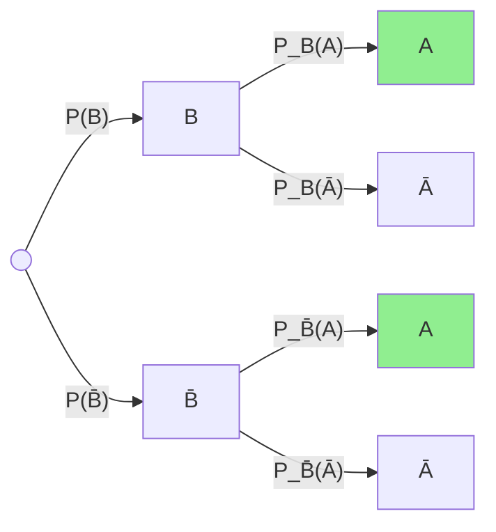
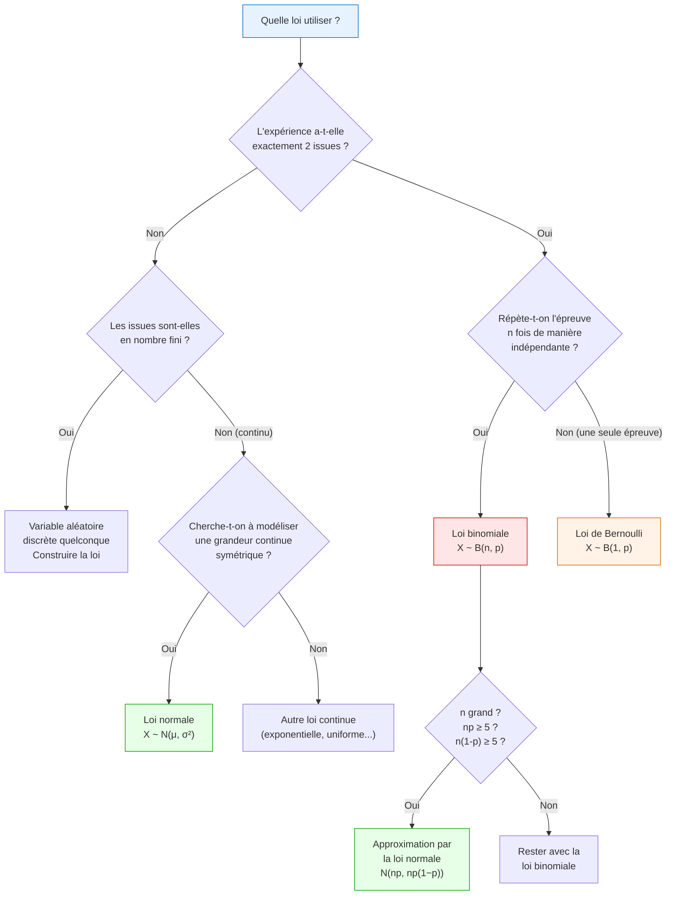

# Probabilités (Seconde – Terminale)

## 4. Notions de base (Seconde)

### 4.1 Vocabulaire

> [!important] Définitions fondamentales
> - **Expérience aléatoire** : expérience dont on ne peut pas prévoir le résultat avec certitude, mais dont on connaît l'ensemble des résultats possibles.
> - **Univers** $\Omega$ : l'ensemble de tous les résultats possibles (issues).
> - **Événement** : partie (sous-ensemble) de $\Omega$.
> - **Événement élémentaire** : événement constitué d'une seule issue.
> - **Événement certain** : $\Omega$ lui-même.
> - **Événement impossible** : $\varnothing$.

> [!example] Exemple : Lancer d'un dé
> $\Omega = \{1, 2, 3, 4, 5, 6\}$
>
> $A$ = « obtenir un nombre pair » = $\{2, 4, 6\}$
>
> $B$ = « obtenir un nombre supérieur à 4 » = $\{5, 6\}$

### 4.2 Opérations sur les événements

| Notation | Nom | Signification |
|----------|-----|---------------|
| $A \cup B$ | Réunion | « $A$ ou $B$ » (au moins l'un des deux) |
| $A \cap B$ | Intersection | « $A$ et $B$ » (les deux simultanément) |
| $\bar{A}$ | Complémentaire | « non $A$ » (contraire de $A$) |
| $A \cap B = \varnothing$ | Incompatibles | $A$ et $B$ ne peuvent pas se réaliser simultanément |

### 4.3 Probabilité d'un événement

> [!important] Définition : Probabilité
> Une **probabilité** sur $\Omega$ est une fonction $P$ qui à chaque événement $A$ associe un réel $P(A)$ vérifiant :
> 1. $0 \leq P(A) \leq 1$
> 2. $P(\Omega) = 1$
> 3. Si $A \cap B = \varnothing$, alors $P(A \cup B) = P(A) + P(B)$

**Propriétés fondamentales :**

- $P(\bar{A}) = 1 - P(A)$
- $P(\varnothing) = 0$
- $P(A \cup B) = P(A) + P(B) - P(A \cap B)$

> [!tip] Équiprobabilité
> Si toutes les issues de $\Omega$ ont la même probabilité (situation d'**équiprobabilité**) :
> $$P(A) = \frac{\text{nombre d'issues favorables}}{\text{nombre total d'issues}} = \frac{|A|}{|\Omega|}$$

## 5. Probabilités conditionnelles (Première)

### 5.1 Définition

> [!important] Définition : Probabilité conditionnelle
> Soit $B$ un événement de probabilité non nulle. La **probabilité de $A$ sachant $B$** est :
> $$P_B(A) = P(A|B) = \frac{P(A \cap B)}{P(B)}$$
> C'est la probabilité que $A$ se réalise **sachant que** $B$ s'est déjà réalisé.

De cette définition découle la **formule de la probabilité de l'intersection** :

$$P(A \cap B) = P(B) \times P_B(A) = P(A) \times P_A(B)$$

### 5.2 Formule des probabilités totales

> [!important] Théorème : Probabilités totales
> Si $B_1, B_2, \ldots, B_n$ forment une **partition** de $\Omega$ (c'est-à-dire : ils sont deux à deux incompatibles et leur réunion est $\Omega$), alors pour tout événement $A$ :
> $$P(A) = \sum_{k=1}^{n} P(B_k) \times P_{B_k}(A)$$
>
> Cas le plus fréquent (partition $\{B, \bar{B}\}$) :
> $$P(A) = P(B) \times P_B(A) + P(\bar{B}) \times P_{\bar{B}}(A)$$

### 5.3 Arbres de probabilité

Les arbres pondérés sont un outil essentiel. Les règles sont :
- La somme des probabilités des branches issues d'un même noeud vaut $1$.
- La probabilité d'un chemin est le **produit** des probabilités des branches qui le composent.
- La probabilité d'un événement est la **somme** des probabilités des chemins qui y mènent.

> [!example] Exemple : Urne et tirage
> Une urne contient 3 boules rouges et 2 boules bleues. On tire une boule, puis une deuxième **sans remise**.
>
> $P(R_1) = \frac{3}{5}$, $P(B_1) = \frac{2}{5}$
>
> $P_{R_1}(R_2) = \frac{2}{4} = \frac{1}{2}$, $P_{R_1}(B_2) = \frac{2}{4} = \frac{1}{2}$
>
> $P_{B_1}(R_2) = \frac{3}{4}$, $P_{B_1}(B_2) = \frac{1}{4}$
>
> $P(\text{2 rouges}) = \frac{3}{5} \times \frac{1}{2} = \frac{3}{10}$
>
> $P(R_2) = P(R_1) \times P_{R_1}(R_2) + P(B_1) \times P_{B_1}(R_2) = \frac{3}{5}\times\frac{1}{2} + \frac{2}{5}\times\frac{3}{4} = \frac{3}{10} + \frac{6}{20} = \frac{3}{10}+\frac{3}{10} = \frac{6}{10} = \frac{3}{5}$

### 5.4 Indépendance

> [!important] Définition : Événements indépendants
> Deux événements $A$ et $B$ sont **indépendants** si et seulement si :
> $$P(A \cap B) = P(A) \times P(B)$$
> De manière équivalente : $P_B(A) = P(A)$ (la réalisation de $B$ n'influence pas $A$).

> [!warning] Attention
> Indépendant $\neq$ incompatible !
> - Deux événements **incompatibles** non vides ne sont **jamais** indépendants (si l'un se réalise, l'autre ne se réalise pas).

## 6. Variables aléatoires discrètes (Première / Terminale)

### 6.1 Définition

> [!important] Définition : Variable aléatoire discrète
> Une **variable aléatoire discrète** $X$ est une fonction qui à chaque issue de $\Omega$ associe un nombre réel.
> La **loi de probabilité** de $X$ est la donnée de toutes les valeurs $x_i$ prises par $X$ et de leurs probabilités $P(X = x_i)$.

### 6.2 Espérance

> [!important] Définition : Espérance
> L'**espérance** de $X$ est la valeur moyenne attendue :
> $$E(X) = \sum_{i} x_i \cdot P(X = x_i)$$

L'espérance est **linéaire** :
- $E(aX + b) = aE(X) + b$

### 6.3 Variance et écart-type

> [!important] Définitions
> $$V(X) = E\left[(X - E(X))^2\right] = E(X^2) - [E(X)]^2$$
> $$\sigma(X) = \sqrt{V(X)}$$

Propriétés :
- $V(aX + b) = a^2 V(X)$
- $\sigma(aX+b) = |a|\,\sigma(X)$

> [!example] Exemple
> On lance un dé équilibré. $X$ = numéro obtenu.
>
> | $x_i$ | 1 | 2 | 3 | 4 | 5 | 6 |
> |-------|---|---|---|---|---|---|
> | $P(X=x_i)$ | $\frac{1}{6}$ | $\frac{1}{6}$ | $\frac{1}{6}$ | $\frac{1}{6}$ | $\frac{1}{6}$ | $\frac{1}{6}$ |
>
> $E(X) = \frac{1}{6}(1+2+3+4+5+6) = \frac{21}{6} = 3{,}5$
>
> $E(X^2) = \frac{1}{6}(1+4+9+16+25+36) = \frac{91}{6}$
>
> $V(X) = \frac{91}{6} - \left(\frac{7}{2}\right)^2 = \frac{91}{6} - \frac{49}{4} = \frac{182 - 147}{12} = \frac{35}{12} \approx 2{,}92$
>
> $\sigma(X) = \sqrt{\frac{35}{12}} \approx 1{,}71$

## 7. Loi binomiale (Première / Terminale)

### 7.1 Schéma de Bernoulli

> [!important] Épreuve de Bernoulli
> Une **épreuve de Bernoulli** de paramètre $p$ est une expérience aléatoire à deux issues :
> - **Succès** avec probabilité $p$
> - **Échec** avec probabilité $q = 1 - p$

### 7.2 Schéma de Bernoulli

Un **schéma de Bernoulli** est la répétition de $n$ épreuves de Bernoulli **identiques** et **indépendantes**.

### 7.3 Loi binomiale

> [!important] Définition : Loi binomiale
> Soit $X$ le nombre de succès dans un schéma de Bernoulli de paramètres $n$ et $p$. Alors $X$ suit la **loi binomiale** $\mathcal{B}(n, p)$ :
> $$P(X = k) = \binom{n}{k} p^k (1-p)^{n-k}, \quad k \in \{0, 1, \ldots, n\}$$
>
> où $\binom{n}{k} = \frac{n!}{k!(n-k)!}$ est le coefficient binomial.

**Espérance et variance :**

$$E(X) = np, \quad V(X) = np(1-p), \quad \sigma(X) = \sqrt{np(1-p)}$$

> [!example] Exemple
> On lance 10 fois une pièce équilibrée. Soit $X$ le nombre de « pile ».
> $X \sim \mathcal{B}(10, 0{,}5)$.
>
> $P(X = 3) = \binom{10}{3} (0{,}5)^3 (0{,}5)^7 = 120 \times \frac{1}{1024} = \frac{120}{1024} \approx 0{,}117$
>
> $E(X) = 10 \times 0{,}5 = 5$
>
> $\sigma(X) = \sqrt{10 \times 0{,}5 \times 0{,}5} = \sqrt{2{,}5} \approx 1{,}58$

## 8. Loi normale (Terminale)

### 8.1 De la loi binomiale à la loi normale

Lorsque $n$ est grand, la loi binomiale $\mathcal{B}(n, p)$ peut être approchée par une **loi normale**. C'est le théorème central limite en action.

### 8.2 Loi normale centrée réduite $\mathcal{N}(0, 1)$

> [!important] Définition : Loi normale centrée réduite
> Une variable aléatoire $Z$ suit la loi $\mathcal{N}(0, 1)$ si sa densité de probabilité est :
> $$f(z) = \frac{1}{\sqrt{2\pi}}\,e^{-z^2/2}$$
> La courbe en forme de cloche est symétrique par rapport à l'axe $z = 0$.

### 8.3 Loi normale générale $\mathcal{N}(\mu, \sigma^2)$

> [!important] Définition : Loi normale
> $X$ suit la loi $\mathcal{N}(\mu, \sigma^2)$ si $Z = \frac{X - \mu}{\sigma}$ suit $\mathcal{N}(0,1)$.
>
> - $E(X) = \mu$ (centre de la courbe)
> - $V(X) = \sigma^2$, $\sigma(X) = \sigma$

### 8.4 Intervalles remarquables

> [!tip] Règle empirique (règle des 68-95-99,7)
> Si $X \sim \mathcal{N}(\mu, \sigma^2)$ :
>
> | Intervalle | Probabilité |
> |---|---|
> | $P(\mu - \sigma \leq X \leq \mu + \sigma)$ | $\approx 0{,}683$ (68,3%) |
> | $P(\mu - 2\sigma \leq X \leq \mu + 2\sigma)$ | $\approx 0{,}954$ (95,4%) |
> | $P(\mu - 3\sigma \leq X \leq \mu + 3\sigma)$ | $\approx 0{,}997$ (99,7%) |

Plus précisément, l'intervalle au seuil de 95% est $[\mu - 1{,}96\sigma\,;\,\mu + 1{,}96\sigma]$.

## 9. Intervalle de fluctuation et estimation (Terminale)

### 9.1 Intervalle de fluctuation

> [!important] Intervalle de fluctuation au seuil de 95%
> Si $X \sim \mathcal{B}(n, p)$ et si $n$ est assez grand ($n \geq 25$, $np \geq 5$, $n(1-p) \geq 5$), la fréquence observée $F = \frac{X}{n}$ fluctue dans l'intervalle :
> $$I_F = \left[p - 1{,}96\frac{\sqrt{p(1-p)}}{\sqrt{n}}\;;\; p + 1{,}96\frac{\sqrt{p(1-p)}}{\sqrt{n}}\right]$$
> avec une probabilité d'environ 95%.

### 9.2 Intervalle de confiance

> [!important] Intervalle de confiance au seuil de 95%
> Après avoir observé une fréquence $f$ sur un échantillon de taille $n$ (assez grand), un intervalle de confiance pour la proportion inconnue $p$ est :
> $$I_C = \left[f - \frac{1}{\sqrt{n}}\;;\; f + \frac{1}{\sqrt{n}}\right]$$
> La vraie valeur de $p$ appartient à cet intervalle avec un niveau de confiance d'environ 95%.

> [!warning] Attention
> L'intervalle de **fluctuation** part d'un $p$ connu pour prédire $f$. L'intervalle de **confiance** part d'un $f$ observé pour estimer $p$. Ne pas les confondre.

## 10. Arbre de décision : choisir la bonne loi

## 11. Exercices types corrigés

### Exercice 1 : Statistiques descriptives

> [!example] Énoncé
> Les notes (sur 20) d'un groupe de 12 élèves sont :
> 8, 10, 12, 7, 15, 11, 9, 14, 13, 6, 10, 17
>
> Calculer la moyenne, la médiane, les quartiles et l'écart-type.

**Solution :**

*Série ordonnée :* 6, 7, 8, 9, 10, 10, 11, 12, 13, 14, 15, 17

*Moyenne :*
$\bar{x} = \frac{6+7+8+9+10+10+11+12+13+14+15+17}{12} = \frac{132}{12} = 11$

*Médiane :* $N = 12$ (pair), $\text{Me} = \frac{x_6 + x_7}{2} = \frac{10+11}{2} = 10{,}5$

*Quartiles :*
$Q_1$ : position $\frac{12}{4} = 3$, donc $Q_1 = x_3 = 8$ (3e valeur)
$Q_3$ : position $\frac{3 \times 12}{4} = 9$, donc $Q_3 = x_9 = 13$ (9e valeur)

*Variance :*
$\overline{x^2} = \frac{36+49+64+81+100+100+121+144+169+196+225+289}{12} = \frac{1574}{12} \approx 131{,}17$

$V(X) = 131{,}17 - 11^2 = 131{,}17 - 121 = 10{,}17$

*Écart-type :* $\sigma = \sqrt{10{,}17} \approx 3{,}19$

### Exercice 2 : Probabilités conditionnelles

> [!example] Énoncé
> Dans une entreprise, 60% des employés sont des femmes. Parmi les femmes, 30% ont suivi une formation spécialisée. Parmi les hommes, 50% l'ont suivie.
> On choisit un employé au hasard.
> 1. Quelle est la probabilité qu'il ait suivi la formation ?
> 2. Sachant qu'il a suivi la formation, quelle est la probabilité que ce soit une femme ?

**Solution :**

Notons $F$ = « être une femme », $S$ = « avoir suivi la formation ».

$P(F) = 0{,}6$, $P(\bar{F}) = 0{,}4$
$P_F(S) = 0{,}3$, $P_{\bar{F}}(S) = 0{,}5$

**Question 1 :** Formule des probabilités totales :
$P(S) = P(F) \times P_F(S) + P(\bar{F}) \times P_{\bar{F}}(S)$
$P(S) = 0{,}6 \times 0{,}3 + 0{,}4 \times 0{,}5 = 0{,}18 + 0{,}20 = 0{,}38$

$$\boxed{P(S) = 0{,}38}$$

**Question 2 :** Formule de Bayes :
$P_S(F) = \frac{P(F \cap S)}{P(S)} = \frac{P(F) \times P_F(S)}{P(S)} = \frac{0{,}6 \times 0{,}3}{0{,}38} = \frac{0{,}18}{0{,}38} \approx 0{,}474$

$$\boxed{P_S(F) \approx 0{,}474 \approx 47{,}4\%}$$

### Exercice 3 : Loi binomiale

> [!example] Énoncé
> Un QCM comporte 8 questions. Pour chaque question, 4 réponses sont proposées dont une seule est correcte. Un élève répond au hasard.
> 1. Quelle est la loi suivie par $X$, le nombre de bonnes réponses ?
> 2. Calculer $P(X = 0)$, $P(X \geq 1)$, et $E(X)$.

**Solution :**

L'élève répond au hasard : chaque question est une épreuve de Bernoulli indépendante avec $p = \frac{1}{4} = 0{,}25$.

**Question 1 :** $X \sim \mathcal{B}(8,\, 0{,}25)$

**Question 2 :**

$P(X = 0) = \binom{8}{0} (0{,}25)^0 (0{,}75)^8 = (0{,}75)^8 \approx 0{,}1001$

$P(X \geq 1) = 1 - P(X = 0) = 1 - 0{,}1001 \approx 0{,}8999$

$E(X) = np = 8 \times 0{,}25 = 2$

$$\boxed{P(X=0) \approx 0{,}10, \quad P(X \geq 1) \approx 0{,}90, \quad E(X) = 2}$$

> [!tip] Interprétation
> En répondant au hasard, l'élève peut s'attendre en moyenne à 2 bonnes réponses sur 8. La probabilité de n'en avoir aucune est d'environ 10%.

### Exercice 4 : Loi normale

> [!example] Énoncé
> La taille (en cm) des élèves de Terminale d'un lycée suit une loi normale $\mathcal{N}(170, 64)$ (donc $\mu = 170$ cm, $\sigma = 8$ cm).
> 1. Quelle est la probabilité qu'un élève choisi au hasard mesure entre 162 cm et 178 cm ?
> 2. Quelle est la probabilité qu'il mesure plus de 186 cm ?

**Solution :**

$X \sim \mathcal{N}(170, 64)$, soit $\sigma = 8$.

**Question 1 :**
$162 = 170 - 8 = \mu - \sigma$ et $178 = 170 + 8 = \mu + \sigma$.

D'après la règle empirique :
$$P(162 \leq X \leq 178) = P(\mu - \sigma \leq X \leq \mu + \sigma) \approx 0{,}683$$

$$\boxed{P(162 \leq X \leq 178) \approx 68{,}3\%}$$

**Question 2 :**
$186 = 170 + 16 = \mu + 2\sigma$.

Par symétrie de la loi normale :
$P(X > 186) = P(X > \mu + 2\sigma) = \frac{1 - P(\mu - 2\sigma \leq X \leq \mu + 2\sigma)}{2} \approx \frac{1 - 0{,}954}{2} = \frac{0{,}046}{2} = 0{,}023$

$$\boxed{P(X > 186) \approx 2{,}3\%}$$

### Exercice 5 : Estimation

> [!example] Énoncé
> Un sondage auprès de 400 personnes révèle que 52% d'entre elles sont favorables à une mesure. Donner un intervalle de confiance à 95% pour la proportion réelle $p$.

**Solution :**

$f = 0{,}52$, $n = 400$

L'intervalle de confiance au seuil de 95% est :

$$I_C = \left[f - \frac{1}{\sqrt{n}}\;;\; f + \frac{1}{\sqrt{n}}\right] = \left[0{,}52 - \frac{1}{20}\;;\; 0{,}52 + \frac{1}{20}\right] = [0{,}47\;;\; 0{,}57]$$

$$\boxed{I_C = [0{,}47\;;\; 0{,}57]}$$

> [!tip] Interprétation
> On estime avec 95% de confiance que la proportion réelle de personnes favorables est comprise entre 47% et 57%. L'échantillon ne permet pas de conclure qu'il y a une majorité.
