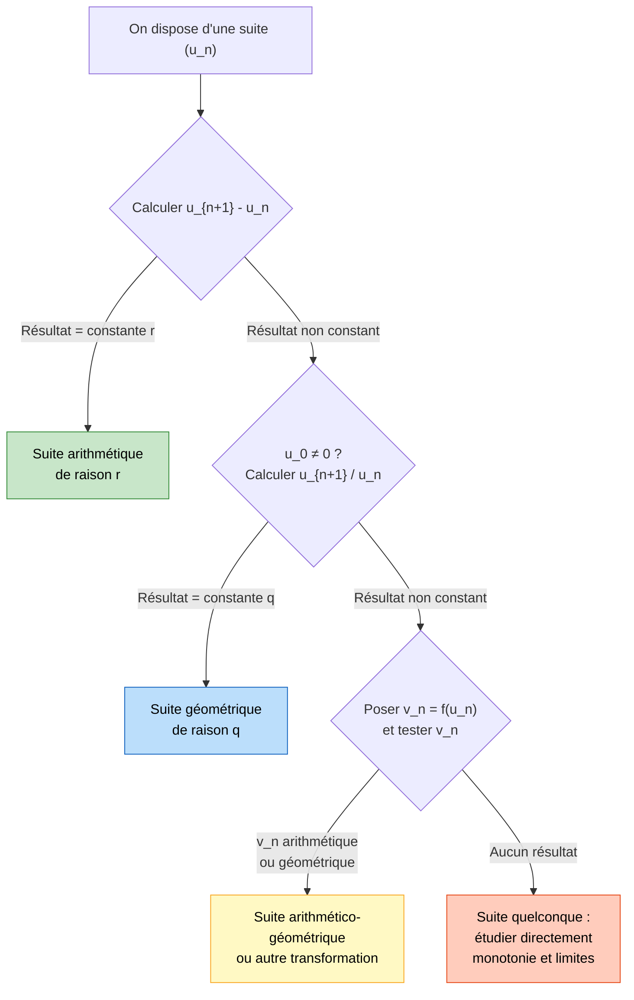
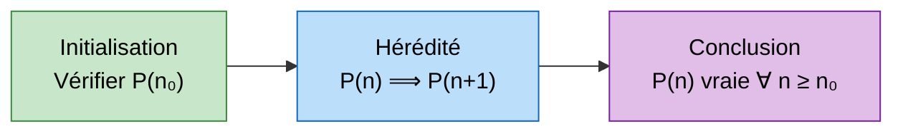

# Suites Numériques

Les suites numériques sont l'un des piliers de l'analyse. Elles permettent de modéliser des phénomènes discrets (évolution d'une population, intérêts composés, algorithmes itératifs) et constituent le fondement de la notion de limite, centrale en [[Limites et Continuité]].

> [!quote] Henri Poincaré
> *"Les mathématiques sont l'art de donner le même nom à des choses différentes."*


## 1. Définition d'une suite

> [!important] Définition
> Une **suite numérique** est une application de $\mathbb{N}$ (ou d'une partie de $\mathbb{N}$) dans $\mathbb{R}$.
> On la note $(u_n)_{n \in \mathbb{N}}$ ou simplement $(u_n)$.
> Pour chaque entier $n$, le réel $u_n$ est appelé le **terme de rang $n$** (ou terme général).

### Deux modes de génération

Une suite peut être définie de deux manières fondamentales :

#### a) Définition explicite

Le terme $u_n$ est donné directement en fonction de $n$.

> [!example] Exemple
> $u_n = 3n + 2$ pour tout $n \in \mathbb{N}$.
> - $u_0 = 2$, $u_1 = 5$, $u_2 = 8$, $u_3 = 11$, ...

#### b) Définition par récurrence

Le terme $u_n$ est défini en fonction du ou des termes précédents, avec un premier terme donné.

> [!example] Exemple
> $\begin{cases} u_0 = 1 \\ u_{n+1} = 2u_n + 3 \end{cases}$
> - $u_0 = 1$, $u_1 = 5$, $u_2 = 13$, $u_3 = 29$, ...

> [!warning] Attention
> Pour une suite définie par récurrence, on ne peut pas calculer directement $u_{100}$ sans avoir calculé tous les termes précédents (sauf si on trouve une formule explicite équivalente).


## 2. Suites arithmétiques

> [!important] Définition
> Une suite $(u_n)$ est **arithmétique** s'il existe un réel $r$ (appelé **raison**) tel que pour tout $n \in \mathbb{N}$ :
> $$u_{n+1} = u_n + r$$

### Terme général

$$\boxed{u_n = u_0 + n \cdot r}$$

Plus généralement, si on connaît $u_p$ :

$$u_n = u_p + (n - p) \cdot r$$

### Somme des termes consécutifs

La somme des $n+1$ premiers termes ($u_0$ à $u_n$) vaut :

$$\boxed{S_n = \sum_{k=0}^{n} u_k = (n+1) \times \frac{u_0 + u_n}{2}}$$

> [!tip] Astuce mnémotechnique
> **Nombre de termes** $\times$ **moyenne du premier et du dernier terme**.
> En particulier : $1 + 2 + 3 + \cdots + n = \dfrac{n(n+1)}{2}$

> [!example] Exemple complet
> Soit $(u_n)$ arithmétique avec $u_0 = 3$ et $r = 4$.
> - Terme général : $u_n = 3 + 4n$
> - $u_{10} = 3 + 40 = 43$
> - Somme $S_{10} = \sum_{k=0}^{10} u_k = 11 \times \dfrac{3 + 43}{2} = 11 \times 23 = 253$

### Représentation graphique

Les points $(n, u_n)$ d'une suite arithmétique sont alignés sur une droite de pente $r$.

- Si $r > 0$ : la suite est **strictement croissante**.
- Si $r < 0$ : la suite est **strictement décroissante**.
- Si $r = 0$ : la suite est **constante**.


## 3. Suites géométriques

> [!important] Définition
> Une suite $(u_n)$ est **géométrique** s'il existe un réel $q \neq 0$ (appelé **raison**) tel que pour tout $n \in \mathbb{N}$ :
> $$u_{n+1} = q \cdot u_n$$

### Terme général

$$\boxed{u_n = u_0 \cdot q^n}$$

Plus généralement, si on connaît $u_p$ :

$$u_n = u_p \cdot q^{n-p}$$

### Somme des termes consécutifs

Pour $q \neq 1$, la somme des $n+1$ premiers termes vaut :

$$\boxed{S_n = \sum_{k=0}^{n} u_k = u_0 \cdot \frac{1 - q^{n+1}}{1 - q}}$$

> [!tip] Formule à retenir
> $$1 + q + q^2 + \cdots + q^n = \frac{1 - q^{n+1}}{1 - q}$$
> Cette formule est la **somme géométrique** fondamentale.

> [!example] Exemple complet
> Soit $(u_n)$ géométrique avec $u_0 = 5$ et $q = 2$.
> - Terme général : $u_n = 5 \times 2^n$
> - $u_6 = 5 \times 64 = 320$
> - Somme $S_6 = 5 \times \dfrac{1 - 2^7}{1 - 2} = 5 \times \dfrac{1 - 128}{-1} = 5 \times 127 = 635$

### Comportement selon la raison

| Condition | Comportement de $(u_n)$ avec $u_0 > 0$ |
|---|---|
| $q > 1$ | Croissante, diverge vers $+\infty$ |
| $q = 1$ | Constante |
| $0 < q < 1$ | Décroissante, converge vers $0$ |
| $q = 0$ | Non définie (convention) |
| $-1 < q < 0$ | Alternée, converge vers $0$ |
| $q = -1$ | Alternée, ne converge pas |
| $q < -1$ | Alternée, diverge |


## 4. Comment identifier le type de suite




## 5. Sens de variation

> [!important] Définitions
> Soit $(u_n)$ une suite :
> - $(u_n)$ est **croissante** si pour tout $n$ : $u_{n+1} \geq u_n$
> - $(u_n)$ est **strictement croissante** si pour tout $n$ : $u_{n+1} > u_n$
> - $(u_n)$ est **décroissante** si pour tout $n$ : $u_{n+1} \leq u_n$
> - $(u_n)$ est **monotone** si elle est croissante ou décroissante.

### Méthodes pour étudier la monotonie

**Méthode 1 :** Étudier le signe de $u_{n+1} - u_n$.

**Méthode 2 :** Si tous les termes sont strictement positifs, comparer $\dfrac{u_{n+1}}{u_n}$ à $1$.

**Méthode 3 :** Si $u_n = f(n)$, étudier les variations de la fonction $f$.

> [!example] Exemple
> Soit $u_n = n^2 - 5n$. Étudier la monotonie.
>
> $u_{n+1} - u_n = (n+1)^2 - 5(n+1) - n^2 + 5n$
> $= n^2 + 2n + 1 - 5n - 5 - n^2 + 5n = 2n - 4$
>
> - Si $n \geq 2$ : $u_{n+1} - u_n \geq 0$ donc $(u_n)$ est croissante.
> - Si $n \leq 1$ : $u_{n+1} - u_n \leq 0$ donc $(u_n)$ est décroissante.
>
> La suite n'est pas monotone sur $\mathbb{N}$ mais elle est croissante **à partir du rang 2**.


## 6. Suites bornées

> [!important] Définitions
> - $(u_n)$ est **majorée** s'il existe $M \in \mathbb{R}$ tel que pour tout $n$ : $u_n \leq M$.
> - $(u_n)$ est **minorée** s'il existe $m \in \mathbb{R}$ tel que pour tout $n$ : $u_n \geq m$.
> - $(u_n)$ est **bornée** si elle est à la fois majorée et minorée.

> [!tip] Propriété fondamentale
> Toute suite convergente est bornée.
> **Attention :** la réciproque est fausse ! Exemple : $u_n = (-1)^n$ est bornée mais ne converge pas.


## 7. Convergence

### Notion intuitive (Première)

> [!important] Définition intuitive
> On dit que $(u_n)$ **converge** vers un réel $\ell$ si les termes $u_n$ se rapprochent **indéfiniment** de $\ell$ quand $n$ devient **arbitrairement grand**.
> On note : $\lim_{n \to +\infty} u_n = \ell$

### Définition formelle (Terminale)

> [!important] Définition rigoureuse ($\varepsilon$-$N$)
> La suite $(u_n)$ converge vers $\ell \in \mathbb{R}$ si :
> $$\forall \varepsilon > 0, \; \exists N \in \mathbb{N}, \; \forall n \geq N : \; |u_n - \ell| < \varepsilon$$
> Cela signifie que tous les termes de la suite finissent par être aussi proches de $\ell$ qu'on le souhaite.

### Limites de référence

| Suite | Limite |
|---|---|
| $\dfrac{1}{n}$ | $0$ |
| $\dfrac{1}{n^2}$ | $0$ |
| $\dfrac{1}{\sqrt{n}}$ | $0$ |
| $q^n$ avec $\|q\| < 1$ | $0$ |
| $q^n$ avec $q > 1$ | $+\infty$ |
| $\sqrt{n}$ | $+\infty$ |
| $n^k$ avec $k \geq 1$ | $+\infty$ |


## 8. Théorème de convergence monotone

> [!important] Théorème
> - Toute suite **croissante et majorée** converge.
> - Toute suite **décroissante et minorée** converge.

> [!warning] Attention
> Ce théorème affirme l'**existence** de la limite mais ne donne pas sa **valeur**. Pour trouver la limite, il faut souvent utiliser d'autres techniques (passage à la limite dans une relation de récurrence, par exemple).

> [!example] Exemple d'application
> Soit $u_0 = 1$ et $u_{n+1} = \sqrt{2 + u_n}$.
>
> **1) La suite est majorée par 2 :**
> Si $u_n \leq 2$, alors $u_{n+1} = \sqrt{2 + u_n} \leq \sqrt{2 + 2} = 2$. Par récurrence, $u_n \leq 2$ pour tout $n$.
>
> **2) La suite est croissante :**
> $u_{n+1} - u_n = \sqrt{2 + u_n} - u_n$. On pose $f(x) = \sqrt{2+x} - x$, et on montre que $f(x) \geq 0$ pour $x \in [1, 2]$.
>
> **3) Conclusion :** $(u_n)$ est croissante et majorée, donc elle converge.
>
> **4) Calcul de la limite :** Si $\ell = \lim u_n$, alors par passage à la limite :
> $\ell = \sqrt{2 + \ell}$, donc $\ell^2 = 2 + \ell$, soit $\ell^2 - \ell - 2 = 0$.
> $(\ell - 2)(\ell + 1) = 0$. Comme $u_n \geq 1$, on a $\ell = 2$.

### Visualisation animée (Manim)

> [!note] Ce que montre l'animation
> Le **diagramme en toile d'araignée** (cobweb) construit géométriquement les termes d'une suite récurrente $u_{n+1} = f(u_n)$, ici $f(x) = \sqrt{2 + x}$. À chaque étape : on monte verticalement jusqu'à la courbe $y = f(x)$ (cela donne $u_{n+1}$), puis on se déplace horizontalement jusqu'à la droite $y = x$ (pour réinjecter $u_{n+1}$). L'escalier s'enroule vers le **point fixe** $\ell$ où $\ell = f(\ell)$ : on *voit* la convergence et pourquoi la limite est l'intersection des deux courbes.

```manim
# Rendu : manimgl suite_cobweb.py ConvergenceToileAraignee
from manimlib import *
import numpy as np


class ConvergenceToileAraignee(Scene):
    def construct(self):
        # Suite récurrente u_{n+1} = f(u_n), avec f(x) = sqrt(2 + x), u0 = 0
        def f(x):
            return np.sqrt(2 + x)

        axes = Axes(x_range=(0, 3, 1), y_range=(0, 3, 1), height=6, width=6)
        courbe = axes.get_graph(f, x_range=(0, 3), color=BLUE)
        diag = axes.get_graph(lambda x: x, x_range=(0, 3), color=GREY_B)   # y = x
        lab_f = Tex(r"y=\sqrt{2+x}", color=BLUE).next_to(axes.c2p(2.6, f(2.6)), UR)
        lab_d = Tex("y=x", color=GREY_B).next_to(axes.c2p(2.7, 2.7), DR)
        self.play(ShowCreation(axes), ShowCreation(courbe), ShowCreation(diag),
                  Write(lab_f), Write(lab_d))

        # Construction de la toile d'araignée à partir de u0 = 0
        u = 0.0
        self.play(FadeIn(Dot(axes.c2p(u, 0), color=YELLOW)))
        for _ in range(8):
            v = f(u)
            vert = Line(axes.c2p(u, u), axes.c2p(u, v), color=YELLOW)    # vers la courbe
            horiz = Line(axes.c2p(u, v), axes.c2p(v, v), color=YELLOW)   # vers y = x
            self.play(ShowCreation(vert), run_time=0.5)
            self.play(ShowCreation(horiz), run_time=0.5)
            u = v

        # Point fixe : la limite ell = f(ell) = 2
        ell = Dot(axes.c2p(2, 2), color=RED)
        lab_ell = Tex(r"\ell = 2", color=RED).next_to(ell, UR).set_backstroke()
        self.play(FadeIn(ell), Write(lab_ell))
        note = Tex(r"u_{n+1}=f(u_n)\ \to\ \ell \quad\text{où}\quad \ell=f(\ell)")
        note.to_edge(UP).set_backstroke()
        self.play(Write(note))
        self.wait(2)
```


## 9. Suites adjacentes

> [!important] Définition
> Deux suites $(u_n)$ et $(v_n)$ sont **adjacentes** si :
> 1. $(u_n)$ est croissante,
> 2. $(v_n)$ est décroissante,
> 3. $\lim_{n \to +\infty} (v_n - u_n) = 0$.

> [!important] Théorème des suites adjacentes
> Si $(u_n)$ et $(v_n)$ sont adjacentes, alors elles convergent vers la **même limite** $\ell$, et pour tout $n$ :
> $$u_n \leq \ell \leq v_n$$

> [!tip] Application classique
> Ce théorème est souvent utilisé pour **encadrer** une limite. Par exemple, on peut construire des suites adjacentes qui encadrent $\sqrt{2}$, $\pi$, ou $e$.


## 10. Raisonnement par récurrence

> [!important] Principe
> Pour démontrer qu'une propriété $P(n)$ est vraie pour tout $n \geq n_0$ :
> 1. **Initialisation :** Vérifier que $P(n_0)$ est vraie.
> 2. **Hérédité :** Supposer $P(n)$ vraie pour un certain $n \geq n_0$ (**hypothèse de récurrence**) et montrer que $P(n+1)$ est vraie.
> 3. **Conclusion :** Par le principe de récurrence, $P(n)$ est vraie pour tout $n \geq n_0$.



> [!example] Exemple
> Montrer que pour tout $n \in \mathbb{N}^*$ : $\displaystyle\sum_{k=1}^{n} k^2 = \dfrac{n(n+1)(2n+1)}{6}$
>
> **Initialisation ($n = 1$) :** $\sum_{k=1}^{1} k^2 = 1$ et $\dfrac{1 \times 2 \times 3}{6} = 1$. OK.
>
> **Hérédité :** Supposons la propriété vraie au rang $n$. Alors :
> $$\sum_{k=1}^{n+1} k^2 = \sum_{k=1}^{n} k^2 + (n+1)^2 = \frac{n(n+1)(2n+1)}{6} + (n+1)^2$$
> $$= \frac{n(n+1)(2n+1) + 6(n+1)^2}{6} = \frac{(n+1)[n(2n+1) + 6(n+1)]}{6}$$
> $$= \frac{(n+1)(2n^2 + 7n + 6)}{6} = \frac{(n+1)(n+2)(2n+3)}{6}$$
> C'est bien la formule au rang $n+1$.
>
> **Conclusion :** Par récurrence, la formule est vraie pour tout $n \geq 1$.


## 11. Exercices types corrigés

### Exercice 1 : Identifier une suite

> [!example] Énoncé
> La suite $(u_n)$ est définie par $u_0 = 5$ et $u_{n+1} = u_n + 7$.
> 1. Quelle est la nature de cette suite ?
> 2. Exprimer $u_n$ en fonction de $n$.
> 3. Calculer $S = u_0 + u_1 + \cdots + u_{20}$.

**Correction :**

1. $u_{n+1} - u_n = 7$ (constante) donc $(u_n)$ est **arithmétique** de raison $r = 7$.

2. $u_n = u_0 + nr = 5 + 7n$.

3. $S = \displaystyle\sum_{k=0}^{20} u_k = 21 \times \dfrac{u_0 + u_{20}}{2} = 21 \times \dfrac{5 + 145}{2} = 21 \times 75 = 1575$.


### Exercice 2 : Suite géométrique et placement financier

> [!example] Énoncé
> On place $1000$ euros sur un compte à intérêts composés de $3\%$ par an.
> Soit $C_n$ le capital après $n$ années.
> 1. Exprimer $C_{n+1}$ en fonction de $C_n$.
> 2. En déduire la nature et le terme général de $(C_n)$.
> 3. Au bout de combien d'années le capital dépasse-t-il $1500$ euros ?

**Correction :**

1. Chaque année, le capital est multiplié par $1{,}03$ :
   $C_{n+1} = 1{,}03 \times C_n$.

2. $(C_n)$ est **géométrique** de raison $q = 1{,}03$ et de premier terme $C_0 = 1000$.
   $C_n = 1000 \times 1{,}03^n$.

3. On cherche $n$ tel que $C_n > 1500$ :
   $1000 \times 1{,}03^n > 1500$
   $1{,}03^n > 1{,}5$
   $n \ln(1{,}03) > \ln(1{,}5)$
   $n > \dfrac{\ln(1{,}5)}{\ln(1{,}03)} \approx \dfrac{0{,}405}{0{,}0296} \approx 13{,}7$

   Le capital dépasse $1500$ euros au bout de **14 ans**.


### Exercice 3 : Récurrence et convergence

> [!example] Énoncé
> Soit $(u_n)$ définie par $u_0 = 0$ et $u_{n+1} = \dfrac{1}{3}u_n + 2$.
> 1. Conjecturer la limite de $(u_n)$.
> 2. Montrer par récurrence que $0 \leq u_n \leq 3$ pour tout $n$.
> 3. Montrer que $(u_n)$ est croissante.
> 4. En déduire que $(u_n)$ converge et déterminer sa limite.

**Correction :**

1. Premiers termes : $u_0 = 0$, $u_1 = 2$, $u_2 = \frac{8}{3} \approx 2{,}67$, $u_3 = \frac{26}{9} \approx 2{,}89$. Conjecture : $\ell = 3$.

2. **Récurrence :**
   - *Initialisation :* $u_0 = 0 \in [0, 3]$. OK.
   - *Hérédité :* Si $0 \leq u_n \leq 3$, alors $0 \leq \frac{1}{3}u_n \leq 1$, donc $2 \leq \frac{1}{3}u_n + 2 \leq 3$, soit $0 \leq u_{n+1} \leq 3$. OK.

3. $u_{n+1} - u_n = \frac{1}{3}u_n + 2 - u_n = -\frac{2}{3}u_n + 2 = \frac{2}{3}(3 - u_n)$.
   Comme $u_n \leq 3$, on a $u_{n+1} - u_n \geq 0$. Donc $(u_n)$ est **croissante**.

4. $(u_n)$ est croissante et majorée par $3$, donc elle converge (théorème de convergence monotone).
   Soit $\ell$ sa limite. Par passage à la limite : $\ell = \frac{1}{3}\ell + 2$, donc $\frac{2}{3}\ell = 2$, d'où $\ell = 3$.


### Exercice 4 : Suite auxiliaire

> [!example] Énoncé
> Soit $(u_n)$ définie par $u_0 = 4$ et $u_{n+1} = \frac{1}{2}u_n + 1$.
> On pose $v_n = u_n - 2$.
> 1. Montrer que $(v_n)$ est géométrique. Préciser sa raison et son premier terme.
> 2. En déduire $v_n$ puis $u_n$ en fonction de $n$.
> 3. Déterminer la limite de $(u_n)$.

**Correction :**

1. $v_{n+1} = u_{n+1} - 2 = \frac{1}{2}u_n + 1 - 2 = \frac{1}{2}u_n - 1 = \frac{1}{2}(u_n - 2) = \frac{1}{2}v_n$.
   Donc $(v_n)$ est **géométrique** de raison $q = \frac{1}{2}$ et de premier terme $v_0 = u_0 - 2 = 2$.

2. $v_n = 2 \times \left(\frac{1}{2}\right)^n = \frac{2}{2^n} = \frac{1}{2^{n-1}}$.
   Donc $u_n = v_n + 2 = \dfrac{1}{2^{n-1}} + 2$.

3. $\lim_{n \to +\infty} \dfrac{1}{2^{n-1}} = 0$, donc $\lim_{n \to +\infty} u_n = 2$.
