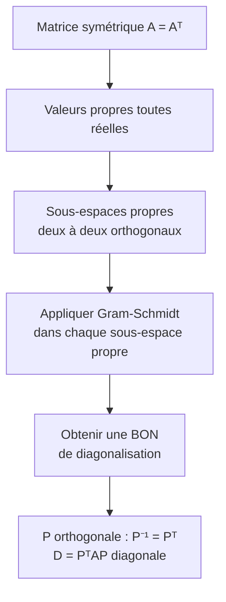

# Espaces Préhilbertiens

Ce chapitre généralise la notion de géométrie euclidienne à la dimension quelconque (y compris infinie). Il établit les fondements de l'analyse fonctionnelle et a des applications majeures en physique, en traitement du signal et en probabilités.

## 1. Produit scalaire

### 1.1 Définitions

> [!abstract] Définition (Produit scalaire réel)
> Soit $E$ un $\mathbb{R}$-espace vectoriel. Un **produit scalaire** sur $E$ est une forme bilinéaire $\langle \cdot, \cdot \rangle : E \times E \to \mathbb{R}$ qui est :
> 1. **Symétrique** : $\langle x, y \rangle = \langle y, x \rangle$ pour tous $x, y \in E$.
> 2. **Positive** : $\langle x, x \rangle \geq 0$ pour tout $x \in E$.
> 3. **Définie** : $\langle x, x \rangle = 0 \implies x = 0$.

> [!abstract] Définition (Espace préhilbertien / euclidien)
> - Un **espace préhilbertien réel** est un $\mathbb{R}$-espace vectoriel muni d'un produit scalaire.
> - Un **espace euclidien** est un espace préhilbertien réel de **dimension finie**.
> - Un **espace de Hilbert** est un espace préhilbertien **complet** (pour la norme induite).

> [!example] Exemples fondamentaux
> 1. $\mathbb{R}^n$ avec $\langle x, y \rangle = \sum_{i=1}^n x_i y_i$ (produit scalaire canonique).
> 2. $\mathcal{C}([a,b], \mathbb{R})$ avec $\langle f, g \rangle = \int_a^b f(t)g(t) \, dt$.
> 3. $\mathcal{M}_n(\mathbb{R})$ avec $\langle A, B \rangle = \mathrm{tr}(A^T B)$ (produit de Frobenius).

### 1.2 Identités remarquables

Pour tout espace préhilbertien $(E, \langle \cdot, \cdot \rangle)$ :

$$\|x + y\|^2 = \|x\|^2 + 2\langle x, y \rangle + \|y\|^2 \quad \text{(développement)}$$

$$\langle x, y \rangle = \frac{1}{2}\left(\|x+y\|^2 - \|x\|^2 - \|y\|^2\right) \quad \text{(identité de polarisation)}$$

$$\|x+y\|^2 + \|x-y\|^2 = 2(\|x\|^2 + \|y\|^2) \quad \text{(identité du parallélogramme)}$$

> [!tip] Remarque
> L'identité du parallélogramme **caractérise** les normes issues d'un produit scalaire : une norme $\|\cdot\|$ provient d'un produit scalaire si et seulement si elle vérifie l'identité du parallélogramme.

## 2. Norme et inégalités fondamentales

### 2.1 Norme associée

> [!abstract] Définition
> La **norme** associée au produit scalaire est $\|x\| = \sqrt{\langle x, x \rangle}$.

La **distance** associée est $d(x, y) = \|x - y\|$.

### 2.2 Inégalité de Cauchy-Schwarz

> [!abstract] Théorème (Cauchy-Schwarz)
> Pour tous $x, y \in E$ :
> $$|\langle x, y \rangle| \leq \|x\| \cdot \|y\|$$
> avec égalité si et seulement si $x$ et $y$ sont **colinéaires**.

> [!tip] Démonstration
> Pour $y \neq 0$, on considère la fonction $\varphi(t) = \|x - ty\|^2 = \|x\|^2 - 2t\langle x, y\rangle + t^2\|y\|^2 \geq 0$ pour tout $t \in \mathbb{R}$.
>
> C'est un trinôme en $t$ qui est positif ou nul, donc son discriminant est négatif ou nul :
> $$\Delta = 4\langle x, y\rangle^2 - 4\|x\|^2\|y\|^2 \leq 0$$
>
> D'où $|\langle x, y\rangle| \leq \|x\| \cdot \|y\|$.
>
> Cas d'égalité : $\Delta = 0$ signifie que $\varphi$ s'annule, donc $x = t_0 y$ pour un certain $t_0$.

### 2.3 Inégalité triangulaire

> [!abstract] Théorème (Inégalité triangulaire)
> Pour tous $x, y \in E$ :
> $$\|x + y\| \leq \|x\| + \|y\|$$
> avec égalité si et seulement si $x$ et $y$ sont positivement colinéaires.

## 3. Orthogonalité

### 3.1 Définitions

> [!abstract] Définition
> Deux vecteurs $x, y \in E$ sont **orthogonaux** si $\langle x, y \rangle = 0$. On note $x \perp y$.
>
> L'**orthogonal** d'une partie $A \subset E$ est :
> $$A^\perp = \{x \in E \mid \forall a \in A, \, \langle x, a \rangle = 0\}$$

> [!important] Propriétés de l'orthogonal
> 1. $A^\perp$ est toujours un **sous-espace vectoriel fermé** de $E$.
> 2. $A \subset B \implies B^\perp \subset A^\perp$.
> 3. $A \subset (A^\perp)^\perp$.
> 4. $A^\perp = (\mathrm{Vect}(A))^\perp$.

### 3.2 Théorème de Pythagore

> [!abstract] Théorème (Pythagore)
> Si $x \perp y$, alors $\|x + y\|^2 = \|x\|^2 + \|y\|^2$.
>
> Plus généralement, si $x_1, \ldots, x_p$ sont deux à deux orthogonaux :
> $$\left\|\sum_{i=1}^p x_i\right\|^2 = \sum_{i=1}^p \|x_i\|^2$$

### 3.3 Supplémentaire orthogonal en dimension finie

> [!abstract] Théorème
> Soit $E$ un espace euclidien et $F$ un sous-espace vectoriel de $E$. Alors :
> $$E = F \oplus F^\perp \quad \text{et} \quad \dim F^\perp = \dim E - \dim F$$

> [!warning] En dimension infinie
> Ce résultat **ne se généralise pas directement** en dimension infinie pour les espaces préhilbertiens quelconques. Il faut la complétude (espaces de Hilbert) pour obtenir $\overline{F} \oplus F^\perp = E$.

## 4. Projection orthogonale

### 4.1 En dimension finie

> [!abstract] Définition
> Soit $F$ un sous-espace vectoriel d'un espace euclidien $E$. La **projection orthogonale** sur $F$ est l'unique application linéaire $p_F : E \to E$ telle que :
> $$\forall x \in E, \quad x = p_F(x) + (x - p_F(x)) \quad \text{avec } p_F(x) \in F \text{ et } x - p_F(x) \in F^\perp$$

> [!important] Caractérisation de la projection orthogonale
> Le projeté orthogonal $p_F(x)$ est l'unique élément de $F$ qui **minimise la distance** de $x$ à $F$ :
> $$\|x - p_F(x)\| = \inf_{y \in F} \|x - y\| = d(x, F)$$

### 4.2 Théorème de projection sur un convexe fermé

> [!abstract] Théorème (Projection sur un convexe fermé)
> Soit $H$ un espace de Hilbert réel et $C$ un **convexe fermé non vide** de $H$. Pour tout $x \in H$, il existe un unique $p_C(x) \in C$ tel que :
> $$\|x - p_C(x)\| = \inf_{y \in C} \|x - y\| = d(x, C)$$
>
> De plus, $p_C(x)$ est caractérisé par :
> $$p_C(x) \in C \quad \text{et} \quad \forall y \in C, \quad \langle x - p_C(x), y - p_C(x) \rangle \leq 0$$

## 5. Bases orthonormales et procédé de Gram-Schmidt

### 5.1 Familles orthonormales

> [!abstract] Définition
> Une famille $(e_1, \ldots, e_p)$ de $E$ est **orthonormale** (ou orthonormée) si :
> $$\langle e_i, e_j \rangle = \delta_{ij} = \begin{cases} 1 & \text{si } i = j \\ 0 & \text{si } i \neq j \end{cases}$$

> [!important] Propriété
> Toute famille orthonormale est **libre**. En particulier, dans un espace euclidien de dimension $n$, une famille orthonormale de $n$ vecteurs est une **base**.

### 5.2 Coordonnées dans une base orthonormale

Si $\mathcal{B} = (e_1, \ldots, e_n)$ est une base orthonormale (BON), alors pour tout $x \in E$ :

$$x = \sum_{i=1}^n \langle x, e_i \rangle \, e_i$$

et $\langle x, y \rangle = \sum_{i=1}^n x_i y_i$ où $x_i = \langle x, e_i \rangle$.

### 5.3 Procédé de Gram-Schmidt

> [!abstract] Théorème (Gram-Schmidt)
> Soit $(v_1, \ldots, v_p)$ une famille libre de $E$. Il existe une unique famille orthonormale $(e_1, \ldots, e_p)$ telle que :
> 1. Pour tout $k \in \{1, \ldots, p\}$ : $\mathrm{Vect}(e_1, \ldots, e_k) = \mathrm{Vect}(v_1, \ldots, v_k)$.
> 2. Pour tout $k$ : $\langle e_k, v_k \rangle > 0$.

**Algorithme** :

$$\tilde{e}_1 = v_1, \quad e_1 = \frac{\tilde{e}_1}{\|\tilde{e}_1\|}$$

Pour $k \geq 2$ :

$$\tilde{e}_k = v_k - \sum_{i=1}^{k-1} \langle v_k, e_i \rangle \, e_i, \quad e_k = \frac{\tilde{e}_k}{\|\tilde{e}_k\|}$$

> [!example] Exemple
> Orthonormaliser $(v_1, v_2, v_3) = ((1,1,0), (1,0,1), (0,1,1))$ dans $\mathbb{R}^3$ muni du produit scalaire canonique.
>
> $e_1 = \frac{1}{\sqrt{2}}(1,1,0)$.
>
> $\tilde{e}_2 = (1,0,1) - \langle (1,0,1), e_1 \rangle e_1 = (1,0,1) - \frac{1}{2}(1,1,0) = (\frac{1}{2}, -\frac{1}{2}, 1)$.
>
> $e_2 = \frac{1}{\sqrt{3/2}}(\frac{1}{2}, -\frac{1}{2}, 1) = \frac{1}{\sqrt{6}}(1, -1, 2)$.
>
> $\tilde{e}_3 = (0,1,1) - \langle (0,1,1), e_1\rangle e_1 - \langle (0,1,1), e_2 \rangle e_2 = \frac{1}{3}(-1, 1, 1)$ (après calcul).
>
> $e_3 = \frac{1}{\sqrt{3}}(-1, 1, 1)$.

## 6. Adjoint d'un endomorphisme

> [!abstract] Définition
> Soit $E$ un espace euclidien et $f \in \mathcal{L}(E)$. L'**adjoint** de $f$, noté $f^*$, est l'unique endomorphisme de $E$ tel que :
> $$\forall x, y \in E, \quad \langle f(x), y \rangle = \langle x, f^*(y) \rangle$$

> [!important] Propriétés
> 1. L'adjoint existe et est unique (théorème de Riesz en dimension finie).
> 2. $(f^*)^* = f$.
> 3. $(f \circ g)^* = g^* \circ f^*$.
> 4. En BON, la matrice de $f^*$ est la **transposée** de la matrice de $f$ : $\mathrm{Mat}(f^*) = \mathrm{Mat}(f)^T$.

## 7. Endomorphismes symétriques et théorème spectral

### 7.1 Endomorphismes symétriques

> [!abstract] Définition
> Un endomorphisme $f$ d'un espace euclidien $E$ est **symétrique** (ou **autoadjoint**) si $f^* = f$, c'est-à-dire :
> $$\forall x, y \in E, \quad \langle f(x), y \rangle = \langle x, f(y) \rangle$$
>
> En BON, cela correspond aux **matrices symétriques** : $A^T = A$.

> [!important] Propriétés des endomorphismes symétriques
> 1. Les **valeurs propres** d'un endomorphisme symétrique sont **réelles**.
> 2. Les **sous-espaces propres** associés à des valeurs propres distinctes sont **orthogonaux**.

> [!tip] Démonstration (valeurs propres réelles)
> Soit $\lambda$ valeur propre complexe de $A \in \mathcal{S}_n(\mathbb{R})$, et $X \in \mathbb{C}^n \setminus \{0\}$ un vecteur propre. Alors $AX = \lambda X$ implique :
> $$\overline{X}^T A X = \lambda \overline{X}^T X$$
> Or $\overline{X}^T A X = \overline{X}^T A^T X = \overline{AX}^T X = \overline{\lambda} \, \overline{X}^T X$.
> Comme $\overline{X}^T X = \sum |x_i|^2 > 0$, on a $\lambda = \overline{\lambda}$, donc $\lambda \in \mathbb{R}$.

### 7.2 Théorème spectral

> [!abstract] Théorème spectral (version euclidienne)
> Tout endomorphisme symétrique d'un espace euclidien est **diagonalisable en base orthonormale**.
>
> De manière équivalente : pour toute matrice symétrique réelle $A \in \mathcal{S}_n(\mathbb{R})$, il existe une matrice orthogonale $P \in \mathcal{O}_n(\mathbb{R})$ telle que :
> $$P^T A P = P^{-1} A P = \mathrm{diag}(\lambda_1, \ldots, \lambda_n)$$
> où $\lambda_1, \ldots, \lambda_n$ sont les valeurs propres de $A$ (réelles).

> [!tip] Esquisse de démonstration
> Par récurrence sur $n = \dim E$.
> 1. $A$ a au moins une valeur propre réelle $\lambda_1$ (car $\chi_A$ est de degré $n$ et les valeurs propres complexes sont réelles par la propriété ci-dessus).
> 2. Soit $e_1$ un vecteur propre unitaire associé à $\lambda_1$. Alors $F = (e_1)^\perp$ est stable par $f$ (car $f$ est symétrique : si $\langle x, e_1 \rangle = 0$, alors $\langle f(x), e_1 \rangle = \langle x, f(e_1) \rangle = \lambda_1 \langle x, e_1 \rangle = 0$).
> 3. La restriction $f|_F$ est un endomorphisme symétrique de l'espace euclidien $F$ de dimension $n-1$. On conclut par hypothèse de récurrence.

## 8. Endomorphismes orthogonaux

> [!abstract] Définition
> Un endomorphisme $f$ d'un espace euclidien est **orthogonal** si $f$ conserve le produit scalaire :
> $$\forall x, y \in E, \quad \langle f(x), f(y) \rangle = \langle x, y \rangle$$
>
> De manière équivalente : $f^* \circ f = f \circ f^* = \mathrm{Id}$.

> [!important] Caractérisations des endomorphismes orthogonaux
> Les propriétés suivantes sont équivalentes :
> 1. $f$ est orthogonal.
> 2. $f$ conserve la norme : $\|f(x)\| = \|x\|$ pour tout $x$.
> 3. $f$ envoie toute BON sur une BON.
> 4. La matrice de $f$ en BON est **orthogonale** : $A^T A = I_n$ (i.e. $A^{-1} = A^T$).

> [!important] Propriétés
> - $\det(f) = \pm 1$ (car $\det(A^T A) = \det(A)^2 = 1$).
> - Les valeurs propres réelles sont $\pm 1$.
> - Le groupe orthogonal $\mathcal{O}_n(\mathbb{R})$ est l'ensemble des matrices orthogonales.
> - $SO_n(\mathbb{R}) = \{A \in \mathcal{O}_n(\mathbb{R}) \mid \det A = 1\}$ est le **groupe spécial orthogonal** (rotations).

### Classification en petite dimension

**En dimension 2** : toute matrice de $\mathcal{O}_2(\mathbb{R})$ est soit :
- Une **rotation** : $R_\theta = \begin{pmatrix} \cos\theta & -\sin\theta \\ \sin\theta & \cos\theta \end{pmatrix}$ ($\det = 1$).
- Une **réflexion** : $S_\theta = \begin{pmatrix} \cos\theta & \sin\theta \\ \sin\theta & -\cos\theta \end{pmatrix}$ ($\det = -1$).

**En dimension 3** : toute matrice de $SO_3(\mathbb{R})$ est une rotation d'axe et d'angle $\theta$. Le théorème d'Euler garantit qu'il existe toujours un axe (vecteur propre pour $\lambda = 1$).

## 9. Formes bilinéaires et quadratiques

### 9.1 Formes bilinéaires symétriques

> [!abstract] Définition
> Une **forme bilinéaire symétrique** sur $E$ est une application $\varphi : E \times E \to \mathbb{R}$ bilinéaire et symétrique. Elle est représentée dans une base $\mathcal{B}$ par une matrice symétrique $S$ telle que :
> $$\varphi(x, y) = X^T S Y$$
> où $X, Y$ sont les vecteurs-colonnes de coordonnées.

### 9.2 Formes quadratiques

> [!abstract] Définition
> La **forme quadratique** associée à $\varphi$ est $q(x) = \varphi(x, x)$.
>
> On retrouve $\varphi$ par **polarisation** : $\varphi(x, y) = \frac{1}{2}[q(x+y) - q(x) - q(y)]$.

### 9.3 Classification : loi d'inertie de Sylvester

> [!abstract] Théorème (Sylvester)
> Soit $q$ une forme quadratique sur un $\mathbb{R}$-espace vectoriel $E$ de dimension $n$. Il existe une base $(e_1, \ldots, e_n)$ de $E$ dans laquelle :
> $$q(x) = \sum_{i=1}^{p} x_i^2 - \sum_{i=p+1}^{p+q_-} x_i^2$$
>
> Le couple $(p, q_-)$ est appelé la **signature** de $q$. Il ne dépend pas de la base choisie.

> [!important] Conséquences
> - $q$ est **positive** $\iff$ $q_- = 0$ (signature $(p, 0)$).
> - $q$ est **définie positive** $\iff$ signature $(n, 0)$ $\iff$ $q$ est un produit scalaire.
> - $q$ est **non dégénérée** $\iff$ $p + q_- = n$ (pas de composante nulle).
> - Le **rang** de $q$ est $p + q_-$.

> [!tip] Méthode pratique : réduction de Gauss
> Pour trouver la signature, on procède par **complétion du carré** (algorithme de Gauss) :
> 1. On cherche un terme carré $x_i^2$ dans $q$.
> 2. On complète le carré en $x_i$.
> 3. On itère sur les variables restantes.
> 4. Si aucun carré n'apparaît, on utilise l'identité $2xy = (x+y)^2 - x^2 - y^2$.

## 10. Exercices types corrigés

### Exercice 1 : Orthonormalisation et projection

> [!example] Énoncé
> Dans $\mathbb{R}^3$ euclidien canonique, soit $F = \mathrm{Vect}((1, 1, 0), (1, 0, 1))$.
> 1. Déterminer une BON de $F$.
> 2. Calculer la projection orthogonale de $v = (1, 2, 3)$ sur $F$.

**Solution** :

**1.** On applique Gram-Schmidt à $(v_1, v_2) = ((1,1,0), (1,0,1))$.

$e_1 = \frac{1}{\sqrt{2}}(1, 1, 0)$.

$\tilde{e}_2 = v_2 - \langle v_2, e_1 \rangle e_1 = (1,0,1) - \frac{1}{2}(1,1,0) = (\frac{1}{2}, -\frac{1}{2}, 1)$.

$\|\tilde{e}_2\| = \sqrt{\frac{1}{4} + \frac{1}{4} + 1} = \sqrt{\frac{3}{2}}$. Donc $e_2 = \frac{1}{\sqrt{6}}(1, -1, 2)$.

**2.** $p_F(v) = \langle v, e_1 \rangle e_1 + \langle v, e_2 \rangle e_2$.

$\langle v, e_1 \rangle = \frac{1}{\sqrt{2}}(1 + 2) = \frac{3}{\sqrt{2}}$.

$\langle v, e_2 \rangle = \frac{1}{\sqrt{6}}(1 - 2 + 6) = \frac{5}{\sqrt{6}}$.

$$p_F(v) = \frac{3}{2}(1,1,0) + \frac{5}{6}(1,-1,2) = \left(\frac{3}{2} + \frac{5}{6}, \frac{3}{2} - \frac{5}{6}, \frac{10}{6}\right) = \left(\frac{7}{3}, \frac{2}{3}, \frac{5}{3}\right)$$

**Vérification** : $v - p_F(v) = (-\frac{4}{3}, \frac{4}{3}, \frac{4}{3})$, et on vérifie que ce vecteur est orthogonal à $v_1$ et $v_2$.

### Exercice 2 : Diagonalisation en BON d'une matrice symétrique

> [!example] Énoncé
> Diagonaliser en base orthonormale la matrice $A = \begin{pmatrix} 2 & 1 \\ 1 & 2 \end{pmatrix}$.

**Solution** :

$\chi_A(\lambda) = (2 - \lambda)^2 - 1 = \lambda^2 - 4\lambda + 3 = (\lambda - 1)(\lambda - 3)$.

$E_1 = \mathrm{Vect}\begin{pmatrix} 1 \\ -1 \end{pmatrix}$, $E_3 = \mathrm{Vect}\begin{pmatrix} 1 \\ 1 \end{pmatrix}$.

Les sous-espaces propres sont orthogonaux (vérifié : $\langle (1,-1), (1,1) \rangle = 0$).

On normalise : $e_1 = \frac{1}{\sqrt{2}}(1, -1)$, $e_2 = \frac{1}{\sqrt{2}}(1, 1)$.

$$P = \frac{1}{\sqrt{2}}\begin{pmatrix} 1 & 1 \\ -1 & 1 \end{pmatrix} \in \mathcal{O}_2(\mathbb{R}), \quad P^T A P = \begin{pmatrix} 1 & 0 \\ 0 & 3 \end{pmatrix}$$

### Exercice 3 : Endomorphismes orthogonaux

> [!example] Énoncé
> Soit $A \in \mathcal{O}_n(\mathbb{R})$. Montrer que $\det(A) = \pm 1$ et que si $\lambda$ est valeur propre réelle de $A$, alors $\lambda = \pm 1$.

**Solution** :

$A^T A = I_n$, donc $\det(A^T)\det(A) = \det(I_n) = 1$. Comme $\det(A^T) = \det(A)$, on a $\det(A)^2 = 1$, d'où $\det(A) = \pm 1$.

Soit $\lambda \in \mathbb{R}$ une valeur propre de $A$, et $x \neq 0$ tel que $Ax = \lambda x$. Alors :

$$\|x\|^2 = x^T x = x^T A^T A x = (Ax)^T(Ax) = \lambda^2 x^T x = \lambda^2 \|x\|^2$$

Comme $\|x\|^2 > 0$, on a $\lambda^2 = 1$, donc $\lambda = \pm 1$.

### Exercice 4 : Signature d'une forme quadratique

> [!example] Énoncé
> Déterminer la signature de $q(x, y, z) = x^2 + 2xy + 2xz + 2y^2 + 2yz + z^2$ sur $\mathbb{R}^3$.

**Solution** :

On procède par complétion du carré (méthode de Gauss).

$q = (x + y + z)^2 - y^2 - z^2 - 2yz + 2y^2 + 2yz + z^2$

$= (x + y + z)^2 + y^2$

En posant $u = x + y + z$, $v = y$, $w = z$, on obtient $q = u^2 + v^2$.

La signature est $(2, 0)$ et le rang est $2$. La forme quadratique est **positive** mais **non définie** (car le rang est inférieur à $n = 3$).

Le noyau est $\{(x,y,z) \mid x + y + z = 0 \text{ et } y = 0\} = \mathrm{Vect}((1, 0, -1))$.
