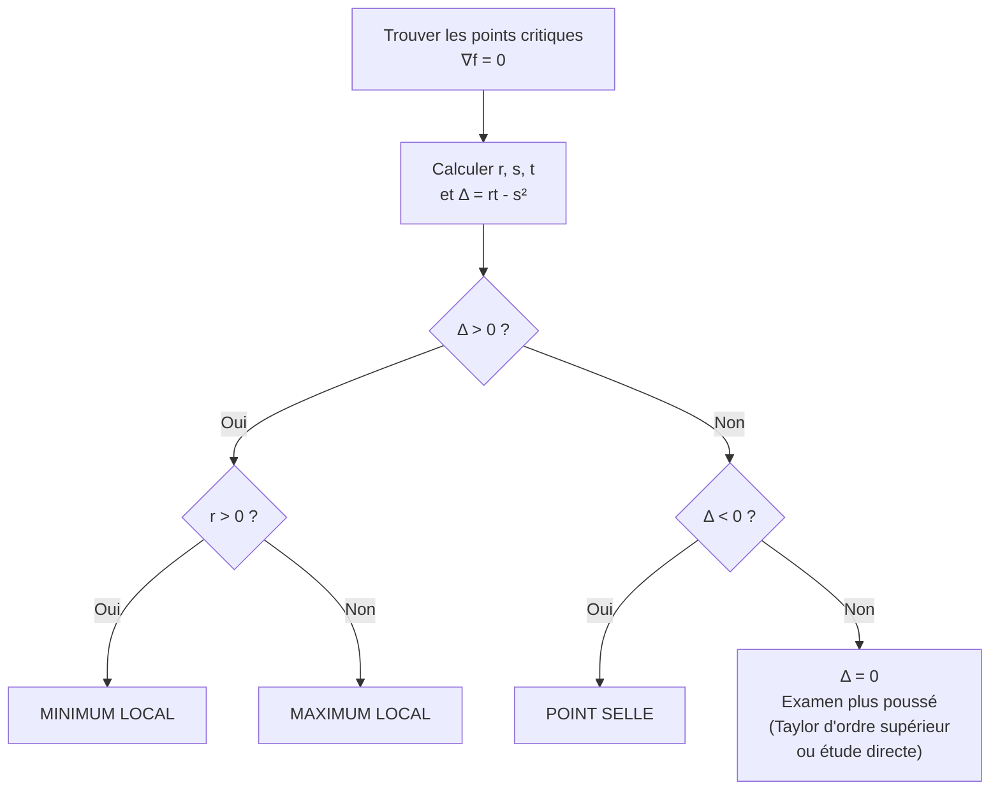

# Fonctions de Plusieurs Variables

## Introduction

Le passage d'une variable à plusieurs variables est un saut conceptuel majeur. De nombreux phénomènes physiques (champs de température, de vitesse, potentiels) sont modélisés par des fonctions $f : \mathbb{R}^n \to \mathbb{R}^p$. Ce chapitre construit les outils d'analyse correspondants : dérivées partielles, différentielle, extrema.


## 1. Topologie de $\mathbb{R}^n$

### 1.1 Normes sur $\mathbb{R}^n$

> [!abstract] Définition
> On munit $\mathbb{R}^n$ des normes classiques :
> - $\|x\|_1 = \sum_{i=1}^n |x_i|$
> - $\|x\|_2 = \left(\sum_{i=1}^n x_i^2\right)^{1/2}$ (norme euclidienne)
> - $\|x\|_\infty = \max_{1 \leq i \leq n} |x_i|$
>
> **En dimension finie, toutes les normes sont équivalentes** : elles définissent la même topologie.

### 1.2 Ouverts, fermés, compacts

> [!abstract] Définitions
> Soit $A \subset \mathbb{R}^n$.
> - $A$ est **ouvert** si pour tout $x \in A$, il existe $r > 0$ tel que $B(x, r) \subset A$.
> - $A$ est **fermé** si $\mathbb{R}^n \setminus A$ est ouvert, ou de manière équivalente, si $A$ contient toutes ses valeurs d'adhérence.
> - $A$ est **borné** si $A \subset B(0, R)$ pour un certain $R > 0$.
> - $A$ est **compact** si $A$ est fermé et borné (théorème de Heine-Borel en dimension finie).

> [!tip] Rappel
> En dimension finie : compact $\iff$ fermé et borné. Voir [[Topologie Prépa]] pour le cadre général des espaces métriques.


## 2. Limites et continuité

### 2.1 Limite d'une fonction en plusieurs variables

> [!abstract] Définition
> Soit $f : U \subset \mathbb{R}^n \to \mathbb{R}^p$ et $a \in \overline{U}$. On dit que $f(x) \to \ell$ quand $x \to a$ si :
> $$\forall \varepsilon > 0,\, \exists \delta > 0,\, \forall x \in U, \quad \|x - a\| < \delta \implies \|f(x) - \ell\| < \varepsilon$$

> [!warning] Attention
> En dimension $\geq 2$, il ne suffit **pas** de vérifier la limite le long des droites passant par $a$. Il faut que la limite soit la même le long de **tous les chemins**.

> [!example] Exemple classique
> $f(x,y) = \dfrac{xy}{x^2 + y^2}$ pour $(x,y) \neq (0,0)$.
>
> - Le long de $y = 0$ : $f(x, 0) = 0 \to 0$.
> - Le long de $y = x$ : $f(x, x) = x^2/(2x^2) = 1/2$.
>
> Les limites diffèrent, donc $f$ **n'a pas de limite en $(0,0)$**.

### 2.2 Continuité

$f$ est continue en $a$ si $\displaystyle\lim_{x \to a} f(x) = f(a)$. Les opérations algébriques et la composition préservent la continuité.

> [!important] Théorème des bornes atteintes
> Une fonction continue sur un **compact** est bornée et atteint ses bornes.


## 3. Dérivées partielles

### 3.1 Définition

> [!abstract] Définition
> Soit $f : U \subset \mathbb{R}^n \to \mathbb{R}$, $U$ ouvert, $a \in U$. La **dérivée partielle** de $f$ par rapport à $x_i$ en $a$ est :
> $$\frac{\partial f}{\partial x_i}(a) = \lim_{h \to 0} \frac{f(a_1, \ldots, a_i + h, \ldots, a_n) - f(a)}{h}$$
> si cette limite existe.

> [!tip] Interprétation
> $\dfrac{\partial f}{\partial x_i}(a)$ est la dérivée de la fonction d'une variable $t \mapsto f(a_1, \ldots, a_{i-1}, t, a_{i+1}, \ldots, a_n)$ en $t = a_i$. On « gèle » toutes les variables sauf $x_i$.

### 3.2 Calcul pratique

> [!example] Exemple
> $f(x, y) = x^2 y + \sin(xy)$.
>
> $$\frac{\partial f}{\partial x} = 2xy + y\cos(xy), \qquad \frac{\partial f}{\partial y} = x^2 + x\cos(xy)$$

> [!warning] Existence des dérivées partielles $\not\Rightarrow$ continuité
> La fonction
> $$f(x,y) = \begin{cases} \dfrac{xy}{x^2+y^2} & \text{si } (x,y) \neq (0,0) \\ 0 & \text{si } (x,y) = (0,0) \end{cases}$$
> admet des dérivées partielles en $(0,0)$ (toutes deux nulles), mais n'est **pas continue** en $(0,0)$.


## 4. Gradient et Jacobienne

### 4.1 Gradient

> [!abstract] Définition
> Si $f : U \subset \mathbb{R}^n \to \mathbb{R}$ admet toutes ses dérivées partielles en $a$, le **gradient** de $f$ en $a$ est :
> $$\nabla f(a) = \operatorname{grad} f(a) = \left(\frac{\partial f}{\partial x_1}(a), \ldots, \frac{\partial f}{\partial x_n}(a)\right)$$

> [!tip] Interprétation géométrique
> Le gradient pointe dans la **direction de plus grande pente** de $f$. Sa norme est le taux de variation maximal.

### Visualisation animée (Manim)

> [!note] Ce que montre l'animation
> On représente la surface $z = f(x, y) = 3\,e^{-(x^2+y^2)/2}$ (une « colline ») en fil de fer. En un point de la base, on dessine le **gradient** $\nabla f$ dans le plan $z = 0$ : il pointe vers la direction où la surface monte le plus vite (ici vers le sommet). La caméra tourne pour bien percevoir le relief. C'est l'interprétation clé : $\nabla f$ donne la **direction de plus grande pente**.

```manim
# Rendu : manimgl gradient_surface.py SurfaceEtGradient
from manimlib import *
import numpy as np


class SurfaceEtGradient(Scene):
    def construct(self):
        axes = ThreeDAxes(x_range=(-3, 3), y_range=(-3, 3), z_range=(0, 3))
        self.add(axes)
        frame = self.camera.frame
        frame.reorient(-45, 70)              # vue 3D initiale

        # "Colline" z = f(x, y) = 3 exp(-(x^2 + y^2)/2)
        def f(x, y):
            return 3 * np.exp(-(x**2 + y**2) / 2)

        # Surface en fil de fer : courbes à y fixe, puis à x fixe
        wire = VGroup()
        for y0 in np.arange(-2.5, 2.6, 0.5):
            wire.add(ParametricCurve(lambda t, y0=y0: axes.c2p(t, y0, f(t, y0)),
                                     t_range=(-2.5, 2.5, 0.1), color=BLUE_D))
        for x0 in np.arange(-2.5, 2.6, 0.5):
            wire.add(ParametricCurve(lambda t, x0=x0: axes.c2p(x0, t, f(x0, t)),
                                     t_range=(-2.5, 2.5, 0.1), color=BLUE_D))
        self.play(ShowCreation(wire), run_time=3)

        # Gradient en un point de la base : nabla f = (-x f, -y f), dans le plan z = 0
        x0, y0 = 1.2, 0.8
        g = np.array([-x0 * f(x0, y0), -y0 * f(x0, y0)])
        g = g / np.linalg.norm(g) * 1.3      # normalisé pour la lisibilité
        base = Dot(axes.c2p(x0, y0, 0), color=YELLOW)
        grad = Arrow(axes.c2p(x0, y0, 0), axes.c2p(x0 + g[0], y0 + g[1], 0),
                     buff=0, color=YELLOW)
        montee = DashedLine(axes.c2p(x0, y0, 0), axes.c2p(x0, y0, f(x0, y0)), color=GREY_B)
        sommet = Dot(axes.c2p(x0, y0, f(x0, y0)), color=RED)
        self.play(FadeIn(base), GrowArrow(grad),
                  ShowCreation(montee), FadeIn(sommet))

        titre = Tex(r"\nabla f \text{ : direction de plus grande pente}")
        titre.fix_in_frame().to_edge(UP)
        self.play(Write(titre))
        self.play(frame.animate.reorient(30, 65), run_time=6)
        self.wait()
```

### 4.2 Matrice jacobienne

> [!abstract] Définition
> Pour $f = (f_1, \ldots, f_p) : U \subset \mathbb{R}^n \to \mathbb{R}^p$, la **matrice jacobienne** en $a$ est :
> $$J_f(a) = \begin{pmatrix} \dfrac{\partial f_1}{\partial x_1}(a) & \cdots & \dfrac{\partial f_1}{\partial x_n}(a) \\ \vdots & \ddots & \vdots \\ \dfrac{\partial f_p}{\partial x_1}(a) & \cdots & \dfrac{\partial f_p}{\partial x_n}(a) \end{pmatrix}$$

Si $p = 1$, la jacobienne est le gradient (transposé en ligne). Le **jacobien** (déterminant de la jacobienne pour $p = n$) intervient dans les changements de variables pour les intégrales multiples.


## 5. Différentielle

### 5.1 Définition

> [!abstract] Définition
> $f : U \subset \mathbb{R}^n \to \mathbb{R}^p$ est **différentiable** en $a \in U$ s'il existe une application linéaire $L : \mathbb{R}^n \to \mathbb{R}^p$ telle que :
> $$f(a + h) = f(a) + L(h) + o(\|h\|) \quad \text{quand } h \to 0$$
> L'application $L$ est unique et s'appelle la **différentielle** de $f$ en $a$, notée $df_a$ ou $Df(a)$.

> [!important] Lien avec les dérivées partielles
> Si $f$ est différentiable en $a$, alors $f$ admet toutes ses dérivées partielles en $a$ et :
> $$df_a(h) = \sum_{i=1}^n \frac{\partial f}{\partial x_i}(a)\,h_i = J_f(a) \cdot h$$
> La matrice de $df_a$ dans la base canonique est la matrice jacobienne.

> [!warning] Réciproque
> L'existence des dérivées partielles ne garantit **pas** la différentiabilité. Mais si les dérivées partielles existent et sont **continues** au voisinage de $a$, alors $f$ est différentiable en $a$.

### 5.2 Propriétés

- **Différentiable $\Rightarrow$ continue** (mais pas la réciproque).
- **Règle de la chaîne** : si $f$ est différentiable en $a$ et $g$ différentiable en $f(a)$, alors $g \circ f$ est différentiable en $a$ et $d(g \circ f)_a = dg_{f(a)} \circ df_a$, soit en termes de matrices jacobiennes :
$$J_{g \circ f}(a) = J_g(f(a)) \cdot J_f(a)$$


## 6. Fonctions de classe $\mathcal{C}^k$

> [!abstract] Définition
> $f$ est de **classe $\mathcal{C}^k$** sur $U$ si toutes ses dérivées partielles d'ordre $\leq k$ existent et sont continues sur $U$.

### 6.1 Théorème de Schwarz

> [!abstract] Théorème (Schwarz)
> Si $f$ est de classe $\mathcal{C}^2$ sur un ouvert $U$, alors pour tous $i, j$ :
> $$\frac{\partial^2 f}{\partial x_i \partial x_j} = \frac{\partial^2 f}{\partial x_j \partial x_i}$$
> Les dérivées partielles d'ordre 2 **commutent**.

> [!tip] En pratique
> Pour les fonctions « raisonnables » (de classe $\mathcal{C}^2$), l'ordre de dérivation n'a pas d'importance. C'est un résultat que l'on utilise constamment.


## 7. Formule de Taylor

### 7.1 Développement de Taylor à l'ordre 1

$$f(a + h) = f(a) + \sum_{i=1}^n \frac{\partial f}{\partial x_i}(a)\,h_i + o(\|h\|)$$

### 7.2 Développement de Taylor à l'ordre 2

Pour $f$ de classe $\mathcal{C}^2$ au voisinage de $a$ :

$$f(a + h) = f(a) + \sum_{i=1}^n \frac{\partial f}{\partial x_i}(a)\,h_i + \frac{1}{2}\sum_{i,j=1}^n \frac{\partial^2 f}{\partial x_i \partial x_j}(a)\,h_i h_j + o(\|h\|^2)$$

Le terme quadratique fait intervenir la **matrice hessienne**.

### 7.3 Matrice hessienne

> [!abstract] Définition
> La **matrice hessienne** de $f : \mathbb{R}^n \to \mathbb{R}$ en $a$ est la matrice symétrique (par Schwarz) :
> $$H_f(a) = \left(\frac{\partial^2 f}{\partial x_i \partial x_j}(a)\right)_{1 \leq i,j \leq n}$$

La forme quadratique associée $q(h) = h^T H_f(a)\,h$ détermine la nature des points critiques.


## 8. Extrema locaux

### 8.1 Condition nécessaire

> [!abstract] Théorème (Condition nécessaire d'ordre 1)
> Si $f$ admet un extremum local en $a$ (point intérieur à $U$) et si $f$ est différentiable en $a$, alors :
> $$\nabla f(a) = 0$$
> Un tel point est appelé **point critique** (ou point stationnaire).

### 8.2 Condition suffisante en dimension 2

Pour $f : \mathbb{R}^2 \to \mathbb{R}$ de classe $\mathcal{C}^2$, soit $(a, b)$ un point critique. On note :

$$r = \frac{\partial^2 f}{\partial x^2}(a,b), \quad s = \frac{\partial^2 f}{\partial x \partial y}(a,b), \quad t = \frac{\partial^2 f}{\partial y^2}(a,b)$$

et $\Delta = rt - s^2 = \det H_f(a,b)$.

> [!abstract] Théorème (Condition suffisante)
> - Si $\Delta > 0$ et $r > 0$ : **minimum local**
> - Si $\Delta > 0$ et $r < 0$ : **maximum local**
> - Si $\Delta < 0$ : **point selle** (pas d'extremum)
> - Si $\Delta = 0$ : **on ne peut pas conclure**

### 8.3 Condition suffisante en dimension $n$

On étudie le signe de la matrice hessienne $H_f(a)$ :

- $H_f(a)$ **définie positive** $\Rightarrow$ minimum local
- $H_f(a)$ **définie négative** $\Rightarrow$ maximum local
- $H_f(a)$ **indéfinie** (valeurs propres de signes différents) $\Rightarrow$ point selle

### 8.4 Stratégie de classification des points critiques (dimension 2)




## 9. Extrema liés : multiplicateurs de Lagrange

### 9.1 Position du problème

On cherche les extrema de $f(x)$ sous la contrainte $g(x) = 0$ (ou $g_1(x) = \cdots = g_k(x) = 0$).

### 9.2 Théorème des multiplicateurs de Lagrange

> [!abstract] Théorème (Lagrange)
> Soient $f, g : \mathbb{R}^n \to \mathbb{R}$ de classe $\mathcal{C}^1$. Si $f$ admet un extremum en $a$ sur l'ensemble $\{x \in \mathbb{R}^n : g(x) = 0\}$, et si $\nabla g(a) \neq 0$, alors il existe $\lambda \in \mathbb{R}$ tel que :
> $$\nabla f(a) = \lambda\,\nabla g(a)$$
> Le réel $\lambda$ est le **multiplicateur de Lagrange**.

> [!tip] Interprétation géométrique
> À l'extremum, le gradient de $f$ est colinéaire au gradient de $g$. Autrement dit, les courbes de niveau de $f$ sont tangentes à la courbe de contrainte $g = 0$.

### 9.3 Méthode pratique

Pour optimiser $f$ sous la contrainte $g = 0$ :

1. Résoudre le système :
$$\begin{cases} \nabla f(x) = \lambda\,\nabla g(x) \\ g(x) = 0 \end{cases}$$
Cela donne $n + 1$ équations à $n + 1$ inconnues ($x_1, \ldots, x_n, \lambda$).

2. Parmi les solutions, identifier les minima et maxima (par exemple en comparant les valeurs de $f$, ou par un argument de compacité).

> [!example] Exemple classique
> **Maximiser** $f(x,y) = xy$ sous la contrainte $g(x,y) = x^2 + y^2 - 1 = 0$.
>
> $\nabla f = (y, x)$, $\nabla g = (2x, 2y)$.
>
> Système : $y = 2\lambda x$, $x = 2\lambda y$, $x^2 + y^2 = 1$.
>
> De la première : $y = 2\lambda x$. Dans la deuxième : $x = 2\lambda(2\lambda x) = 4\lambda^2 x$.
> Si $x \neq 0$ : $4\lambda^2 = 1$, donc $\lambda = \pm 1/2$.
>
> - $\lambda = 1/2$ : $y = x$, avec $2x^2 = 1$, soit $(x,y) = (\pm 1/\sqrt{2}, \pm 1/\sqrt{2})$, $f = 1/2$.
> - $\lambda = -1/2$ : $y = -x$, soit $(x,y) = (\pm 1/\sqrt{2}, \mp 1/\sqrt{2})$, $f = -1/2$.
>
> Maximum : $f = 1/2$, atteint en $(\pm 1/\sqrt{2}, \pm 1/\sqrt{2})$.


## 10. Exercices types corrigés

### Exercice 1 : Calcul de dérivées partielles et gradient

> [!example] Énoncé
> Soit $f(x, y, z) = x^2 y\,e^{xz}$. Calculer $\nabla f$.

**Solution.**

$$\frac{\partial f}{\partial x} = 2xy\,e^{xz} + x^2 y \cdot z\,e^{xz} = xy\,e^{xz}(2 + xz)$$

$$\frac{\partial f}{\partial y} = x^2\,e^{xz}$$

$$\frac{\partial f}{\partial z} = x^2 y \cdot x\,e^{xz} = x^3 y\,e^{xz}$$

$$\boxed{\nabla f(x,y,z) = \left(xy\,e^{xz}(2+xz),\; x^2 e^{xz},\; x^3 y\,e^{xz}\right)}$$


### Exercice 2 : Différentiabilité

> [!example] Énoncé
> Montrer que $f(x,y) = \sqrt{x^2 + y^2}$ n'est pas différentiable en $(0,0)$.

**Solution.**

Si $f$ était différentiable en $(0,0)$, on aurait $f(h,k) = f(0,0) + ah + bk + o(\sqrt{h^2+k^2})$ pour des constantes $a, b$.

Or $f(0,0) = 0$ et $f(h,k) = \sqrt{h^2 + k^2}$, donc on aurait :
$$\sqrt{h^2 + k^2} = ah + bk + o(\sqrt{h^2+k^2})$$

Divisons par $\sqrt{h^2+k^2} \neq 0$ :
$$1 = \frac{ah + bk}{\sqrt{h^2+k^2}} + o(1)$$

Le terme $\dfrac{ah + bk}{\sqrt{h^2+k^2}}$ dépend de la direction (prendre $h = r\cos\theta$, $k = r\sin\theta$, il vaut $a\cos\theta + b\sin\theta$), donc il ne peut tendre vers $1$ pour toute direction. Contradiction. $\blacksquare$


### Exercice 3 : Extrema libres

> [!example] Énoncé
> Trouver les extrema de $f(x,y) = x^3 + y^3 - 3xy$.

**Solution.**

**Points critiques** : $\nabla f = 0$ :
$$\frac{\partial f}{\partial x} = 3x^2 - 3y = 0 \implies y = x^2$$
$$\frac{\partial f}{\partial y} = 3y^2 - 3x = 0 \implies x = y^2$$

En substituant : $x = (x^2)^2 = x^4$, soit $x(x^3 - 1) = 0$. Donc $x = 0$ ou $x = 1$.

Points critiques : $(0, 0)$ et $(1, 1)$.

**Nature** : $r = 6x$, $s = -3$, $t = 6y$, $\Delta = 36xy - 9$.

- En $(0, 0)$ : $\Delta = -9 < 0$ $\Rightarrow$ **point selle**.
- En $(1, 1)$ : $\Delta = 36 - 9 = 27 > 0$ et $r = 6 > 0$ $\Rightarrow$ **minimum local**, $f(1,1) = -1$.


### Exercice 4 : Multiplicateurs de Lagrange

> [!example] Énoncé
> Trouver les points de la sphère $x^2 + y^2 + z^2 = 1$ les plus proches et les plus éloignés du plan $x + y + z = 0$.

**Solution.**

La distance du point $(x,y,z)$ au plan $x+y+z=0$ est $\dfrac{|x+y+z|}{\sqrt{3}}$. On optimise $f(x,y,z) = x + y + z$ (puis on prendra la valeur absolue) sous $g(x,y,z) = x^2 + y^2 + z^2 - 1 = 0$.

$\nabla f = (1, 1, 1)$, $\nabla g = (2x, 2y, 2z)$.

Lagrange : $1 = 2\lambda x$, $1 = 2\lambda y$, $1 = 2\lambda z$, donc $x = y = z = \dfrac{1}{2\lambda}$.

Contrainte : $3 \cdot \dfrac{1}{4\lambda^2} = 1$, soit $\lambda^2 = 3/4$, $\lambda = \pm\dfrac{\sqrt{3}}{2}$.

- $\lambda = \dfrac{\sqrt{3}}{2}$ : $x = y = z = \dfrac{1}{\sqrt{3}}$, $f = \sqrt{3}$.
- $\lambda = -\dfrac{\sqrt{3}}{2}$ : $x = y = z = -\dfrac{1}{\sqrt{3}}$, $f = -\sqrt{3}$.

Distance maximale : $\dfrac{\sqrt{3}}{\sqrt{3}} = 1$ (points $\pm(1/\sqrt{3}, 1/\sqrt{3}, 1/\sqrt{3})$).
Distance minimale : $0$, atteinte sur le cercle intersection de la sphère et du plan.

Mais les extrema de $f$ sur la sphère sont bien $\pm\sqrt{3}$, correspondant aux points les **plus éloignés** du plan, à distance $1$. Les points **les plus proches** du plan sont ceux de l'intersection sphère/plan (distance $0$), mais ce ne sont pas des extrema de $f$ au sens de Lagrange — ils sont dans l'ensemble $g = 0$ avec $f = 0$.


### Exercice 5 : Règle de la chaîne

> [!example] Énoncé
> Soit $f(x,y)$ de classe $\mathcal{C}^1$ et $g(r,\theta) = f(r\cos\theta, r\sin\theta)$ (coordonnées polaires). Exprimer $\dfrac{\partial g}{\partial r}$ et $\dfrac{\partial g}{\partial \theta}$.

**Solution.**

Par la règle de la chaîne avec $x = r\cos\theta$, $y = r\sin\theta$ :

$$\frac{\partial g}{\partial r} = \frac{\partial f}{\partial x}\cos\theta + \frac{\partial f}{\partial y}\sin\theta$$

$$\frac{\partial g}{\partial \theta} = \frac{\partial f}{\partial x}(-r\sin\theta) + \frac{\partial f}{\partial y}(r\cos\theta)$$

En notation vectorielle : $\dfrac{\partial g}{\partial r} = \nabla f \cdot \mathbf{e}_r$ et $\dfrac{1}{r}\dfrac{\partial g}{\partial \theta} = \nabla f \cdot \mathbf{e}_\theta$.


*Voir aussi : [[Intégrales Généralisées]], [[Topologie Prépa]]*
